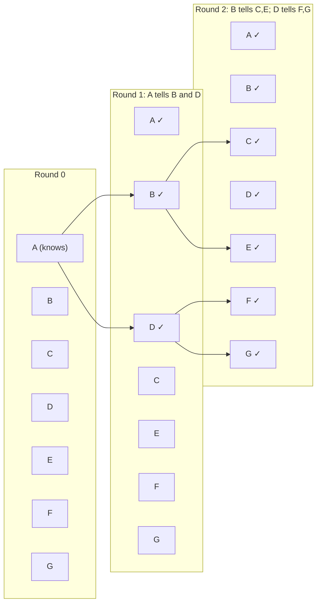
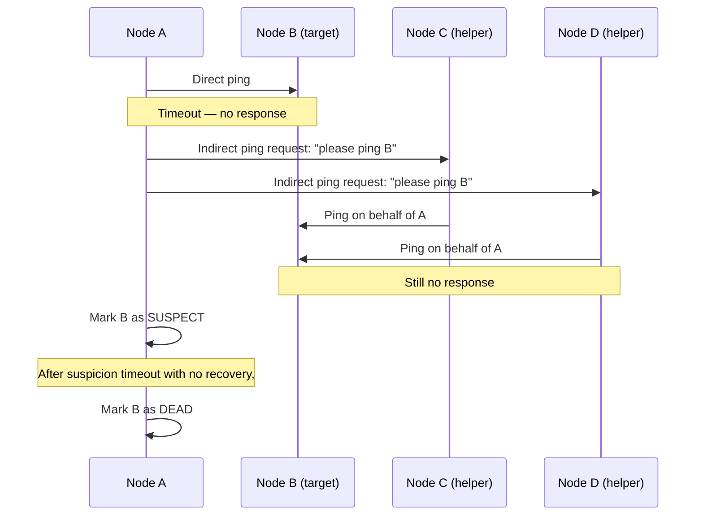
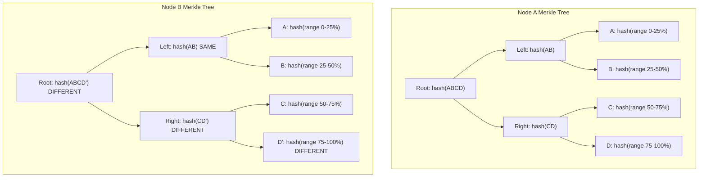

# Gossip Protocol

## Why This Topic Exists

In a distributed cluster of 100 nodes, how does each node know which other nodes are alive? The naive answer is to have a central coordinator that tracks all nodes. But that coordinator becomes a single point of failure — if it dies, no node knows the state of any other. You have traded a distributed problem for a centralized bottleneck.

Gossip protocols solve this by having every node periodically tell a few random neighbors about what it knows. Within seconds, information about a single event (like a node dying) has propagated to every node in the cluster — without any central coordinator, and resilient to any individual node failure.

---

## Learning Objectives

By the end of this file, you will be able to:
- Explain how gossip protocols spread information through a cluster
- Calculate convergence time given fanout (K) and cluster size (N)
- Describe the SWIM protocol for failure detection
- Explain how Cassandra uses gossip for cluster membership
- Describe anti-entropy and how it uses gossip to reconcile differences between nodes
- Understand the trade-offs of gossip vs. centralized coordination

---

## Prerequisites

- Understanding of distributed systems fundamentals ([Introduction to Distributed Systems](./01.%20Introduction%20to%20Distributed%20Systems%20%28BEGINNER%29.md))
- Basic understanding of what a distributed database is
- Understanding of consistent hashing ([Consistent Hashing](./02.%20Consistent%20Hashing%20%28INTERMEDIATE%29.md)) is helpful but not required

---

## Introduction

Gossip protocols are named after how rumors spread in an office. If one person learns something interesting and tells three colleagues, those three each tell three more, and within a few rounds everyone in the office knows — even if the original person leaves before telling everyone.

This is the core mechanic: each node periodically picks K random nodes and shares its current knowledge with them. Knowledge spreads exponentially. After O(log N) rounds, all N nodes are informed.

This is also called an "epidemic protocol" because information spreads like a biological epidemic — infecting a few, then spreading to others at an exponential rate.

---

## Real-World Analogy

Imagine you are at a conference with 1,000 attendees, and you have a piece of news: the keynote speaker just cancelled. You cannot announce it to everyone yourself (that would be central coordination). Instead:

- You tell 3 random people
- Each of those 3 people tells 3 more
- Round 1: 1 + 3 = 4 people know
- Round 2: 4 + (3×3) = 13 people know
- Round 3: 13 + (9×3) = 40 people know
- Round 7: roughly 3,000 — more than the whole conference

In roughly log₃(1000) ≈ 7 rounds, everyone knows, and no single announcer was needed. Even if some people did not pass on the message, the information still spreads through other paths.

---

## Core Concepts

### Epidemic Spreading

The basic gossip algorithm:

1. Every node maintains a list of (key, value, version) tuples representing its current knowledge
2. Every T seconds (the gossip interval), a node picks K random nodes from the cluster
3. It sends its current state to those K nodes
4. Each receiving node merges the received state with its own (taking the newest version of each key)
5. Repeat

This is a "push" gossip. There are also "pull" gossip (ask a random node for their state) and "push-pull" (send your state AND request theirs back) variants.

### Convergence Time

Given a cluster of N nodes and a fanout of K (each node tells K others per round), the number of rounds to reach full convergence is approximately:

```
rounds ≈ log(N) / log(K)
```

Practical example:
- N = 1,000 nodes, K = 3
- Rounds ≈ log(1000) / log(3) ≈ 6.3 rounds
- At a gossip interval of 1 second, the entire cluster converges in roughly 6 seconds

| Cluster Size | Fanout K=3 | Fanout K=5 |
|---|---|---|
| 100 nodes | ~4.2 rounds | ~2.9 rounds |
| 1,000 nodes | ~6.3 rounds | ~4.3 rounds |
| 10,000 nodes | ~8.4 rounds | ~5.7 rounds |
| 100,000 nodes | ~10.5 rounds | ~7.2 rounds |

Even for massive clusters, convergence happens in single-digit rounds. This is the power of exponential spread.

### Gossip for Failure Detection

The most critical use of gossip in distributed systems is detecting which nodes have failed. If a node crashes silently, how does the rest of the cluster know?

**Naive approach: heartbeats to a central monitor**
Each node sends a heartbeat to a central monitor every second. If the monitor does not hear from a node for 5 seconds, it marks that node as dead.

Problems: the monitor is a single point of failure; it does not scale to thousands of nodes.

**Gossip-based approach:**
Each node maintains a heartbeat counter that it increments every second. During gossip, nodes share their heartbeat counters for all nodes they know about. If a node's counter stops incrementing in anyone's view, it is probably dead.

This is decentralized — no single node has to track everyone. The failure information propagates through gossip just like any other information.

---

## Visual Diagram (Mermaid)

### Gossip Spread Over 3 Rounds (K=2, N=7 nodes)



After just 2 rounds with K=2, all 7 nodes are informed. For N nodes and K=2, convergence takes log₂(N) rounds.

---

## Deep Explanation

### The SWIM Protocol (Scalable Weakly-consistent Infection-style Membership)

SWIM (published in 2002) is the foundational paper for gossip-based failure detection. It is used in production by Consul, memberlist (HashiCorp), and is influential in many other systems.

**The problem with simple heartbeat-based detection:**
If a node sends heartbeats to a central coordinator, and the network between that node and the coordinator is partitioned, the coordinator marks the node as dead even though the node is healthy and other nodes can still reach it. This is a false positive.

**SWIM's approach — two layers:**

**Layer 1: Failure Detector**



Only if the direct ping and multiple indirect pings all fail does A mark B as suspect. Only after the suspicion period expires with no response is B marked dead.

**Why indirect pings matter:**
Direct pings can fail due to a single network link problem between A and B. Indirect pings through K random nodes are much more robust — the node is only declared dead if it is unreachable from many different directions simultaneously.

**Layer 2: Dissemination (gossip)**
Once a node is marked suspect or dead, that information is piggybacked onto outgoing gossip messages. It spreads through the cluster exponentially.

### Gossip for Cluster Membership — How Cassandra Uses It

When a Cassandra node starts, it contacts a small number of pre-configured "seed nodes" and begins gossiping. Within a few gossip rounds, the new node learns about all other nodes in the cluster.

**What Cassandra gossips:**
- The node's current state (NORMAL, LEAVING, LEFT, REMOVING)
- The node's token ranges (which part of the consistent hash ring it owns)
- The node's load (approximately how much data it holds)
- The node's schema version

Cassandra gossips every second. Each gossip round, a node:
1. Picks one random live node and gossips
2. Picks one random dead node and gossips (to detect if it came back)
3. Optionally gossips with a seed node (for bootstrap stability)

This means membership changes propagate across the entire cluster in seconds, not minutes.

**ApplicationState and HeartbeatState:**
Cassandra's gossip protocol divides information into HeartbeatState (the incrementing counter proving the node is alive) and ApplicationState (data about the node like schema version, token ranges). Each state has a version number so recipients can tell whether their copy is newer or older.

### Anti-Entropy: Reconciling Differences Between Nodes

Beyond membership and failure detection, gossip is used for a deeper purpose: making sure replicas of the same data agree on what they hold.

**The problem:** Replica A and Replica B both hold key "user_42". Due to a network partition, Replica A received a write that Replica B missed. How does Replica B find out and catch up?

**Anti-entropy with Merkle trees:**



The process:
1. Each node builds a Merkle tree over its data — a hash tree where leaf nodes are hashes of individual key ranges and parent nodes are hashes of their children
2. Periodically, two nodes exchange the root hash of their Merkle trees
3. If the root hashes match, the nodes are perfectly in sync — no further work needed
4. If they differ, they walk down the tree, comparing child hashes, to identify exactly which key ranges differ
5. Only the differing ranges need to be exchanged

This is efficient: comparing two trees of 10,000 keys requires only O(log N) hash comparisons to find the divergent subtree, rather than comparing every key individually.

Cassandra uses exactly this approach in its repair process. DynamoDB uses a similar mechanism for its replica synchronization.

### Gossip vs. Centralized Coordination

| Aspect | Gossip | Centralized Coordinator |
|--------|--------|------------------------|
| Single point of failure | None | Yes (the coordinator) |
| Scalability | O(log N) rounds, no bottleneck | Coordinator becomes bottleneck at scale |
| Consistency | Eventually consistent | Immediately consistent |
| Failure detection accuracy | Probabilistic — mitigated by SWIM | Precise but breaks if coordinator fails |
| Complexity | More complex to reason about | Simpler for small clusters |
| Bandwidth | Constant low background traffic | Bursty when failures are detected |

---

## Step-by-Step Example

**Scenario**: A Cassandra cluster has 6 nodes (N1–N6). Node N3 crashes. How does the cluster find out?

**Second 0**: N3 crashes. N3's heartbeat counter stops incrementing.

**Second 1 (Gossip Round 1)**:
- N2 gossips with N3 (attempt) — N3 does not respond
- N2 notes that N3's heartbeat has not incremented — marks N3 as suspicious
- N2 gossips suspicion information to N1 and N5

**Second 2 (Gossip Round 2)**:
- N1 and N5 now know N3 is suspicious
- N1 attempts indirect pings to N3 through N4 — N3 still does not respond
- N1 gossips to N4 and N6 with N3's suspicious state

**Second 3 (Gossip Round 3)**:
- N4 and N6 learn of N3's suspicious state
- All 5 remaining nodes now believe N3 is suspect

**Second 5 (Gossip Round ~5)**:
- N3's heartbeat has not incremented for 5 rounds — the suspicion timeout is exceeded
- All nodes mark N3 as DOWN
- Reads and writes that would go to N3 are now served by N3's replicas (N4 and N5 in this example)

The entire process took about 5 seconds for a cluster of 6 nodes with 1-second gossip intervals.

---

## Advantages / Disadvantages / Trade-offs

| Advantage | Detail |
|-----------|--------|
| No single point of failure | Every node is equal; no coordinator to lose |
| Scales to large clusters | Convergence is O(log N) rounds — works for 10 nodes or 10,000 |
| Resilient to partial failures | Information still propagates through remaining nodes even if many fail |
| Self-healing | When nodes come back, they gossip and catch up on what they missed |

| Disadvantage | Detail |
|--------------|--------|
| Eventually consistent | Information is not instantaneously known by all nodes |
| False positives possible | A slow node might be falsely declared dead (mitigated by SWIM) |
| Redundant messages | Some information is gossiped many times, wasting bandwidth |
| Hard to debug | Tracing why information failed to propagate is difficult |

---

## When to Use / When NOT to Use

**Use gossip when:**
- You need decentralized failure detection in a large cluster
- You need to propagate cluster membership information without a central directory
- You need eventual consistency of metadata across many nodes
- You are building a system that needs to scale to hundreds or thousands of nodes

**Do NOT use gossip when:**
- You need immediate, strong consistency — gossip is eventually consistent
- You need total ordering of events — gossip has no concept of order
- Your cluster is very small (3-5 nodes) — simpler centralized approaches are fine
- Bandwidth is extremely constrained — gossip generates constant background traffic

---

## Common Interview Questions

1. How does a gossip protocol propagate information through a cluster?
2. What is the time complexity of gossip convergence? Why is it O(log N)?
3. What is the SWIM protocol? How does it detect node failures without a central coordinator?
4. How does Cassandra use gossip? What information is gossiped?
5. What is anti-entropy? How do Merkle trees make it efficient?
6. What are the trade-offs between gossip-based and centralized failure detection?
7. Can gossip give false positives (declaring a live node dead)? How is this mitigated?

---

## Common Beginner Mistakes

**Mistake 1: Thinking gossip is instant**
Gossip convergence takes O(log N) rounds. For large clusters with 1-second intervals, this means several seconds. Design systems to handle the window where different nodes have different views of cluster state.

**Mistake 2: Confusing gossip with broadcast**
Gossip sends to K random neighbors, not all N nodes. Broadcasting to all N nodes requires O(N) messages; gossip requires O(K log N). This is what makes gossip scale.

**Mistake 3: Assuming failure detection is immediate**
In SWIM-based gossip, a node needs to fail to respond across multiple rounds before being declared dead. This adds a few seconds of delay intentionally — to avoid false positives.

**Mistake 4: Not mentioning the eventual consistency caveat**
Gossip is eventually consistent. Nodes may briefly have different views of cluster state. Acknowledge this when designing systems that depend on membership data.

---

## Summary

Gossip protocols are a decentralized way for nodes in a cluster to share information with each other. Each node periodically tells K random neighbors what it knows. Information spreads exponentially, converging across all N nodes in O(log N) rounds — typically seconds.

The SWIM protocol extends gossip with robust failure detection: nodes are only declared dead after direct pings and multiple indirect pings all fail, greatly reducing false positives.

Cassandra uses gossip for cluster membership and token ranges. Anti-entropy uses gossip to detect and repair differences between data replicas using Merkle trees.

---

## Key Takeaways

- Each gossip round, a node tells K random neighbors its current state — information spreads exponentially
- Convergence time is O(log N) rounds, typically seconds even for thousands of nodes
- SWIM protocol uses indirect pings through random intermediaries to detect failures without false positives
- Gossip is eventually consistent — nodes may briefly have different views of cluster state
- Cassandra gossips every second to share membership, token ranges, and schema versions
- Anti-entropy uses Merkle trees to efficiently identify and repair data divergence between replicas
- Gossip scales because each node only communicates with K nodes, not all N

---

## Related Topics (relative markdown links)

- [Introduction to Distributed Systems](./01.%20Introduction%20to%20Distributed%20Systems%20%28BEGINNER%29.md)
- [Consistent Hashing](./02.%20Consistent%20Hashing%20%28INTERMEDIATE%29.md)
- [Leader Election](./04.%20Leader%20Election%20%28INTERMEDIATE%29.md)
- [Vector Clocks and Logical Time](./06.%20Vector%20Clocks%20and%20Logical%20Time%20%28ADV%29.md)
- [Chapter 10: Consistency and Consensus](../10.%20Consistency%20and%20Consensus/README.md)
- [Chapter 11: Reliability and Fault Tolerance](../11.%20Reliability%20and%20Fault%20Tolerance/README.md)
- [Chapter README — All Distributed Systems Topics](./README.md)
