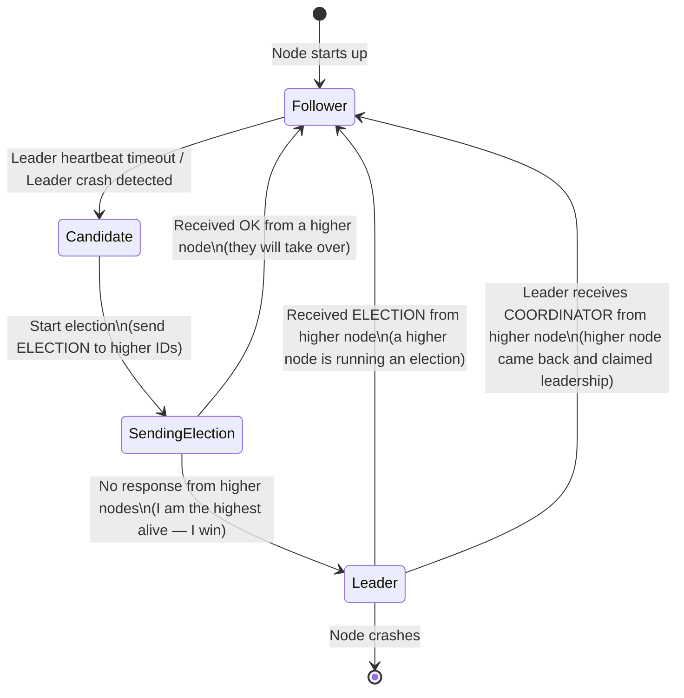
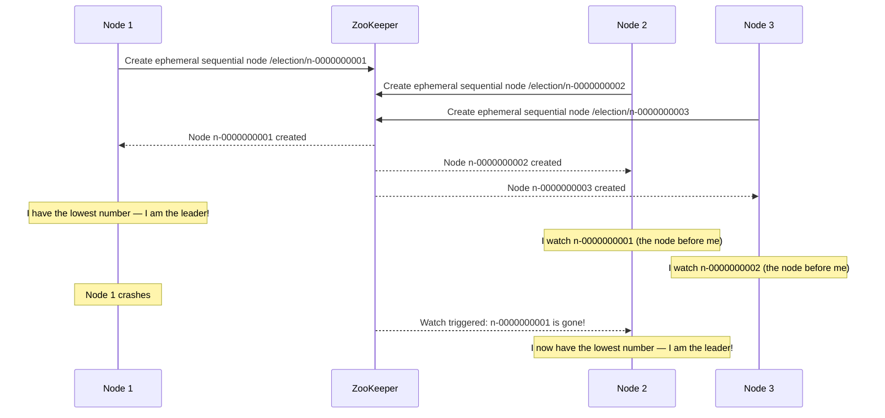

# Leader Election

## Why This Topic Exists

Many distributed operations require exactly one node to be "in charge" at any given time. Consider a database cluster — only one node should accept writes (the primary) to avoid conflicting updates. Consider a distributed job scheduler — only one node should trigger the 2 AM batch job, not all five. Consider a message queue — only one node should manage partition assignments.

The moment you need exactly-one-leader semantics, you need leader election. The challenge is that nodes can fail at any time, and when the leader dies, the cluster must elect a new one — automatically, correctly, and quickly.

---

## Learning Objectives

By the end of this file, you will be able to:
- Explain why leader election is needed in distributed clusters
- Describe the Bully algorithm and trace through an election step by step
- Describe the Ring algorithm and explain its difference from Bully
- Explain how ZooKeeper's ephemeral nodes enable leader election
- Explain how Raft performs leader election
- Define split-brain and explain why it is dangerous
- Give real examples of leader election in Kafka and Elasticsearch

---

## Prerequisites

- Understanding of distributed systems basics ([Introduction to Distributed Systems](./01.%20Introduction%20to%20Distributed%20Systems%20%28BEGINNER%29.md))
- Understanding of gossip protocols for failure detection ([Gossip Protocol](./03.%20Gossip%20Protocol%20%28ADV%29.md)) is helpful

---

## Introduction

Think of a ship. When the captain is on the bridge, everyone knows who is in command. But what if the captain falls ill in the middle of the ocean? The crew cannot wait for a central authority to appoint a new captain — they are too far from shore. They must elect one themselves based on seniority, competence, or whatever rule they agree on in advance.

Leader election is exactly this problem. When the current leader of a cluster dies (or is unreachable), the remaining nodes must agree on a new leader using a pre-defined protocol. The new leader then takes over the leader's responsibilities.

The hard part: nodes might not agree. Two nodes might both think the leader is dead and both try to become the new leader simultaneously. This is the split-brain problem.

---

## Real-World Analogy

Imagine a team at work. The manager is the "leader" — they approve requests and make final decisions. If the manager goes on vacation (or quits), the team needs a new decision-maker. They cannot just have everyone making independent decisions — that leads to conflicts.

They follow a rule: "the most senior person by years of service becomes acting manager." This is a leader election algorithm — a pre-agreed protocol that all team members follow to pick exactly one leader from among themselves.

Split-brain happens if two people both think the other is gone and both start acting as manager simultaneously. Now you have two people giving conflicting orders. Chaos.

---

## Core Concepts

### Why Exactly One Leader

If there are zero leaders: no one can make decisions. The system stalls.

If there are two leaders (split-brain): both leaders accept writes. They diverge. When they reconnect, you have conflicting data that is very hard to reconcile. In some cases (financial systems), data loss occurs.

The goal of leader election is to guarantee that at any given time, at most one node believes itself to be the leader.

### The Bully Algorithm

The Bully algorithm, proposed by H. Garcia-Molina in 1982, is one of the simplest election algorithms. The core rule: **the node with the highest ID always wins**.

**Setup**: Each node has a unique ID (e.g., 1, 2, 3, 4, 5). Higher ID = higher priority. Node 5 is the natural leader.

**What triggers an election?**
Any node that notices the current leader is not responding starts an election.

**Steps (Node 3 notices the leader Node 5 is dead):**

1. Node 3 sends ELECTION messages to all nodes with IDs higher than itself (nodes 4 and 5)
2. Node 3 waits for a response. If no response within timeout, Node 3 declares itself leader and broadcasts COORDINATOR to all lower nodes
3. If Node 4 is alive: Node 4 receives the ELECTION message, sends OK back to Node 3 (stopping Node 3's attempt), and itself sends ELECTION messages to all higher nodes (Node 5)
4. Node 4 waits. Node 5 is dead, so no response comes. Node 4 declares itself leader and broadcasts COORDINATOR to all lower nodes (1, 2, 3)
5. Nodes 1, 2, 3 receive the COORDINATOR message and recognize Node 4 as the new leader

**Why is it called "Bully"?** Because a higher-ID node can "bully" lower-ID nodes out of an election by simply responding to their ELECTION message.

**Message complexity**: O(N²) in the worst case — each of N nodes may need to contact N-1 others.

### The Ring Algorithm

In the Ring algorithm, nodes are arranged in a logical ring. Each node only communicates with its successor (next node clockwise).

**Steps:**

1. The node noticing the failure (say Node 3) sends an ELECTION message containing its own ID around the ring
2. Each node that receives an ELECTION message adds its own ID to the message (or forwards it if its own ID is already in the message) and passes it to the next node
3. When the original message returns to Node 3 with all IDs, the node with the highest ID wins
4. Node 3 sends a COORDINATOR message around the ring announcing the winner
5. All nodes record the new leader

**Advantage over Bully**: O(N) messages in normal operation, not O(N²).

**Disadvantage**: All messages must travel the full ring. If the ring has failures (multiple nodes down), the ring must be reconstructed.

---

## Visual Diagram (Mermaid)

### Bully Algorithm — State Diagram

### ZooKeeper Leader Election — Sequence

---

## Deep Explanation

### ZooKeeper-Based Leader Election

ZooKeeper is a distributed coordination service. It provides two key primitives useful for leader election:

**1. Ephemeral nodes**: ZooKeeper nodes (znodes) that are automatically deleted when the client session that created them disconnects. If a server dies, its ephemeral node disappears.

**2. Sequential nodes**: ZooKeeper can create nodes with a monotonically increasing sequence number appended to the name (e.g., `/election/n-0000000001`, `/election/n-0000000002`).

**The algorithm:**

1. Every server that wants to be a leader creates an ephemeral sequential node under a known path (e.g., `/election/`)
2. Each server lists all nodes under `/election/` and sorts them by sequence number
3. The server with the lowest sequence number is the leader
4. Every other server watches the node with the sequence number immediately before its own
5. If a server's watched node disappears (because that server died), the watcher checks if it now has the lowest sequence number — if so, it becomes the new leader; if not, it watches the node before the new lowest

**Why watch the predecessor instead of watching the leader directly?**
If all 100 nodes watched the leader's znode directly, and the leader died, all 100 nodes would simultaneously receive a watch notification and all 100 would try to check if they're the new leader. This "herd effect" creates unnecessary load. By watching only the predecessor, at most one node is notified at a time.

**Real systems using ZooKeeper-based election:**
- Kafka (pre-3.0): broker leaders for partitions were elected via ZooKeeper
- HBase: master election
- Hadoop YARN: ResourceManager HA

### Raft's Leader Election

Raft (covered in depth in its own chapter) uses a timer-based election mechanism:

1. Each node is either a Follower, Candidate, or Leader
2. Followers expect periodic heartbeats from the leader
3. If a Follower does not receive a heartbeat within its election timeout (a random duration between 150ms and 300ms), it becomes a Candidate
4. The Candidate increments its "term" (epoch) number and sends RequestVote messages to all other nodes
5. Nodes vote for the first Candidate they hear from in a given term (one vote per term)
6. A Candidate that receives votes from a majority of nodes becomes the new Leader
7. The new Leader immediately starts sending heartbeats to prevent other nodes from starting elections

**Randomized timeouts**: The election timeout is randomized per-node to prevent multiple nodes from starting elections simultaneously. Typically the first node to time out wins the vote before others time out.

### Split-Brain: The Most Dangerous Failure Mode

Split-brain occurs when a network partition causes two groups of nodes to each believe the other group is dead. Each group then elects its own leader.

Example: A 5-node cluster is split by a network failure:
- Group A: Nodes 1, 2, 3 — they elect Node 3 as leader
- Group B: Nodes 4, 5 — they elect Node 5 as leader

Now both Node 3 and Node 5 are accepting writes. Data diverges. When the network heals, you have two conflicting histories that must be reconciled — which is often impossible without data loss.

**How to prevent split-brain: Quorum**

The key insight is to require a leader to have votes from a majority (quorum) of nodes, not just a majority of the nodes that can currently communicate with it.

With 5 nodes, a quorum is 3. In the split-brain scenario:
- Group A (3 nodes) can form a quorum and elect a leader
- Group B (2 nodes) cannot form a quorum (needs 3) — they cannot elect a leader

Now only Group A can accept writes. Group B's partition keeps running as read-only (or goes offline). When the partition heals, Group B catches up from Group A. No data divergence.

This is why most distributed systems use odd cluster sizes (3, 5, 7 nodes) — to ensure a clear majority always exists.

| Cluster Size | Quorum | Can Tolerate N Failures |
|---|---|---|
| 3 nodes | 2 | 1 failure |
| 5 nodes | 3 | 2 failures |
| 7 nodes | 4 | 3 failures |
| 9 nodes | 5 | 4 failures |

### Real Examples

**Kafka (pre-3.0 with ZooKeeper):**
- Each Kafka partition has a leader broker (handles reads and writes) and follower brokers (replicas)
- When a broker fails, ZooKeeper detects it via session timeout
- The controller (itself elected via ZooKeeper) assigns a new leader from the partition's in-sync replicas (ISR)
- This typically takes 10-30 seconds in practice

**Kafka (post-3.0 with KRaft):**
- Kafka replaced ZooKeeper with its own Raft-based consensus mechanism (KRaft)
- The controller quorum uses Raft leader election
- Election is faster and does not require an external ZooKeeper cluster

**Elasticsearch:**
- Uses a Raft-inspired master election
- Master node is responsible for cluster state: indices, shards, node membership
- If the master dies, remaining eligible nodes elect a new master
- Requires `discovery.zen.minimum_master_nodes = (N/2) + 1` to prevent split-brain (this is now automatic in modern versions)

---

## Step-by-Step Example

**Bully Algorithm — 5 nodes, current leader is Node 5, Node 5 crashes**

Node IDs: 1, 2, 3, 4, 5. Leader is Node 5.

**Step 1**: Node 2 detects that Node 5 is not responding. Starts election.
- Node 2 sends ELECTION to Nodes 3, 4, 5

**Step 2**: Node 3 receives ELECTION from Node 2.
- Node 3 sends OK to Node 2 (Node 2 stops its election attempt)
- Node 3 sends ELECTION to Nodes 4, 5

**Step 3**: Node 4 receives ELECTION from Node 3.
- Node 4 sends OK to Node 3 (Node 3 stops its election attempt)
- Node 4 sends ELECTION to Node 5

**Step 4**: Node 5 does not respond (it's dead). Timeout expires.
- Node 4 sends COORDINATOR to Nodes 1, 2, 3
- Node 4 becomes the new leader

**Total messages**: 2 + 2 + 1 + 3 = 8 messages.

---

## Advantages / Disadvantages / Trade-offs

| Algorithm | Advantage | Disadvantage |
|-----------|-----------|--------------|
| Bully | Simple to understand, fast election | O(N²) messages, highest ID always wins (no load balancing) |
| Ring | O(N) messages | Slower (must travel full ring), fragile if ring breaks |
| ZooKeeper | Battle-tested, production-grade, watch mechanism prevents herd effect | External dependency (ZooKeeper cluster itself needs HA) |
| Raft | Built into the system (no external dependency), well-understood, fast | Implementation complexity, requires odd cluster size for clean quorum |

---

## When to Use / When NOT to Use

**Use leader election when:**
- Exactly one node must perform a task at a time (cron jobs, batch processors)
- You need a coordinator for distributed transactions
- Your system has a primary/replica architecture

**Do NOT use leader election when:**
- All nodes are equal and work can be distributed freely (stateless web servers)
- You can use optimistic concurrency control (version numbers) instead of a lock
- The cost of leader election overhead is too high for your latency requirements

---

## Common Interview Questions

1. What is leader election? Why is it needed in distributed systems?
2. Describe the Bully algorithm. What is its time and message complexity?
3. What is split-brain? How do quorums prevent it?
4. How does ZooKeeper enable leader election? What is an ephemeral node?
5. Why does ZooKeeper's election algorithm use a "watch predecessor" strategy instead of "watch the leader"?
6. How does Raft elect a leader? What is a term?
7. If you have a 6-node cluster, what quorum size do you need? Is 6 a good cluster size?

---

## Common Beginner Mistakes

**Mistake 1: Not accounting for split-brain**
Proposing a leader election algorithm without mentioning how you prevent two leaders. Quorum is the standard answer.

**Mistake 2: Recommending even cluster sizes**
A 4-node cluster can split 2/2. Each group can elect a leader. Always use odd cluster sizes for leader election.

**Mistake 3: Assuming ZooKeeper solves everything**
ZooKeeper itself is a 3-node or 5-node cluster that requires leader election and high availability. Using ZooKeeper shifts the problem, not eliminates it.

**Mistake 4: Forgetting the "no leader" window**
Between a leader dying and a new leader being elected, there is a window where the cluster cannot accept writes. Design your clients to handle this window with retries and backoff.

---

## Summary

Leader election is the process by which a cluster of nodes automatically selects exactly one leader to coordinate work. When the leader fails, the remaining nodes run the election algorithm and elect a new one.

The Bully algorithm (highest ID wins) is simple but message-heavy. The Ring algorithm is more efficient. ZooKeeper provides a production-grade election mechanism using ephemeral sequential nodes. Raft builds election into the consensus algorithm itself.

Split-brain — two nodes simultaneously believing they are the leader — is the most dangerous failure mode. Quorum-based elections (majority vote required) prevent split-brain by ensuring only one group of nodes can form a quorum at a time.

---

## Key Takeaways

- Leader election ensures exactly one node is "in charge" at any time
- Bully algorithm: highest ID wins — simple but O(N²) messages
- Ring algorithm: nodes pass election message around a ring — O(N) messages
- ZooKeeper: ephemeral sequential nodes + watch predecessor = production-grade election without herd effect
- Raft: randomized election timeouts + majority vote = built-in leader election with quorum
- Split-brain is when two nodes both think they are leader — quorum (majority vote) prevents it
- Always use odd cluster sizes (3, 5, 7) so a clear majority always exists

---

## Related Topics (relative markdown links)

- [Introduction to Distributed Systems](./01.%20Introduction%20to%20Distributed%20Systems%20%28BEGINNER%29.md)
- [Gossip Protocol](./03.%20Gossip%20Protocol%20%28ADV%29.md)
- [Distributed Locks](./05.%20Distributed%20Locks%20%28INTERMEDIATE%29.md)
- [Raft Consensus Algorithm](./08.%20Raft%20Consensus%20Algorithm%20%28ADV%29.md)
- [Chapter 10: Consistency and Consensus](../10.%20Consistency%20and%20Consensus/README.md)
- [Chapter README — All Distributed Systems Topics](./README.md)
