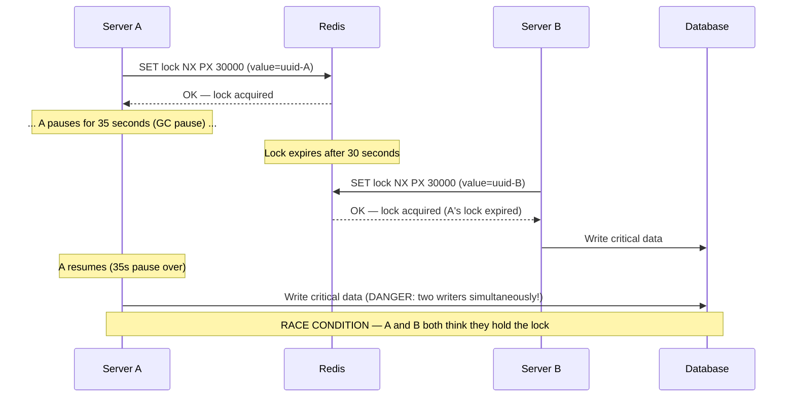
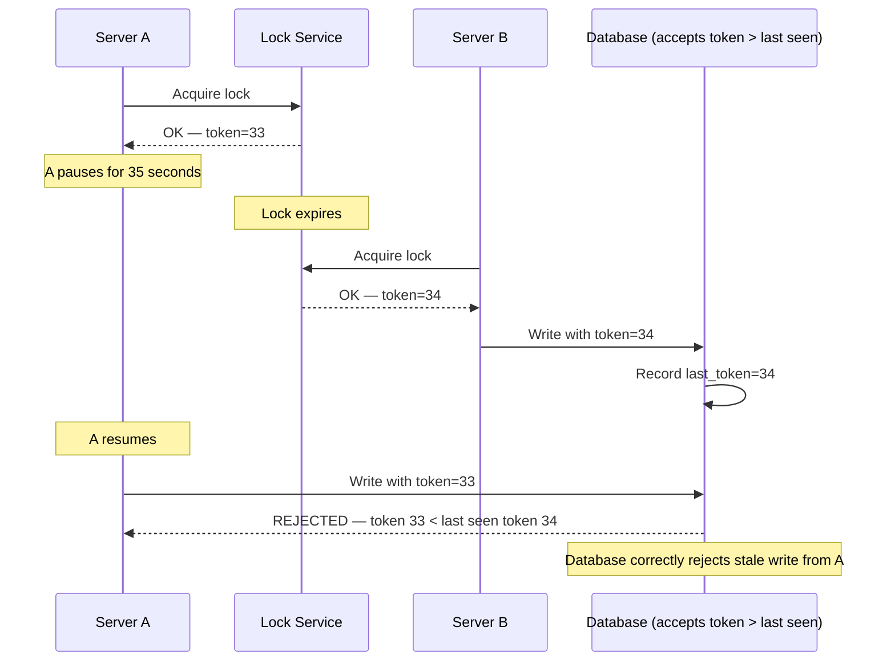

# Distributed Locks

## Why This Topic Exists

Concurrency bugs are among the hardest bugs to debug. Two servers both read a counter value of 42, both decide to increment it, and both write 43. The correct answer was 44. This is a classic race condition.

On a single machine, you solve this with a mutex (mutual exclusion lock). But in a distributed system, there is no shared memory — a mutex on Server A has no effect on Server B. You need a lock that all servers in the cluster can participate in. This is a distributed lock.

Distributed locks appear in many real systems: preventing two instances of a cron job from running simultaneously, ensuring only one server processes a payment at a time, or coordinating access to a shared resource across a fleet of microservices.

---

## Learning Objectives

By the end of this file, you will be able to:
- Explain why distributed locks are needed and what problem they solve
- Describe Redis-based locking using `SET NX EX`
- Explain the Redlock algorithm and why it uses multiple Redis nodes
- Describe ZooKeeper-based distributed locks
- Explain fencing tokens and why they are needed even when you have a distributed lock
- Identify the common failure modes of distributed locks (expired locks, clock skew)

---

## Prerequisites

- Understanding of distributed systems basics ([Introduction to Distributed Systems](./01.%20Introduction%20to%20Distributed%20Systems%20%28BEGINNER%29.md))
- Basic understanding of Redis (key-value store, SET command)
- Understanding of leader election concepts ([Leader Election](./04.%20Leader%20Election%20%28INTERMEDIATE%29.md)) is helpful

---

## Introduction

A lock has two operations: acquire (take the lock so others cannot) and release (give it back so others can proceed). A distributed lock works the same way, but the "lock" is stored in a shared external system (like Redis or ZooKeeper) so that all servers in the cluster can see it.

The twist with distributed locks is that the system holding the lock can fail or become slow. If Server A acquires a lock and then crashes before releasing it, the lock is held forever — no other server can ever acquire it. To handle this, distributed locks have an expiry time (TTL). If the lock is not released within the TTL, it automatically expires and another server can acquire it.

But now you have a new problem: what if Server A takes a long time (paused for garbage collection, for example) and its lock expires while it is still operating — and Server B acquires the lock — and now both A and B hold the lock simultaneously? This is the fencing problem, and it requires fencing tokens to solve.

---

## Real-World Analogy

Think of a single hotel bathroom at a conference. There is only one key. If someone takes the key, others wait. When they leave, they return the key.

But what if someone falls asleep in the bathroom? (This is "lock expiry" — after 10 minutes, staff will open the door.)

Now imagine two staff members both try to open the door at the same moment because they both think the 10-minute timer expired (one clock was slightly fast). Both get the door open. Both enter. There's a conflict.

Fencing tokens are the solution: each time the bathroom key is issued, it has a monotonically increasing number stamped on it. The bathroom's door lock only accepts the key if its number is higher than the last accepted number. Old expired keys are rejected even if they physically work.

---

## Core Concepts

### The Basic Problem

Two servers read the same value from a database, modify it, and write it back:

```
Server A: reads counter = 42
Server B: reads counter = 42
Server A: writes counter = 43  (42 + 1)
Server B: writes counter = 43  (42 + 1)
```

Expected result: 44. Actual result: 43. One increment was lost.

A distributed lock prevents this by ensuring only one server can be inside the critical section at a time.

### Redis-Based Locking — SET NX EX

Redis is a fast in-memory data store. A simple distributed lock using Redis:

```
SET lock_key unique_value NX PX 30000
```

- `SET lock_key unique_value`: Store a value at key "lock_key"
- `NX`: Only set if the key does Not eXist (atomic acquire — if another server holds the lock, this fails)
- `PX 30000`: Expire after 30,000 milliseconds (30 seconds) — ensures the lock is released even if the holder crashes

**Releasing the lock (using a Lua script for atomicity):**

```lua
if redis.call("get", KEYS[1]) == ARGV[1] then
    return redis.call("del", KEYS[1])
else
    return 0
end
```

The unique_value is a random UUID generated by the acquiring server. This ensures that only the server that acquired the lock can release it. Without this check, Server A could accidentally release a lock that was already re-acquired by Server B after A's lock expired.

**Why a Lua script?** The check-and-delete must be atomic. If you do `GET` then `DEL` as two separate commands, another server could acquire the lock between your GET and DEL, and you would delete their lock, not yours.

---

## Visual Diagram (Mermaid)

### The Lock Expiry Race Condition Problem



This is the core problem that fencing tokens solve.

### Fencing Tokens — The Solution



---

## Deep Explanation

### The Redlock Algorithm

What if the single Redis node you are using for locking fails? Your lock service becomes a single point of failure.

Martin Kleppmann (author of "Designing Data-Intensive Applications") proposed Redlock: acquire the lock on a majority of N independent Redis nodes.

**Redlock steps (with 5 Redis nodes):**

1. Record the current time T1
2. Try to acquire the lock on all 5 Redis nodes in sequence, with a short timeout per node (much shorter than the lock TTL)
3. Record the current time T2
4. The lock is considered acquired if:
   - You successfully acquired the lock on at least 3 of 5 nodes (majority)
   - The time elapsed (T2 - T1) is less than the lock TTL (the lock has not already expired)
5. The effective remaining TTL = original TTL - (T2 - T1)
6. If step 4 fails, release the lock on all nodes and try again after a random backoff

**Releasing Redlock:** Send the release command to all 5 nodes (even ones where acquisition failed — there might be a race condition where the SET succeeded after the timeout).

**Why does Redlock need a majority?**
If Redis Node 3 crashes after you acquire the lock on it, another client trying to acquire the lock can only reach nodes 1, 2, 4, 5. It can at most acquire 4 nodes. If Redlock requires 3-of-5, the new client could also succeed on 3 of the 4 remaining nodes — potentially giving two clients the lock simultaneously.

Actually, with a majority requirement: if Client A holds locks on nodes 1, 2, 3, and node 3 fails, Client B can acquire lock on nodes 1, 2 (already held by A — will fail), 4, 5. Client B gets 2 successful acquisitions, not 3. Redlock correctly rejects this.

**Criticism of Redlock:**
Martin Kleppmann himself later wrote that Redlock has a fundamental flaw: it relies on timing assumptions (the lock TTL vs. GC pauses, network delays, etc.). If a process pauses for longer than the TTL, it may believe it holds the lock but the lock has already expired and been re-acquired by another process. This is where fencing tokens are essential.

### ZooKeeper-Based Locks

ZooKeeper provides stronger guarantees for distributed locks than Redis.

**Algorithm:**

1. Create an ephemeral sequential node at `/locks/resource_name/n-` (ZooKeeper appends a sequence number)
2. List all nodes under `/locks/resource_name/`
3. If your node has the lowest sequence number, you hold the lock
4. Otherwise, watch the node with the sequence number immediately below yours
5. When your watched node is deleted (the holder released the lock or crashed), re-check if you now have the lowest number. If so, proceed.
6. To release the lock, delete your ephemeral node (or let ZooKeeper delete it when your session disconnects)

**Advantages over Redis:**
- Ephemeral nodes are automatically deleted when the session disconnects — if the lock holder crashes, ZooKeeper automatically releases the lock
- ZooKeeper's consistency guarantees are stronger than Redis's eventual consistency
- No need to worry about clock skew affecting TTL

**Disadvantages:**
- ZooKeeper is slower than Redis (disk-based, strong consistency has latency)
- ZooKeeper itself must be highly available (requires its own 3-5 node cluster)

### Fencing Tokens — The Essential Safety Net

Even with a perfect distributed lock, there is a window where two clients can simultaneously think they hold the lock (due to GC pauses, network delays, or lock expiry miscalculation). Fencing tokens handle this at the resource level.

**How fencing tokens work:**

1. Every time the lock is acquired, the lock service returns a monotonically increasing token (e.g., 1, 2, 3, 4...)
2. The client includes this token in every request to the protected resource (e.g., the database)
3. The resource (database, storage service) tracks the highest token it has ever seen
4. If a client sends a request with a token lower than the highest seen, the resource rejects it

This guarantees safety even if a stale client (whose lock expired) tries to make a write. Its token is lower than the token of the new lock holder, so the resource rejects it.

**Implementing fencing tokens with Redis:**
Redis does not natively support fencing tokens. You can implement them by maintaining a counter in Redis and incrementing it atomically each time a lock is acquired. Redlock documentation recommends using ZooKeeper or similar systems for applications that require fencing tokens.

### The Clock Skew Problem

Distributed locks with TTLs depend on clocks being synchronized. If Server A's clock is 10 seconds ahead of Redis's clock, the lock that Server A sets with TTL=30s actually expires after only 20 seconds from Server A's perspective (because Redis uses its own clock).

This is why you should:
1. Keep NTP synchronized across all nodes (use `chrony` or similar)
2. Use conservative TTLs (much longer than the maximum expected clock skew)
3. Not rely solely on TTL for safety — use fencing tokens as a belt-and-suspenders approach

---

## Step-by-Step Example

**Scenario**: A distributed cron job runs on 5 servers. The job should only run on one server at a time. How do you prevent duplicate runs?

**Step 1**: Each server tries to acquire the lock at job start time:
```
SET cron_job_daily_report unique_id NX PX 600000
```
(TTL = 10 minutes = 600,000ms — longer than the job usually takes)

**Step 2**: Only one server (say Server 3) gets `OK`. The others get `nil` (key already exists).

**Step 3**: Server 3 runs the job. Servers 1, 2, 4, 5 exit gracefully (they know they lost the lock).

**Step 4**: Server 3 finishes the job in 4 minutes and releases the lock:
```lua
if redis.call("get", "cron_job_daily_report") == "server3-uuid" then
    redis.call("del", "cron_job_daily_report")
end
```

**Step 5**: If Server 3 crashes mid-job, the lock expires after 10 minutes (the TTL). At the next scheduled run (next day), the lock is gone and any server can acquire it.

**What if the job takes longer than 10 minutes?** You can implement lock renewal: Server 3 periodically extends the TTL while the job is running:
```
EXPIRE cron_job_daily_report 600
```
(only if the UUID still matches — use a Lua script for atomicity)

---

## Advantages / Disadvantages / Trade-offs

| Approach | Consistency | Performance | Complexity | Failure Handling |
|----------|-------------|-------------|------------|-----------------|
| Redis single-node | Weak (single point of failure) | Very fast | Simple | Lock lost if Redis crashes |
| Redlock (Redis multi-node) | Better (majority quorum) | Fast | Medium | Survives minority Redis failures |
| ZooKeeper | Strong (strict ordering) | Slower | Higher | Ephemeral nodes auto-release |
| Fencing tokens | N/A (complementary) | Negligible overhead | Low | Handles stale lock holders |

---

## When to Use / When NOT to Use

**Use distributed locks when:**
- You need exactly-once execution of a critical operation across multiple servers
- You are coordinating access to an external resource that does not support concurrent modification
- You are preventing duplicate processing (e.g., two workers picking up the same job)

**Do NOT use distributed locks when:**
- You can use database-level optimistic locking (version numbers + conditional updates) — this is usually simpler and more reliable
- Your operation is idempotent — if running it twice is harmless, a lock is unnecessary overhead
- Your operation must be fast and the lock acquisition latency is a bottleneck
- You need strong transactional guarantees — use a database transaction instead

**The general advice:** reach for a distributed lock only after considering whether you can redesign the operation to be idempotent. Idempotent operations don't need locks.

---

## Common Interview Questions

1. What is a distributed lock? Why can't you just use a mutex?
2. Explain Redis-based locking with `SET NX EX`. Why do you need a unique value?
3. Why must you use a Lua script to release a Redis lock?
4. What is the Redlock algorithm? What problem does it solve over single-Redis locking?
5. What is a fencing token? Why is it needed even when you have a distributed lock?
6. How do ZooKeeper-based locks differ from Redis-based locks? When would you prefer one over the other?
7. What happens if a lock holder dies before releasing the lock? How does each approach handle this?

---

## Common Beginner Mistakes

**Mistake 1: Forgetting the unique value when releasing**
Using `DEL lock_key` directly instead of checking the UUID first. If your lock expired and another server acquired it, you will delete their lock, not yours.

**Mistake 2: Not handling lock acquisition failure**
Assuming the `SET NX` always succeeds. When the lock is held, your code must handle the failure — retry with backoff, fail gracefully, or skip the operation.

**Mistake 3: Ignoring the GC pause problem**
Thinking that a sufficiently long TTL makes the lock safe. A GC pause or network delay can cause the lock to expire while the holder believes it is still valid. This is why fencing tokens exist.

**Mistake 4: Using distributed locks for everything**
Over-relying on distributed locks creates bottlenecks and latency. Prefer idempotent operations, optimistic locking, or database transactions when possible.

**Mistake 5: Not considering lock renewal**
Setting the TTL based on average job duration. If a job occasionally takes 10x longer, the lock expires and another server starts the job — duplicate execution. Either use generous TTLs or implement lock renewal.

---

## Summary

A distributed lock is a lock stored in a shared external system (Redis, ZooKeeper) that allows multiple servers to coordinate access to a critical section. Redis-based locking uses `SET NX EX` with a unique value and a Lua script for atomic release. Redlock extends this to multiple Redis nodes for resilience.

ZooKeeper provides stronger locking guarantees using ephemeral sequential nodes. Fencing tokens add a final layer of safety by allowing the protected resource to reject requests from stale lock holders, even if the distributed lock service itself has a bug.

---

## Key Takeaways

- A distributed lock coordinates access to a critical section across multiple servers via a shared external system
- Redis `SET NX EX` acquires a lock atomically; a Lua script releases it safely using a unique UUID check
- Redlock acquires the lock on a majority of Redis nodes — survives individual Redis node failures
- ZooKeeper locks use ephemeral sequential nodes — automatically released on crash
- Fencing tokens (monotonically increasing tokens) allow the protected resource to reject stale writers
- GC pauses and clock skew can cause lock expiry while the holder believes it is still valid
- Prefer idempotent operations and database transactions over distributed locks when possible

---

## Related Topics (relative markdown links)

- [Introduction to Distributed Systems](./01.%20Introduction%20to%20Distributed%20Systems%20%28BEGINNER%29.md)
- [Leader Election](./04.%20Leader%20Election%20%28INTERMEDIATE%29.md)
- [Vector Clocks and Logical Time](./06.%20Vector%20Clocks%20and%20Logical%20Time%20%28ADV%29.md)
- [Two-Phase Commit and Distributed Transactions](./07.%20Two-Phase%20Commit%20and%20Distributed%20Transactions%20%28ADV%29.md)
- [Chapter 05: Caching](../05.%20Caching/README.md)
- [Chapter 12: Microservices](../12.%20Microservices/README.md)
- [Chapter README — All Distributed Systems Topics](./README.md)
