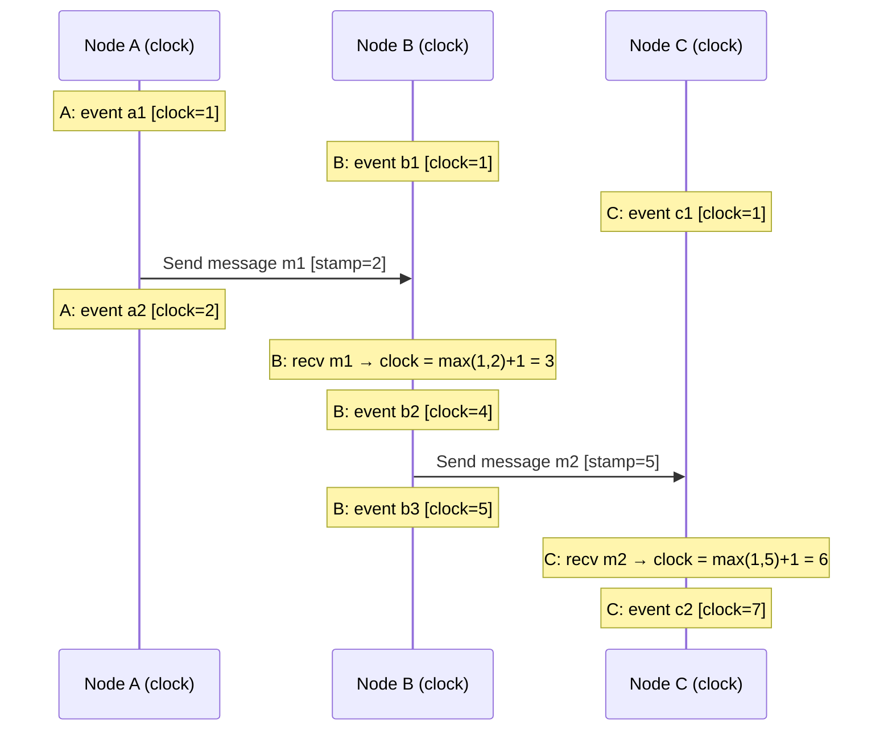

# Vector Clocks and Logical Time

## Why This Topic Exists

In a distributed system, events happen on multiple machines simultaneously. To understand causality — "did event A cause event B?" — you need to know the order in which events occurred. The natural instinct is to use timestamps. But timestamps are fundamentally unreliable across machines because every machine's clock is slightly different and drifts continuously.

Logical clocks, and their more powerful cousin vector clocks, solve this problem without depending on physical time. They track causality directly. This is how DynamoDB detects conflicting concurrent writes, how distributed databases reconcile divergent replicas, and how distributed debuggers trace the order of events across machines.

---

## Learning Objectives

By the end of this file, you will be able to:
- Explain why physical clocks cannot reliably order events in a distributed system
- Define Lamport timestamps and the happens-before relationship
- Describe how Lamport timestamps are updated on send and receive
- Define vector clocks and explain how they track causality per node
- Determine from two vector clocks whether one event caused the other, or whether the events were concurrent
- Explain how DynamoDB uses vector clocks (version vectors) to detect conflicting writes
- Define version vectors and explain how they differ from vector clocks

---

## Prerequisites

- Understanding of distributed systems basics ([Introduction to Distributed Systems](./01.%20Introduction%20to%20Distributed%20Systems%20%28BEGINNER%29.md))
- Understanding of why distributed systems have no shared clock (covered in the Introduction file)
- Basic understanding of distributed databases

---

## Introduction

Imagine a distributed system where three engineers send each other emails. Alice sends Bob "the meeting is at 3pm." Bob replies to Alice with "I will be there." Carol sends Alice "I moved the meeting to 4pm" at the same time Bob sent his reply. When you look at the emails later and want to understand what happened in what order — did Bob confirm before or after Carol moved the meeting? — timestamp alone cannot tell you reliably. Their computers might have slightly different clocks.

Logical clocks solve this by measuring not physical time but the causal ordering of events. Instead of "this happened at 14:37:22", logical clocks say "this happened after event 7 on Node A and event 3 on Node B."

---

## Real-World Analogy

Think of a relay race. Each runner passes the baton to the next. The order of events is clear not from clock time but from causality: Alice passes to Bob, Bob passes to Carol. No matter what the clock says, you know Bob's run caused Carol's run because of the baton.

Now imagine three parallel relay races happening on adjacent tracks. The runners on different tracks can see each other. When a runner from Track 2 finishes, the Track 3 runner says "I started after Track 2 runner 4 finished." They don't need a clock — they can observe and record causality directly.

This is what vector clocks do. Each node maintains a counter for each other node it has communicated with, recording exactly whose events it has seen before acting.

---

## Core Concepts

### Why Physical Clocks Fail

**Clock drift**: Every computer's clock drifts by a few milliseconds per hour. Even with NTP synchronization, clocks on different machines can differ by 1-10 milliseconds (or more in degraded conditions).

**NTP uncertainty**: NTP can step a clock backward or forward in small increments to correct drift. If your application is writing timestamps during a backward step, two events can appear to have the same timestamp or even reverse order.

**Real consequences**:
- Two writes to a database at "the same time" — which one wins?
- An event log that is out of order — debugging becomes impossible
- A distributed lock that expires "too early" because one clock is ahead

**Example of the problem:**
- Server A writes value V1 to key K at T=100
- Server B writes value V2 to key K at T=99 (B's clock is 1ms behind)
- By timestamp, V1 was written "after" V2, so V1 is the winner
- But the actual causal order was: V2 was sent AFTER V1, meaning V2 should win
- Physical timestamps give the wrong answer

Google's Spanner database solves this by using GPS and atomic clocks (TrueTime) with a bounded uncertainty interval. But most systems cannot afford atomic clocks. For those systems, logical clocks are the answer.

---

## Visual Diagram (Mermaid)

### Lamport Timestamps — Three Nodes, Multiple Events



---

## Deep Explanation

### Lamport Timestamps

Leslie Lamport introduced logical clocks in his 1978 paper "Time, Clocks, and the Ordering of Events in a Distributed System" — one of the most cited papers in computer science.

**The happens-before relationship (→)**

Event A → Event B (A happens before B) if:
1. A and B are on the same process and A comes before B in execution order
2. A is the sending of a message and B is the receipt of that same message
3. There exists an event C such that A → C and C → B (transitivity)

If neither A → B nor B → A, then A and B are **concurrent** (independent, neither caused the other).

**Lamport clock rules:**

1. Each process maintains a counter L, initially 0
2. Before executing an event, increment the counter: L = L + 1
3. When sending a message, attach the current L value to the message
4. When receiving a message with timestamp T: L = max(L, T) + 1

**What Lamport timestamps guarantee:**
If A → B, then L(A) < L(B).

**What Lamport timestamps do NOT guarantee:**
If L(A) < L(B), it does NOT necessarily mean A → B. Two concurrent events can have any Lamport timestamp order.

This is the fundamental limitation of Lamport clocks — they can tell you about causality in one direction, but cannot identify concurrent events.

### Vector Clocks

Vector clocks extend Lamport clocks by maintaining a separate counter for each process. Instead of a single integer, each event is stamped with a vector of integers: one per node in the system.

**Notation:** For a system with nodes A, B, C:
- Vector clock = [A's counter, B's counter, C's counter]
- Node A's initial vector: [0, 0, 0]

**Vector clock rules:**

1. Each process P maintains a vector V where V[P] is P's own counter, and V[X] is the latest counter P knows about for node X
2. Before executing an event, P increments its own counter: V[P] = V[P] + 1
3. When sending a message, P attaches its current vector V to the message
4. When P receives a message with vector W: merge element-by-element, then increment own counter:
   - V[X] = max(V[X], W[X]) for all X
   - V[P] = V[P] + 1

**Comparing two vector clocks (VC1 vs VC2):**

| Relationship | Condition |
|---|---|
| VC1 = VC2 | All elements are equal |
| VC1 → VC2 (VC1 happened before VC2) | All elements of VC1 ≤ VC2, AND at least one element strictly less |
| VC2 → VC1 (VC2 happened before VC1) | All elements of VC2 ≤ VC1, AND at least one element strictly less |
| VC1 and VC2 are concurrent | Neither VC1 ≤ VC2 nor VC2 ≤ VC1 — some elements of VC1 are greater, some of VC2 are greater |

**Example: Detecting a concurrent conflict**

```
Node A writes: VC_A = [1, 0, 0]
Node B writes: VC_B = [0, 1, 0]

Compare: [1,0,0] vs [0,1,0]
Is [1,0,0] ≤ [0,1,0]? No (A's element 1 > 0)
Is [0,1,0] ≤ [1,0,0]? No (B's element 1 > 0)
→ These are CONCURRENT writes. There is a conflict.
```

```
Node A reads, then writes based on that read: VC = [1, 0, 0]
Node B reads A's write (receives A's VC), then writes: VC = [1, 1, 0]

Compare: [1,0,0] vs [1,1,0]
Is [1,0,0] ≤ [1,1,0]? Yes (all elements of [1,0,0] ≤ [1,1,0])
→ A happened before B. B's write supersedes A's write. No conflict.
```

### How DynamoDB Uses Vector Clocks (Version Vectors)

The 2007 Amazon Dynamo paper describes how vector clocks are used to detect conflicting concurrent writes.

**The scenario:**
DynamoDB uses eventual consistency by default. A key can be written to different nodes simultaneously (no central coordinator). Vector clocks allow the system to determine whether writes are causally related or genuinely conflicting.

**The flow:**
1. Client reads key K. The response includes the current version vector: `[nodeA=3, nodeB=2]`
2. Client modifies the value
3. Client writes the new value back, including the version vector it read
4. The node receiving the write increments its own counter: `[nodeA=4, nodeB=2]`
5. If a conflicting concurrent write happened on another node: `[nodeA=3, nodeB=3]`
6. On reconciliation: DynamoDB sees that `[nodeA=4, nodeB=2]` and `[nodeA=3, nodeB=3]` are concurrent (neither is ≤ the other)
7. Both versions are returned to the next read — the client must resolve the conflict

**Conflict resolution in DynamoDB:**
- Business logic: the application can merge the two values (e.g., a shopping cart adds items from both versions)
- Last write wins: use the one with the higher physical timestamp (less safe but simpler)
- "Sibling" resolution: store both versions and let the client decide

**Version vectors vs. vector clocks:**
The terms are often used interchangeably, but technically:
- Vector clocks track causality of individual events (each event has a vector)
- Version vectors track versions of data objects (each replica of a data item has a vector)

In DynamoDB's context, the vector attached to a data item is a version vector — it tracks which replica servers have written to this item and how many times.

### Clock Skew in Real Distributed Databases

**Google Spanner's TrueTime API:**
Google Spanner solves clock skew with dedicated atomic clocks and GPS receivers in every data center. The TrueTime API returns a time interval [earliest, latest] rather than a single timestamp, representing the uncertainty range. Before committing a transaction, Spanner waits until the uncertainty interval passes (typically 7ms), ensuring the commit timestamp is globally unique and ordered.

This is an extreme (and expensive) engineering approach. Most systems use logical clocks instead.

**CockroachDB's Hybrid Logical Clocks (HLC):**
HLC combines physical time (for approximate real-world ordering) with logical clocks (for strict causal ordering). Each event has a (physical_time, logical_counter) pair. This gives approximate real-world time while maintaining strict causal ordering within that approximation.

---

## Step-by-Step Example

**Three nodes: A, B, C. Each starts with vector [A=0, B=0, C=0].**

**Step 1**: A processes an internal event
- A's vector becomes: **[A=1, B=0, C=0]**

**Step 2**: B processes an internal event
- B's vector becomes: **[A=0, B=1, C=0]**

**Step 3**: A sends a message to C
- A increments before sending: A's vector = **[A=2, B=0, C=0]**
- Message carries A's vector: [A=2, B=0, C=0]
- C receives: C's vector = max([0,0,0], [2,0,0]) + increment C = **[A=2, B=0, C=1]**

**Step 4**: B sends a message to C
- B increments before sending: B's vector = **[A=0, B=2, C=0]**
- Message carries B's vector: [A=0, B=2, C=0]
- C receives: C's vector = max([2,0,1], [0,2,0]) + increment C = **[A=2, B=2, C=2]**

**Now compare A's write [A=2, B=0, C=0] and B's write [A=0, B=2, C=0]:**
- Is [2,0,0] ≤ [0,2,0]? No (A=2 > 0)
- Is [0,2,0] ≤ [2,0,0]? No (B=2 > 0)
- **Conclusion: A's write and B's write are concurrent.** They happened independently, neither caused the other. This is a conflict that must be resolved.

**C's vector [A=2, B=2, C=2] vs B's write [A=0, B=2, C=0]:**
- Is [0,2,0] ≤ [2,2,2]? Yes (all elements ≤)
- **Conclusion: B's write happened before C's current state.** C has already seen B's information.

---

## Advantages / Disadvantages / Trade-offs

| Aspect | Lamport Timestamps | Vector Clocks |
|--------|-------------------|---------------|
| Data size | 1 integer per event | N integers per event (N = nodes) |
| Detects causality (A → B) | Yes — if L(A) < L(B) | Yes — if VC(A) < VC(B) |
| Detects concurrency (A ∥ B) | No | Yes |
| Storage overhead | Minimal | Grows with cluster size |
| Use case | Logging, debugging | Conflict detection in replicated systems |

| Advantage of Vector Clocks | Detail |
|---|---|
| Full causality tracking | Determines not just order but whether events are causally related |
| Concurrent conflict detection | Identifies exactly which writes are truly conflicting |
| No physical clock dependency | Works without synchronized clocks |

| Disadvantage of Vector Clocks | Detail |
|---|---|
| Size grows with N | In a 1,000-node cluster, every event carries 1,000 integers |
| Complexity | Harder to implement and reason about than timestamps |
| Garbage collection | Stale entries must be pruned from vectors, which is complex |

---

## When to Use / When NOT to Use

**Use vector clocks when:**
- You need to detect concurrent conflicting writes in a replicated system
- You need to track causality between distributed events for debugging or ordering
- You are implementing a distributed key-value store with eventual consistency
- You need to implement causal consistency

**Do NOT use vector clocks when:**
- Your cluster is very large (hundreds of nodes) — vector size becomes impractical
- You only need approximate ordering (Lamport timestamps are simpler)
- Strong consistency (linearizability) is required — use consensus (Raft, Paxos) instead
- Physical timestamps are sufficient for your use case (single data center, well-synced clocks)

---

## Common Interview Questions

1. Why can you not use physical timestamps to order events in a distributed system?
2. What is the happens-before relationship? Define it formally.
3. What does a Lamport timestamp guarantee? What does it not guarantee?
4. What information does a vector clock contain that a Lamport timestamp does not?
5. Given two vector clocks [2, 1, 0] and [1, 2, 0], are these events causally related or concurrent?
6. How does DynamoDB use vector clocks to detect conflicting writes?
7. What is the difference between a vector clock and a version vector?

---

## Common Beginner Mistakes

**Mistake 1: Thinking Lamport timestamps detect concurrency**
They do not. L(A) < L(B) does not mean A happened before B. Only vector clocks can detect concurrency.

**Mistake 2: Forgetting the merge step when receiving**
When receiving a message with vector W, you must merge (take max of each element), then increment your own counter. Forgetting the merge loses causal information.

**Mistake 3: Confusing concurrent with conflicting**
Concurrent events happened independently — they are not causally related. Whether they conflict depends on whether they both write to the same key. Two concurrent writes to different keys are not a conflict.

**Mistake 4: Assuming DynamoDB resolves conflicts automatically**
In many cases, DynamoDB returns multiple conflicting versions to the client and expects the application to resolve them. The application must implement conflict resolution logic.

---

## Summary

Physical clocks are unreliable for ordering events across distributed systems due to clock drift, NTP uncertainty, and the absence of a global clock. Logical clocks solve this by tracking causality directly.

Lamport timestamps provide a partial ordering of events — if A happened before B, then L(A) < L(B). But the converse does not hold, making them unable to detect concurrency.

Vector clocks extend this by maintaining one counter per node. They can fully characterize the relationship between any two events: one caused the other, or they were concurrent (independent). DynamoDB uses vector clocks as version vectors to detect conflicting writes across replicas, returning both versions to the client when a conflict is found.

---

## Key Takeaways

- Physical clocks drift and cannot reliably order events across machines
- Lamport timestamps guarantee: if A → B then L(A) < L(B), but not the converse
- Vector clocks maintain one counter per node — they can detect concurrent events that Lamport timestamps miss
- Two events are concurrent if neither vector clock is ≤ the other (some elements are larger in each)
- DynamoDB uses version vectors to detect conflicting concurrent writes and returns all conflicting versions for client resolution
- Vector clock size grows with cluster size — impractical for very large clusters
- Google Spanner uses atomic clocks + GPS to get bounded clock uncertainty instead of logical clocks

---

## Related Topics (relative markdown links)

- [Introduction to Distributed Systems](./01.%20Introduction%20to%20Distributed%20Systems%20%28BEGINNER%29.md)
- [Gossip Protocol](./03.%20Gossip%20Protocol%20%28ADV%29.md)
- [Distributed Locks](./05.%20Distributed%20Locks%20%28INTERMEDIATE%29.md)
- [Two-Phase Commit and Distributed Transactions](./07.%20Two-Phase%20Commit%20and%20Distributed%20Transactions%20%28ADV%29.md)
- [Raft Consensus Algorithm](./08.%20Raft%20Consensus%20Algorithm%20%28ADV%29.md)
- [Chapter 10: Consistency and Consensus](../10.%20Consistency%20and%20Consensus/README.md)
- [Chapter README — All Distributed Systems Topics](./README.md)
