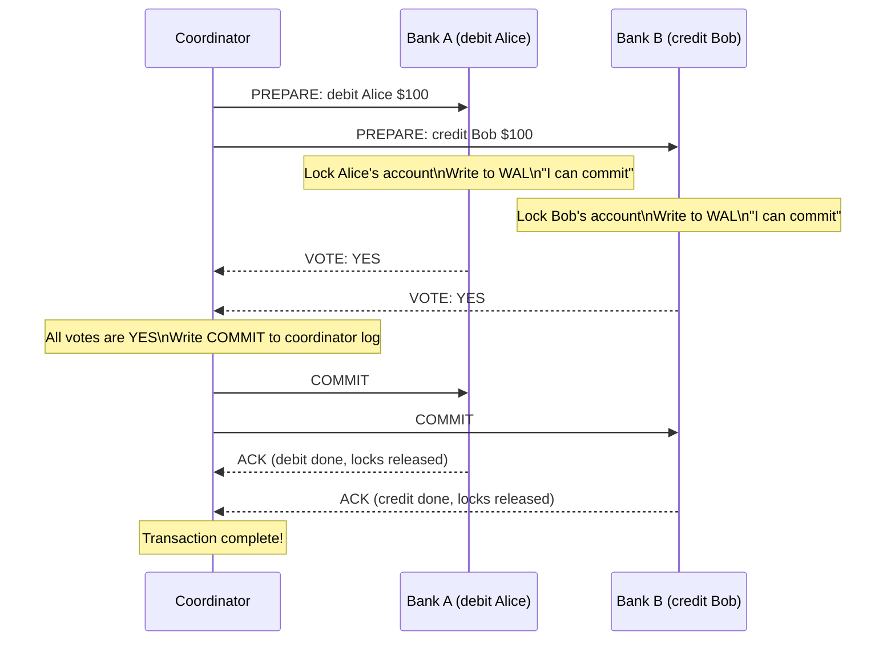
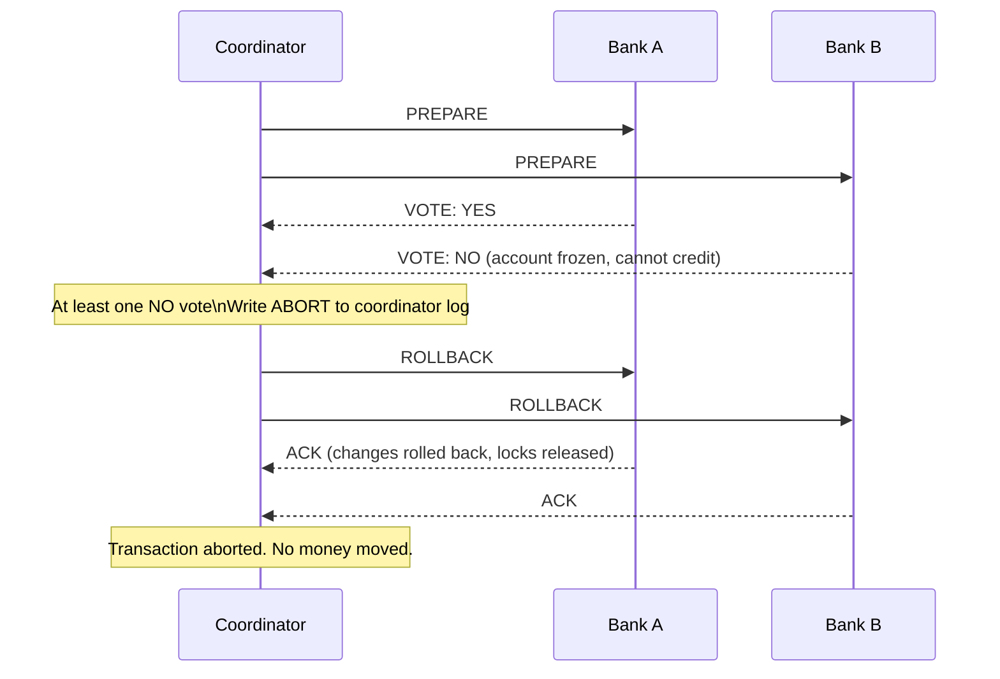
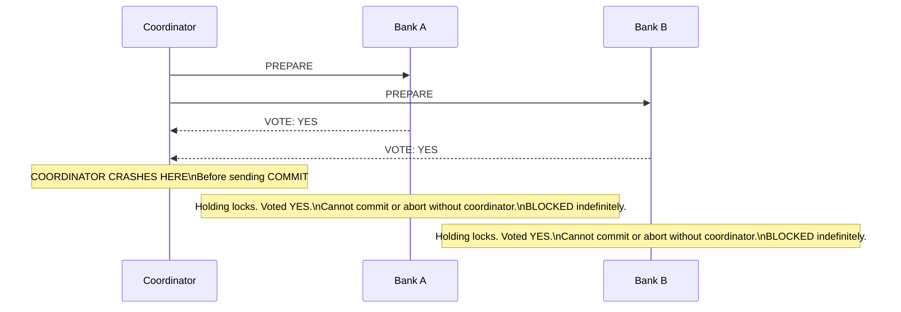

# Two-Phase Commit and Distributed Transactions

## Why This Topic Exists

In a single database, atomicity is handled by the database engine: either all operations in a transaction commit, or none do. But what happens when a transaction spans two separate databases, or two microservices with their own databases?

A money transfer between two banks is the classic example. Bank A must debit $100 from Alice's account. Bank B must credit $100 to Bob's account. Either both must succeed, or neither must. If Bank A debits successfully but then Bank B crashes before crediting, you have lost $100. There is no single database to provide atomic commit across both systems.

Two-phase commit (2PC) is the classic protocol for achieving atomic commit across multiple independent resources. It is widely used in distributed databases, enterprise systems, and message broker integrations. Understanding its limitations — especially the blocking problem — is just as important as understanding the algorithm itself.

---

## Learning Objectives

By the end of this file, you will be able to:
- Explain why atomic commit is hard across multiple databases
- Describe the two phases of 2PC (prepare and commit) in detail
- Explain why 2PC can block indefinitely if the coordinator crashes
- Describe how 3PC reduces (but does not eliminate) blocking
- Explain the SAGA pattern as a 2PC alternative for microservices
- Give a real example of 2PC usage (cross-bank transfer)
- Identify the trade-offs between 2PC and SAGA

---

## Prerequisites

- Understanding of database transactions and ACID properties ([Chapter 04: Databases](../04.%20Databases/README.md))
- Understanding of distributed systems basics ([Introduction to Distributed Systems](./01.%20Introduction%20to%20Distributed%20Systems%20%28BEGINNER%29.md))
- Understanding of leader election (the coordinator concept) ([Leader Election](./04.%20Leader%20Election%20%28INTERMEDIATE%29.md))

---

## Introduction

Imagine you are transferring money between two bank accounts held at different banks. Bank A's system and Bank B's system are completely separate. No shared database exists.

The operation must be atomic: either both the debit (Bank A) and the credit (Bank B) succeed, or neither does. You cannot have a world where Bank A debited Alice but Bank B never credited Bob — that money just vanished.

Two-phase commit solves this by introducing a coordinator that orchestrates the transaction across all participants. The protocol has exactly two phases: a prepare phase (ask everyone "are you ready?") and a commit phase (if everyone is ready, tell everyone "go ahead").

---

## Real-World Analogy

Think of the coordinator as a wedding officiant. Before the ceremony, the officiant asks each partner: "Do you take this person to be your spouse?" (prepare phase). Only after both say "I do" does the officiant pronounce them married (commit phase).

If either partner says "I don't" or hesitates too long, the officiant calls off the ceremony (abort phase). Both parties return to their previous state — unmarried.

The problem: what if the officiant drops dead after asking the question but before pronouncing them married? Both partners said "I do" but are now stuck — they cannot marry someone else yet, but they are not actually married. They are blocked waiting for the officiant to recover.

This is the fundamental blocking problem of 2PC.

---

## Core Concepts

### Roles in 2PC

**Coordinator**: The node that drives the transaction. It sends prepare messages, collects votes, and sends the final commit or abort decision.

**Participants**: The nodes that execute parts of the transaction (e.g., the two bank databases). They vote yes/no and then follow the coordinator's final decision.

### Phase 1: Prepare Phase

1. The coordinator sends a `PREPARE` message to all participants
2. Each participant:
   - Writes the transaction data to a durable write-ahead log (WAL)
   - Acquires all necessary locks on the data it will modify
   - Votes YES (it is ready to commit and can guarantee it) or NO (something went wrong)
   - Sends its vote back to the coordinator
3. A YES vote is a promise: "I have everything I need, I can definitely commit if you tell me to"

**Critical point**: Once a participant votes YES, it cannot change its mind. It must hold its locks and keep its transaction data on disk until the coordinator sends the final decision. This is why the prepare phase is sometimes called the "point of no return" for participants.

### Phase 2: Commit Phase

**If all participants voted YES:**
1. The coordinator writes "commit" to its own durable log
2. The coordinator sends `COMMIT` messages to all participants
3. Each participant commits the transaction (makes changes permanent) and releases its locks
4. Each participant sends an ACK to the coordinator
5. The coordinator marks the transaction as complete

**If any participant voted NO (or timed out):**
1. The coordinator writes "abort" to its own durable log
2. The coordinator sends `ROLLBACK` messages to all participants
3. Each participant rolls back its changes and releases its locks
4. Each participant sends an ACK to the coordinator

---

## Visual Diagram (Mermaid)

### 2PC Happy Path — Bank Transfer

### 2PC Failure — Bank B Cannot Commit

### 2PC Blocking Problem — Coordinator Crashes

---

## Deep Explanation

### The Blocking Problem

The most serious limitation of 2PC is that it is a **blocking protocol**. If the coordinator crashes after participants have voted YES but before the coordinator sends the COMMIT or ROLLBACK, the participants are stuck:

- They cannot commit on their own (what if the coordinator was going to send ROLLBACK due to a network partition they don't know about?)
- They cannot abort on their own (what if the coordinator was going to send COMMIT?)
- They hold their locks, preventing any other transactions from accessing those records
- They wait for the coordinator to recover

This can cause indefinite blocking. In practice, coordinators crash and take minutes, hours, or longer to recover. During that time, every transaction waiting on the coordinator is locked out.

**Recovery after coordinator crash:**
When the coordinator recovers, it reads its durable log:
- If the log says COMMIT: resend COMMIT to all participants
- If the log says ABORT: resend ROLLBACK to all participants
- If the log has only PREPARE (crashed before deciding): the coordinator can safely abort (no participant has committed yet)

The critical window is between "coordinator decided to commit" and "coordinator wrote commit to its log." If the crash happens in this window, the coordinator might abort a transaction that it intended to commit, violating the original intent.

### Three-Phase Commit (3PC)

3PC adds a third phase to reduce (but not eliminate) blocking:

**Phase 1: Can-Commit** (same as 2PC prepare — "can you commit?")

**Phase 2: Pre-Commit** (new — "prepare to commit; I have received all yes votes")
- The coordinator sends a PRE-COMMIT message after receiving all YES votes
- Participants acknowledge and enter a "pre-committed" state
- Participants now know: if the coordinator crashes, they can safely commit (because all participants have voted YES)

**Phase 3: Do-Commit** (same as 2PC commit — "commit now")
- Coordinator sends COMMIT, participants commit and release locks

**Why 3PC reduces blocking:**
If the coordinator crashes after Phase 2, participants in the pre-committed state know it is safe to commit (because they know all participants voted YES in Phase 1). They can elect a new coordinator among themselves to send COMMIT.

**Why 3PC does NOT eliminate blocking:**
If the coordinator crashes before Phase 2 in a network partition scenario, participants cannot determine if the coordinator received all YES votes. They still block.

In practice, 3PC is rarely used in real systems. The extra round-trip latency adds cost, and the blocking problem is not fully solved. Real systems instead use:
- Paxos or Raft-based distributed transactions (used by Google Spanner, CockroachDB)
- The SAGA pattern (used in microservices)

### SAGA Pattern — An Alternative to 2PC

For microservices and long-running transactions, the SAGA pattern is the modern alternative to 2PC.

A SAGA breaks a large transaction into a sequence of smaller local transactions, each with a corresponding compensating transaction (undo operation).

**Example: Hotel + Flight + Car booking (all or nothing)**

| Step | Action | Compensating Action |
|------|--------|---------------------|
| 1 | Book hotel room | Cancel hotel booking |
| 2 | Book flight | Cancel flight |
| 3 | Book rental car | Cancel rental car |
| 4 | Charge credit card | Issue refund |

If Step 3 fails (no cars available), the SAGA executes compensating transactions in reverse:
- Cancel flight (Step 2 compensating)
- Cancel hotel (Step 1 compensating)

The system ends up in a consistent state, but through compensation rather than atomicity.

**SAGA vs. 2PC:**

| Aspect | 2PC | SAGA |
|--------|-----|------|
| Atomicity | True atomic — all or nothing | Eventual consistency — compensations |
| Blocking | Yes — coordinator failure blocks participants | No — each step is independent |
| Long-running transactions | Poor — holds locks for entire duration | Good — each step releases resources immediately |
| Complexity | Protocol complexity | Business logic complexity (compensating actions) |
| Use case | Short, tightly-coupled transactions | Long-running, loosely-coupled workflows |

**SAGA choreography vs. orchestration** (covered in more depth in the Microservices chapter):
- Choreography: each service publishes events and listens to others' events — decentralized
- Orchestration: a central SAGA coordinator sends commands to each service — centralized (but less blocking than 2PC because each step commits immediately)

### Real-World Usage of 2PC

**Database XA transactions:**
The X/Open XA standard defines a 2PC protocol for distributed transactions across multiple resource managers (databases). JDBC supports XA transactions. When an application modifies both a PostgreSQL database and a MySQL database in the same transaction, XA 2PC coordinates the atomic commit.

**Message queue + database (transactional outbox pattern):**
A common problem: you want to insert a database record AND publish a Kafka message atomically. If the database commits but Kafka publish fails, you have inconsistent state.

Solutions:
- XA 2PC across the DB and Kafka (possible but complex)
- Transactional outbox: write to a separate "outbox" table in the same DB transaction, then a background process reads the outbox and publishes to Kafka (at-least-once)

**Distributed SQL databases:**
CockroachDB, Google Spanner, and TiDB implement distributed transactions internally using variants of 2PC coordinated by Raft-based consensus. The coordinator is not a single point of failure because it is replicated via Raft.

---

## Step-by-Step Example

**Scenario**: Alice transfers $100 from her account at Bank A to Bob's account at Bank B.

**Preconditions**: Coordinator is a separate transaction manager service. Bank A has Alice's account. Bank B has Bob's account. Alice has $200 balance.

**Step 1: Start transaction**
- Coordinator assigns transaction ID: TXN-9981

**Step 2: Prepare Phase — send to Bank A**
- Coordinator → Bank A: PREPARE TXN-9981 (debit $100 from Alice)
- Bank A: checks Alice has sufficient funds ($200 ≥ $100): YES
- Bank A: writes debit operation to WAL: "TXN-9981: debit Alice $100"
- Bank A: acquires lock on Alice's account row
- Bank A → Coordinator: VOTE YES for TXN-9981

**Step 3: Prepare Phase — send to Bank B**
- Coordinator → Bank B: PREPARE TXN-9981 (credit $100 to Bob)
- Bank B: checks Bob's account exists: YES
- Bank B: writes credit operation to WAL: "TXN-9981: credit Bob $100"
- Bank B: acquires lock on Bob's account row
- Bank B → Coordinator: VOTE YES for TXN-9981

**Step 4: Coordinator decides**
- Both votes are YES
- Coordinator writes to its durable log: "TXN-9981: COMMIT"

**Step 5: Commit Phase**
- Coordinator → Bank A: COMMIT TXN-9981
- Coordinator → Bank B: COMMIT TXN-9981
- Bank A: applies debit (Alice: $200 → $100), releases lock, ACKs
- Bank B: applies credit (Bob: $50 → $150), releases lock, ACKs

**Step 6: Complete**
- Coordinator marks TXN-9981 as complete
- Total: Alice lost $100, Bob gained $100. Atomic.

---

## Advantages / Disadvantages / Trade-offs

| Aspect | Advantage | Disadvantage |
|--------|-----------|--------------|
| Atomicity | True all-or-nothing across multiple systems | Blocking if coordinator fails after prepare |
| Durability | All state is written to durable logs before commit | Requires durable storage at all participants |
| Simplicity (for business logic) | No need for compensating transactions | Protocol implementation is complex |
| Lock contention | Guaranteed isolation | Holds locks for the entire 2-phase duration — poor for long transactions |
| Network round trips | Two phases = at minimum 2 round trips | High latency for geographically distributed participants |

---

## When to Use / When NOT to Use

**Use 2PC when:**
- You need strict atomic transactions across multiple databases or resource managers
- Your transactions are short-lived (milliseconds to seconds)
- You are operating within a single data center or low-latency network
- You use a database system that already implements 2PC internally (CockroachDB, Spanner)

**Do NOT use 2PC when:**
- You need high availability — coordinator failure blocks the entire transaction
- Your transactions are long-running (seconds to minutes) — lock contention is unbearable
- You are operating across microservices with loose coupling — use SAGA instead
- You need to span across services owned by different teams or organizations — coordination overhead is too high

---

## Common Interview Questions

1. Explain the two phases of two-phase commit. What happens in each phase?
2. What is the blocking problem in 2PC? Under what conditions does it occur?
3. What does a participant do if it votes YES and then loses contact with the coordinator?
4. How does 3PC attempt to reduce blocking? Why does it not fully solve it?
5. What is the SAGA pattern? How is it different from 2PC?
6. When would you choose 2PC over SAGA? When would you choose SAGA over 2PC?
7. How do distributed SQL databases like CockroachDB or Spanner implement distributed transactions?

---

## Common Beginner Mistakes

**Mistake 1: Thinking 2PC guarantees no blocking**
2PC can block indefinitely if the coordinator crashes after participants have voted. This is not a bug — it is an inherent limitation of the protocol.

**Mistake 2: Proposing SAGA for everything**
SAGA does not provide true atomicity. If a compensating transaction fails (e.g., the airline refuses to cancel the flight), you have an inconsistent state. SAGA requires careful design of compensating actions.

**Mistake 3: Forgetting the coordinator's durable log**
The coordinator must write its commit/abort decision to a durable log before sending it to participants. If it crashes between deciding and writing, the decision is lost and participants are blocked.

**Mistake 4: Confusing 2PC with replication**
2PC is about atomic commit across multiple independent systems. Database replication (primary/replica) is about copying data for redundancy. They serve different purposes.

---

## Summary

Two-phase commit ensures that a transaction spanning multiple independent databases either commits on all of them or rolls back on all of them. The prepare phase collects YES/NO votes. The commit phase sends the final decision.

The critical limitation is blocking: if the coordinator crashes after participants have voted YES but before sending COMMIT, participants hold their locks indefinitely waiting for the coordinator to recover.

Three-phase commit reduces blocking by adding a pre-commit phase but does not eliminate it. For microservices and long-running workflows, the SAGA pattern is the modern alternative: each step commits locally and has a compensating action that can undo it if a later step fails.

---

## Key Takeaways

- 2PC ensures atomic commit across multiple independent systems: all commit or all rollback
- Phase 1 (Prepare): coordinator asks "are you ready?"; participants lock resources and vote YES/NO
- Phase 2 (Commit): if all YES, coordinator sends COMMIT; if any NO, coordinator sends ROLLBACK
- The blocking problem: if the coordinator crashes after YES votes but before COMMIT, participants hold locks indefinitely
- 3PC adds a pre-commit phase to reduce blocking but does not eliminate it
- SAGA breaks large transactions into local steps with compensating actions — eventual consistency, no blocking
- Real distributed SQL databases (Spanner, CockroachDB) implement 2PC internally with Raft-replicated coordinators to avoid the single point of failure

---

## Related Topics (relative markdown links)

- [Introduction to Distributed Systems](./01.%20Introduction%20to%20Distributed%20Systems%20%28BEGINNER%29.md)
- [Leader Election](./04.%20Leader%20Election%20%28INTERMEDIATE%29.md)
- [Distributed Locks](./05.%20Distributed%20Locks%20%28INTERMEDIATE%29.md)
- [Vector Clocks and Logical Time](./06.%20Vector%20Clocks%20and%20Logical%20Time%20%28ADV%29.md)
- [Raft Consensus Algorithm](./08.%20Raft%20Consensus%20Algorithm%20%28ADV%29.md)
- [Chapter 04: Databases](../04.%20Databases/README.md)
- [Chapter 10: Consistency and Consensus](../10.%20Consistency%20and%20Consensus/README.md)
- [Chapter 12: Microservices](../12.%20Microservices/README.md)
- [Chapter README — All Distributed Systems Topics](./README.md)
