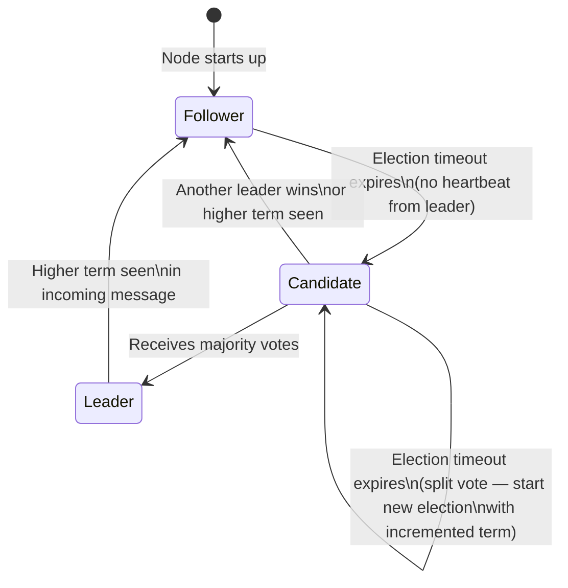
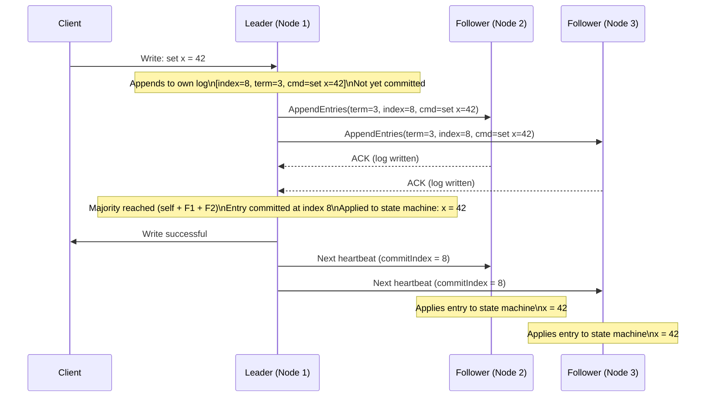

# Raft Consensus Algorithm

## Why This Topic Exists

Distributed systems are only useful if the nodes agree on what the current state is. A distributed database where Node A thinks the balance is $500 and Node B thinks it is $300 is not a database — it is a source of bugs and data corruption. A cluster where two nodes both believe they are the leader will accept conflicting writes, leading to diverged state that is nearly impossible to reconcile safely.

Consensus is the mechanism that makes nodes agree. Raft is the most widely used consensus algorithm in modern infrastructure. It powers etcd (which is the brain of every Kubernetes cluster), CockroachDB, TiDB, and many other systems you depend on every day without knowing it.

As a senior or staff engineer, you will be expected to understand how systems like etcd and distributed databases actually guarantee correctness. Raft is the answer. You will also encounter interview questions that ask "how does leader election actually work in a real system?" or "what happens when a Kafka controller crashes?" Raft is the conceptual foundation behind all of these.

---

## Learning Objectives

By the end of this file, you will be able to:
- Explain why consensus is needed in distributed systems and where it is required
- Explain why Raft was created as an alternative to Paxos
- Describe Raft's three sub-problems: Leader Election, Log Replication, and Safety
- Trace through a full leader election including split-vote scenarios
- Trace through the log replication flow from client write to committed entry
- Explain the Leader Completeness Property and why it prevents data loss
- Explain log compaction via snapshots and why it is necessary
- Describe how etcd uses Raft for Kubernetes cluster state management
- Compare Raft and Paxos on key dimensions

---

## Prerequisites

- Understanding of distributed systems basics ([Introduction to Distributed Systems](./01.%20Introduction%20to%20Distributed%20Systems%20%28BEGINNER%29.md))
- Understanding of leader election concepts ([Leader Election](./04.%20Leader%20Election%20%28INTERMEDIATE%29.md))
- Understanding of distributed locks ([Distributed Locks](./05.%20Distributed%20Locks%20%28INTERMEDIATE%29.md))
- Understanding of distributed transactions for contrast ([Two-Phase Commit and Distributed Transactions](./07.%20Two-Phase%20Commit%20and%20Distributed%20Transactions%20%28ADV%29.md))

---

## Introduction

Imagine you have three database replicas. A client sends a write: "set x = 42". All three replicas need to agree on two things: that this write happened, and in what order it happened relative to other writes. If they disagree on the order, they will end up with different final states.

The problem of getting nodes to agree on a value — or a sequence of values — is called the **consensus problem**. It sounds simple but is surprisingly hard when nodes can crash, messages can be delayed, and the network can partition.

Consensus is needed in several places across real systems:

- **Distributed databases**: replicas must agree on which writes happened in which order
- **Leader election**: the cluster must agree on exactly one node being the leader
- **Configuration management**: all nodes must see the same configuration at the same time
- **Distributed locks**: all nodes must agree on who holds a lock
- **Service discovery**: all nodes must agree on which services are available

The first widely studied consensus algorithm was **Paxos**, introduced by Leslie Lamport in 1989. Paxos is theoretically correct and highly efficient, but it is famously difficult to understand. Even Lamport himself wrote two papers on it — the original "Part-Time Parliament" (1989) and a simpler follow-up "Paxos Made Simple" (2001) — because people could not grasp the first one. In practice, teams implementing Paxos frequently got it wrong, leading to subtle correctness bugs in production systems.

In 2014, Diego Ongaro and John Ousterhout published the **Raft** paper ("In Search of an Understandable Consensus Algorithm"). The opening of the paper is remarkably direct: *"Raft was designed for understandability."* They ran user studies where students who learned Raft answered more questions correctly than students who learned Paxos — including questions about Paxos. The algorithm was literally designed to be teachable.

Raft achieves the same correctness guarantees as Paxos but decomposes the problem into three clearly separated sub-problems that you can learn one at a time.

---

## Real-World Analogy

Think of Raft as a **national election system**.

Each election cycle is called a **term**. Terms are numbered sequentially: Term 1, Term 2, Term 3, and so on. At the start of each term, there may be an election to choose a president (the leader). Terms are like US presidential election cycles — they are numbered, they are finite, and when one ends, the next one begins.

Every citizen (node) starts as a regular voter (Follower). As long as the current president (leader) is active, they broadcast regular announcements (heartbeats) to all citizens. Citizens hear these announcements and stay content. But if a voter stops hearing from the president for a while — maybe the president collapsed — they assume the president is gone and decide to run for office themselves. They become a **Candidate** and start campaigning: they send messages to other voters saying "I am running for president of Term 5. Please vote for me."

Other citizens follow a simple rule: vote for the first credible candidate you hear from in a given term (credible means their knowledge of past laws is at least as complete as yours). Once a citizen casts their vote, they will not vote for anyone else in that same term.

If a candidate gets votes from more than half the citizens (a majority), they win and become the new **Leader** for Term 5. They immediately start broadcasting announcements to suppress other candidates.

Once elected, the president handles all legislation (client write requests). When a new law needs to be enacted, the president drafts it and sends it to all citizens: "Proposed Law #48: set x = 42. Please write it down and confirm you received it." Once more than half the citizens confirm, the president declares the law enacted (committed) and officially applies it.

**What if two candidates run simultaneously and split the vote?** Neither reaches a majority. Term 5 ends without a winner. Everyone waits a random amount of time, then a new election begins for Term 6. The randomization ensures one candidate usually gets a head start in the next round and wins before the other one even starts campaigning.

This analogy maps precisely to Raft's mechanics: terms = election cycles, followers = voters, candidates = candidates, leader = elected president, heartbeats = presidential broadcasts, log entry = proposed law, commit = law enacted.

---

## Core Concepts

### The Three Sub-Problems of Raft

Raft decomposes consensus into three cleanly separated problems:

1. **Leader Election**: How do nodes agree on one leader? What happens when the leader dies?
2. **Log Replication**: How does the leader replicate writes to followers in a consistent order?
3. **Safety**: How does Raft guarantee that committed entries are never lost, even across leader changes?

### Node States

Every Raft node is always in exactly one of three states:

| State | Description |
|---|---|
| **Follower** | The default state. Passive. Accepts AppendEntries from the leader and votes in elections. |
| **Candidate** | Transitional state. Initiated an election by timing out. Requests votes from peers. |
| **Leader** | The active, authoritative node. Handles all client writes. Replicates logs to followers. Sends periodic heartbeats. |

### Terms

A **term** is a monotonically increasing integer that acts as a logical clock. Each election starts a new term. Terms serve two purposes:

- **Stale message detection**: if a node receives a message from an older term, it ignores it (that message is from a stale leader)
- **Split-brain prevention**: if a partitioned leader reconnects and finds it has a lower term, it immediately steps down to Follower

### Quorum

Raft requires a **majority (quorum)** for any decision. In a cluster of 5 nodes, a quorum is 3. In a cluster of 3 nodes, a quorum is 2.

This majority requirement is why Raft tolerates up to **(N-1)/2 node failures** in a cluster of N nodes:
- 3-node cluster: tolerates 1 failure
- 5-node cluster: tolerates 2 failures
- 7-node cluster: tolerates 3 failures

---

## Visual Diagram (Mermaid)

### Node State Transitions



### Log Replication Sequence



---

## Deep Explanation

### Leader Election in Detail

Every follower has an **election timeout** — a random timer, typically between 150 ms and 300 ms. The timer is randomized deliberately: if all nodes had the same timeout, they would all start elections simultaneously on every leader failure, producing perpetual split votes.

**Normal operation**: The leader continuously sends heartbeat messages (empty `AppendEntries` RPC calls) to all followers at a short interval (typically 50-100 ms). Every time a follower receives a heartbeat, it resets its election timeout. As long as the leader is healthy, no follower ever times out.

**Leader dies**: Followers stop receiving heartbeats. Their election timers count down. The first follower whose timer reaches zero transitions to Candidate.

**The Candidate's actions**:
1. Increments its own term number (e.g., from Term 3 to Term 4)
2. Votes for itself
3. Sends `RequestVote` RPCs to all other nodes, including its current term number and the index and term of its last log entry

**How followers vote**:
A follower grants a vote only if two conditions are met:
- It has not already voted in this term (one vote per term, first-come first-served)
- The candidate's log is at least as up-to-date as the follower's own log ("up-to-date" means: the candidate's last log entry has a higher term, or has the same term but a higher index)

Once a follower votes YES, it resets its own election timer — it will now wait for the new leader rather than starting its own election.

**Winning the election**: If the candidate receives YES votes from a majority of nodes (including its own vote), it declares itself the Leader for the new term. It immediately sends heartbeats to all nodes to establish authority and suppress other candidates.

**Split vote**: If two candidates start elections simultaneously, they may each get roughly half the votes — neither reaches a majority. No leader is elected for this term. Both candidates time out and start a new election for the next term. Because the timeouts are **randomized**, one candidate will almost always get a head start and win before the other even starts campaigning.

### Log Replication in Detail

Once a leader is elected, it handles all client requests. If a client accidentally contacts a follower, the follower rejects the write and redirects the client to the leader's address.

**The full replication flow**:

1. Client sends a write to the leader.
2. Leader appends the entry to its own log — marked as uncommitted at this point. The entry carries: the command, the current term number, and a log index.
3. Leader sends `AppendEntries` RPCs to all followers in parallel. Each message includes the new entry, the leader's current term, the index and term of the entry just before this one (for consistency checking), and the leader's current commit index.
4. Each follower checks that the entry immediately before the new one matches what it has locally (using `prevLogIndex` and `prevLogTerm`). If it matches, the follower appends the new entry and sends a success response. If it does not match (the follower missed earlier entries), it rejects, and the leader retries with progressively older entries until it finds the point where the logs agree.
5. As soon as the leader receives success responses from a majority of nodes (counting its own log as one acknowledgment), it marks the entry as committed.
6. Leader applies the committed entry to its state machine and responds to the client with success.
7. In the next heartbeat or `AppendEntries` message, the leader includes the updated commit index. Followers advance their own commit index and apply the committed entries to their state machines.

### Safety: The Leader Completeness Property

Raft's most important safety guarantee: **if an entry is committed in a given term, it will be present in the logs of all future leaders.**

Why? Because of the voting rule. For a committed entry, by definition, a majority of nodes have it in their logs. For any candidate to win an election, it must get votes from a majority of nodes. Since both majorities share at least one node, and that node will refuse to vote for a candidate whose log does not contain the committed entry, the winning candidate always has all committed entries.

This is called the **Leader Completeness Property** and is why Raft never loses committed data even across multiple leader failures.

### Log Compaction via Snapshots

Without compaction, the Raft log grows forever. A server restarting after a long outage would have to replay millions of log entries to reconstruct the current state — taking minutes or hours.

Raft solves this with **snapshots**. Periodically, a node captures the entire current state of its state machine at a specific log index, writes it to disk, and discards all log entries up to that index. The snapshot includes the index and term of the last entry it replaces (for consistency checks).

When a follower is significantly behind (perhaps it was down for weeks), the leader can send it a complete snapshot via the `InstallSnapshot` RPC instead of replaying thousands of individual log entries. The follower loads the snapshot, then catches up from the snapshot's point forward using normal `AppendEntries`.

Most production systems trigger a snapshot after the log reaches a configurable size threshold — for example, etcd defaults to snapshotting every 10,000 entries.

---

## Step-by-Step Example

### How etcd Uses Raft for Kubernetes Cluster State

**What is etcd?** etcd is a distributed key-value store that Kubernetes uses as its sole persistent backing store. Every Kubernetes object — every Pod, Deployment, Service, ConfigMap, Secret, and Node registration — is stored in etcd. The Kubernetes API server reads from and writes to etcd for every state change in the cluster.

etcd runs as a 3-node or 5-node cluster and uses Raft internally for all writes. Here is how a real Kubernetes operation flows through Raft:

**Scenario**: A user runs `kubectl scale deployment my-app --replicas=5`

**Step 1**: The `kubectl` command sends an HTTP PATCH request to the Kubernetes API server, asking to update `my-app`'s `spec.replicas` from 3 to 5.

**Step 2**: The API server validates the request and calls the etcd client library with a write: "set key `/registry/deployments/default/my-app` to the updated Deployment object."

**Step 3**: The etcd client library contacts the **etcd Leader** node. (If it hits a Follower, the Follower returns the leader's address and the client retries.)

**Step 4**: The etcd Leader appends a new entry to its Raft log:
```
[index=4821, term=12, cmd="PUT /registry/deployments/default/my-app = {...replicas: 5...}"]
```
This entry is in the log but not yet committed.

**Step 5**: The Leader sends `AppendEntries` to the two Follower nodes in parallel.

**Step 6**: Both Followers append the entry to their logs and respond with success. The Leader now has acknowledgment from itself plus both Followers — all 3 nodes in the cluster. That is a majority (and in fact unanimity). The Leader commits the entry at index 4821.

**Step 7**: The Leader applies the entry to its key-value state machine and responds to the etcd client with "write successful." The API server responds to `kubectl`: "deployment/my-app scaled."

**Step 8**: The Leader includes the updated commit index (4821) in the next heartbeat. Both Followers advance their commit index and apply the entry to their own state machines. All three etcd nodes now have `spec.replicas = 5` in their stores.

**Step 9**: The Kubernetes Deployment controller was watching etcd for changes. It receives a notification that `my-app`'s replica count changed. It calculates that 2 more Pods are needed and issues create requests for them.

**What happens if the etcd Leader crashes between Step 4 and Step 6?**

The two Followers stop receiving heartbeats. After their election timeouts expire (etcd uses 1-second timeouts), one of them starts a new election for Term 13. It needs just 1 vote from the other Follower. The other Follower grants the vote (the candidate's log is at least as up-to-date). The new Leader is elected in under 2 seconds.

The uncommitted entry at index 4821 is on the new Leader's log (it was replicated before the crash) but it was never committed. The new Leader does not commit entries from Term 12 directly — it issues a no-op entry for Term 13 and commits that. Once the no-op commits, index 4821 commits too (Raft commits all preceding uncommitted entries when a new entry commits).

The Kubernetes API server's write timed out. It retries. The retry succeeds on the new Leader. The `scale` command completes. No data was lost. The cluster recovered automatically in under 2 seconds with no human intervention.

---

## Advantages / Disadvantages / Trade-offs

### Advantages

| Advantage | Detail |
|---|---|
| **Understandable** | Deliberately designed to be teachable. Most engineers can reason about it correctly after a single reading. |
| **Strong consistency** | All writes go through the leader. Every client sees the same linearizable view of data. |
| **Fault tolerant** | Tolerates up to (N-1)/2 node failures with no data loss for committed entries. |
| **Automatic recovery** | Leader election and log reconciliation are fully automatic. No operator intervention needed. |
| **Widely battle-tested** | Production-grade in etcd (Kubernetes), CockroachDB, TiDB, Consul. |
| **Complete specification** | The Raft paper covers leader election, log replication, membership changes, and snapshots. Nothing is left undefined. |

### Disadvantages

| Disadvantage | Detail |
|---|---|
| **Write latency** | Every write requires a quorum round-trip before acknowledgment. Adds latency compared to single-node writes. |
| **Leader bottleneck** | All writes route through one node. Leader CPU and network bandwidth is the throughput ceiling. |
| **Election disruption** | During failover, writes are unavailable for the duration of the election (typically 150–600 ms). |
| **Geographical limits** | Quorum round-trips across continents add 100–200 ms of latency per write. Not suitable for globally distributed writes. |
| **Odd cluster sizes only** | Requires 3, 5, or 7 nodes for clean quorums. Two-node clusters cannot tolerate any failure. |

### Key Trade-off: Consistency vs. Availability

Raft sits firmly on the **CP side** of the CAP theorem. During a network partition where the leader cannot reach a majority, writes stop — the minority partition refuses to accept writes without quorum. This is the correct choice for systems where correctness is non-negotiable (etcd, distributed SQL databases). But it means Raft-backed systems can be unavailable for writes during certain network failures.

---

## Raft vs. Paxos

| Dimension | Raft | Paxos |
|---|---|---|
| **Primary design goal** | Understandability | Theoretical elegance |
| **Leader model** | Single strong leader at all times | Single leader in Multi-Paxos; flexible in base Paxos |
| **Log replication** | Explicit, well-defined AppendEntries RPC | Implicit; must be derived from the base protocol |
| **Leader election** | Randomized timeouts; simple majority vote | Distinguished proposer; complex mechanism |
| **Specification completeness** | Full — covers all edge cases | Partial — many details left unspecified |
| **Learning curve** | Moderate — teachable in a few hours | Very high — famously misunderstood |
| **Production implementations** | etcd, CockroachDB, TiDB, Consul, TiKV | Google Chubby, some Spanner components, Apache ZooKeeper (ZAB is Paxos-like) |
| **Formal verification** | TLA+ proof available | Original Paxos formally proven |

---

## When to Use / When NOT to Use

### Use Raft when:

- You are building a **distributed database** with replication and need strong consistency (CockroachDB, TiDB, and YugabyteDB all use Raft per shard)
- You need a **configuration store** all services trust as a source of truth (etcd, Consul)
- You need **distributed locking** with automatic leader failover
- You need **leader election** with a hard guarantee of single-leader safety
- Your cluster is in a **single data center** or connected by low-latency links (quorum round-trips are cheap)
- Correctness is non-negotiable and you are willing to accept bounded write unavailability during leader failures

### Do NOT use Raft when:

- You need **maximum write throughput** — the leader bottleneck is real; leaderless eventually-consistent systems outperform Raft at high write rates
- Your application **tolerates stale reads** and prioritizes availability — Cassandra-style eventual consistency is a better fit
- Your nodes are **spread across multiple continents** — quorum latency across regions is hundreds of milliseconds per write
- You are building a **read-heavy cache** — consensus overhead is not justified
- You have only **2 nodes** — Raft cannot tolerate any failure with just 2 nodes

---

## Common Interview Questions

**Q: What is the difference between Raft and Paxos?**
Both achieve the same fault tolerance guarantees. Raft decomposes the problem into explicit sub-problems and uses randomized election timeouts and a strong leader model. Paxos is more flexible but leaves many implementation details unspecified, making it notoriously hard to implement correctly. Raft was explicitly designed for understandability — the paper says so in its title.

**Q: What is a Raft term and why does it matter?**
A term is a monotonically increasing integer representing an election epoch. It acts as a logical clock. Any node that receives a message from a lower term ignores it (stale message). Any node that sees a higher term than its own immediately reverts to Follower. This prevents a partitioned stale leader from causing split-brain when it reconnects.

**Q: How does Raft prevent split-brain?**
By requiring a strict majority for both elections and commits. In a 5-node cluster, if the network partitions into groups of 2 and 3, only the group of 3 can form a quorum. The group of 2 cannot elect a leader or commit writes. This ensures at most one leader is active at any time.

**Q: What happens if a leader crashes right after committing an entry?**
The entry is already on a majority of nodes — that is what committed means. When a new leader is elected, it will have that entry (the voting rule ensures any winning candidate's log is at least as complete as any voter's). No data is lost.

**Q: What is log compaction and why is it needed?**
Without compaction, the Raft log grows forever. Log compaction works by taking a snapshot of the entire state machine at a specific log index and discarding all entries before that point. This bounds disk usage and speeds up recovery. New or recovering followers that are far behind receive a full snapshot instead of replaying thousands of stale log entries.

**Q: How does etcd use Raft in Kubernetes?**
etcd is the sole persistent backing store for all Kubernetes cluster state. Every object (Pod, Deployment, Service, ConfigMap) is stored in etcd. When the Kubernetes API server writes an object, it goes through Raft: the etcd leader appends the entry to its log, replicates it to followers, waits for a majority to acknowledge, commits the entry, and responds to the API server. If the leader crashes, a new leader is elected in under 2 seconds and the API server retries.

---

## Common Beginner Mistakes

**Mistake: Thinking any node can accept writes.**
In Raft, only the leader accepts writes. Followers reject write requests and redirect clients to the leader's address. This is a deliberate design choice that simplifies correctness.

**Mistake: Confusing "appended to log" with "committed."**
When the leader receives a write, it first appends it to its own log — this is not a commitment. The entry is committed only after a majority of nodes have acknowledged it. An uncommitted entry can be lost if the leader crashes before the acknowledgments arrive.

**Mistake: Thinking Raft is fully available during network partitions.**
Raft is a CP system. During a partition, the minority partition cannot form a quorum, so it stops accepting writes. This is correct behavior — accepting writes on a minority partition would cause divergence. But it means Raft systems can be unavailable for writes during certain network failures.

**Mistake: Deploying a 2-node Raft cluster.**
Two nodes cannot tolerate any failure. If one node goes down, the remaining node cannot form a majority (1 out of 2 is not a majority in Raft's strict definition). The cluster stops accepting commits. Always use clusters of at least 3 nodes.

**Mistake: Assuming Raft provides fast linearizable reads without extra work.**
A naive read from the leader can return stale data if the leader was just partitioned from the rest of the cluster and does not know it yet. Production implementations that need linearizable reads must use read-index or lease-based reads to confirm the leader is still authoritative before serving a read.

**Mistake: Thinking etcd = Kubernetes.**
etcd uses Raft. Kubernetes uses etcd as its backing store. Kubernetes itself does not implement Raft — it relies on etcd. The Raft guarantees live inside etcd, not in Kubernetes.

---

## Summary

Raft is a consensus algorithm that enables a cluster of nodes to agree on a sequence of values (a replicated log) even when nodes fail. It was designed explicitly for understandability, decomposing the consensus problem into three sub-problems: Leader Election, Log Replication, and Safety.

In Leader Election, nodes use randomized timeouts to avoid split votes, request votes from peers, and form a quorum majority. In Log Replication, the leader appends client writes to its log, replicates them to followers via AppendEntries RPCs, and commits entries once a majority acknowledges. The Safety guarantee — specifically the Leader Completeness Property — ensures committed entries survive any number of leader changes.

Raft is the consensus backbone of etcd (Kubernetes), CockroachDB, TiDB, Consul, and many other production systems. Understanding Raft is essential for any engineer working with distributed databases, container orchestration, or infrastructure automation.

---

## Key Takeaways

- **Consensus** is the problem of getting distributed nodes to agree on values. Required for distributed databases, leader election, configuration management, and distributed locks.
- **Raft was created because Paxos was too hard to implement correctly.** The Raft paper literally says it was "designed for understandability."
- **Three sub-problems**: Leader Election, Log Replication, Safety. Each is cleanly separated.
- **Terms** are election epochs. Each term has at most one leader. Higher terms always override lower terms — the logical clock that prevents stale leaders.
- **Election**: randomized timeouts avoid simultaneous elections. First candidate to timeout campaigns; majority vote wins. Split votes retry in the next term.
- **Log replication**: write to leader → append to leader log → AppendEntries to followers → majority ACK → commit → notify followers → respond to client.
- **Committed** means on a majority of nodes. Committed entries are never lost, even across multiple leader failures (Leader Completeness Property).
- **Log compaction** via snapshots bounds log size. Without it, logs grow forever and recovery from scratch becomes impractical.
- **etcd uses Raft** to store all Kubernetes cluster state. Every `kubectl` command that changes state goes through a Raft commit in etcd.
- **Raft is CP**: strong consistency, bounded write unavailability during leader failover (~150–600 ms). Not suitable for applications requiring AP semantics.
- **Always deploy odd clusters of at least 3 nodes.** Two-node clusters cannot tolerate any failure.

---

## Related Topics (relative markdown links)

- [Introduction to Distributed Systems](./01.%20Introduction%20to%20Distributed%20Systems%20%28BEGINNER%29.md) — foundational distributed systems concepts
- [Consistent Hashing](./02.%20Consistent%20Hashing%20%28INTERMEDIATE%29.md) — how distributed systems partition data across nodes
- [Gossip Protocol](./03.%20Gossip%20Protocol%20%28ADV%29.md) — decentralized failure detection, contrast with Raft's centralized leader model
- [Leader Election](./04.%20Leader%20Election%20%28INTERMEDIATE%29.md) — Bully algorithm and ZooKeeper-based election as simpler alternatives
- [Distributed Locks](./05.%20Distributed%20Locks%20%28INTERMEDIATE%29.md) — how etcd and Consul implement locks on top of Raft
- [Vector Clocks and Logical Time](./06.%20Vector%20Clocks%20and%20Logical%20Time%20%28ADV%29.md) — how distributed systems reason about event ordering without consensus
- [Two-Phase Commit and Distributed Transactions](./07.%20Two-Phase%20Commit%20and%20Distributed%20Transactions%20%28ADV%29.md) — an alternative coordination protocol; contrasts with Raft's append-only log approach
