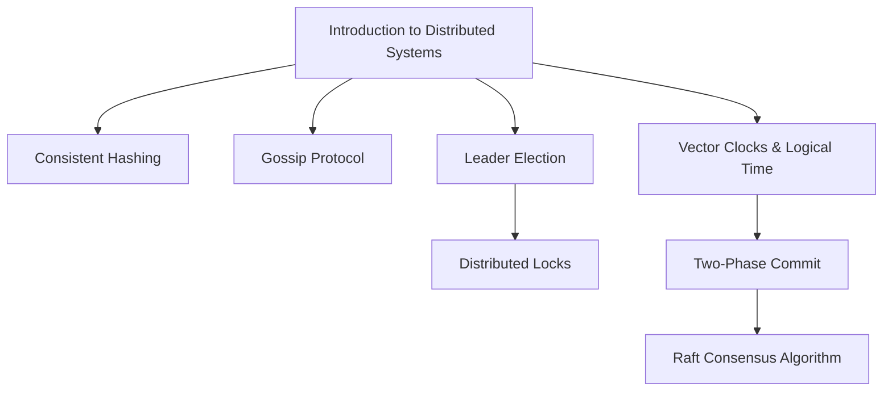

# Chapter 8: Distributed Systems

## Why This Chapter Exists

A single machine can only do so much. At some point, your application becomes too large, too slow, or too critical to run on one server. The moment you add a second machine, you have entered the world of distributed systems — and with it comes an entirely new class of problems: network failures, partial outages, data disagreements, and the impossibility of a shared clock.

This chapter takes you from the basic definition of a distributed system all the way to the advanced consensus algorithms that power databases like CockroachDB and TiDB. Every senior engineer and staff engineer is expected to reason fluently about these topics. They appear constantly in system design interviews, architecture reviews, and production post-mortems.

---

## What Is a Distributed System?

A distributed system is a group of computers that work together and appear to the user as a single system. The computers communicate over a network to coordinate their work.

Examples you use every day:
- Google Search (thousands of servers)
- Netflix (video streamed from the nearest server to you)
- WhatsApp (messages replicated across data centers)
- Your bank's core banking system (multiple nodes for availability)

---

## Chapter Roadmap

---

## Topics in This Chapter

| # | File | Topic | Level | Description |
|---|------|--------|-------|-------------|
| 01 | [01. Introduction to Distributed Systems](./01.%20Introduction%20to%20Distributed%20Systems%20%28BEGINNER%29.md) | Introduction to Distributed Systems | Beginner | Why distributed systems exist, the 8 fallacies of distributed computing, fundamental challenges like partial failures and no shared clock |
| 02 | [02. Consistent Hashing](./02.%20Consistent%20Hashing%20%28INTERMEDIATE%29.md) | Consistent Hashing | Intermediate | Solving the cache miss problem when adding/removing nodes, the ring concept, virtual nodes, and how DynamoDB and Cassandra use it |
| 03 | [03. Gossip Protocol](./03.%20Gossip%20Protocol%20%28ADV%29.md) | Gossip Protocol | Advanced | How nodes share information without a central coordinator, epidemic spreading, failure detection, SWIM protocol, Cassandra membership |
| 04 | [04. Leader Election](./04.%20Leader%20Election%20%28INTERMEDIATE%29.md) | Leader Election | Intermediate | Bully algorithm, ring algorithm, ZooKeeper-based election, Raft leader election, the split-brain problem |
| 05 | [05. Distributed Locks](./05.%20Distributed%20Locks%20%28INTERMEDIATE%29.md) | Distributed Locks | Intermediate | Redis-based locking, Redlock algorithm, ZooKeeper locks, fencing tokens, clock skew hazards |
| 06 | [06. Vector Clocks and Logical Time](./06.%20Vector%20Clocks%20and%20Logical%20Time%20%28ADV%29.md) | Vector Clocks and Logical Time | Advanced | Why physical clocks fail, Lamport timestamps, vector clocks, conflict detection in DynamoDB |
| 07 | [07. Two-Phase Commit and Distributed Transactions](./07.%20Two-Phase%20Commit%20and%20Distributed%20Transactions%20%28ADV%29.md) | Two-Phase Commit | Advanced | Atomicity across services, 2PC prepare/commit phases, the blocking problem, 3PC, SAGA as an alternative |
| 08 | [08. Raft Consensus Algorithm](./08.%20Raft%20Consensus%20Algorithm%20%28ADV%29.md) | Raft Consensus Algorithm | Advanced | Leader election, log replication, safety, how etcd and CockroachDB use Raft |

---

## Difficulty Levels Explained

- **Beginner**: Core concepts, definitions, and why the problem exists. Suitable for engineers new to distributed systems.
- **Intermediate**: Practical patterns used in real production systems. You need the beginner foundation first.
- **Advanced (ADV)**: Deep algorithmic and protocol-level knowledge. Expected of senior and staff engineers in interviews and architecture discussions.

---

## Suggested Reading Order

If you are new to distributed systems, follow the files in order (01 → 08). Each file builds on the previous.

If you are preparing for a senior/staff interview, prioritize:
1. Introduction (01) — foundational mental models
2. Consistent Hashing (02) — appears in almost every distributed DB interview
3. Raft (08) — consensus is a flagship senior topic
4. Two-Phase Commit (07) — distributed transactions are everywhere
5. Vector Clocks (06) — causality and conflict detection

---

## Prerequisites for This Chapter

Before starting this chapter, you should be comfortable with:
- Basic networking (TCP/IP, HTTP) from Chapter 02
- Databases and replication from Chapter 04
- Caching concepts from Chapter 05
- Load balancing from Chapter 06

---

## How These Topics Connect to Other Chapters

| This Chapter | Connects To |
|---|---|
| Consistent Hashing | Chapter 05 (Caching), Chapter 04 (Databases) |
| Leader Election + Raft | Chapter 10 (Consistency and Consensus) |
| Two-Phase Commit | Chapter 12 (Microservices — SAGA pattern) |
| Gossip Protocol | Chapter 11 (Reliability and Fault Tolerance) |
| Distributed Locks | Chapter 05 (Caching — Redis), Chapter 12 (Microservices) |

---

## Key Themes That Run Through This Entire Chapter

**1. Partial Failure**
In a single machine, either the whole system works or it crashes. In a distributed system, some parts can fail while others keep running. This is the hardest problem in distributed systems.

**2. No Shared State**
Machines cannot look at each other's memory. They can only communicate by sending messages over a network, and those messages can be delayed, lost, or reordered.

**3. No Global Clock**
There is no single authoritative source of time across all machines. Every clock drifts. This makes ordering events across machines surprisingly hard.

**4. The CAP Theorem**
You cannot have Consistency, Availability, and Partition Tolerance all at once. This forces every distributed system design to make trade-offs.

**5. Trade-offs, Trade-offs, Trade-offs**
Every solution in this chapter is a trade-off. More consistency means less availability. Simpler algorithms mean fewer guarantees. Understanding the trade-offs is what separates junior engineers from senior engineers.

---

## Related Chapters

- [Chapter 04: Databases](../04.%20Databases/README.md) — replication, sharding, ACID
- [Chapter 05: Caching](../05.%20Caching/README.md) — where consistent hashing is most visible
- [Chapter 10: Consistency and Consensus](../10.%20Consistency%20and%20Consensus/README.md) — deep dive on consistency models
- [Chapter 11: Reliability and Fault Tolerance](../11.%20Reliability%20and%20Fault%20Tolerance/README.md) — how systems survive failures
- [Chapter 12: Microservices](../12.%20Microservices/README.md) — SAGA, service discovery, coordination
