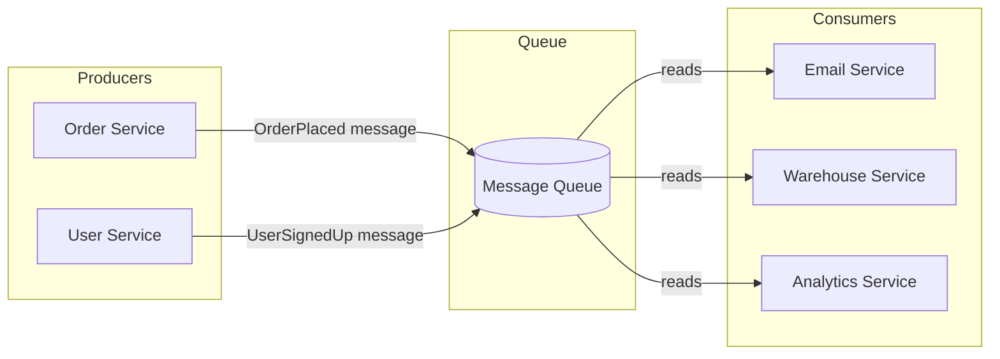

# Why Message Queues

## Why This Topic Exists

Imagine you are building an e-commerce site. When a customer places an order, your system needs to: save the order to the database, send a confirmation email, notify the warehouse, update inventory, and send a push notification. If you call each of these services one by one and wait for each to finish, your customer stares at a loading spinner for 8 seconds. If the email service is down, the entire order fails.

Message queues were invented to solve exactly this problem. They let services communicate without being tightly coupled together. This document explains the problem, the solution, and why every large system uses queues.

---

## Learning Objectives

By the end of this file, you will be able to:

- Explain the difference between synchronous and asynchronous communication
- Describe what a message queue is and what problem it solves
- Identify at least five real-world use cases for message queues
- Explain the producer/consumer model
- Describe why async communication matters at scale

---

## Prerequisites

- Basic understanding of what a web API is
- Know what a database is
- Familiarity with the concept of microservices (helpful but not required)

---

## Introduction

When two services need to communicate, there are two approaches. They can talk **synchronously** — meaning Service A calls Service B and waits for the response before continuing. Or they can talk **asynchronously** — meaning Service A drops a message somewhere and continues, while Service B picks up that message when it is ready.

For simple, small systems, synchronous communication works fine. But as systems grow, the weaknesses of synchronous calls become serious problems. Message queues provide the asynchronous alternative.

---

## Real-World Analogy: The Post Office

Think about how you send a letter.

**Without a post office (direct delivery):** You personally walk to the recipient's house. If they are not home, you wait. If they live far away, it takes hours. You cannot do anything else while travelling. If they have moved, you are stuck.

**With a post office (message queue):** You drop your letter at the post office and walk away. You are free to do other things. The post office holds the letter and delivers it when the recipient is available. If the recipient moves, the post office can forward it. If the postal worker is sick today, a new one picks up tomorrow and your letter is still there waiting.

The post office is the message queue. You are the producer. The recipient is the consumer. The letter is the message.

Key insight: **the sender and receiver do not need to be available at the same time.**

---

## Core Concepts

### Synchronous Communication

In synchronous communication, the caller waits for the response.

```
Service A ──── HTTP Request ────► Service B
Service A ◄─── HTTP Response ─── Service B
(A is blocked while waiting)
```

Problems with this approach:
- If B is slow, A is slow
- If B is down, A fails
- If B is overloaded, all requests to A start failing
- A and B must both be running at the same time
- Hard to handle bursts of traffic (B gets 10,000 requests at once)

### Asynchronous Communication

In asynchronous communication, the caller sends a message and moves on immediately.

```
Service A ──── drops message ────► Queue
Service A continues doing other work
(later...)
Service B ◄─── picks up message ── Queue
```

Benefits:
- A continues working even if B is slow or temporarily down
- B processes at its own pace
- Traffic spikes are absorbed by the queue (buffering)
- A and B are decoupled — changes to B do not break A
- You can add more B instances to process faster

### The Producer / Consumer Model

This is the fundamental pattern of message queues.

- **Producer**: The service that creates and sends messages. It does not know who will receive them or when.
- **Consumer**: The service that reads and processes messages. It does not need to know which service sent them.
- **Queue**: The buffer in the middle that holds messages until consumers are ready.

A producer can produce much faster than a consumer processes. The queue absorbs the difference. This is called **buffering**.

Multiple consumers can read from the same queue. This is how you scale: add more consumer instances.

---

## Visual Diagram (Mermaid)



Notice: the Order Service does not call the Email Service directly. It drops a message and forgets about it. The Email Service reads from the queue when it is ready.

---

## Deep Explanation

### Why Synchronous Calls Break at Scale

Let us trace what happens in a synchronous system when you have 100,000 orders per hour (a modest e-commerce load):

1. 100,000 orders arrive at the Order Service
2. Each order triggers a call to the Email Service
3. Each email takes 200ms to send
4. The Email Service can handle 50 requests/second = 3,000/minute = 180,000/hour
5. Sounds fine — but what happens during a flash sale when 500,000 orders arrive in one hour?

At 500,000 orders/hour with 200ms/email, you need to process 139 emails/second. The Email Service handles 50/second. It is overwhelmed. Requests start failing. Orders start failing. Customers are unhappy.

With a message queue:
1. 500,000 orders drop messages into the queue instantly (milliseconds each)
2. The Order Service returns success to every customer immediately
3. The Email Service processes at 50/second — it will catch up in a few hours
4. No orders are lost. No failures. Just a slight delay in emails.

This is the key trade-off: **eventual processing** in exchange for **reliability and scalability**.

### What Happens When a Service Goes Down

**Synchronous:** Service A calls Service B. Service B is restarting for a deployment. Service A gets a connection error. You either show an error to the user or implement complex retry logic.

**Asynchronous:** Service A drops a message in the queue. Service B restarts. Service B comes back up and reads all the messages that accumulated while it was down. Zero messages lost. Zero errors to users.

This property — messages survive service restarts — is called **durability**. Good message queue systems persist messages to disk so they survive even if the queue server itself restarts.

### Decoupling: The Hidden Superpower

When services call each other directly, they are coupled. Service A must know:
- Service B's URL or IP address
- Service B's API format
- That Service B even exists

With a message queue, Service A only knows:
- The queue name to drop messages into
- The format of the message

Now if you want to add a new service C that also needs to process orders, you do not touch Service A at all. You just add a new consumer that reads from the same queue. This is the **open/closed principle** applied to distributed systems.

---

## Step-by-Step Example

**Scenario:** E-commerce order processing

Without message queues (synchronous):

1. User clicks "Buy"
2. Order Service saves order to database (50ms)
3. Order Service calls Email Service and waits (300ms)
4. Order Service calls Warehouse Service and waits (200ms)
5. Order Service calls Analytics Service and waits (150ms)
6. Order Service calls Push Notification Service and waits (100ms)
7. Response returned to user — total: **800ms**
8. If Email Service is down at step 3 — order appears to fail

With message queues (asynchronous):

1. User clicks "Buy"
2. Order Service saves order to database (50ms)
3. Order Service drops one "OrderPlaced" message into queue (5ms)
4. Response returned to user — total: **55ms**
5. Email Service reads message and sends email (whenever it is ready)
6. Warehouse Service reads message and updates inventory (whenever it is ready)
7. If Email Service is down — message waits in queue until it comes back

Result: **15x faster response** to user, and services are independent.

---

## Advantages / Disadvantages / Trade-offs

| Aspect | Advantage | Disadvantage |
|--------|-----------|--------------|
| Response time | Producer returns immediately | Processing happens later (eventual) |
| Reliability | Messages survive service failures | More moving parts to monitor |
| Scalability | Add consumers to scale processing | Queue itself can become a bottleneck |
| Decoupling | Services do not know about each other | Harder to trace what happened end-to-end |
| Flexibility | Add new consumers without changing producers | Debugging async flows is harder |
| Traffic spikes | Queue absorbs bursts | Queue can grow large under sustained load |

---

## When to Use / When NOT to Use

### Use Message Queues When:

- Processing can be done asynchronously (the user does not need an immediate result)
- Services run at different speeds
- You need resilience against service outages
- You have traffic spikes that need to be buffered
- Multiple services need to react to the same event
- You want to decouple services so they can be deployed independently

**Good examples:** Sending emails, processing payments, generating reports, sending notifications, updating search indexes, event logging.

### Do NOT Use Message Queues When:

- The user needs an immediate synchronous response (e.g., checking account balance before payment)
- The operation must be transactional and the result matters immediately
- You are building a simple system where the added complexity is not worth it
- Latency is critical and even queue overhead is unacceptable (e.g., high-frequency trading)

**Simple rule:** If the user clicks a button and needs to see the result right now, use synchronous. If the user does not need to wait for the result, use a queue.

---

## Common Interview Questions

**Q: What is the difference between synchronous and asynchronous communication?**
Synchronous: caller waits for response. Asynchronous: caller sends and continues; receiver processes later.

**Q: What problem do message queues solve?**
They decouple services, absorb traffic spikes, provide resilience against failures, and enable multiple consumers to process the same event.

**Q: What is a producer and a consumer?**
Producer creates and sends messages to the queue. Consumer reads and processes messages from the queue.

**Q: How does a message queue help with scalability?**
You can add more consumer instances to process messages faster. The queue acts as a buffer so producers are never blocked by slow consumers.

**Q: What happens to messages if a consumer service goes down?**
Messages stay in the queue. When the service comes back up, it reads the accumulated messages and processes them.

---

## Common Beginner Mistakes

**Mistake 1: Using a queue for everything.**
Not all communication should be async. A checkout that requires confirming inventory before charging the card should be synchronous. Not everything needs a queue.

**Mistake 2: Not handling consumer failures.**
If a consumer reads a message and crashes before processing it, the message must go back to the queue. Beginners often forget to implement acknowledgement properly.

**Mistake 3: Ignoring message ordering.**
Many beginners assume messages will be processed in the order they were sent. This is only guaranteed in specific configurations. Out-of-order processing can cause bugs (e.g., "CancelOrder" processed before "PlaceOrder").

**Mistake 4: No dead letter queue.**
When a message fails to process repeatedly, it needs somewhere to go. Without a dead letter queue, it either blocks the whole queue or silently disappears.

**Mistake 5: Not thinking about idempotency.**
In at-least-once delivery, a consumer may receive the same message twice. Your processing logic must be safe to run multiple times. For example, "send confirmation email" must check if the email was already sent.

---

## Summary

Message queues solve the problem of tight coupling between services. Instead of Service A calling Service B directly and waiting, A drops a message into a queue and continues. B reads from the queue when it is ready. This simple change has enormous consequences: services can fail and recover independently, traffic spikes are absorbed, response times improve, and adding new functionality requires no changes to existing services.

The post office analogy captures it perfectly: you do not deliver mail yourself. You drop it off and let the postal system handle delivery. You can go about your day.

---

## Key Takeaways

- Synchronous communication creates tight coupling and failure cascades
- Message queues enable asynchronous, decoupled communication
- The producer/consumer model is the fundamental pattern
- Queues act as buffers, absorbing traffic spikes
- Messages persist in the queue even when consumers are down
- The trade-off is eventual processing — the user does not get an immediate result
- Not everything should be async — synchronous is still right for some operations

---

## Related Topics (relative markdown links)

- [02. Message Queue Concepts](./02.%20Message%20Queue%20Concepts%20(BEGINNER).md)
- [03. Kafka Deep Dive](./03.%20Kafka%20Deep%20Dive%20(INTERMEDIATE).md)
- [04. RabbitMQ vs Kafka](./04.%20RabbitMQ%20vs%20Kafka%20(INTERMEDIATE).md)
- [05. Event-Driven Architecture](./05.%20Event-Driven%20Architecture%20(INTERMEDIATE).md)
- [08. Distributed Systems README](../08.%20Distributed%20Systems/README.md)
- [12. Microservices README](../12.%20Microservices/README.md)
