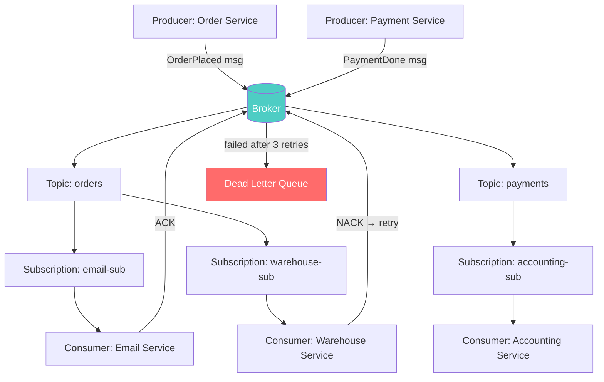

# Message Queue Concepts

## Why This Topic Exists

Once you understand why message queues exist, you need to learn the vocabulary. Every queue system — whether it is Kafka, RabbitMQ, SQS, or Pub/Sub — uses a consistent set of terms. Understanding these terms precisely is critical because they describe different behaviors, and choosing the wrong option has real consequences. Getting delivery guarantees wrong can mean lost payments or duplicate charges.

---

## Learning Objectives

By the end of this file, you will be able to:

- Define producer, consumer, queue, broker, topic, and subscription
- Explain what acknowledgement (ACK) is and why it matters
- Describe what a dead letter queue is and when messages end up there
- Compare the three delivery guarantee models: at-most-once, at-least-once, and exactly-once
- Explain the difference between in-memory and durable message storage
- Read a message queue architecture diagram and understand each component

---

## Prerequisites

- [01. Why Message Queues](./01.%20Why%20Message%20Queues%20(BEGINNER).md) — you should understand the problem before learning the vocabulary

---

## Introduction

Different message queue systems use slightly different naming, but the core concepts are universal. A Kafka "topic" serves the same purpose as a RabbitMQ "exchange + queue". An AWS SQS "queue" is the same idea as a Google Pub/Sub "subscription". Once you know the concepts, learning any specific system is just learning that system's terminology.

This file defines every concept you will encounter in message queue systems, with clear examples and diagrams.

---

## Real-World Analogy: The Restaurant Kitchen

Think of a busy restaurant:

- **Producer**: The waiter who takes the customer's order and hangs a ticket on the kitchen rail
- **Message**: The order ticket
- **Queue/Broker**: The kitchen rail — it holds all pending order tickets
- **Consumer**: The chef who picks up a ticket and cooks the dish
- **Acknowledgement**: The chef marks the ticket "done" when the dish is plated
- **Dead Letter Queue**: A separate "problem tickets" board for orders with missing ingredients that cannot be fulfilled normally
- **Topic**: Different rails for different sections — one rail for hot food, one for cold food, one for drinks
- **Subscription**: A chef assigned to a specific rail

The waiter does not cook. The chef does not take orders. The rail decouples them.

---

## Core Concepts

### Producer

A **producer** is any service or application that creates messages and sends them to a queue or topic. The producer does not know who will consume the message or when.

Examples:
- An Order Service that sends an "OrderPlaced" message when a customer buys something
- A Sensor that sends temperature readings every second
- A User Service that sends a "UserRegistered" message when someone signs up

### Consumer

A **consumer** is any service or application that reads messages from a queue or topic and processes them. The consumer does not know which service produced the message.

Examples:
- An Email Service that reads "OrderPlaced" messages and sends confirmation emails
- A Dashboard that reads temperature readings and updates a chart
- A Welcome Service that reads "UserRegistered" messages and sends welcome emails

### Queue

A **queue** is the storage buffer that holds messages between the producer and consumer. Messages typically follow FIFO order (first in, first out). Once a consumer reads and acknowledges a message, it is removed from the queue.

Key property: **a message is delivered to exactly one consumer** (in the basic queue model). If three consumers are reading from the same queue, each message goes to only one of them.

### Broker

A **broker** is the server that runs the queue system. It receives messages from producers, stores them, and delivers them to consumers. RabbitMQ and Kafka are both brokers.

The broker handles:
- Receiving messages from producers
- Persisting messages to storage
- Tracking which messages have been read
- Delivering messages to consumers
- Handling retries on failure

### Topic

A **topic** is a named channel. Producers send messages to a topic. Consumers subscribe to a topic. Unlike a simple queue (where each message goes to one consumer), a topic can deliver each message to multiple consumers.

Think of a topic as a radio station broadcast: everyone tuned in gets the same signal.

Examples:
- `orders` topic — all order-related events
- `user-events` topic — all user activity
- `payments` topic — all payment events

### Subscription

A **subscription** is a consumer's registration to receive messages from a topic. When a consumer subscribes to a topic, it starts receiving messages published to that topic.

In some systems, multiple consumers can share a subscription (and then each message goes to only one of them — useful for load balancing). In other systems, each consumer has its own subscription (and then each consumer gets every message — useful for fan-out).

### Acknowledgement (ACK)

An **acknowledgement** (ACK) is the consumer's way of telling the broker: "I received this message and processed it successfully. You can remove it from the queue."

This is critical for reliability. Here is why:

1. Broker delivers message to consumer
2. Consumer starts processing
3. Consumer crashes before finishing
4. Without ACK: message is lost forever
5. With ACK: because no ACK was received, the broker re-delivers the message to another consumer

The broker only deletes a message after it receives an ACK. If the consumer crashes, the message goes back to the queue.

**Negative acknowledgement (NACK):** The consumer explicitly tells the broker "I could not process this message." The broker can then re-queue it for another consumer to try.

### Dead Letter Queue (DLQ)

A **dead letter queue** is a special queue where messages go when they cannot be processed successfully. Think of it as a "problem inbox" for failed messages.

Messages end up in the DLQ when:
- A consumer repeatedly fails to process them (exceeded retry limit)
- The message format is invalid or corrupt
- Processing throws an unrecoverable error
- The message exceeded its time-to-live

Why DLQs matter: without a DLQ, failed messages either disappear silently (you lose data) or block the entire queue forever (one bad message stops all processing). A DLQ lets you isolate problematic messages for investigation without disrupting normal processing.

Teams monitor DLQs as an alert signal. A sudden spike in DLQ messages means something is broken.

### Message Durability

**Message durability** determines whether messages survive system restarts.

- **In-memory (non-durable):** Messages are held in RAM only. If the broker crashes, all messages are lost. Faster but unreliable.
- **Persistent (durable):** Messages are written to disk before the producer gets a confirmation. Slower but survives crashes.

For anything important — financial transactions, orders, user registrations — you need persistent messages. For low-stakes data like metrics pings or cache invalidation signals, in-memory may be acceptable.

---

## Visual Diagram (Mermaid)

---

## Deep Explanation

### How ACK Works Under the Hood

When the broker delivers a message to a consumer, it enters a "in-flight" state — it has been sent but not yet confirmed. The broker keeps a timer. If no ACK arrives before the timer expires, the broker assumes the consumer crashed and re-delivers the message.

This timer is called the **visibility timeout** (in AWS SQS) or **acknowledgement timeout** (in RabbitMQ). Set it too short and you get false re-deliveries. Set it too long and recovery after a crash is slow.

### Message Ordering

Most queue systems do not guarantee strict ordering across all messages. They may deliver messages slightly out of order, especially when multiple consumers are reading concurrently.

Kafka solves this by guaranteeing ordering **within a partition** — messages sent to the same partition are always delivered in order. You can use a partition key (like customer ID) to ensure all messages for one customer go to the same partition and are processed in order.

Simple queue systems like SQS offer "FIFO queues" as a separate product that guarantees ordering at the cost of lower throughput.

---

## Delivery Guarantees

This is one of the most important concepts in message queues. There are three delivery models, each with a different trade-off.

### At-Most-Once

The message is delivered **zero or one time**. It will never be delivered twice, but it may be lost.

How it works: The producer sends the message. The broker does not wait for an ACK. If the consumer crashes before processing, the message is gone.

Trade-off: You choose speed over reliability. No overhead of retries or ACK management.

When it is acceptable:
- Metrics and telemetry data (losing one data point out of millions is fine)
- Log streams where occasional gaps are tolerable
- Real-time dashboards where stale data is discarded anyway

When it is NOT acceptable:
- Financial transactions
- Order processing
- Anything where losing a message has business impact

### At-Least-Once

The message is delivered **one or more times**. It will never be lost, but it may be delivered multiple times.

How it works: The broker keeps the message until it receives an ACK. If the consumer crashes, the broker re-delivers. This means if the consumer processed the message but crashed before sending the ACK, the message gets processed twice.

Trade-off: You choose reliability over simplicity. You must write consumers to be **idempotent** — safe to run multiple times with the same result.

Example of idempotent operation: "Set user's email to X" — running it twice has the same result.
Example of non-idempotent operation: "Charge credit card for $50" — running it twice charges $100.

When it is acceptable:
- Most business operations (with idempotent consumers)
- Email sending (check if email already sent)
- Inventory updates (check current state before applying change)

### Exactly-Once

The message is delivered **exactly one time** — never lost, never duplicated.

How it works: Requires complex coordination between producer, broker, and consumer. The broker uses transactions or deduplication IDs to ensure each message is processed exactly once.

Trade-off: Highest reliability but significantly more complex and slower. In distributed systems, true exactly-once semantics require careful implementation and can have 2-10x performance overhead compared to at-least-once.

When it is necessary:
- Financial transactions where duplicate processing causes real harm
- Idempotency is impossible or very hard to implement
- Regulatory compliance scenarios

---

## Comparison Table: Delivery Guarantees

| Guarantee | Can Lose Messages? | Can Duplicate Messages? | Performance | Complexity | Use Case Example |
|-----------|-------------------|------------------------|-------------|------------|-----------------|
| At-most-once | Yes | No | Fastest | Lowest | Metrics, telemetry, real-time dashboards |
| At-least-once | No | Yes | Medium | Medium | Order processing, emails (with idempotency) |
| Exactly-once | No | No | Slowest | Highest | Payment deductions, ledger updates |

**Industry reality:** Most production systems use at-least-once with idempotent consumers. True exactly-once is expensive and often unnecessary if you design consumers carefully.

---

## Step-by-Step Example

**Scenario:** Online pharmacy order system

1. Customer orders medication. **Order Service (producer)** creates a message: `{"orderId": "123", "drug": "Aspirin", "qty": 2, "customerId": "u456"}`

2. Message is sent to `pharmacy-orders` **topic** on the **broker**.

3. Broker writes message to **disk** (durable).

4. **Fulfillment Service (consumer)** has a **subscription** on `pharmacy-orders`. It reads the message.

5. Fulfillment Service processes: finds Aspirin in inventory, marks it for packing.

6. Fulfillment Service sends an **ACK**. Broker marks message as delivered.

7. **Email Service** also has a subscription on `pharmacy-orders`. It reads the same message and sends a confirmation email.

8. Email Service sends an **ACK**.

9. What if Fulfillment Service crashes after reading but before sending ACK? Broker's timeout expires. Message is re-delivered. Fulfillment Service processes again — but because it checks if order 123 is already in progress (idempotency), it skips duplicate processing.

10. What if the drug is out of stock and fulfillment keeps failing? After 3 retries, the message goes to the **DLQ**. A pharmacist is alerted to handle it manually.

---

## Advantages / Disadvantages / Trade-offs

| Concept | Advantage | Potential Pitfall |
|---------|-----------|------------------|
| ACK | Guarantees message is not lost | Consumer must send ACK correctly — forgetting it means infinite re-delivery |
| DLQ | Isolates failures, enables investigation | DLQ must be monitored or problems go unnoticed |
| Durable storage | Survives crashes | Slower than in-memory by ~2-5x |
| At-least-once | Simple, reliable | Consumers must handle duplicates (idempotency) |
| Exactly-once | No duplicates | Complex, slow, not always truly achievable across all systems |
| Topics | Fan-out to many consumers | Multiple consumers all receiving every message — careful with volume |

---

## When to Use / When NOT to Use

### Use durable messages when:
- Messages represent business-critical events (orders, payments, signups)
- Losing a message has financial or legal consequences

### Use in-memory messages when:
- Speed is critical and some data loss is acceptable
- Data is regenerated frequently anyway (e.g., sensor readings every 100ms)

### Use at-least-once when:
- You can write idempotent consumers (most cases)

### Use exactly-once when:
- The cost of duplicate processing is severe and idempotency is impractical
- Regulatory requirements demand it

---

## Common Interview Questions

**Q: What is the difference between a queue and a topic?**
A queue delivers each message to one consumer. A topic delivers each message to all subscribers.

**Q: What happens if a consumer reads a message but crashes before processing it?**
With ACK-based delivery, the broker never receives the ACK, so it re-delivers the message after a timeout.

**Q: What is a dead letter queue?**
A DLQ is where messages go after repeated processing failures. It prevents bad messages from blocking the main queue.

**Q: Why is idempotency important in message queues?**
With at-least-once delivery, consumers may receive the same message twice. Idempotent consumers produce the same result regardless of how many times they process a message.

**Q: What is the difference between at-least-once and exactly-once delivery?**
At-least-once guarantees no message is lost but may deliver duplicates. Exactly-once guarantees no loss and no duplicates, at higher cost and complexity.

---

## Common Beginner Mistakes

**Mistake 1: Forgetting idempotency with at-least-once delivery.**
If your consumer charges a credit card and receives the same message twice due to a retry, the customer gets charged twice.

**Mistake 2: Not setting up a DLQ.**
Without a DLQ, a poison message (one that always fails) either loops forever consuming processing resources or is silently dropped.

**Mistake 3: Confusing queue semantics with topic semantics.**
A queue sends each message to one consumer (competing consumers). A topic sends each message to all subscribers. Using the wrong one leads to either missing processing or duplicate processing.

**Mistake 4: Assuming FIFO ordering.**
Most queues do not guarantee strict order. Design your consumers to handle out-of-order messages, or use a system that explicitly guarantees ordering.

**Mistake 5: Setting ACK timeout too short.**
If your consumer takes 30 seconds to process a message but the ACK timeout is 10 seconds, the broker re-delivers the message while the first consumer is still working. Now two consumers process the same message simultaneously.

---

## Summary

Message queue systems use a consistent vocabulary. Producers create messages. Consumers read them. Brokers store and route messages in between. Topics enable fan-out to multiple consumers. Subscriptions register consumers on topics. Acknowledgements confirm successful processing. Dead letter queues capture failures for investigation. Delivery guarantees — at-most-once, at-least-once, exactly-once — describe the trade-off between performance, complexity, and reliability. Understanding these concepts is essential before working with any specific queue system.

---

## Key Takeaways

- Producer sends, consumer receives, broker stores and routes
- ACK tells the broker "I processed this successfully"
- DLQ captures repeatedly failing messages for investigation
- At-most-once: fast but can lose messages
- At-least-once: reliable but may duplicate — requires idempotent consumers
- Exactly-once: no loss, no duplicates — most complex and slowest
- Durable messages survive crashes; in-memory messages do not
- Most production systems use at-least-once with carefully designed idempotent consumers

---

## Related Topics (relative markdown links)

- [01. Why Message Queues](./01.%20Why%20Message%20Queues%20(BEGINNER).md)
- [03. Kafka Deep Dive](./03.%20Kafka%20Deep%20Dive%20(INTERMEDIATE).md)
- [04. RabbitMQ vs Kafka](./04.%20RabbitMQ%20vs%20Kafka%20(INTERMEDIATE).md)
- [05. Event-Driven Architecture](./05.%20Event-Driven%20Architecture%20(INTERMEDIATE).md)
- [10. Consistency and Consensus README](../10.%20Consistency%20and%20Consensus/README.md)
