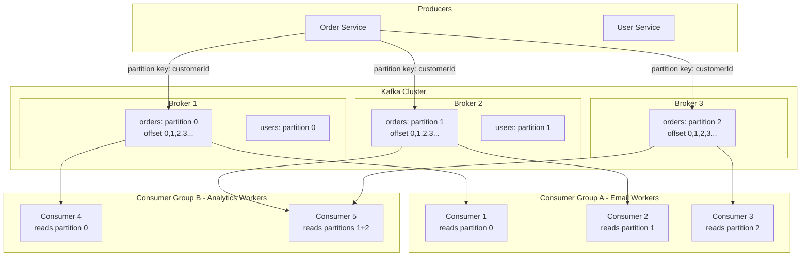

# Kafka Deep Dive

## Why This Topic Exists

Apache Kafka is the dominant message system for large-scale production systems. LinkedIn invented it. Uber, Netflix, Airbnb, Twitter, and thousands of other companies run their core data pipelines on Kafka. If you work in backend engineering at any serious company, you will encounter Kafka. Understanding Kafka's architecture — not just how to use it, but why it is designed the way it is — is essential for both production work and system design interviews.

---

## Learning Objectives

By the end of this file, you will be able to:

- Explain Kafka's core architecture: topics, partitions, offsets, brokers, consumer groups
- Describe how partitions enable parallelism and horizontal scaling
- Explain how consumer groups allow multiple services to read the same data independently
- Describe Kafka's log-based storage model and why it is fundamentally different from traditional queues
- Explain message ordering guarantees and their limitations
- Describe Kafka retention policies
- Explain what ZooKeeper and KRaft are and why Kafka needed to change
- Give real-world examples of Kafka at scale

---

## Prerequisites

- [01. Why Message Queues](./01.%20Why%20Message%20Queues%20(BEGINNER).md)
- [02. Message Queue Concepts](./02.%20Message%20Queue%20Concepts%20(BEGINNER).md)
- Basic understanding of distributed systems (replication, fault tolerance)

---

## Introduction

Traditional message queues work like a physical queue: messages go in one end and out the other, and once processed, they are gone. Kafka is fundamentally different. Kafka is a **distributed log**. Messages are appended to a log and stay there. Consumers do not remove messages — they simply track their position in the log using a number called an **offset**. This design difference is what makes Kafka handle trillions of events per day while remaining readable by many different services simultaneously.

---

## Real-World Analogy: The Newspaper Archive

A traditional queue is like a stack of newspapers at the doorstep. Once you pick it up and read it, it is gone. No one else can read it. You cannot go back.

Kafka is like a newspaper archive or library. Every edition is kept in order. You start reading from wherever you want. Multiple people can read the same editions simultaneously. If you miss a week, you can go back and read it. The archive is never emptied — it is just trimmed when it gets too old (configurable retention).

Your reading position (the edition you are currently on) is tracked by a bookmark — in Kafka this is your **offset**.

---

## Core Concepts

### Topic

A **topic** is a named category for messages. Producers send messages to a topic. Consumers read from a topic. Topics are like tables in a database — they organize messages by type.

Examples: `user-events`, `payment-events`, `order-updates`, `click-stream`

### Partition

A **partition** is a sub-division of a topic. Each topic is split into N partitions. Each partition is an independent, ordered log.

Why partitions matter:
- Each partition is stored on a different machine (broker) — this is how Kafka scales horizontally
- Multiple consumers can read from different partitions simultaneously — this is how Kafka achieves parallelism
- Within one partition, messages are strictly ordered — this is how Kafka guarantees ordering

Think of a topic as a highway and partitions as lanes. More lanes = more cars (messages) moving simultaneously.

### Offset

An **offset** is a sequential ID number that identifies a message's position in a partition. Offset 0 is the first message. Offset 1 is the second. And so on.

Consumers use offsets to track where they are. When a consumer reads message at offset 5, it stores "I've read up to offset 5 in partition 2 of topic orders." Next time it runs, it resumes from offset 6.

This is the key architectural difference from traditional queues: **Kafka never deletes messages when they are consumed. Consumers control their own position.**

### Broker

A **broker** is a Kafka server. A Kafka **cluster** is multiple brokers working together. Each broker stores some partitions. If a broker goes down, other brokers have replicated copies of its partitions.

### Replica and Leader

Each partition has one **leader** (the broker that handles reads and writes) and N **replicas** (other brokers that maintain copies for fault tolerance). If the leader dies, a replica is promoted to leader automatically.

The replication factor is typically 3 in production — each partition exists on 3 brokers.

### Producer

Producers send messages to topics. When sending, the producer can:
- Let Kafka choose the partition (round-robin by default)
- Specify a **partition key** — Kafka hashes the key to always send to the same partition

Using a partition key is critical for ordering. If you want all events for customer ID "C123" to be in order, use `customerId` as the partition key. All messages with the same key go to the same partition, and Kafka guarantees ordering within a partition.

### Consumer Group

A **consumer group** is a set of consumers that collectively read from a topic. Each partition is assigned to exactly one consumer in the group at a time. This enables load balancing.

Example: Topic `orders` has 4 partitions. Consumer Group `warehouse-workers` has 4 consumers. Each consumer reads from exactly one partition — processing happens in parallel across 4 machines.

If you add more consumers than partitions, the extra consumers sit idle. The maximum parallelism equals the number of partitions.

Multiple consumer groups can read from the same topic independently. Group A tracks its own offsets. Group B tracks its own offsets. Each group gets every message. This is fundamentally different from a traditional queue where one consumer getting a message means no other consumer gets it.

### ZooKeeper and KRaft

**ZooKeeper** is a distributed coordination service that Kafka historically used to track cluster metadata: which brokers are alive, which broker is the leader for each partition, consumer group offsets.

The problem: ZooKeeper is a separate system to operate and became a bottleneck for scaling to very large clusters.

**KRaft** (Kafka Raft) is Kafka's replacement for ZooKeeper, introduced in Kafka 2.8 and made production-ready in 3.3. With KRaft, Kafka manages its own metadata using the Raft consensus protocol. Simpler to operate, faster to start, supports larger clusters. As of 2024, new Kafka deployments should use KRaft mode.

---

## Visual Diagram (Mermaid)

---

## Deep Explanation

### Kafka's Log-Based Storage

Every partition is a **commit log** — an append-only file on disk. Messages are written to the end of the file. They are never updated or deleted (except by retention policy). This is why Kafka can be so fast: sequential disk writes are extremely fast, even on spinning hard drives.

When a consumer reads, it seeks to its current offset and reads forward. This is also sequential access — very fast.

This design means Kafka can use disk efficiently with **page cache** — the OS keeps recently accessed disk data in RAM. Consumers reading recent messages almost always hit the page cache, making reads as fast as RAM access.

### How Consumer Groups Enable Scaling

Imagine you have a `payments` topic with 12 partitions and you need to process 1 million payments per hour.

Start with 3 consumer instances. Each reads from 4 partitions. Processing might be too slow.

Add 3 more consumers (now 6 total). Each reads from 2 partitions. Processing doubles.

Add 6 more consumers (now 12 total). Each reads from 1 partition. Processing maxes out.

Want more? Add more partitions (requires planning ahead — repartitioning is hard). With 24 partitions and 24 consumers, you double throughput again.

This is the key scaling knob in Kafka: **number of partitions = maximum parallelism for a consumer group**.

### Message Ordering Guarantees

**Kafka guarantees ordering within a partition.**

If messages A, B, C are sent to partition 3 in that order, consumers will always read them in the order A, B, C.

**Kafka does NOT guarantee ordering across partitions.**

If messages go to different partitions, you have no guarantee of cross-partition order. Message A in partition 0 might be processed after message D in partition 2, even if A was sent first.

How to use this correctly: choose a partition key that ensures related messages go to the same partition. For a payment system, use `accountId` as the key. All events for account "123" go to the same partition and are processed in order. Events for account "456" may go to a different partition and be processed independently.

### Retention Policy

Kafka keeps messages based on a configurable retention policy. Messages are NOT deleted when consumed. They are deleted based on:

- **Time-based retention**: Keep messages for N days (default: 7 days). After that, old messages are deleted.
- **Size-based retention**: Keep up to N gigabytes per partition. When the limit is reached, the oldest messages are deleted.
- **Compacted topics**: Keep only the most recent message for each key. Older versions are deleted. Used for storing latest state (like a database).

This retention model enables **event replay** — a powerful feature where you can re-process historical events. If you deploy a new service or fix a bug in a consumer, you can reset the consumer group's offset to the beginning and re-process all events from the past 7 days (or however long you retain).

### Exactly-Once in Kafka

Kafka supports exactly-once semantics using:
- **Idempotent producers**: Each message has a unique sequence number. Kafka detects and discards duplicates.
- **Transactions**: Producers can write to multiple partitions atomically — all succeed or all fail.
- **Transactional consumers**: Commit offsets and produce output atomically.

This is available but adds overhead. Most teams use at-least-once with idempotent consumers unless the use case truly requires exactly-once.

---

## Step-by-Step Example

**Scenario:** Uber's real-time driver matching and surge pricing

Uber processes approximately 1 trillion events per day (as of 2021 public statements). Here is a simplified version:

1. **Driver app** (producer) sends GPS location every 5 seconds to topic `driver-locations` with partition key = `driverId`. 1 million active drivers = 200,000 events/second.

2. **Kafka cluster** stores these in a topic with 1,000 partitions spread across 100 brokers.

3. **Matching Service** (consumer group A) reads from all 1,000 partitions with 1,000 consumer instances. Each consumer handles 200 location updates/second. Matches available drivers to ride requests in real-time.

4. **Surge Pricing Service** (consumer group B) independently reads the same topic. It analyzes driver density per city zone and adjusts prices. It is behind the Matching Service by a few seconds — that is fine, it uses its own offsets.

5. **Analytics Service** (consumer group C) reads the same topic to store to a data warehouse for later analysis. It runs slower and that is fine — it just falls behind and catches up.

6. All three consumer groups get every GPS update. None of them interfere with each other. This is the power of the consumer group model.

---

## Advantages / Disadvantages / Trade-offs

| Aspect | Advantage | Disadvantage |
|--------|-----------|--------------|
| Throughput | Millions of messages/second per node | Requires tuning — out-of-box config is not optimal |
| Scalability | Add partitions and brokers as needed | Repartitioning an existing topic is complex |
| Durability | Replicated, disk-persisted by default | Disk I/O is required — more infrastructure cost |
| Replay | Any consumer group can re-read history | Retention storage cost grows with retention period |
| Ordering | Guaranteed within partition | No cross-partition ordering guarantee |
| Consumer decoupling | Multiple groups read independently | Consumer offset management adds operational complexity |
| Operational complexity | Mature ecosystem, good tooling | More complex to operate than simpler queues |

---

## When to Use / When NOT to Use

### Use Kafka When:

- You need to process millions+ events per second
- Multiple services need to read the same event stream independently
- You need event replay capability (re-process historical data)
- You are building an audit log or event sourcing system
- You need strict ordering within a category (e.g., per-user or per-account ordering)
- Your data pipeline needs fault tolerance and durability

**Real use cases:** Real-time analytics, user activity tracking, microservices event backbone, change data capture (CDC) from databases, stream processing pipelines.

### Do NOT Use Kafka When:

- You need complex message routing (e.g., route message X to consumer Y based on message content — use RabbitMQ instead)
- You need request-reply (RPC) patterns — Kafka is not designed for this
- You have simple, low-volume task queue needs — Kafka's operational overhead is not worth it for small systems
- You need per-message TTL (time-to-live) or priority queues — not Kafka's strength
- Your team does not have the operational expertise — Kafka is powerful but requires knowledge to run well

---

## Common Interview Questions

**Q: How does Kafka achieve high throughput?**
Sequential disk writes (append-only log), batching, zero-copy transfers to consumers, and horizontal scaling via partitions.

**Q: How does Kafka guarantee ordering?**
Ordering is guaranteed within a partition. Use partition keys to ensure related messages go to the same partition.

**Q: What is the difference between a consumer group and a subscription?**
A consumer group distributes partitions among its members — each partition goes to one consumer in the group. Multiple groups can independently consume the same topic.

**Q: How do consumers track their position in Kafka?**
Via offsets. Each consumer group stores its current offset per partition. Offsets are committed to Kafka's internal `__consumer_offsets` topic.

**Q: What happens if you add a new consumer to a consumer group?**
Kafka triggers a **rebalance** — partitions are redistributed among the new set of consumers. During the rebalance, consumption pauses briefly.

**Q: Why would you increase the number of partitions?**
More partitions = more parallelism. If consumers cannot keep up with producer throughput, add partitions and add more consumer instances.

---

## Common Beginner Mistakes

**Mistake 1: Too few partitions.**
You start with 3 partitions. Your load triples. You need 9 consumers but can only use 3. Plan partition count ahead of time — 2-4x your expected max consumer count is a common rule of thumb.

**Mistake 2: Not using partition keys for ordered data.**
You need events for user 123 to be processed in order. Without a partition key, Kafka may put them in different partitions. Use `userId` as the key.

**Mistake 3: Treating Kafka like a traditional queue.**
In a traditional queue, each message is consumed once and deleted. In Kafka, messages are retained. Multiple consumer groups can all consume the same message. Resetting an offset replays historical messages. These are features — but they surprise engineers expecting traditional queue behavior.

**Mistake 4: Long-running processing in a consumer.**
Kafka's session timeout will declare the consumer dead if it does not poll frequently. For long operations, commit the offset before starting the long work, or process asynchronously.

**Mistake 5: Not monitoring consumer lag.**
Consumer lag = number of messages in the queue that have not been consumed yet. Lag growing means consumers are falling behind. You must monitor this.

---

## Summary

Kafka is a distributed, append-only log system. Producers write to topics that are divided into partitions. Each partition is stored on a broker with replicas for fault tolerance. Consumers track their position using offsets — they control where they read from. Consumer groups distribute partition workload among members, enabling horizontal scaling. Multiple consumer groups can read the same data independently. Messages are retained by time or size policy, enabling replay. Kafka's design — sequential I/O, replication, consumer-managed offsets — is what allows it to handle trillions of events per day at companies like Uber and LinkedIn.

---

## Key Takeaways

- Kafka is an append-only distributed log, not a traditional queue
- Partitions enable parallelism — max consumers in a group = number of partitions
- Consumer groups let multiple services read the same data independently
- Ordering is guaranteed within a partition — use partition keys for related messages
- Offsets are consumer-managed — Kafka never deletes messages when consumed
- Retention policy controls when messages are eventually deleted
- Replay is possible by resetting consumer offsets to earlier positions
- KRaft replaces ZooKeeper in modern Kafka deployments

---

## Related Topics (relative markdown links)

- [02. Message Queue Concepts](./02.%20Message%20Queue%20Concepts%20(BEGINNER).md)
- [04. RabbitMQ vs Kafka](./04.%20RabbitMQ%20vs%20Kafka%20(INTERMEDIATE).md)
- [05. Event-Driven Architecture](./05.%20Event-Driven%20Architecture%20(INTERMEDIATE).md)
- [06. Stream Processing](./06.%20Stream%20Processing%20(ADV).md)
- [08. Distributed Systems README](../08.%20Distributed%20Systems/README.md)
- [10. Consistency and Consensus README](../10.%20Consistency%20and%20Consensus/README.md)
