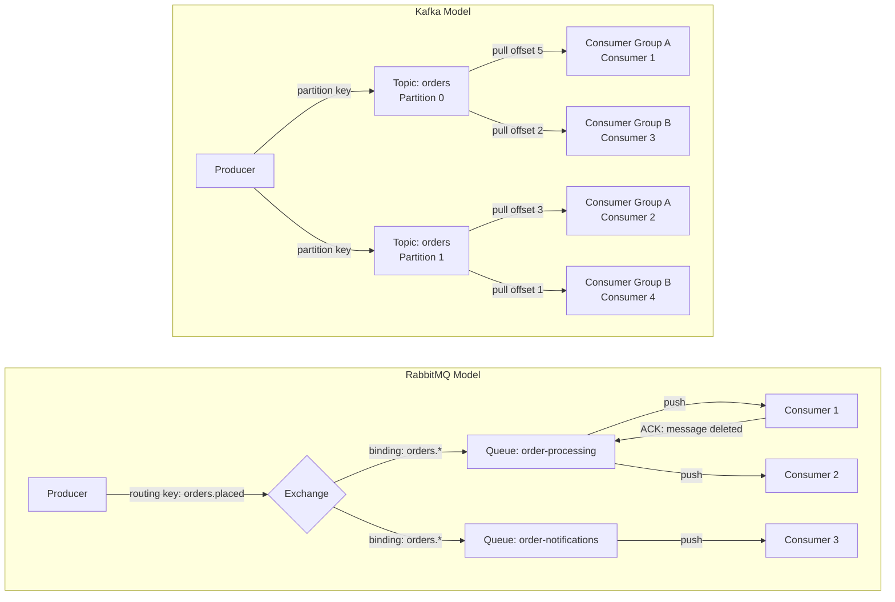

# RabbitMQ vs Kafka

## Why This Topic Exists

RabbitMQ and Kafka are the two most commonly used message queue systems in production. They appear in almost every system design discussion involving asynchronous communication. Many engineers use them interchangeably and pick the wrong one. The result is systems that are overly complex, do not scale as expected, or miss critical features like event replay. Understanding the fundamental architecture difference — not just a feature checklist — is what allows you to make the right choice.

---

## Learning Objectives

By the end of this file, you will be able to:

- Explain the core architectural difference between RabbitMQ (smart broker) and Kafka (smart consumer)
- Describe the AMQP protocol and how RabbitMQ uses exchanges and bindings for routing
- Identify at least three use cases where RabbitMQ is the better choice
- Identify at least three use cases where Kafka is the better choice
- Compare the two systems on throughput, ordering, routing, and operational complexity
- Make an informed recommendation in a system design interview

---

## Prerequisites

- [02. Message Queue Concepts](./02.%20Message%20Queue%20Concepts%20(BEGINNER).md)
- [03. Kafka Deep Dive](./03.%20Kafka%20Deep%20Dive%20(INTERMEDIATE).md)

---

## Introduction

RabbitMQ was released in 2007. Kafka was released by LinkedIn in 2011. Both are battle-tested, open source, and widely used. They solve overlapping but distinct problems.

The single most important conceptual difference:

- **RabbitMQ**: Smart broker, dumb consumers. The broker routes messages to the right consumer, keeps track of what has been delivered, and deletes messages after they are consumed. Consumers simply receive what is pushed to them.

- **Kafka**: Dumb broker, smart consumers. The broker is just a durable log. It does not track who received what. Consumers manage their own positions (offsets) and pull messages at their own pace.

This difference in philosophy cascades into every design decision and determines which system is right for a given use case.

---

## Real-World Analogy

**RabbitMQ is like a postal sorting office.**
You drop a letter with a destination address. The sorting office (broker) reads the address, routes it to the right mailbox, and ensures it is delivered. Once delivered and confirmed, the letter is gone. The sorting office is smart — it knows about addresses, routing rules, dead letters, and priority mail.

**Kafka is like a public bulletin board (notice board).**
You pin a notice to the board. The board just holds notices in order. Anyone can come and read any notice at any time. Notices are not removed when read — they are removed after a set number of days. Readers keep their own bookmark of what they have read. The board is simple — it does not route or track readers. The readers are responsible for knowing where they are.

---

## Core Concepts: RabbitMQ Architecture

### Exchange

An **exchange** is where producers send messages. The exchange decides how to route the message. There are four types:

- **Direct exchange**: Routes to a queue based on an exact routing key match. Like email — `invoice@company.com` goes to the invoice queue.
- **Fanout exchange**: Routes to all bound queues simultaneously. Like a company-wide announcement.
- **Topic exchange**: Routes based on wildcard routing key patterns. `orders.*.placed` matches `orders.europe.placed` and `orders.asia.placed`.
- **Headers exchange**: Routes based on message header attributes.

### Binding

A **binding** is a rule that connects an exchange to a queue. It says "messages with routing key X go to queue Y."

### Queue

In RabbitMQ, a queue stores messages until they are consumed. Once a consumer ACKs a message, it is deleted. This is the fundamental difference from Kafka — **messages do not persist after consumption** in RabbitMQ.

### Consumer Push Model

RabbitMQ **pushes** messages to consumers. The broker holds the connection and sends messages as they arrive. Consumers have a configurable **prefetch count** — how many unacknowledged messages they are allowed to hold at once. This prevents overwhelming a slow consumer.

---

## Core Concepts: Kafka Architecture (Recap)

Kafka's architecture is covered in detail in [03. Kafka Deep Dive](./03.%20Kafka%20Deep%20Dive%20(INTERMEDIATE).md). Key points:

- Kafka is a **distributed log**. Messages are appended and never deleted on consumption.
- Consumers **pull** messages at their own pace using offsets.
- **Consumer groups** distribute partitions among members for parallel processing.
- Multiple consumer groups read the same data independently.
- **Retention** (time or size-based) is the only way messages are deleted.
- Ordering is guaranteed within a partition.

---

## Visual Diagram (Mermaid)

---

## Deep Explanation

### The Push vs Pull Difference

RabbitMQ pushes messages to consumers. This gives the broker fine-grained control. It can balance load, route based on rules, and know exactly what each consumer has received.

Kafka consumers pull messages. This lets each consumer control its own pace. A slow consumer falling behind does not affect other consumers or the broker. The consumer simply reads at whatever rate it can manage.

The push model is better for real-time responsiveness — the consumer processes the message as soon as it arrives, with minimal latency.

The pull model is better for high throughput — consumers can batch-read thousands of messages per request, which is more efficient than processing one at a time.

### Message Lifecycle

This is the most important practical difference:

**RabbitMQ:** Message exists → consumer reads → consumer ACKs → message deleted. Once consumed, it is gone. You cannot replay it. If you add a new service that needs historical messages, it starts from the point it was added — it gets no history.

**Kafka:** Message exists → consumers read (but message stays) → consumers advance their offsets → message deleted only after retention period expires. You can replay all messages within the retention window. Add a new service today and set its offset to the beginning — it can process the last 7 days of events.

### Routing Capabilities

RabbitMQ has sophisticated routing built into the broker. Messages can be routed based on content, headers, routing keys, and wildcards. This is powerful for complex message dispatching.

Kafka has no routing at the broker level. Routing is achieved by having different topics for different message types. All messages in a topic are delivered to all consumer groups subscribed to it.

For complex routing needs — "send this to consumer A if it is a high-priority order from Europe, but send it to consumer B otherwise" — RabbitMQ's exchange/binding system is far more expressive than Kafka's topic model.

### Throughput Comparison

Kafka was designed specifically for high throughput. Sequential disk writes, batching, and zero-copy transfers allow a single Kafka broker to handle millions of messages per second.

RabbitMQ is designed for flexibility and routing richness. A single RabbitMQ node handles roughly 20,000-50,000 messages per second under typical workloads — still excellent for most applications, but a fraction of Kafka's throughput.

For reference: Uber's Kafka cluster processed ~7 million messages per second in 2020. RabbitMQ is not designed for this scale.

### Protocol Differences

**RabbitMQ** implements **AMQP 0-9-1** (Advanced Message Queuing Protocol). AMQP is an open standard protocol that defines the wire format for message communication. This means any AMQP-compatible client library in any language works with RabbitMQ. It also supports MQTT (for IoT devices) and STOMP protocols.

**Kafka** uses its own proprietary binary protocol over TCP. Kafka clients are available in many languages (Java, Python, Go, etc.) but they all implement Kafka's specific protocol, not a standard. This means you cannot accidentally swap RabbitMQ for Kafka without changing your client code.

### Message Priority

RabbitMQ supports **message priority queues**. You can assign priority 1-10 to messages. High-priority messages jump ahead in the queue. This is essential for use cases like customer support tickets (premium customers get faster processing) or emergency alerts.

Kafka has no concept of message priority. All messages in a partition are processed in the order they arrive.

---

## Comparison Table

| Feature | RabbitMQ | Kafka |
|---------|----------|-------|
| Architecture | Smart broker, dumb consumer | Dumb broker, smart consumer |
| Message delivery | Push (broker sends to consumer) | Pull (consumer requests from broker) |
| Message persistence | Deleted after ACK | Retained until expiry/size limit |
| Message replay | Not supported natively | Yes — reset consumer offset |
| Routing | Rich: direct, fanout, topic, headers | Simple: separate topics |
| Ordering | Per-queue FIFO (not cross-queue) | Per-partition guaranteed |
| Throughput | ~50K msgs/sec per node (typical) | ~1M+ msgs/sec per node |
| Consumer groups | Competing consumers (one message, one consumer) | Consumer groups + fan-out |
| Protocol | AMQP (open standard) | Kafka custom protocol |
| Priority queues | Yes | No |
| Message TTL | Per-message and per-queue | Retention policy only |
| Use case focus | Task distribution, routing, RPC | Event streaming, log aggregation |
| Operational complexity | Moderate | Higher (but KRaft simplifies this) |
| Multi-tenant | Easy per-user queues | Less natural (topics are shared) |

---

## When to Use RabbitMQ

**Task queues where each task goes to one worker:**
You have 100 image processing jobs. You want 10 workers to process them in parallel, each job going to exactly one worker. RabbitMQ distributes competing consumers perfectly.

**Complex routing:**
Different message types must go to different queues based on content, headers, or wildcard patterns. RabbitMQ's exchanges handle this natively. With Kafka you would need separate topics and application-level routing.

**Request-Reply (RPC) patterns:**
Service A sends a request and expects a specific reply back. RabbitMQ supports this via reply-to headers and correlation IDs. Kafka is not designed for request-reply.

**Priority-based processing:**
VIP orders processed before standard orders. RabbitMQ supports priority queues. Kafka does not.

**Short retention needs:**
You do not need to replay events. Once a job is done, it is done. No storage overhead.

**Lower message volumes:**
Startup or mid-size system with hundreds of thousands of messages per day. RabbitMQ is simpler to operate for this scale.

**Real examples:** WhatsApp (user messaging delivery), task scheduling systems, job queues, print queues.

## When to Use Kafka

**High-throughput event streaming:**
You need to process millions of events per second. Kafka's architecture is purpose-built for this.

**Multiple services consuming the same events:**
When a user signs up, you need 8 different services to react. With Kafka, publish once to a topic and all 8 consumer groups read independently.

**Event replay:**
You need to re-process historical data. New service needs to catch up on past events. Debug an issue by replaying events. Only Kafka (and similar log-based systems) support this.

**Audit logs and change data capture:**
You need a permanent, ordered log of everything that happened. Kafka's retention model is perfect. Used heavily with CDC tools like Debezium to stream database changes.

**Event sourcing:**
Store all events, not just current state. The log IS the source of truth.

**Real-time analytics pipelines:**
Events flow from producers through Kafka and into stream processors (Flink, Kafka Streams) to dashboards.

**Real examples:** Uber (1 trillion events/day), LinkedIn (Kafka's origin), Netflix, Airbnb, Robinhood.

---

## Step-by-Step Example

**Scenario 1 (RabbitMQ wins): Job processing system**

A video encoding platform receives video uploads. Each video must be encoded into 5 formats. Order of processing does not matter as long as each video gets processed once.

1. Upload Service sends message to `video-encoding` queue
2. 20 encoding workers (consumers) connect to the queue
3. RabbitMQ distributes videos across workers — no worker processes the same video
4. Worker finishes, sends ACK, message deleted
5. Need priority? Add a `hd-priority` queue for premium users
6. Adding routing: `video.type.4k` goes to high-memory workers, `video.type.720p` goes to standard workers

RabbitMQ's routing and competing consumer model is ideal here.

**Scenario 2 (Kafka wins): E-commerce event pipeline**

An e-commerce platform wants all these services to react when an order is placed: Email, Warehouse, Analytics, Fraud Detection, Recommendation Engine, Loyalty Points, Shipping.

With RabbitMQ: 7 separate queues or complex exchange routing. Hard to add an 8th service later.

With Kafka:
1. Order Service publishes `OrderPlaced` to `order-events` topic
2. All 7 services have their own consumer groups
3. Each consumer group independently reads every order event
4. Adding an 8th service? Create a new consumer group — zero changes to anything else
5. Need to replay the last 30 days for a new Loyalty Points service? Reset its offset to 30 days ago

Kafka's fan-out and replay model wins here.

---

## Advantages / Disadvantages / Trade-offs

| System | Best For | Weakness |
|--------|----------|----------|
| RabbitMQ | Task queues, routing, RPC | Cannot replay messages, lower throughput |
| Kafka | Event streaming, fan-out, high volume | No complex routing, higher operational complexity |

---

## Common Interview Questions

**Q: What is the core difference between RabbitMQ and Kafka?**
RabbitMQ is a smart broker that routes and deletes messages. Kafka is a dumb log where consumers manage their own positions. RabbitMQ is push-based; Kafka is pull-based.

**Q: You need multiple services to react to a single event. Which do you choose?**
Kafka. Each service creates its own consumer group and reads the event independently.

**Q: You need to replay the last week of events. Which do you choose?**
Kafka. Messages are retained and consumers can reset their offset.

**Q: You need message routing based on content. Which do you choose?**
RabbitMQ. Its exchange/binding system provides rich routing capabilities.

**Q: Your system needs to process 2 million messages per second. Which do you choose?**
Kafka. It is designed for this throughput.

---

## Common Beginner Mistakes

**Mistake 1: Using Kafka for simple task queues.**
Kafka is operationally complex. For a simple job queue, RabbitMQ is simpler, easier to run, and perfectly adequate.

**Mistake 2: Expecting RabbitMQ to replay messages.**
Once consumed and ACKed, the message is gone. If you realize you need replay, you need to rethink your architecture.

**Mistake 3: Using RabbitMQ for high fan-out.**
To get 10 services to all receive an event in RabbitMQ, you typically need 10 queues or a fanout exchange. This works but becomes complex at scale. Kafka's consumer group model is cleaner.

**Mistake 4: Picking Kafka because it is "the big name."**
Kafka is often overkill. If you have 10,000 messages per day and one consuming service, RabbitMQ is simpler and sufficient. Engineering complexity has a real cost.

---

## Summary

RabbitMQ and Kafka are complementary tools for different scenarios. RabbitMQ excels at task distribution, flexible message routing, request-reply patterns, and priority queues. Kafka excels at high-throughput event streaming, fan-out to multiple consumer groups, event replay, and building audit logs. The core architectural difference — smart broker vs smart consumer, push vs pull, delete-on-consume vs retain-until-expiry — determines which fits your needs. Many large organizations run both: RabbitMQ for internal task queues, Kafka for their event streaming backbone.

---

## Key Takeaways

- RabbitMQ: smart broker routes and removes messages; consumers are dumb receivers
- Kafka: dumb broker stores messages in a log; consumers manage their own offsets
- RabbitMQ: push model; Kafka: pull model
- RabbitMQ messages are deleted after ACK; Kafka messages are retained by policy
- Kafka allows replay; RabbitMQ does not
- RabbitMQ wins for task queues, routing, RPC, priority; Kafka wins for streaming, fan-out, high throughput
- Many companies run both systems for different purposes
- Do not use Kafka just because it is popular — operational complexity is real

---

## Related Topics (relative markdown links)

- [02. Message Queue Concepts](./02.%20Message%20Queue%20Concepts%20(BEGINNER).md)
- [03. Kafka Deep Dive](./03.%20Kafka%20Deep%20Dive%20(INTERMEDIATE).md)
- [05. Event-Driven Architecture](./05.%20Event-Driven%20Architecture%20(INTERMEDIATE).md)
- [06. Stream Processing](./06.%20Stream%20Processing%20(ADV).md)
- [12. Microservices README](../12.%20Microservices/README.md)
