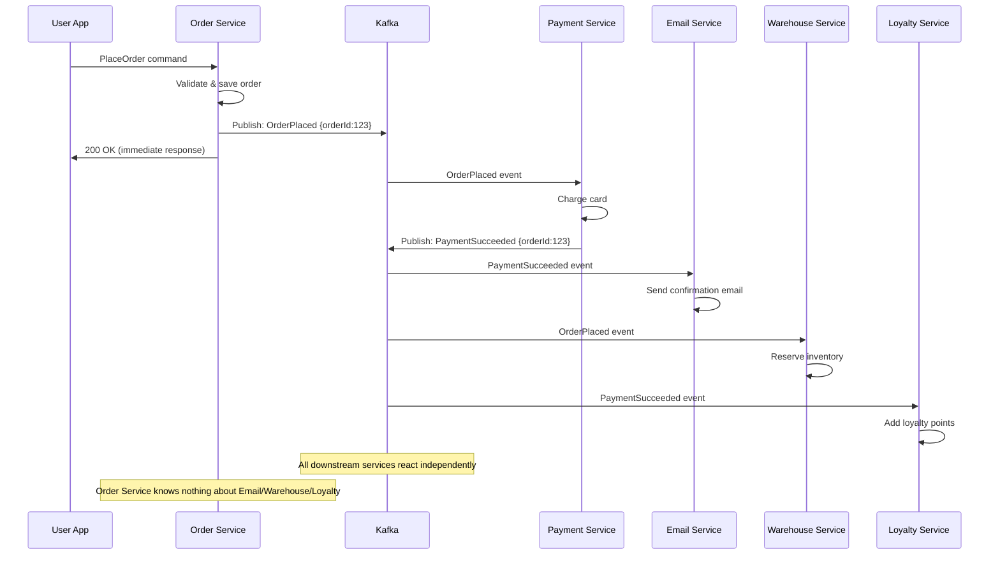

# Event-Driven Architecture

## Why This Topic Exists

As systems grow and add microservices, the number of direct connections between services explodes. Service A calls B, B calls C and D, D calls E. Change one service and you risk breaking three others. Test one flow and you must spin up six services. Deploy one update and you must coordinate with four teams.

Event-Driven Architecture (EDA) solves this by inverting the communication model. Instead of services calling each other, services emit events — facts about what happened — and other services react to those events. No service knows about the others. Every service only knows about events.

---

## Learning Objectives

By the end of this file, you will be able to:

- Distinguish between an event and a command
- Explain the publish-subscribe pattern and how it differs from direct calls
- Describe event sourcing and why it is powerful
- Explain CQRS and why read and write models are often separated
- Compare choreography vs orchestration for multi-service workflows
- Trace a real-world event flow (Uber ride example) through an EDA system

---

## Prerequisites

- [01. Why Message Queues](./01.%20Why%20Message%20Queues%20(BEGINNER).md)
- [02. Message Queue Concepts](./02.%20Message%20Queue%20Concepts%20(BEGINNER).md)
- [03. Kafka Deep Dive](./03.%20Kafka%20Deep%20Dive%20(INTERMEDIATE).md) (recommended but not required)

---

## Introduction

In a traditional architecture, services communicate by making direct requests: "Do this now." In EDA, services communicate by announcing facts: "This happened." The difference sounds small but changes everything about how you design, scale, and evolve a system.

An event is an immutable fact. "UserSignedUp", "OrderPlaced", "PaymentFailed" — these describe things that happened. They cannot be undone. Any service that cares about that fact can react to it, whenever and however it chooses.

---

## Real-World Analogy: The News Broadcast

Consider a television news broadcast.

In a **direct-call model**: The news station calls every viewer individually and reads them the headline. The viewer must be home and available. If the station grows from 1,000 to 10 million viewers, it must make 10 million calls.

In an **event-driven model**: The news station broadcasts the headline. Viewers who are interested are tuned in. Viewers can record it (DVR) and watch later. The station does not know or care who is watching. Adding 10 million new viewers does not change how the station operates.

Events are the broadcast. Services are the viewers. The message queue is the broadcast infrastructure.

---

## Core Concepts

### Event vs Command

This distinction is fundamental. Getting it wrong leads to bad EDA design.

**Command**: A request to perform an action. It is imperative. It implies intent: "Do this." It is addressed to a specific service. It may be accepted or rejected.

Examples of commands:
- `ProcessPayment` — sent to the Payment Service
- `SendEmail` — sent to the Email Service
- `CancelOrder` — sent to the Order Service

**Event**: A record of something that happened. It is declarative. It implies a fact: "This occurred." It is broadcast to anyone interested. It cannot be rejected — it already happened.

Examples of events:
- `PaymentProcessed` — published after payment succeeded
- `EmailSent` — published after email was sent
- `OrderCancelled` — published after order was cancelled

The key design principle: **services publish events, not commands.**

When an Order Service publishes `OrderPlaced`, it does not tell anyone what to do. It just announces the fact. The Email Service, Warehouse Service, and Analytics Service each independently decide what to do with that fact. The Order Service does not know they exist.

### Publish-Subscribe Pattern

In pub-sub, a publisher emits an event to a channel (topic). Any number of subscribers receive that event and process it independently.

Properties:
- Publisher does not know who is subscribed
- Subscribers do not know who else is subscribed
- Adding a new subscriber requires no changes to the publisher
- Removing a subscriber requires no changes to the publisher

This is the foundation of EDA. Every time you add a new capability to a system, you add a new subscriber — without touching existing code.

### Event Sourcing

**Event sourcing** means storing the history of events as your source of truth, rather than storing only the current state.

**Traditional storage (state-based):**
```
orders table:
| orderId | status    | total |
|---------|-----------|-------|
| 123     | shipped   | $99   |
```
You only know the current state. You cannot know what happened — was it "cancelled then reinstated then shipped"? You do not know.

**Event sourcing:**
```
events table:
| orderId | event          | timestamp           |
|---------|----------------|---------------------|
| 123     | OrderPlaced    | 2024-01-01 10:00:00 |
| 123     | PaymentTaken   | 2024-01-01 10:00:05 |
| 123     | OrderCancelled | 2024-01-01 10:01:00 |
| 123     | OrderReinstated| 2024-01-01 10:05:00 |
| 123     | OrderShipped   | 2024-01-02 09:00:00 |
```

Current state is derived by replaying events from the beginning. The event log is the source of truth.

**Why event sourcing is powerful:**
- **Complete audit trail**: You know exactly what happened and when
- **Rebuild state at any point in time**: Replay events up to a given date
- **Debug production bugs**: Re-run the exact sequence of events that caused a bug
- **New projections**: Create a new read model by replaying all events through new logic
- **Temporal queries**: "What did the system look like 3 days ago?"

**The trade-off**: Rebuilding current state requires replaying all events (can be slow for old records). Solved with **snapshots** — periodically save current state so you only need to replay events since the last snapshot.

**Banking analogy**: A bank ledger never edits old entries. Every transaction (debit, credit) is a new event appended to the ledger. Your balance is the sum of all transactions. This is event sourcing.

### CQRS — Command Query Responsibility Segregation

CQRS is a pattern often paired with event sourcing. The idea: use separate models for reading data and writing data.

**Without CQRS:**
One data model serves both writes and reads. This works for simple systems but causes problems at scale:
- Reads often need very different data shapes than writes
- Optimizing reads (indexes, denormalization) conflicts with optimizing writes
- Complex reporting queries slow down the write path

**With CQRS:**
- **Write model (Command side)**: Receives commands, validates business rules, emits events. Optimized for correctness.
- **Read model (Query side)**: Subscribes to events, builds denormalized views optimized for specific queries.

Example: An e-commerce order system.

Write side: receives `PlaceOrder` command, validates inventory, charges payment, emits `OrderPlaced` event. Data is normalized (orders table, items table, payments table).

Read side: subscribes to `OrderPlaced` events, builds a flat denormalized `order_summary` view with all data pre-joined. Reads are lightning fast — no joins needed.

The read model can be rebuilt at any time by replaying events through the projection logic.

**Trade-off**: Eventual consistency. The read model is updated asynchronously after the write. There may be a brief lag (milliseconds to seconds) where the read model does not reflect the latest write.

### Choreography vs Orchestration

When a business process involves multiple services, you need a way to coordinate them. There are two approaches.

**Choreography**: Each service reacts to events and emits new events. No central coordinator. Services are autonomous.

Like a dance where each dancer knows their part and responds to the music. No choreographer directs each step in real time.

**Orchestration**: A central orchestrator service tells other services what to do. It knows the entire workflow.

Like a conductor directing an orchestra. The conductor knows the score and directs each section.

---

## Visual Diagram (Mermaid)



---

## Deep Explanation

### Choreography in Detail

In choreography, each service publishes events that trigger other services. The workflow emerges from the interactions between services.

Uber ride example (choreography):
1. User requests ride → `RideRequested` event published
2. **Driver Matching Service** reacts → finds nearby driver → `DriverMatched` event published
3. **Driver App** reacts → driver accepts → `DriverAccepted` event published
4. **ETA Service** reacts → calculates arrival time → `ETAUpdated` event published
5. Trip starts → `TripStarted` event published
6. Trip ends → `TripCompleted` event published
7. **Payment Service** reacts → charges rider → `PaymentProcessed` event published
8. **Rating Service** reacts → sends rating request → `RatingRequested` event published

No single service knows the full workflow. Each service only knows what events it cares about.

**Advantages of choreography:**
- Loose coupling — services are fully independent
- Easy to add new behavior — add a new subscriber to any event
- No single point of failure
- Services can be developed and deployed independently

**Disadvantages of choreography:**
- Hard to understand the full workflow — it is spread across many services
- Hard to debug — tracing a failure requires looking at multiple service logs
- Risk of "choreography hell" — complex implicit dependencies
- Hard to implement error handling and compensation (what do you do if payment fails after warehouse reserved inventory?)

### Orchestration in Detail

In orchestration, a central Orchestrator service manages the workflow. It sends commands to other services and waits for results.

Same order flow with orchestration (SAGA pattern):
1. **Order Orchestrator** receives `PlaceOrder` command
2. Orchestrator sends `ProcessPayment` command to Payment Service
3. Payment Service responds (success or failure)
4. If success: Orchestrator sends `ReserveInventory` command to Warehouse Service
5. If Warehouse success: Orchestrator sends `SendConfirmationEmail` command to Email Service
6. If any step fails: Orchestrator sends compensating commands (e.g., `RefundPayment`)

**Advantages of orchestration:**
- Workflow is visible in one place — easy to understand and debug
- Easier to handle errors and compensations
- Clear place to implement retry logic, timeouts, and rollbacks

**Disadvantages of orchestration:**
- Orchestrator becomes a central dependency — single point of failure
- Orchestrator needs to know about all participating services — tighter coupling
- Harder to add new behavior without modifying the orchestrator
- Can become a bottleneck

### The SAGA Pattern

A SAGA is a sequence of transactions where each step publishes events that trigger the next step. If a step fails, compensating transactions undo previous steps.

This is crucial in distributed systems because you cannot use a single database transaction across services. SAGA provides "eventual consistency" across multiple services.

Compensating transactions:
- `ReserveInventory` fails → compensate with `RefundPayment`
- `SendEmail` fails → no compensation needed (non-critical)

SAGAs can be implemented with choreography or orchestration.

---

## Step-by-Step Example: Uber Ride EDA Flow

This is a simplified trace of the event-driven flow when you request an Uber:

1. You tap "Request Ride"
2. **Rider App** sends command `RequestRide` to Ride Service
3. **Ride Service** validates the request, saves to database, publishes event `RideRequested {rideId, riderId, location, destination}`
4. **Driver Matching Service** consumes `RideRequested` — finds available drivers, selects best match, publishes `DriverAssigned {rideId, driverId}`
5. **Driver Notification Service** consumes `DriverAssigned` — sends push notification to driver
6. Driver accepts in app → `DriverAccepted {rideId, driverId}` published
7. **ETA Service** consumes `DriverAccepted` — calculates route and ETA, publishes `ETACalculated {rideId, eta}`
8. **Rider Notification Service** consumes `ETACalculated` — sends ETA to rider app
9. Driver arrives, trip starts → `TripStarted {rideId, startTime}` published
10. Trip ends → `TripCompleted {rideId, distance, duration}` published
11. **Fare Calculation Service** consumes `TripCompleted` — calculates fare, publishes `FareCalculated {rideId, amount}`
12. **Payment Service** consumes `FareCalculated` — charges rider's card, publishes `PaymentProcessed {rideId, amount}`
13. **Rating Service** consumes `PaymentProcessed` — sends rating request to both rider and driver
14. **Analytics Service** consumes all events — records trip metrics to data warehouse

Each service only knows about the events it cares about. You can add a new service (e.g., a carbon footprint tracking service) by subscribing to `TripCompleted` — zero changes to any existing service.

---

## Advantages / Disadvantages / Trade-offs

| Aspect | Advantage | Disadvantage |
|--------|-----------|--------------|
| Loose coupling | Services independent, deployable separately | Harder to trace full flow |
| Scalability | Each service scales independently | Event ordering issues across services |
| Extensibility | Add subscribers without changing producers | Schema evolution — changing event format is hard |
| Resilience | One service failure does not cascade | Distributed debugging is complex |
| Event sourcing | Complete audit trail, replay capability | More storage, eventual consistency on reads |
| CQRS | Optimized read models | Eventual consistency, more moving parts |
| Choreography | No central coordinator | "Choreography hell" with complex workflows |
| Orchestration | Visible workflow, easier error handling | Central dependency, tighter coupling |

---

## When to Use / When NOT to Use

### Use EDA When:
- Multiple services need to react to the same event
- Services should be independently deployable
- You need an audit trail of what happened
- High scalability requirements
- You are building microservices

### Do NOT Use EDA When:
- You need immediate, synchronous responses (e.g., checking account balance before charging)
- Your system is simple and the overhead of events is not justified
- Your team is small and the complexity of distributed events will slow development
- Strong consistency is required and eventual consistency is not acceptable

---

## Common Interview Questions

**Q: What is the difference between an event and a command?**
A command is a request to do something (imperative). An event is a record that something happened (declarative, past tense). Commands can be rejected; events cannot.

**Q: What is event sourcing?**
Storing all state changes as an immutable log of events. Current state is derived by replaying the event log. Enables audit trails, replay, and temporal queries.

**Q: What is CQRS?**
Separating the write model (commands, events, business logic) from the read model (optimized queries). The read model is updated asynchronously from events.

**Q: What is the difference between choreography and orchestration?**
Choreography: services react to events autonomously, no central coordinator. Orchestration: a central orchestrator manages the workflow and sends commands to services.

---

## Common Beginner Mistakes

**Mistake 1: Emitting commands as events.**
Publishing `SendEmail` is a command disguised as an event. Publish `OrderPlaced` and let the Email Service decide to send an email. The difference matters — commands assume knowledge of the recipient.

**Mistake 2: Ignoring event schema evolution.**
Events are immutable. Once published, consumers depend on their format. Adding a required field to an event breaks old consumers. Use backward-compatible schema evolution strategies.

**Mistake 3: Not handling out-of-order events.**
`PaymentProcessed` might arrive before `OrderPlaced` due to network delays. Design consumers to handle events arriving out of order.

**Mistake 4: Using EDA for everything.**
Synchronous reads are still the right choice when users need immediate results. Use EDA for writes and background processing, not for read queries.

---

## Summary

Event-Driven Architecture decouples services by having them communicate through events rather than direct calls. Services publish events (facts that happened) and other services subscribe and react. This enables loose coupling, independent scaling and deployment, easy extensibility, and resilience. Patterns like event sourcing (storing events as the source of truth) and CQRS (separate read and write models) extend the power of EDA. Workflows can be coordinated through choreography (autonomous services reacting to events) or orchestration (central coordinator directing services). The trade-offs are complexity, eventual consistency, and harder debugging.

---

## Key Takeaways

- Events are facts that happened; commands are requests to do something
- Publish events, not commands — let subscribers decide what to do
- Pub-sub decouples producers and consumers; adding subscribers requires no producer changes
- Event sourcing stores the event log as truth; current state is derived by replay
- CQRS separates read models from write models for optimization
- Choreography has no central coordinator; orchestration does
- The SAGA pattern handles distributed transactions across services
- EDA enables loose coupling and scalability at the cost of eventual consistency and debugging complexity

---

## Related Topics (relative markdown links)

- [01. Why Message Queues](./01.%20Why%20Message%20Queues%20(BEGINNER).md)
- [03. Kafka Deep Dive](./03.%20Kafka%20Deep%20Dive%20(INTERMEDIATE).md)
- [04. RabbitMQ vs Kafka](./04.%20RabbitMQ%20vs%20Kafka%20(INTERMEDIATE).md)
- [06. Stream Processing](./06.%20Stream%20Processing%20(ADV).md)
- [10. Consistency and Consensus README](../10.%20Consistency%20and%20Consensus/README.md)
- [12. Microservices README](../12.%20Microservices/README.md)
