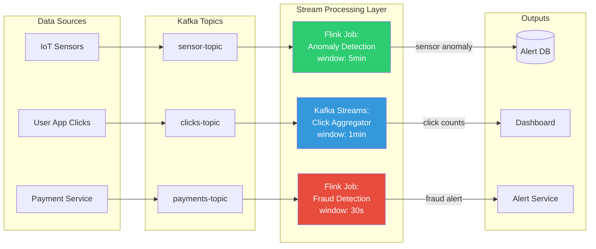

# Stream Processing

## Why This Topic Exists

Message queues handle discrete messages — individual events that get processed one by one. But the modern world generates continuous, infinite flows of data: clicks, sensor readings, transactions, log lines, location updates. Processing this data one message at a time is possible, but it misses the bigger picture. What if you need to know: "Has this credit card made 5 transactions in the last 30 seconds?" or "What is the average order value in the last 10 minutes?" or "Which users are about to churn based on their behavior pattern in the last hour?"

These questions require processing data as a continuous stream, aggregating across time windows, and maintaining state across many events. This is stream processing — and it changes what is possible in real-time systems.

---

## Learning Objectives

By the end of this file, you will be able to:

- Explain the difference between batch processing and stream processing
- Describe the three types of time windows: tumbling, sliding, and session
- Explain stateful stream processing and why it is hard in distributed systems
- Describe the major stream processing frameworks: Kafka Streams, Apache Flink, and Spark Streaming
- Explain exactly-once semantics in the context of stream processing
- Give real-world examples of stream processing applications (fraud detection, real-time metrics, recommendations)

---

## Prerequisites

- [03. Kafka Deep Dive](./03.%20Kafka%20Deep%20Dive%20(INTERMEDIATE).md)
- [05. Event-Driven Architecture](./05.%20Event-Driven%20Architecture%20(INTERMEDIATE).md)
- Basic understanding of SQL aggregations (SUM, GROUP BY, HAVING)

---

## Introduction

There are two fundamental approaches to processing data: batch and stream.

**Batch processing** collects data over a period, then processes it all at once. Like doing laundry once a week — efficient, but you might run out of clean clothes in the meantime.

**Stream processing** processes data as it arrives, continuously. Like washing each item of clothing as you use it — always current, no accumulation.

For many real-time use cases, batch is too slow. Detecting fraud after the transaction already cleared is useless. Showing a recommendation 24 hours after the user left the site serves no purpose. Stream processing enables real-time intelligence.

---

## Real-World Analogy: The River vs the Lake

**Batch processing is like a lake**: Water flows in continuously, but you wait for the lake to fill up before you treat all the water at once. Efficient for large volumes, but slow — water must accumulate before processing begins.

**Stream processing is like a water treatment plant on a river**: Water is treated continuously as it flows through. You get clean water immediately. You can monitor water quality in real time. You can detect contamination as soon as it enters.

The river never stops. Processing never stops. Results are continuous.

---

## Core Concepts

### Batch Processing

Data is collected over time, stored, and then processed as a large batch.

Process:
1. Collect all transactions from Monday through Sunday
2. On Sunday night, run a batch job
3. Compute weekly totals, generate reports, update recommendations

**Characteristics:**
- High throughput — process millions of records efficiently
- High latency — results are available only after the batch runs
- Simple to implement and reason about
- Tools: Apache Spark (batch mode), Hadoop MapReduce, SQL queries on data warehouses

**Use cases:**
- Weekly financial reports
- Training machine learning models on historical data
- ETL (Extract, Transform, Load) into data warehouses
- Billing calculations at end of month

### Stream Processing

Data is processed continuously as each event arrives.

Process:
1. Transaction arrives
2. Immediately processed — check fraud rules, update counters, trigger alerts
3. Result available in milliseconds or seconds

**Characteristics:**
- Low throughput per unit time (processes one event at a time, not batches)
- Low latency — results available immediately
- Stateful — must remember context across events
- Harder to implement — distributed state management is complex
- Tools: Apache Kafka Streams, Apache Flink, Apache Spark Streaming

**Use cases:**
- Fraud detection (real-time, per transaction)
- Real-time dashboards (orders per minute, active users)
- Personalized recommendations (react to user behavior as it happens)
- Alerting (CPU spike detected, send alert immediately)
- Ad bidding (decide on an ad bid in under 100ms)

### Batch vs Stream — Comparison

| Dimension | Batch Processing | Stream Processing |
|-----------|-----------------|-------------------|
| When results available | After batch completes | As events arrive |
| Latency | High (hours to days) | Low (milliseconds to seconds) |
| Throughput | Very high (optimized for bulk) | Lower per event |
| State management | Simple (read all data) | Complex (partial state per window) |
| Fault tolerance | Re-run the batch | Complex checkpoint/recovery |
| Data freshness | Stale (as old as last batch) | Current (within seconds) |
| Implementation complexity | Lower | Higher |
| Example tool | Apache Spark (batch), SQL | Kafka Streams, Apache Flink |
| Use case | End-of-month reports | Real-time fraud detection |

---

## Visual Diagram (Mermaid)



---

## Deep Explanation

### Windowing Operations

Stream processing cannot aggregate over all time — there is no beginning and no end to a stream. Instead, you aggregate over **windows** — time-bounded chunks of the stream.

There are three types of windows.

#### Tumbling Window

A tumbling window divides time into **non-overlapping, fixed-size buckets**. Each event belongs to exactly one window. Windows do not overlap.

```
|------ 10:00-10:05 ------|------ 10:05-10:10 ------|------ 10:10-10:15 ------|
        Window 1                   Window 2                   Window 3
```

Example: "Count orders every 5 minutes."
- 10:00-10:05: 142 orders
- 10:05-10:10: 198 orders
- 10:10-10:15: 167 orders

Use when you need non-overlapping reporting periods. Good for dashboards and metrics.

#### Sliding Window

A sliding window has a fixed size that **slides forward** by a step smaller than the window. Windows overlap.

```
Window 1: |-------10:00-10:10-------|
Window 2:      |-------10:05-10:15-------|
Window 3:           |-------10:10-10:20-------|
```

Example: "Has this credit card made more than 5 transactions in any 10-minute period?"
- At 10:07: look back at 09:57-10:07. Count transactions.
- At 10:08: look back at 09:58-10:08. Count transactions.
- Each event causes a new window evaluation.

Use when you need continuous monitoring without gaps. Standard for fraud detection and alerting.

#### Session Window

A session window groups events by activity with **gaps** defining session boundaries. A new session starts when there is a gap longer than a threshold after the previous event.

```
Event   Event  Event  [30min gap]  Event   Event   [30min gap]  Event
|-------- Session 1 -----------|   |- Session 2 -|              |Session 3|
```

Example: "What is the average pages visited per user session on our website?"
- User clicks 5 pages over 15 minutes (session 1)
- User is inactive for 30 minutes
- User clicks 3 pages (session 2)

Use for user behavior analysis, website analytics, and any "activity burst" scenarios.

### Stateful Stream Processing

Some stream processing is **stateless**: each event is processed independently. Example: format a log line, or filter events below a threshold. This is easy.

But many real use cases are **stateful**: to process event N, you need memory of events 1 through N-1.

Example: "Detect if a user clicks an ad more than 10 times in 5 minutes (click fraud)."
To process click 11, you need to know about clicks 1 through 10. You need state.

In a single process, state is just a variable in memory. In a distributed stream processor running on 100 machines, state is hard:
- The events for one user might go to different machines (if partitioning is not by userId)
- State must be recovered if a machine crashes
- Reprocessing must produce the same state as original processing

**How frameworks handle state:**

**Kafka Streams** uses local state stores (RocksDB by default) on each processing node. State is backed by a Kafka topic (changelog topic) for fault tolerance. When a node fails, the new node restores state from the changelog.

**Apache Flink** uses managed state with periodic **checkpoints** — snapshots of all state written to distributed storage (HDFS, S3). On failure, the job restarts from the last checkpoint.

### Exactly-Once Semantics in Stream Processing

Exactly-once semantics means every event affects the output exactly once — even if the system crashes and recovers.

This is hard because when a processor crashes mid-way through processing a batch:
- Did it write the output before crashing? If yes, and we re-process, we get duplicate output.
- Did it fail before writing? If yes, and we re-process, we get correct behavior.
- We often do not know which scenario occurred.

**Apache Flink's approach:** Distributed snapshots (Chandy-Lamport algorithm). The job periodically injects a barrier message into the stream. When all operators have processed the barrier, a consistent snapshot is saved. On failure, restart from the snapshot. Output since the last checkpoint is re-produced, but downstream sinks must be idempotent or transactional.

**Kafka Streams' approach:** Exactly-once is achieved using Kafka's transactional API. Reads, processing, and writes are wrapped in a transaction. Either all succeed or none do.

**Cost:** Exactly-once adds latency and reduces throughput. Most systems use at-least-once with idempotent sinks.

### The Lambda and Kappa Architectures

**Lambda Architecture**: Run batch and stream processing in parallel.
- **Speed layer**: Stream processing for real-time results (lower accuracy, latest data)
- **Batch layer**: Batch processing for accurate historical results
- **Serving layer**: Merges results from speed and batch layers

Problem: You maintain two codebases doing the same thing. Complexity doubles.

**Kappa Architecture**: Use only stream processing for everything.
- Process all data through the stream processor
- For historical re-processing, replay Kafka events from the beginning
- Simpler to operate — one codebase, one paradigm

Most modern systems prefer Kappa architecture with Kafka + Flink or Kafka Streams.

---

## Stream Processing Frameworks

### Apache Kafka Streams

A lightweight Java library for stream processing built directly on top of Kafka. No separate cluster to manage — it runs as part of your application.

**Best for:**
- Teams already using Kafka
- Moderate complexity stream processing
- When you do not want to operate a separate cluster

**Key features:** Stateful processing with local RocksDB state stores, exactly-once via Kafka transactions, DSL for common operations (filter, map, join, aggregate, windowing).

**Limitation:** Only reads from and writes to Kafka. Cannot process data from other sources directly.

### Apache Flink

A powerful distributed stream processing framework designed for high throughput, low latency, and complex stateful processing.

**Best for:**
- Complex CEP (Complex Event Processing) — detect patterns across multiple events
- Very low latency requirements (milliseconds)
- Large-scale stateful aggregations
- Mixed batch and stream workloads (Flink handles both)

**Key features:** Event-time processing (handles late-arriving data correctly), managed state with checkpointing, exactly-once semantics, rich windowing APIs, SQL support (Flink SQL), watermarks for late data.

**Real users:** Alibaba (processes trillions of events per day), Uber, Netflix.

### Apache Spark Streaming

An extension of Apache Spark that processes data as micro-batches — tiny batch jobs run every few seconds. Not true streaming (unlike Flink), but familiar for teams already using Spark.

**Best for:**
- Teams already using Spark for batch processing
- Lower-frequency stream processing (acceptable latency of seconds)
- When you need to mix batch and stream processing on Spark

**Limitation:** Micro-batch model has higher latency than true streaming. Not ideal for sub-second latency requirements.

---

## Step-by-Step Example: Real-Time Fraud Detection

**Scenario:** A payment processor needs to detect fraud in real time — within 100ms of each transaction.

**Rule:** If a credit card makes more than 5 transactions in any 30-second sliding window, flag as potential fraud.

**Architecture:**

1. **Payment Service** processes a transaction and publishes to Kafka topic `transactions` with partition key = `cardId` (ensures all transactions for one card go to same partition, ensuring ordering).

2. **Flink Fraud Detection Job** consumes from `transactions` topic.

3. For each transaction event, Flink:
   - Looks up state for this `cardId` (list of recent transactions in last 30 seconds)
   - Adds current transaction to the list
   - Removes transactions older than 30 seconds from the list
   - Counts remaining transactions
   - If count > 5: emits `FraudAlert` event

4. **Fraud Alert** is published to `fraud-alerts` Kafka topic.

5. **Block Service** consumes `fraud-alerts` and temporarily blocks the card.

6. **Notification Service** consumes `fraud-alerts` and sends SMS/email to cardholder.

**How state is maintained:**
- Flink maintains a `MapState<cardId, List<Transaction>>` in local state stores
- State is checkpointed to S3 every 30 seconds
- If a Flink node fails, it restarts from the last checkpoint — no fraud patterns are lost

**Windowing:** This is a **sliding window** — at every new transaction, look back 30 seconds. The window slides forward with each event.

---

## Advantages / Disadvantages / Trade-offs

| Aspect | Stream Processing | Batch Processing |
|--------|------------------|-----------------|
| Latency | Milliseconds to seconds | Minutes to hours |
| Throughput | Lower per-record | Higher in bulk |
| Complexity | High | Low |
| State management | Complex, distributed | Simple, replay all data |
| Fault tolerance | Checkpoints, complex | Re-run entire batch |
| Data freshness | Real-time | Stale |
| Infrastructure cost | Always running | Run on schedule |

---

## When to Use / When NOT to Use

### Use Stream Processing When:
- Fraud detection — must act in real time
- Real-time dashboards — users expect live data
- Alerting — CPU spike, payment failure, system anomaly
- Personalization — react to user behavior as it happens
- IoT/sensor data — process millions of readings per second
- Bidding systems — ad bids, financial trading

### Do NOT Use Stream Processing When:
- Results do not need to be real-time — use simpler batch processing
- Your team lacks expertise — stream processing requires significant operational knowledge
- Data volume is low — the complexity is not justified
- Historical analysis is the primary use case — use batch with a data warehouse

---

## Common Interview Questions

**Q: What is the difference between batch and stream processing?**
Batch: process accumulated data at scheduled intervals. Stream: process data continuously as it arrives.

**Q: What are the three types of windows in stream processing?**
Tumbling (non-overlapping fixed intervals), sliding (overlapping, slide by step smaller than window), session (group by activity with idle gap defining boundaries).

**Q: How does a stream processor handle failures without losing state?**
Checkpointing — periodically snapshot all state to durable storage. On failure, restart from the last checkpoint and re-process events since then.

**Q: What is the difference between event time and processing time?**
Processing time: when the event is processed by the stream processor. Event time: when the event actually occurred (timestamp in the event itself). Event time is correct for windowing but requires handling late-arriving data (via watermarks).

**Q: What is a watermark in stream processing?**
A watermark is a signal to the stream processor saying "I believe all events with timestamps before T have now arrived." Events older than the watermark that arrive after it are "late data" — handled by allowing late arrivals up to a configurable lag.

---

## Common Beginner Mistakes

**Mistake 1: Using processing time instead of event time.**
If you use processing time for windows, a network delay causes a transaction that happened at 10:04:58 to be counted in the 10:05-10:10 window instead of 10:00-10:05. Use event timestamps for correct windowing.

**Mistake 2: Not handling late data.**
Events can arrive late due to network delays, mobile apps coming back online, or retries. Without watermarks and late data handling, late events are silently dropped and your aggregations are wrong.

**Mistake 3: Too much state per partition.**
If you store unbounded state per key, your state store grows forever. Set state TTL — expire state for inactive keys.

**Mistake 4: Checkpointing too infrequently.**
If you checkpoint every 10 minutes and a node fails, you re-process 10 minutes of events. For low-latency fraud detection, this could mean missing detections. Balance checkpoint interval vs performance overhead.

**Mistake 5: Ignoring backpressure.**
If your stream processor cannot keep up with the input rate, the queue grows. Without backpressure handling, memory fills up and the system crashes. Proper stream frameworks handle backpressure automatically — use them.

---

## Summary

Stream processing enables real-time intelligence on continuous data flows. Unlike batch processing which processes accumulated data at intervals, stream processing handles each event as it arrives. Windowing operations — tumbling, sliding, and session windows — enable aggregations across time. Stateful processing allows complex patterns to be detected across many events. Frameworks like Kafka Streams, Apache Flink, and Spark Streaming provide the infrastructure for reliable, fault-tolerant, exactly-once stream processing. Real-world applications include fraud detection, real-time dashboards, alerting, and personalized recommendations — use cases where waiting for a batch job would make the results useless.

---

## Key Takeaways

- Batch processing: accumulate then process; high latency, high throughput per batch
- Stream processing: process continuously as events arrive; low latency, higher complexity
- Tumbling windows: non-overlapping fixed intervals (reporting)
- Sliding windows: overlapping, continuous evaluation (alerting, fraud detection)
- Session windows: group by activity gaps (user behavior analysis)
- Stateful processing requires distributed state management — frameworks handle this via local stores + changelog or checkpointing
- Exactly-once semantics add overhead; most systems use at-least-once with idempotent outputs
- Kafka Streams: lightweight, Kafka-native, no extra cluster
- Apache Flink: powerful, true streaming, lowest latency, complex CEP
- Spark Streaming: micro-batch, familiar to Spark users, higher latency

---

## Related Topics (relative markdown links)

- [03. Kafka Deep Dive](./03.%20Kafka%20Deep%20Dive%20(INTERMEDIATE).md)
- [04. RabbitMQ vs Kafka](./04.%20RabbitMQ%20vs%20Kafka%20(INTERMEDIATE).md)
- [05. Event-Driven Architecture](./05.%20Event-Driven%20Architecture%20(INTERMEDIATE).md)
- [08. Distributed Systems README](../08.%20Distributed%20Systems/README.md)
- [10. Consistency and Consensus README](../10.%20Consistency%20and%20Consensus/README.md)
- [16. Performance README](../16.%20Performance/README.md)
- [18. Large Scale Architecture README](../18.%20Large%20Scale%20Architecture/README.md)
