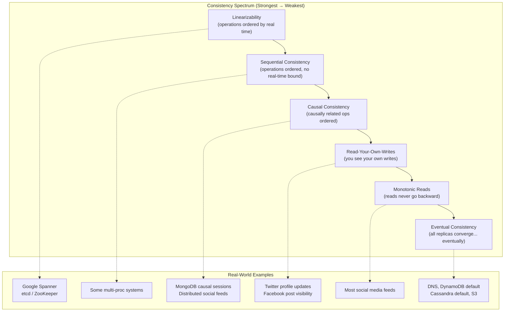

# Consistency Models

## Why This Topic Exists

Imagine you update your profile photo on Instagram from your phone. Your friend, sitting next to you, refreshes Instagram on their laptop at the exact same moment. Do they see your new photo or your old one?

In a single-server database, the answer is simple: yes, they see the new one. But Instagram does not run on one server. It runs on hundreds of servers spread across datacenters in the US, Europe, and Asia. When you upload a photo, it gets written to a primary server, then copied to replicas. That copying takes time — milliseconds to seconds.

So your friend might see the old photo for a moment. Is that a bug? Or is it acceptable behavior?

The answer depends on which **consistency model** the system uses. A consistency model is a contract between the database and the application. It says: "Here is exactly what you can expect when you read data."

---

## Learning Objectives

By the end of this file you will be able to:

- Explain what a consistency model is and why it matters
- Describe at least six consistency models on the consistency spectrum
- Explain the difference between linearizability and sequential consistency
- Give a real-world example for each consistency model
- Explain why stronger consistency costs more

---

## Prerequisites

- What database replication is (primary writes, replicas read)
- The basic idea of the CAP theorem (consistency vs. availability under partitions)

---

## Introduction

"Consistent" is one of the most overloaded words in computer science. In ACID transactions, the C stands for "the database moves from one valid state to another." In the CAP theorem, the C means something completely different: every node sees the same data at the same time.

In this file, we focus on the CAP meaning: **what can a client expect to read after a write?**

There is not one right answer. There is a spectrum. At one end you have strong consistency — every read sees the latest write, always. At the other end you have eventual consistency — reads might be stale, but eventually all nodes agree. In between, there are several models that offer different trade-offs between correctness and performance.

---

## Real-World Analogy

Think of a whiteboard in an office. When one person writes something on the whiteboard, everyone in the room sees it immediately. That is **strong consistency** — one copy, all readers see the same thing instantly.

Now imagine a whiteboard app where changes sync across devices. You write something on your laptop. Your colleague's tablet might not update for a second or two if their network is slow. Eventually it syncs. That is **eventual consistency**.

Now imagine the app guarantees: "On your own device, you will always see your own latest changes." You wrote something, so you see it even before it syncs to others. That is **read-your-own-writes**.

The whiteboard analogy captures the feel. Now let us get precise.

---

## Core Concepts

The **scenario** we will use throughout this file: a distributed database with User Profile data spread across three datacenters — US-East, EU-West, and AP-Southeast. User Alice updates her email address. What can clients in different locations read?

### The Consistency Spectrum

```
STRONG ←——————————————————————————————→ WEAK
Linearizability → Sequential → Causal → Eventual
(most consistent,              (most available,
 most expensive)                cheapest)
```

### 1. Strong Consistency

**Definition:** Every read returns the most recent write. Period. No exceptions.

If Alice updates her email at time T, any client reading Alice's profile at time T or later — from any datacenter — gets the new email.

**How it works:** Typically implemented by routing all reads and writes through a single primary node. Or by requiring all replicas to acknowledge a write before it is confirmed.

**Cost:** High latency (writes must sync before returning), low availability (if the primary is unreachable, no writes succeed).

**Example:** A bank account balance. You must never show a stale balance.

---

### 2. Linearizability

**Definition:** The strongest consistency model. Operations appear to happen instantaneously at some single point in real time, and the order is globally consistent with the real-time order of those operations.

Linearizability is *strong consistency* with an additional real-time ordering guarantee. If operation A completes before operation B starts (in wall-clock time), then A appears to happen before B in the system.

This matters because in a distributed system, "before" is hard to define. Linearizability pins operations to real time.

**Example:** etcd and Zookeeper are linearizable key-value stores. Google's Spanner database offers linearizable transactions using GPS clocks and atomic clocks to establish real-time ordering.

**Cost:** Extremely expensive — requires coordination across all replicas for every read and write. Latency is bounded by the slowest replica. Unavailable during network partitions.

---

### 3. Sequential Consistency

**Definition:** All operations appear to execute in some sequential order, and that order is consistent with the order of operations on each individual process (each client sees its own operations in order). But there is no real-time constraint.

Two clients might see operations in different orders, as long as each client's own operations are ordered correctly.

**Example:** Alice updates her email at 10:00:00 and her phone number at 10:00:01. With sequential consistency, every client must see the email update before the phone update. But the updates might appear to happen at 10:00:05 on a replica — delayed, but in order.

**Real-world use:** Older multi-processor hardware memory models (x86 does not even guarantee this without fences).

---

### 4. Causal Consistency

**Definition:** Operations that have a cause-and-effect relationship are seen in the correct order by all nodes. Operations with no causal relationship can be seen in any order.

"Causally related" means: Bob reads Alice's write, then Bob makes his own write. Bob's write is causally dependent on Alice's write. All clients must see Alice's write before Bob's write.

**Example:**

- Alice posts: "I got promoted!"
- Bob reads Alice's post, then replies: "Congratulations!"
- All clients must see Alice's post before Bob's reply. It would be confusing to see Bob's reply without Alice's post.
- But if Carol independently posts "Nice weather today," her post has no causal relationship to Alice's promotion post. It can appear before or after.

**Real-world use:** Distributed social networks, comment threads, collaborative editing systems. MongoDB can be configured for causal consistency per session.

**Cost:** Much cheaper than linearizability. Requires tracking causal dependencies (usually with vector clocks or version vectors), but does not require global synchronization.

---

### 5. Eventual Consistency

**Definition:** If no new writes are made to a piece of data, all replicas will eventually agree on the same value. But while writes are occurring, replicas may disagree.

"Eventually" typically means milliseconds to seconds in practice, but the guarantee is only that they will converge — no time bound is given.

**Example:** DNS (Domain Name System). When a domain's IP address changes, DNS updates propagate around the world over hours. During that propagation, some servers return the old IP, some return the new one. Eventually, all DNS servers agree.

**Real-world use:** Amazon DynamoDB (default), Apache Cassandra (default), Amazon S3 (for list operations), DNS.

**Cost:** Cheapest to implement. Allows maximum availability and low latency. But requires the application to handle the possibility of reading stale data.

---

### 6. Read-Your-Own-Writes (RYOW)

**Definition:** A user always sees their own writes. Other users might see stale data, but you never see a stale version of something you just wrote.

This is not about the global ordering of writes. It is about a specific user's experience of their own actions.

**Example:** You change your Twitter bio. You immediately refresh and see the new bio. Your followers might not see it yet, but you see it. This is read-your-own-writes consistency.

**How it works:** Route a user's reads to the same replica they wrote to, or use sticky sessions, or include a "read-after-write" token that tells replicas "do not serve this read unless you have write version X."

---

### 7. Monotonic Reads

**Definition:** Once you read a value, you will never see an older version of that value. Reads do not go backward in time.

**Example:** Without monotonic reads, you could refresh your feed and see 100 posts, refresh again and see only 98. This would be extremely confusing. Monotonic reads prevents this regression.

**How it works:** Route each user's reads to the same replica. Or track the version seen and reject reads from replicas that are behind that version.

---

## Visual Diagram



---

## Deep Explanation

### Why Stronger Consistency Is More Expensive

To understand the cost, consider what linearizability requires. When Alice writes her new email:

1. The write goes to the primary replica in US-East
2. The primary must send the write to EU-West and AP-Southeast
3. Both replicas must acknowledge the write
4. Only then does the primary tell Alice "write successful"

If EU-West takes 80ms to acknowledge and AP-Southeast takes 120ms, Alice's write has a minimum latency of 120ms. Every write. The slowest replica determines the latency for everyone.

Now if EU-West goes offline (network partition), Alice's write cannot complete until it comes back. The system is unavailable.

This is the CAP theorem in practice: choosing strong consistency means sacrificing availability during partitions.

Eventual consistency flips this. The primary writes to US-East, immediately tells Alice "success," and then asynchronously replicates to EU-West and AP-Southeast. Alice gets low latency. The system stays available. But readers in Europe might see the old data for a moment.

### Vector Clocks and Causal Ordering

How does a system track causal dependencies? Each event carries a **vector clock** — a map from node ID to logical timestamp.

```
Alice writes email at US-East:  {US: 1, EU: 0, AP: 0}
EU replica receives update:     {US: 1, EU: 1, AP: 0}
Bob reads from EU replica:      sees {US: 1, EU: 1, AP: 0}
Bob updates phone from EU:      {US: 1, EU: 2, AP: 0}
AP replica sees Bob's update:   knows it must have Alice's write first
```

If AP has not yet received Alice's update (US:1), it will hold Bob's update until it has the prerequisite write. This ensures causal order.

### The Hierarchy Is Not Always Linear

Note that these models are not always strictly nested. Read-your-own-writes and monotonic reads are **session guarantees** — they apply per client session, not globally. A system can offer eventual consistency globally but still provide RYOW and monotonic reads per session.

DynamoDB, for example, offers eventual consistency globally but lets you opt into "strong consistency" per read (at double the cost in read capacity units).

---

## Step-by-Step Example

**Scenario:** Alice updates her email from `alice@old.com` to `alice@new.com`. The system has three nodes: N1 (primary), N2, N3.

**With Linearizability:**

1. Alice sends write to N1: `email = alice@new.com`
2. N1 forwards write to N2 and N3
3. N2 acknowledges: OK
4. N3 acknowledges: OK
5. N1 returns success to Alice
6. Bob reads from N3: gets `alice@new.com` (guaranteed)
7. Carol reads from N2: gets `alice@new.com` (guaranteed)

Total time for Alice's write: ~120ms (round trip to slowest replica)

**With Eventual Consistency:**

1. Alice sends write to N1: `email = alice@new.com`
2. N1 returns success to Alice immediately
3. N1 asynchronously replicates to N2 and N3
4. Bob reads from N3 at T+0ms: gets `alice@old.com` (stale!)
5. Bob reads from N3 at T+50ms: gets `alice@new.com` (converged)
6. Carol reads from N2 at T+0ms: gets `alice@old.com` (stale!)

Total time for Alice's write: ~5ms
Maximum staleness: ~50ms (depends on replication lag)

---

## Advantages / Disadvantages / Trade-offs

| Model | Availability | Latency | Correctness Guarantee |
|-------|-------------|---------|----------------------|
| Linearizability | Low (unavailable during partitions) | High | Strongest — real-time ordering |
| Sequential Consistency | Low | High | Strong — process-order respected |
| Causal Consistency | Medium | Medium | Moderate — cause-effect respected |
| Eventual Consistency | High | Low | Weakest — just convergence |
| Read-Your-Own-Writes | High | Low | Per-session only |
| Monotonic Reads | High | Low | Per-session only |

---

## When to Use / When NOT to Use

**Use strong consistency / linearizability when:**
- Financial transactions (account balances, inventory counts)
- Leader election systems
- Distributed locks (only one process should hold the lock)
- Configuration management (all nodes must see the same config)

**Use eventual consistency when:**
- Social media feeds and timelines
- Product catalog reads (small price staleness is acceptable)
- Analytics counters (approximate counts are fine)
- DNS updates
- Shopping cart (brief divergence is acceptable)

**Use causal consistency when:**
- Comment threads (reply must appear after the original post)
- Collaborative editing with dependencies
- Message systems where reply ordering matters

---

## Common Interview Questions

**Q: What is the difference between consistency in ACID and consistency in CAP?**
A: ACID consistency means the database moves from one valid state to another (no constraint violations). CAP consistency means every read returns the most recent write — all nodes see the same data. They are different concepts using the same word.

**Q: Is eventual consistency the same as no consistency?**
A: No. Eventual consistency is a real guarantee: given no new writes, all replicas will converge. Systems using eventual consistency must still handle conflicts carefully. It is not "anything goes."

**Q: Can a system offer both linearizability and high availability?**
A: No, not during network partitions. The CAP theorem says a distributed system can offer at most two of: consistency, availability, partition tolerance. Since partition tolerance is mandatory in a real network, you must choose between strong consistency and high availability.

**Q: What does DynamoDB use?**
A: Eventually consistent reads by default, with an option for strongly consistent reads (which read from the primary and cost more).

---

## Common Beginner Mistakes

**Mistake 1: Assuming "consistent" means linearizable.**
Most databases that call themselves "consistent" offer something weaker, like read-committed or eventual consistency. Always ask: "What specific consistency model?"

**Mistake 2: Thinking eventual consistency means data loss.**
Eventual consistency is about *ordering* and *staleness*, not about durability. Your write is not lost — it is just not visible to all readers immediately.

**Mistake 3: Confusing RYOW with strong consistency.**
Read-your-own-writes only applies to your own session. Other users can still see stale data. It is a per-session guarantee, not a global one.

**Mistake 4: Ignoring the session guarantees.**
Many real systems offer per-session monotonic reads and RYOW even when they are eventually consistent globally. These are powerful practical guarantees that should not be overlooked.

---

## Summary

Consistency models define what a client can expect when reading data in a distributed system. The spectrum runs from linearizability (strongest, most expensive, real-time ordered) to eventual consistency (weakest, cheapest, just convergence). In between are sequential consistency, causal consistency, read-your-own-writes, and monotonic reads.

Choosing a consistency model is a trade-off: stronger consistency costs higher latency, lower throughput, and reduced availability during failures. Most large-scale systems use eventual consistency or weak consistency with per-session guarantees. Safety-critical systems (banking, distributed locks) require linearizability or strong consistency.

---

## Key Takeaways

- Consistency is a spectrum, not a binary choice
- Linearizability is the strongest model — operations are ordered by real time
- Eventual consistency is the weakest — replicas will eventually agree
- Causal consistency is a middle ground — cause-effect relationships are respected
- Stronger consistency = higher latency + lower availability
- Read-your-own-writes and monotonic reads are session-level guarantees, not global ones
- The CAP theorem forces you to choose between strong consistency and availability during partitions

---

## Related Topics

- [02. Eventual Consistency Deep Dive](./02.%20Eventual%20Consistency%20Deep%20Dive%20(INTERMEDIATE).md)
- [03. Quorum Consensus](./03.%20Quorum%20Consensus%20(INTERMEDIATE).md)
- [07. Linearizability vs Serializability](./07.%20Linearizability%20vs%20Serializability%20(ADV).md)
- [Chapter 9: CAP Theorem and PACELC](../09.%20CAP%20Theorem%20and%20PACELC/README.md)
