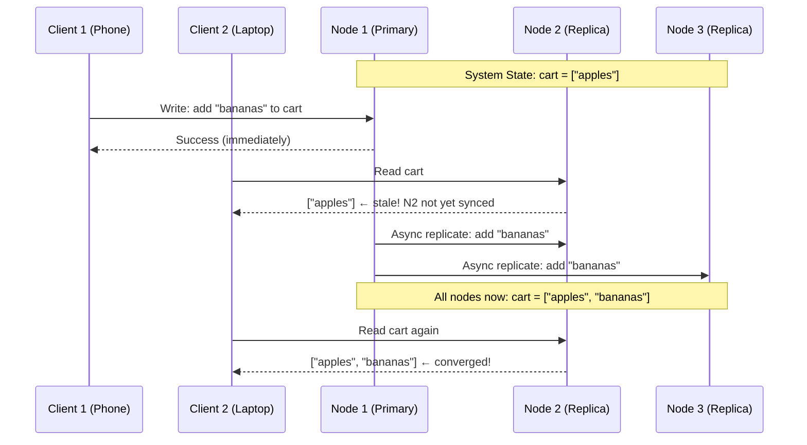
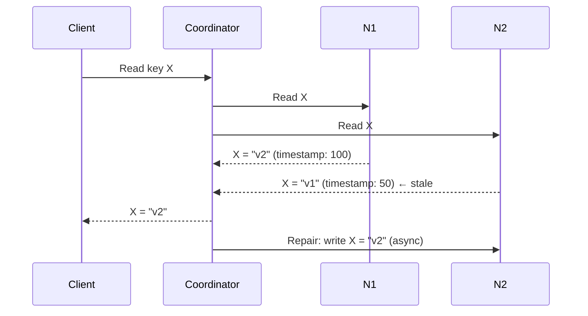

# Eventual Consistency Deep Dive

## Why This Topic Exists

Your Amazon shopping cart has a superpower: it never goes down. You can add items from your phone, from your laptop, from a store kiosk — all at the same time — and the cart always works, even during AWS outages.

The secret is that Amazon's shopping cart does not use strong consistency. It uses eventual consistency. Two devices might briefly show different items in your cart. But Amazon decided that "always available" is more important than "always perfectly synchronized." When the devices sync up, the cart converges to the correct state.

Amazon actually published a famous paper about this decision in 2007 (the Dynamo paper). It influenced an entire generation of distributed databases. Understanding how eventual consistency actually works — at the implementation level — is what separates a senior engineer from a junior one.

---

## Learning Objectives

By the end of this file you will be able to:

- Explain exactly what "eventual consistency" guarantees and what it does not
- Describe why network partitions make strong consistency expensive
- Explain three conflict resolution strategies: last-write-wins, merge functions, and CRDTs
- Describe the three mechanisms DynamoDB uses to achieve eventual consistency: anti-entropy, read repair, and hinted handoff
- Give a real-world example of where eventual consistency is and is not appropriate

---

## Prerequisites

- [01. Consistency Models](./01.%20Consistency%20Models%20(INTERMEDIATE).md) — you need to know what "eventual consistency" means before diving into how it works
- Basic understanding of database replication

---

## Introduction

Eventual consistency is the most misunderstood concept in distributed systems. Junior engineers either treat it as magic ("the database handles it") or as a bug ("how can you ship software that returns stale data?").

The reality is more nuanced. Eventual consistency is a deliberate design choice made by some of the best engineers at Amazon, Google, and Facebook. It comes with real trade-offs, concrete implementation mechanisms, and known failure modes. This file explains all of it.

---

## Real-World Analogy

Think of a group of friends sharing a grocery list using a notes app that works offline. Each person has a copy of the list on their phone. When offline, they can add or remove items. When they come back online, the app syncs.

While offline, one person adds "milk" and removes "eggs." Another person adds "eggs" (without knowing the first person removed them) and adds "butter." When they sync, the app must figure out: should eggs be on the list or not?

This is exactly the conflict resolution problem that eventually consistent systems solve every day. The "shopping cart" is not a metaphor — it is the literal example Amazon uses.

---

## Core Concepts

### What Eventual Consistency Actually Guarantees

The formal definition: "If no new updates are made to a given data item, eventually all accesses to that item will return the last updated value."

Three things this guarantees:
1. **Convergence** — all replicas will eventually agree
2. **No data loss** — writes are not discarded (unless specifically designed that way)
3. **Availability** — reads and writes succeed even during failures

Three things this does NOT guarantee:
1. **When** convergence happens (no time bound)
2. **What** you read between writes (could be stale)
3. **Which value wins** when two replicas conflict (that depends on conflict resolution strategy)

---

### Why Network Partitions Make Strong Consistency Expensive

Consider a database with three replicas: A in New York, B in London, C in Tokyo.

With strong consistency, every write must be acknowledged by all three replicas before returning success:

```
Client → A (New York) → B (London) [140ms round trip]
                      → C (Tokyo)  [160ms round trip]
A waits for both → returns success after 160ms minimum
```

If the cable between New York and London breaks (a network partition), A cannot reach B. So A must refuse all writes until the partition heals. The system is unavailable.

With eventual consistency:
```
Client → A (New York) → returns success immediately
A → B (async, best effort)
A → C (async, best effort)
```

If the cable breaks, A still accepts writes. B and C get the writes when connectivity restores. The system is always available.

This is the CAP theorem trade-off in its most concrete form.

---

## Visual Diagram



---

## Deep Explanation

### Conflict Resolution Strategy 1: Last-Write-Wins (LWW)

The simplest strategy. When two writes conflict, the one with the later timestamp wins.

**Example:** Alice updates her profile on her phone (timestamp: 10:00:01.500) and on her laptop (timestamp: 10:00:01.600) at roughly the same time. The laptop write wins because it has the later timestamp.

**The problem:** Clocks are not synchronized. Different nodes have clocks that drift by milliseconds or even seconds. An "earlier" wall-clock timestamp might actually represent a later event. This means LWW can silently discard data.

**Where it is used:** Cassandra uses LWW by default. DynamoDB uses it in some configurations. It is acceptable when conflicts are rare and discarding a write is tolerable.

**The critical insight:** Last-write-wins does not mean "most recent intent wins." It means "highest timestamp wins." These are different things when clocks disagree.

---

### Conflict Resolution Strategy 2: Merge Functions

Instead of discarding one write, merge both writes into a combined result.

**Example (shopping cart):**

Node 1 state: `cart = ["apples", "bananas"]`
Node 2 state: `cart = ["apples", "milk"]`

Merge result: `cart = ["apples", "bananas", "milk"]`

This is a set union merge. It works well for additive operations. But what about deletions?

Node 1 state: `cart = ["apples"]` (bananas was deleted)
Node 2 state: `cart = ["apples", "bananas"]` (did not receive the delete)

Set union gives: `cart = ["apples", "bananas"]` — the delete is lost!

This is the famous "deleted items reappear in cart" bug. Amazon experienced exactly this and it is why they invested heavily in CRDTs (covered in file 04).

---

### Conflict Resolution Strategy 3: CRDTs (Brief Preview)

CRDTs (Conflict-free Replicated Data Types) are special data structures where merge is always well-defined and never produces conflicts. For a shopping cart, instead of using a plain set (which cannot handle deletes correctly), you use an OR-Set (observed-remove set), which tracks both additions and deletions in a way that always merges correctly.

CRDTs are covered in depth in [04. CRDTs](./04.%20CRDTs%20-%20Conflict-free%20Replicated%20Data%20Types%20(ADV).md).

---

### How DynamoDB Achieves Eventual Consistency

DynamoDB (Amazon's key-value store) uses three mechanisms to bring replicas into sync:

#### Mechanism 1: Anti-Entropy

Anti-entropy is a background process that constantly compares replicas and fixes differences.

Each node maintains a **Merkle tree** — a hash tree where each node in the tree is a hash of its children. The root hash changes when any leaf (data item) changes.

To detect divergence between two nodes:
1. Compare root hashes — if equal, nodes are in sync
2. If different, compare child hashes to find the subtree with the difference
3. Recurse down to find the exact key that differs
4. Sync that key

This is efficient because you compare O(log N) hashes to find the divergent item, rather than comparing all N items. Cassandra uses Merkle trees for exactly this purpose.

#### Mechanism 2: Read Repair

When a read request goes to multiple replicas (as in quorum reads), the coordinator compares the responses. If they disagree, the coordinator:

1. Returns the most recent version to the client
2. Asynchronously updates the out-of-date replicas

Read repair is "lazy" — it only happens when a read occurs. A rarely-read key might stay stale indefinitely until it is read. That is why anti-entropy (proactive) is also needed.



#### Mechanism 3: Hinted Handoff

What if a node is temporarily unavailable? Without hinted handoff, writes to that node would be lost until the node recovers and anti-entropy catches up.

With hinted handoff:
1. When node B is unavailable, node A accepts the write on B's behalf
2. Node A stores the write with a "hint" — "this write belongs to node B"
3. When node B comes back online, node A delivers the hinted write

This preserves writes during short outages. For long outages, anti-entropy takes over.

---

## Step-by-Step Example

**Scenario:** Two users add and remove items from a shared Amazon cart concurrently.

Initial state: `cart = {apples: 1, bananas: 1}` on all three nodes (N1, N2, N3)

**Time 0:** Network partition — N3 is cut off from N1 and N2

**Time 1:** User A (connected to N1) removes bananas:
- N1 state: `cart = {apples: 1}`
- N2 (synced with N1): `cart = {apples: 1}`
- N3 (partitioned): `cart = {apples: 1, bananas: 1}`

**Time 2:** User B (connected to N3) adds milk:
- N3 state: `cart = {apples: 1, bananas: 1, milk: 1}`

**Time 3:** Network partition heals. N1/N2 and N3 must merge.

**With LWW:** N3's writes are newer (higher timestamp) → wins → result: `{apples: 1, bananas: 1, milk: 1}`. Bananas deletion is lost.

**With OR-Set CRDT:** The deletion of bananas was observed by N1/N2 as a specific delete event. The add of milk was a specific add event. Merge correctly produces: `{apples: 1, milk: 1}`. Bananas stays deleted.

---

## Advantages / Disadvantages / Trade-offs

| Aspect | Eventual Consistency |
|--------|---------------------|
| **Availability** | High — writes succeed even during failures |
| **Latency** | Low — no need to wait for all replicas |
| **Throughput** | High — no coordination overhead |
| **Staleness** | Reads may return old data |
| **Conflict complexity** | Requires explicit conflict resolution strategy |
| **Application complexity** | Application must tolerate stale reads |
| **Suitable for** | Social feeds, shopping carts, analytics, DNS |
| **Not suitable for** | Bank balances, inventory systems, distributed locks |

---

## When to Use / When NOT to Use

**Use eventual consistency when:**
- Stale reads are acceptable (feeds, profiles, catalogs)
- High availability is critical (e-commerce, social media)
- The data naturally converges (counters, sets)
- Conflict resolution is straightforward

**Do NOT use eventual consistency when:**
- Correctness is safety-critical (you must not overdraw a bank account)
- Two operations must be mutually exclusive (seat reservation: only one person can book seat 14A)
- Your application cannot handle seeing stale data (real-time inventory: you must not sell an item you do not have)

---

## Common Interview Questions

**Q: How does Amazon's DynamoDB achieve eventual consistency?**
A: Through three mechanisms: anti-entropy (background Merkle tree comparison), read repair (fix stale replicas during reads), and hinted handoff (hold writes for unavailable nodes). By default, reads are eventually consistent. You can request strongly consistent reads (at double the cost).

**Q: What happens when two clients write to the same key at the same time in an eventually consistent system?**
A: The system detects a conflict (usually using vector clocks or timestamps). It resolves the conflict using a strategy like last-write-wins, a merge function, or CRDTs. Without explicit conflict resolution, one write silently overwrites the other.

**Q: Why does Amazon's shopping cart use eventual consistency instead of strong consistency?**
A: Amazon prioritized availability over strict consistency. The cart must always be usable — even during failures. The occasional stale item or duplicate is a minor UX issue, far less damaging than "the cart is unavailable."

---

## Common Beginner Mistakes

**Mistake 1: Thinking eventual consistency means data can be permanently wrong.**
Eventual consistency guarantees convergence. Given no new writes, all replicas will agree. The system does not stay wrong forever — it resolves differences.

**Mistake 2: Using LWW without understanding clock drift.**
Many teams use last-write-wins and assume wall-clock timestamps are reliable. In distributed systems, clocks drift. LWW can silently lose data because a "later" timestamp actually represents an earlier event.

**Mistake 3: Not designing the application for stale reads.**
If your application assumes every read is fresh, eventual consistency will introduce subtle bugs. Design the UI and business logic to handle stale data gracefully — show "updated a moment ago" timestamps, allow users to refresh.

**Mistake 4: Conflating eventual consistency with "no consistency."**
Eventual consistency is a real guarantee. Systems like Cassandra, DynamoDB, and S3 make strong engineering commitments to convergence — they use sophisticated mechanisms (anti-entropy, read repair, hinted handoff) to ensure it.

---

## Summary

Eventual consistency is the consistency model of choice for large-scale, high-availability systems. It trades strong correctness guarantees for high availability and low latency. The key insight is that network partitions make strong consistency expensive — you either wait for all replicas or accept stale reads.

Conflict resolution is the hard part of eventual consistency. Last-write-wins is simple but can lose data. Merge functions work well for additive operations but struggle with deletions. CRDTs are the principled solution — data structures whose merge operations are always correct and conflict-free.

DynamoDB (and systems inspired by the Dynamo paper) achieve eventual consistency through three mechanisms: anti-entropy (proactive background repair), read repair (lazy repair during reads), and hinted handoff (holding writes for unavailable nodes).

---

## Key Takeaways

- Eventual consistency guarantees convergence, not freshness
- Network partitions make strong consistency expensive — that is why eventual consistency exists
- LWW is simple but can silently discard writes due to clock drift
- Merge functions handle additions well but struggle with deletions
- DynamoDB uses anti-entropy, read repair, and hinted handoff
- Eventual consistency is a deliberate design choice for availability-critical systems
- Application code must be designed to tolerate stale reads

---

## Related Topics

- [01. Consistency Models](./01.%20Consistency%20Models%20(INTERMEDIATE).md)
- [03. Quorum Consensus](./03.%20Quorum%20Consensus%20(INTERMEDIATE).md)
- [04. CRDTs — Conflict-free Replicated Data Types](./04.%20CRDTs%20-%20Conflict-free%20Replicated%20Data%20Types%20(ADV).md)
- [Chapter 9: CAP Theorem and PACELC](../09.%20CAP%20Theorem%20and%20PACELC/README.md)
