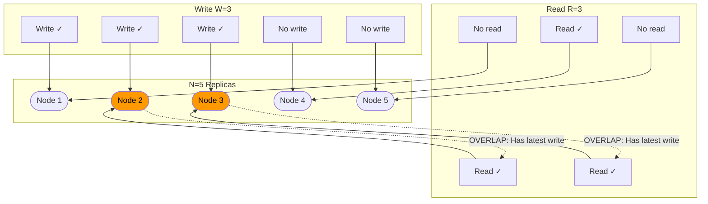

# Quorum Consensus

## Why This Topic Exists

Imagine you need to make a group decision. You have 5 committee members. You could require all 5 to agree before any decision is made — but that means one sick committee member blocks everything. You could require only 1 to agree — but that gives too much power to one person. So you require 3 out of 5: a majority. Enough that you can still function when some members are absent, but enough that decisions are legitimate.

Distributed databases use the exact same logic. Instead of "committee members," you have replica nodes. Instead of "votes," you have read and write acknowledgments. The rule is called **quorum**, and it lets you tune the consistency vs. availability trade-off with a single formula.

---

## Learning Objectives

By the end of this file you will be able to:

- Explain what a quorum is and why it works
- Derive and apply the W + R > N formula
- Explain what W, R, and N represent
- Describe how different W/R combinations create different trade-off profiles
- Explain sloppy quorum and when it is used
- Describe how Cassandra uses quorum levels

---

## Prerequisites

- [01. Consistency Models](./01.%20Consistency%20Models%20(INTERMEDIATE).md)
- [02. Eventual Consistency Deep Dive](./02.%20Eventual%20Consistency%20Deep%20Dive%20(INTERMEDIATE).md)
- Basic understanding of replication (data has multiple copies)

---

## Introduction

Quorum consensus is the mechanism that lets you dial consistency up or down. With N replicas, you can require W write acknowledgments and R read acknowledgments. If you choose W and R such that W + R > N, you are guaranteed that at least one node in every read has participated in the latest write.

This gives you tunable consistency. You can optimize for fast writes (low W), fast reads (low R), or both (lower both and accept weaker consistency). Understanding this formula is essential for interviews and for configuring real systems like Cassandra or DynamoDB.

---

## Real-World Analogy

Imagine 5 people each keep a copy of your calendar. When you make an appointment:

- **W = write quorum**: You need to update at least W copies before you consider the appointment "confirmed"
- **R = read quorum**: When you check your calendar, you ask at least R copies and take the most recent answer

If W = 3 and R = 3, any three people confirming a write means the appointment exists. When you read from any three, at least one of them was part of the write — so at least one has the latest version. You can always get the truth.

If the 5 people are in different offices and communication is slow:
- W = 1 means you confirm the appointment with just one person — fast, but other readers might not know
- W = 5 means you confirm with everyone — slow, but every reader will know

---

## Core Concepts

### The Variables

| Variable | Meaning |
|----------|---------|
| **N** | Total number of replicas |
| **W** | Write quorum — number of replicas that must acknowledge a write |
| **R** | Read quorum — number of replicas that must respond to a read |

### The Formula

**W + R > N** guarantees that every read intersects with every write by at least one node.

**Why it works:**

If you write to W nodes, those W nodes are "up to date." If you read from R nodes, you get responses from R nodes. If W + R > N, then by the **pigeonhole principle**, at least one node must be in both groups — it acknowledged the write AND it responded to the read. That node has the latest value.

**Worked Example — N = 3:**

```
Nodes: [A, B, C]

Write W=2: Write goes to A and B.  A✓  B✓  C✗
Read  R=2: Read from  B and C.         B✓  C✓

W + R = 4 > N = 3 ✓
Overlap: B participated in both write and read.
B has the latest value. The read returns the correct answer.
```

```
Write W=2: Write goes to A and B.  A✓  B✓  C✗
Read  R=2: Read from  A and C.     A✓       C✓

W + R = 4 > N = 3 ✓
Overlap: A participated in both write and read.
A has the latest value. The read returns the correct answer.
```

No matter which W=2 nodes received the write, and no matter which R=2 nodes you read from, there will always be at least one overlap when W + R > N.

---

## Visual Diagram



**N2 and N3 are in both the write set and the read set — guaranteed overlap when W+R > N.**

---

## Deep Explanation

### Tuning W and R for Different Trade-offs

Given N = 3 (a common replication factor), here are the meaningful configurations:

| W | R | W+R | > N? | Profile |
|---|---|-----|------|---------|
| 1 | 1 | 2 | No (2 ≤ 3) | Fast both ways, no consistency guarantee |
| 1 | 3 | 4 | Yes | Fast writes, slow reads (read all replicas) |
| 3 | 1 | 4 | Yes | Slow writes (write all replicas), fast reads |
| 2 | 2 | 4 | Yes | Balanced — default for most systems |
| 3 | 3 | 6 | Yes | All nodes must participate — maximum consistency, minimum availability |

**Profile: W=1, R=N (Fast writes, strong reads)**

Every read queries all replicas and takes the freshest answer. Writes are confirmed by just one node, so they are fast. This is useful when reads are rare and writes are frequent.

**Profile: W=N, R=1 (Strong writes, fast reads)**

Every write must be confirmed by all replicas. Reads only need one response. Once the write is confirmed, every node has the data. This is how you get read-heavy workloads with strong consistency.

**Profile: W=2, R=2 (Balanced with N=3)**

This is the most common default. Two nodes must confirm a write, two nodes must respond to a read. You can tolerate one node failure on either side. This is what Cassandra calls `QUORUM` consistency level.

**Profile: W=1, R=1 (Fire and forget)**

W + R = 2 which is not greater than N = 3. No consistency guarantee. Writes go to one node, reads come from one node — they might be different nodes with different data. Use only when you accept stale reads (like a cache layer).

---

### What Happens During a Node Failure

With N = 3, W = 2, R = 2:

- If **one node fails**: W = 2 still succeeds (two healthy nodes). R = 2 still succeeds. System continues normally.
- If **two nodes fail**: W = 2 fails (only one node available). Writes are rejected. The system sacrifices availability for consistency — it does not write if it cannot confirm a quorum.

This is the key trade-off: a strict quorum prefers consistency over availability. When too few nodes are available to form a quorum, the operation fails rather than potentially returning stale data.

---

### Sloppy Quorum

What if you want availability even when you cannot reach the required replicas?

**Sloppy quorum** says: if you cannot reach W "home" nodes for a write, write to W "reachable" nodes instead, including nodes that are not the usual replicas. The write is tagged as a "hint" — it will be forwarded to the home nodes when they recover.

This is exactly the **hinted handoff** mechanism from DynamoDB (covered in the Eventual Consistency Deep Dive). Sloppy quorum is a form of quorum that prioritizes availability over strict consistency.

With sloppy quorum, W + R > N no longer guarantees overlap, because your reads might go to the home nodes while the writes went to substitute nodes. You get higher availability but weaker consistency.

**When to use sloppy quorum:** When you need writes to succeed even during failures and you accept the possibility of stale reads until hints are delivered. Amazon uses sloppy quorum in DynamoDB for exactly this reason.

---

### How Cassandra Uses Quorum

Cassandra lets you specify the consistency level **per operation**. The major levels are:

| Cassandra Level | Meaning | N = 3 equivalent |
|----------------|---------|-----------------|
| `ONE` | Only 1 replica must respond | W=1 or R=1 |
| `TWO` | 2 replicas must respond | W=2 or R=2 |
| `THREE` | 3 replicas must respond | W=3 or R=3 |
| `QUORUM` | (N/2) + 1 replicas | W=2 or R=2 for N=3 |
| `ALL` | All replicas must respond | W=N or R=N |
| `LOCAL_QUORUM` | Quorum within local datacenter only | Useful for multi-DC deployments |
| `EACH_QUORUM` | Quorum in every datacenter | Strongest multi-DC guarantee |

A key insight: the consistency level can differ for reads vs. writes. A common production pattern is to use `QUORUM` for writes and `ONE` for reads when stale reads are acceptable — this gives durable writes with fast reads.

For a system requiring strong consistency in Cassandra, you would use `QUORUM` for both reads and writes, giving you the W + R > N guarantee.

---

## Step-by-Step Example

**Scenario:** A product catalog with N = 3 replicas, W = 2, R = 2.

**Step 1: Initial state**
All three nodes (A, B, C) have: `product_id=42, price=99.99`

**Step 2: Write — price change to $89.99**
```
Client → Coordinator → Node A: Write price=89.99 → ACK ✓
                     → Node B: Write price=89.99 → ACK ✓
                     → Node C: Write price=89.99 → timeout (C is slow)
W = 2 ACKs received. W ≥ required W = 2. Write SUCCESS.
```

**Step 3: State after write**
- Node A: `price = 89.99` (new)
- Node B: `price = 89.99` (new)
- Node C: `price = 99.99` (stale — write timed out)

**Step 4: Read — check the price**
```
Client → Coordinator → Node B: Read price → 89.99, timestamp: 1000
                     → Node C: Read price → 99.99, timestamp: 500
R = 2 responses received. R ≥ required R = 2.
Coordinator picks highest timestamp: 89.99 at timestamp 1000.
Returns: price = 89.99 ✓
```

The coordinator also triggers read repair: sends `price=89.99` to Node C asynchronously.

**Step 5: State after read repair**
- Node A: `price = 89.99`
- Node B: `price = 89.99`
- Node C: `price = 89.99` (repaired)

All nodes converge. The quorum read returned the correct value even though one replica was stale.

---

## Advantages / Disadvantages / Trade-offs

| Aspect | Strict Quorum (W+R>N) | Sloppy Quorum |
|--------|----------------------|---------------|
| Consistency | Guaranteed (at least one overlap) | Not guaranteed |
| Availability | Lower (fails if < W or < R nodes) | Higher (writes to substitute nodes) |
| Read latency | Higher (must wait for R responses) | Lower |
| Write latency | Higher (must wait for W ACKs) | Lower |
| Use case | Financial data, catalog prices | Shopping carts, social activity |

---

## When to Use / When NOT to Use

**Use strict quorum when:**
- You need the W + R > N consistency guarantee
- You can tolerate some writes/reads failing during node failures
- Data correctness is important (inventory, pricing, user auth)

**Use sloppy quorum when:**
- High availability is critical even during failures
- You can tolerate temporary inconsistency
- You have a good conflict resolution strategy (CRDTs or LWW)

**Tune W and R for your workload:**
- Read-heavy with stale-OK: `W = N, R = 1` (strong writes, fast reads)
- Write-heavy: `W = 1, R = N` (fast writes, slow reads)
- Balanced: `W = R = (N/2)+1`

---

## Common Interview Questions

**Q: What does W + R > N guarantee?**
A: It guarantees that at least one node in every read set participated in the latest write. Because W + R exceeds the total number of replicas N, the write set and read set must overlap. The overlapping node has the latest data.

**Q: If N = 5, what are the values of W and R for a quorum?**
A: Quorum means majority, so W = R = (5/2) + 1 = 3. Both the write set and read set contain 3 nodes out of 5, so there is always at least 1 node (3 + 3 - 5 = 1) in the intersection.

**Q: What is the difference between a strict quorum and a sloppy quorum?**
A: A strict quorum requires exactly the designated W or R home replicas to respond. If they are unavailable, the operation fails. A sloppy quorum allows substitute nodes to fill in, prioritizing availability. Writes are hinted and forwarded to home nodes when they recover.

**Q: What does Cassandra's QUORUM consistency level mean?**
A: QUORUM requires (N/2) + 1 replicas to acknowledge. For N = 3, that is 2 replicas. Using QUORUM for both reads and writes (QUORUM/QUORUM) satisfies W + R > N and provides strong consistency.

---

## Common Beginner Mistakes

**Mistake 1: Confusing N with the replication factor.**
N is the replication factor — the number of copies of data. In Cassandra, you set the replication factor per keyspace. The quorum formula uses this N.

**Mistake 2: Thinking quorum alone solves all consistency problems.**
Quorum guarantees you read at least one node with the latest write. But if writes are happening concurrently, you still need conflict resolution (LWW or CRDTs) to determine which write wins. Quorum is about *reading the latest write*, not about *preventing concurrent writes*.

**Mistake 3: Ignoring latency implications.**
Higher W or R means waiting for more nodes to respond. In a geographically distributed cluster (e.g., Cassandra with nodes in US, EU, AP), QUORUM reads might take 200ms+ because they must wait for a node across the ocean. Use LOCAL_QUORUM for multi-datacenter deployments to avoid cross-region latency.

**Mistake 4: Forgetting that W + R = N does not guarantee overlap.**
The formula requires strictly greater than N. W + R = N means you might just barely miss — the write set and read set might be disjoint. The overlap guarantee requires W + R > N.

---

## Summary

Quorum consensus is the mechanism behind tunable consistency in distributed databases. The formula W + R > N guarantees that at least one node in every read participated in the latest write, ensuring you always get the freshest data.

By tuning W and R relative to N, you control the consistency-availability trade-off. High W means durable writes. High R means consistent reads. Low W/R means high availability but potential staleness.

Sloppy quorum sacrifices the mathematical guarantee for higher availability — it allows writes to go to substitute nodes when home nodes are unavailable. This is DynamoDB's approach for shopping carts and similar use cases where availability matters more than strict consistency.

Cassandra exposes quorum as a first-class configuration via consistency levels, giving developers fine-grained control per operation.

---

## Key Takeaways

- N = replicas, W = write quorum, R = read quorum
- W + R > N guarantees at least one overlapping node between every write and read
- Higher W = more durable writes, higher write latency
- Higher R = more consistent reads, higher read latency
- W = 1, R = N or W = N, R = 1 are valid extreme configurations
- Sloppy quorum prioritizes availability over the overlap guarantee
- Cassandra exposes quorum via ONE, QUORUM, ALL, LOCAL_QUORUM consistency levels
- W + R = N is NOT sufficient — it must be strictly greater

---

## Related Topics

- [01. Consistency Models](./01.%20Consistency%20Models%20(INTERMEDIATE).md)
- [02. Eventual Consistency Deep Dive](./02.%20Eventual%20Consistency%20Deep%20Dive%20(INTERMEDIATE).md)
- [04. CRDTs — Conflict-free Replicated Data Types](./04.%20CRDTs%20-%20Conflict-free%20Replicated%20Data%20Types%20(ADV).md)
- [Chapter 7: Replication](../07.%20Replication/README.md)
