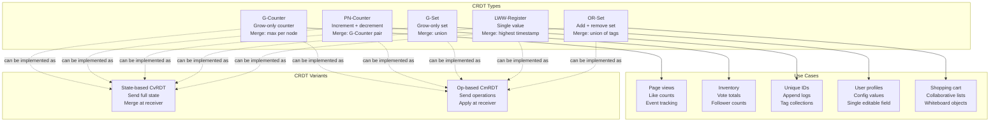

# CRDTs — Conflict-free Replicated Data Types

## Why This Topic Exists

You are building a collaborative to-do list app. Two users are offline. User A completes a task. User B adds a new task. When they come back online and sync, the app must merge their changes. Easy enough.

But what if User A deletes a task and User B edits the same task while offline? What if two users increment a shared counter at the same time on different servers? With regular data structures, these operations conflict and you have to write custom code to resolve every possible conflict.

CRDTs solve this at the data structure level. A CRDT is a data structure designed so that *any two replicas can always be merged without conflict*. The merge is mathematically guaranteed to produce the same result regardless of the order of operations. You get eventual consistency for free, with no application-level conflict resolution code.

---

## Learning Objectives

By the end of this file you will be able to:

- Explain why standard data structures cause conflicts in distributed systems
- Describe what a CRDT is and what "conflict-free" means mathematically
- Explain G-Counter, PN-Counter, G-Set, LWW-Register, and OR-Set
- Distinguish between state-based (CvRDT) and operation-based (CmRDT) CRDTs
- Give real-world examples of where CRDTs are used in production

---

## Prerequisites

- [02. Eventual Consistency Deep Dive](./02.%20Eventual%20Consistency%20Deep%20Dive%20(INTERMEDIATE).md) — especially the section on conflict resolution
- Basic understanding of set theory (union, intersection)
- Familiarity with the concept of replicas

---

## Introduction

The word "conflict-free" in CRDT is not a marketing term — it is a mathematical guarantee. A CRDT defines a *merge function* that satisfies three properties:

1. **Commutativity**: `merge(A, B) = merge(B, A)` — the order of merging does not matter
2. **Associativity**: `merge(A, merge(B, C)) = merge(merge(A, B), C)` — grouping does not matter
3. **Idempotency**: `merge(A, A) = A` — merging a state with itself does not change it

If a data structure's merge function has these three properties, it can be replicated across any number of nodes, updated independently, and merged in any order — and all replicas will always converge to the same state.

This is the mathematical foundation. Now let us build real data structures on it.

---

## Real-World Analogy

Think of a Google Doc. Two people are editing at the same time. You type "hello" at position 5 and your colleague types "world" at position 5 simultaneously. When Google merges these, it does not arbitrarily pick one — it keeps both, in a consistent way, using an algorithm that ensures everyone's screen shows the same result.

Google Docs uses an OT (Operational Transformation) algorithm rather than a pure CRDT, but modern collaborative editors like Figma and Notion use CRDT-based approaches. The key insight is: the data structure itself handles conflicts, so the application does not have to.

---

## Core Concepts

### Why Regular Data Structures Fail in Distributed Systems

Consider a simple integer counter. Two nodes start at 0. Both increment by 1. You might expect the final value to be 2. But:

```
Node 1: value = 0, increment → value = 1
Node 2: value = 0, increment → value = 1

Merge: Node 1 sends value=1 to Node 2.
       Node 2 already has value=1.
       Result: 1 (should be 2!)
```

If you merge by "take the maximum," you get 1, not 2. You lost an increment. This is why simple integer values fail as distributed counters.

### Why Regular Sets Fail

```
Node 1: Set = {A, B}. User removes B → Set = {A}
Node 2: Set = {A, B}. User adds C  → Set = {A, B, C}

Merge by union: {A, B, C} — the removal of B is lost!
Merge by intersection: {A} — the addition of C is lost!
```

No simple merge works. You need a smarter data structure.

---

## The CRDT Data Structures

### 1. G-Counter (Grow-Only Counter)

**Problem:** Count views, likes, or events without losing increments.

**Solution:** Instead of one counter, give each node its own counter. The total is the sum of all node counters.

```
State: A map from node-id → count
{N1: 3, N2: 5, N3: 2} → total = 10
```

**Increment rule:** Node X only increments its own entry.
```
Node 1 increments: {N1: 3, N2: 5, N3: 2} → {N1: 4, N2: 5, N3: 2}
Node 2 increments: {N1: 3, N2: 6, N3: 2} → {N1: 3, N2: 6, N3: 2}
```

**Merge rule:** Take the maximum of each node's counter.
```
Node 1 state: {N1: 4, N2: 5, N3: 2}
Node 2 state: {N1: 3, N2: 6, N3: 2}
Merge:        {N1: 4, N2: 6, N3: 2} → total = 12 ✓
```

No conflicts. The merge is commutative, associative, and idempotent.

**Used for:** Page view counters, event tracking, "number of items sold" counters.

---

### 2. PN-Counter (Positive-Negative Counter)

**Problem:** You need a counter that can also decrement (e.g., available inventory).

**Solution:** Use two G-Counters — one for increments (P), one for decrements (N). The value is `sum(P) - sum(N)`.

```
P counter: {N1: 5, N2: 3} → sum = 8 (total increments)
N counter: {N1: 2, N2: 1} → sum = 3 (total decrements)
Value: 8 - 3 = 5
```

**Merge rule:** Merge each G-Counter independently.

This works because each G-Counter is already conflict-free. The subtraction is done at read time, not stored as state.

**Limitation:** The value can go negative. If you need a floor of 0 (you cannot have negative inventory), you must enforce this at the application layer or use a different approach.

**Used for:** Inventory counts, vote counts (upvotes - downvotes), follower counts.

---

### 3. G-Set (Grow-Only Set)

**Problem:** A set where items are only ever added, never removed.

**Solution:** A plain set where the merge operation is set union.

```
Node 1: {A, B, C}
Node 2: {A, D}
Merge:  {A, B, C, D} ← union
```

Union is commutative, associative, and idempotent. This is the simplest CRDT.

**Limitation:** You cannot remove items. Ever.

**Used for:** Append-only logs, accumulating tags, collecting unique identifiers.

---

### 4. LWW-Register (Last-Write-Wins Register)

**Problem:** Store a single value that can be updated (like a user's name).

**Solution:** Pair the value with a timestamp. Merge by taking the value with the highest timestamp.

```
Node 1: {value: "Alice Smith",  timestamp: 100}
Node 2: {value: "Alice Johnson", timestamp: 150}
Merge:  {value: "Alice Johnson", timestamp: 150} ← later timestamp wins
```

**The catch:** This is technically a CRDT because the merge is well-defined and idempotent. But it can lose data if clocks are not monotonic or if two writes have the same timestamp. LWW-Register is a CRDT that accepts possible data loss in exchange for simplicity.

**Used for:** Configuration values, user profile fields, any "single current value" that does not have concurrent write conflicts often.

---

### 5. OR-Set (Observed-Remove Set)

**Problem:** A set where items can be both added and removed, correctly.

**Background:** The naive solution (Add-Remove Set or 2P-Set) tracks adds and removes separately. Once removed, an item can never be re-added. This is limiting.

**The OR-Set Solution:** Give every addition a unique tag (a UUID). Removal removes specific tags, not the item itself.

```
Initial state: {}

Node 1: Add "milk"  with tag t1  → {(milk, t1)}
Node 2: Add "milk"  with tag t2  → {(milk, t2)}
                                    [concurrent adds on two nodes]

Node 1: Remove "milk"            → removes t1 → {}
Node 2: state: {(milk, t2)}     → milk still there on Node 2

Merge: {} ∪ {(milk, t2)}        → {(milk, t2)}
Value: milk is still in the set (because t2 was added after the observation of t1's removal)
```

The key insight: a remove only removes the specific observed version (tagged). A concurrent add on another node creates a new tag that survives the removal.

This solves the "deleted items reappear in the shopping cart" problem mentioned in the Eventual Consistency Deep Dive. Amazon's shopping cart could use an OR-Set: adding an item creates a tagged entry, removing deletes that specific tag, and concurrent re-additions on another device survive.

**Used for:** Shopping carts, collaborative whiteboards, distributed tag systems.

---

## Visual Diagram



---

## Deep Explanation

### State-Based CRDTs (CvRDTs)

In state-based CRDTs, each node periodically sends its **full current state** to other nodes. The receiver applies the merge function to combine the incoming state with its own.

**Advantages:**
- Simple to implement
- Works even if messages are lost (state is resent)
- Idempotency means duplicate messages are harmless

**Disadvantages:**
- Sends the full state every time — expensive for large data structures
- A G-Counter with 1000 nodes sends 1000 entries per sync

---

### Operation-Based CRDTs (CmRDTs)

In operation-based CRDTs, each node sends **operations** (like "increment N1 by 1") instead of full state. Receivers apply operations in order.

**Advantages:**
- Much smaller messages (just the operation, not the full state)
- Efficient for large data structures

**Disadvantages:**
- Operations must be delivered exactly once (requires a reliable channel)
- Operations must be applied in the correct order (for some types)
- Harder to implement correctly

**Which to choose:** State-based is easier to implement and more robust to network issues. Operation-based is more efficient. Many production systems use a hybrid.

---

### CRDTs in Production Systems

**Redis (via Redis CRDT module):** Redis Enterprise supports CRDT data types for multi-region active-active deployments. Two Redis clusters in different regions can accept writes independently and merge using CRDTs.

**Riak (Basho):** Riak was one of the first databases to offer native CRDT data types — including counters, sets, maps, and flags. Riak's counters are PN-Counters; its sets are OR-Sets.

**Akka Distributed Data:** The Akka framework includes a CRDT library for building actor-based distributed systems. It offers G-Counter, PN-Counter, OR-Set, LWW-Map, and more.

**SoundCloud's Roshi:** A scalable CRDT-based storage system for time-series data (feeds).

**Collaborative editors:** Figma's multiplayer editing is based on CRDT principles. Notion uses CRDTs for real-time collaboration. The Yjs library is a popular JavaScript CRDT framework for collaborative text editors.

---

## Step-by-Step Example

**Scenario:** A multi-region shopping cart using an OR-Set. User has two devices: Phone (connected to US region) and Tablet (connected to EU region). The user is temporarily offline on the tablet.

**Initial state (both devices):**
```
Cart: {(milk, t1), (bread, t2)}
Items visible: milk, bread
```

**User removes milk from phone (US):**
```
US removes tag t1:
US state: {(bread, t2)}
```

**Tablet goes offline. Later, user adds milk again from tablet (EU):**
```
EU offline — does not know about the removal
EU adds milk with new tag t3:
EU state: {(milk, t1), (bread, t2), (milk, t3)}
```

**Devices sync (OR-Set merge = union of surviving tags):**
```
US has: {(bread, t2)}                      ← t1 was removed
EU has: {(milk, t1), (bread, t2), (milk, t3)}
Merge:  {(bread, t2), (milk, t3)}          ← t1 is gone (removed), t3 survives
Items visible: bread, milk
```

The result is correct: milk is in the cart (because the user re-added it on the tablet after the removal was observed). If you had used a naive set union, t1 would come back and you would have "milk" from both t1 and t3 — confusing duplication.

---

## Advantages / Disadvantages / Trade-offs

| Aspect | CRDTs |
|--------|-------|
| **Conflict resolution** | Automatic, mathematically guaranteed |
| **Implementation complexity** | Moderate (choosing the right CRDT for your use case) |
| **Data model constraints** | Must fit a supported CRDT type — not all data models work |
| **Memory overhead** | Higher — metadata (tags, per-node counters) |
| **Performance** | Generally good; state-based can be expensive for large sets |
| **Eventual convergence** | Guaranteed |
| **Application simplicity** | High — no custom conflict resolution code |

---

## When to Use / When NOT to Use

**Use CRDTs when:**
- Offline-first applications (mobile apps, sync later)
- Multi-region active-active writes (no single leader)
- Collaborative real-time editing
- Distributed counters, sets, or registers
- You want eventual consistency without writing conflict resolution code

**Do NOT use CRDTs when:**
- Your data model requires strong consistency (bank accounts)
- Your semantics cannot be expressed as a CRDT (e.g., a transaction spanning multiple objects)
- The metadata overhead is prohibitive (a G-Counter with millions of nodes is large)
- You need to enforce business invariants (you cannot have negative inventory — PN-Counter does not prevent this)

---

## Common Interview Questions

**Q: What does "conflict-free" mean in a CRDT?**
A: The merge function is commutative, associative, and idempotent. Any two states can be merged in any order and will produce the same result. There is no conflict to resolve because the merge is always well-defined.

**Q: How does an OR-Set differ from a simple set with add and remove?**
A: An OR-Set tags every addition with a unique identifier. Removal deletes specific tags. A concurrent addition on another node creates a new tag that is not affected by the removal of the old tag. This correctly handles the "deleted item reappears" problem.

**Q: What is the difference between state-based and operation-based CRDTs?**
A: State-based CRDTs send the full state; receivers merge it. Operation-based CRDTs send individual operations; receivers apply them. State-based is simpler and more resilient to network issues. Operation-based is more efficient but requires exactly-once delivery.

**Q: Can CRDTs replace all distributed consistency mechanisms?**
A: No. CRDTs work for specific data types (counters, sets, registers). They cannot express transactional semantics or enforce multi-object constraints. For complex business logic, you still need distributed transactions or consensus protocols.

---

## Common Beginner Mistakes

**Mistake 1: Thinking CRDTs solve all distributed consistency problems.**
CRDTs solve the problem of merging independent updates to the same data type. They do not solve cross-object consistency (e.g., "transfer money from account A to account B atomically").

**Mistake 2: Using LWW-Register for everything.**
LWW is technically a CRDT, but it silently discards concurrent writes. For data where both concurrent writes matter (like two users editing a shared document), LWW is wrong. Use OR-Set or a text CRDT instead.

**Mistake 3: Forgetting CRDT metadata costs memory.**
An OR-Set that has had thousands of add-remove cycles accumulates old tags. You need a garbage collection mechanism (tombstone compaction) to keep the memory footprint manageable.

**Mistake 4: Treating PN-Counter as an invariant-safe counter.**
A PN-Counter can go negative. If you need "inventory cannot go below 0," you cannot enforce this with a CRDT alone — you need coordination at the application layer.

---

## Summary

CRDTs are data structures designed for distributed systems. Their merge operations are mathematically guaranteed to be conflict-free: commutative, associative, and idempotent. Any two replicas can merge in any order and converge to the same result.

The key CRDT types are: G-Counter (grow-only, per-node counters, sum is total), PN-Counter (increment and decrement, pair of G-Counters), G-Set (grow-only set, union merge), LWW-Register (single value, latest timestamp wins), and OR-Set (add and remove set, tagged entries survive concurrent removals).

CRDTs come in two flavors: state-based (send full state, merge at receiver) and operation-based (send operations, apply at receiver). State-based is simpler; operation-based is more efficient.

CRDTs are used in production by Redis, Riak, Akka, and collaborative editing tools like Figma and Notion. They are the right tool for offline-first, multi-region active-active, and collaborative editing use cases.

---

## Key Takeaways

- CRDTs are data structures with conflict-free merge functions (commutative + associative + idempotent)
- G-Counter: per-node counts, merge by max, total by sum
- PN-Counter: two G-Counters for increment and decrement
- G-Set: grow-only, merge by union
- LWW-Register: single value, merge by latest timestamp (can lose concurrent writes)
- OR-Set: tagged adds, removes delete specific tags — solves the "deleted item reappears" bug
- State-based = send full state; operation-based = send operations
- CRDTs do not solve cross-object consistency or business invariants

---

## Related Topics

- [02. Eventual Consistency Deep Dive](./02.%20Eventual%20Consistency%20Deep%20Dive%20(INTERMEDIATE).md)
- [03. Quorum Consensus](./03.%20Quorum%20Consensus%20(INTERMEDIATE).md)
- [05. Paxos Algorithm](./05.%20Paxos%20Algorithm%20(ADV).md)
- [Chapter 7: Replication](../07.%20Replication/README.md)
