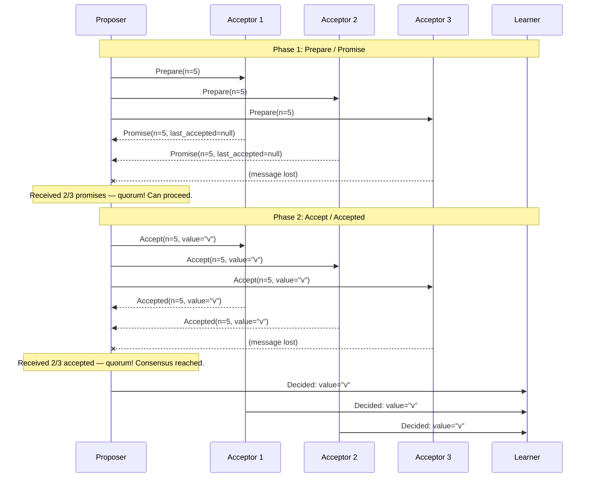

# Paxos Algorithm

## Why This Topic Exists

Imagine five politicians trying to vote on a single law. They are in different cities. They can send letters, but letters can be lost or delayed. Some politicians might go silent mid-vote (they got distracted, or their office burned down). Despite all this, the group must agree on *one* law — and once they agree, that agreement must be permanent.

This is the **distributed consensus problem**, and it is the hardest fundamental problem in distributed systems. You need a group of unreliable nodes to agree on a single value, even when messages are lost and nodes fail.

Paxos is the first algorithm that provably solves this problem correctly. It was invented by Leslie Lamport in 1989 (published 1998) and is the foundation of distributed consensus algorithms used in Google Spanner, Google Chubby, Apache ZooKeeper, and many others. Understanding Paxos tells you *why* distributed consensus is hard and how it is solved at its core.

---

## Learning Objectives

By the end of this file you will be able to:

- Explain what the distributed consensus problem is and why it matters
- Describe the three roles in Paxos: Proposer, Acceptor, Learner
- Walk through the two phases of Basic Paxos: Prepare/Promise and Accept/Accepted
- Explain why Paxos is considered difficult
- Describe how Multi-Paxos reduces round trips with a stable leader
- Name real systems built on Paxos or Paxos variants
- Explain why Raft was created as an alternative

---

## Prerequisites

- [01. Consistency Models](./01.%20Consistency%20Models%20(INTERMEDIATE).md)
- Understanding of what "leader election" means
- Basic familiarity with network failures (messages can be lost, delayed, or duplicated)

---

## Introduction

Before we get to Paxos, let us be precise about what problem we are solving.

**The Consensus Problem:** A set of N processes must agree on one value. Any process can propose a value. At the end, all processes must decide on the same single value. This decision must be permanent — it cannot be changed after agreement is reached.

**Why it matters:** Consensus is used for:
- Electing a single leader (only one process can be leader at a time)
- Distributed locks (only one process can hold a lock)
- Replicated state machines (all replicas execute the same sequence of operations)
- Configuration management (all nodes agree on the current config)

**Why it is hard:** In an asynchronous distributed network, messages can be delayed indefinitely. You cannot distinguish between a slow node and a dead node. The FLP impossibility theorem (1985) proved that in an asynchronous system, no deterministic consensus algorithm can guarantee both safety (everyone agrees on the same value) and liveness (they always eventually agree) if even one process can fail.

Paxos gets around FLP by sacrificing liveness in rare cases — it might get stuck if too many nodes fail at the same time. But it never violates safety — it never allows two nodes to disagree.

---

## Real-World Analogy

Imagine you are running a vote for "Best Restaurant in Town." The voters are spread across the city and can only communicate by postal mail. Some letters get lost. Some voters go on vacation mid-process.

The Paxos algorithm says: send a "prepare" letter to get permission to run the vote. If most voters respond, send your actual vote. If most voters accept your vote, the vote is decided. If someone else tried to run their own vote while you were running yours, the system ensures that only one vote wins — they cannot both succeed.

The key insight: you do not need *everyone* — you need a *majority* (quorum). If a majority has seen your proposal, no conflicting majority can form.

---

## Core Concepts

### Paxos Roles

| Role | Responsibility |
|------|---------------|
| **Proposer** | Proposes a value for the group to agree on. In practice, any node can be a proposer. |
| **Acceptor** | Votes on proposals. Must remember what it has promised and accepted. Usually every node is an acceptor. |
| **Learner** | Learns the final agreed-upon value once consensus is reached. In practice, all nodes are learners. |

In a typical deployment, every node plays all three roles. The distinction is conceptual.

### The Two Phases of Basic Paxos

**Phase 1: Prepare/Promise**

The proposer announces "I want to propose something. Please promise me you won't accept anything from an older proposal."

**Phase 2: Accept/Accepted**

The proposer sends the actual value. Acceptors vote yes if they haven't already promised a newer proposer.

---

## Visual Diagram



---

## Deep Explanation

### Phase 1 in Detail: Prepare/Promise

The proposer picks a proposal number `n`. This number must be unique and larger than any proposal number the proposer has used before. (In practice, `n` is often `(round_number * num_nodes) + node_id` to guarantee uniqueness across nodes.)

The proposer sends `Prepare(n)` to all acceptors.

Each acceptor receives `Prepare(n)` and:
- If `n` is greater than any prepare they have responded to before: respond with `Promise(n, last_accepted_proposal, last_accepted_value)`. Promise means "I will not accept any proposal with number less than n." Also report any value you have already accepted (this is crucial — see below).
- If `n` is less than or equal to a prepare they have already responded to: ignore or send a rejection.

If the proposer receives promises from a majority (quorum) of acceptors, it can proceed to Phase 2.

**Why report the last accepted value?** If a previous round of Paxos partially completed (some acceptors accepted a value but consensus was not confirmed), the proposer must adopt that previous value. This is what prevents two proposers from choosing conflicting values.

Specifically: if any promise includes a `(last_accepted_proposal, last_accepted_value)`, the proposer must use the value from the *highest-numbered* prior accepted proposal. This ensures continuity — if some value was nearly chosen before, Paxos will finish choosing it.

### Phase 2 in Detail: Accept/Accepted

The proposer sends `Accept(n, value)` to all acceptors.

- If no promise included a prior accepted value: the proposer can choose any value it wants (the original proposal).
- If some promise included a prior accepted value: the proposer MUST use the value with the highest proposal number from the promises.

Each acceptor receives `Accept(n, value)` and:
- If `n` is greater than or equal to the highest prepare they promised: accept the proposal, store `(n, value)`, respond with `Accepted(n, value)`.
- If `n` is less than a prepare they already promised: ignore (they made a higher promise).

If the proposer (or a learner) receives `Accepted` from a majority, consensus has been reached. The value is decided.

### Why Paxos Is Hard

Leslie Lamport admitted that even he finds Paxos confusing. Here is why:

**1. The two-phase interplay is subtle.** The rule "adopt the highest-numbered prior accepted value" is what makes Paxos safe. Without it, two proposers could choose conflicting values. But this rule is non-obvious and hard to implement correctly.

**2. Multiple concurrent proposers.** If two proposers both try to run Paxos at the same time with competing proposal numbers, they can livelock — each one keeps getting its proposal blocked by the other. Paxos does not prevent livelock (in line with FLP impossibility). Multi-Paxos adds a leader to prevent this.

**3. Crashes mid-protocol.** If a proposer crashes after sending some `Accept` messages but not others, the state is ambiguous. Acceptors might have partially accepted a value. Paxos handles this correctly (a new proposer will learn the partially accepted value and complete it), but the recovery logic is complex.

**4. The distinction between "decided" and "known to be decided."** A value is decided when a majority has accepted it. But individual nodes might not know it was decided (if messages are lost). Learners might not find out until the next round.

---

### Multi-Paxos: Reducing Round Trips

Basic Paxos requires two network round trips per consensus decision. For a replicated log (where you need to agree on *many* values, one per log entry), this is expensive.

**Multi-Paxos** optimization: elect a single **leader** (Proposer) for an extended period. The leader skips Phase 1 for subsequent entries.

```
Round 1: Phase 1 (Prepare) + Phase 2 (Accept) = 2 round trips
Round 2: skip Phase 1 (leader already established) → Phase 2 only = 1 round trip
Round 3: Phase 2 only = 1 round trip
...
```

A new leader election is needed only when the current leader fails. During normal operation (no failures), Multi-Paxos costs just 1 round trip per log entry.

**Leader election itself requires Paxos** — you use Paxos to agree on who the leader is. Then the leader uses Multi-Paxos to agree on log entries.

---

### Real-World Systems Built on Paxos

**Google Chubby:** Google's distributed lock service. Chubby uses Paxos to elect a primary node and to replicate the lock database to five replicas. GFS (Google File System) and Bigtable use Chubby for coordination. Chubby was the practical reason Google needed to solve Paxos at scale.

**Google Spanner:** Uses Paxos for replication within each shard. Each shard is a Paxos group of 5 replicas. Spanner also uses TrueTime (GPS + atomic clocks) to assign globally ordered timestamps to Paxos entries.

**Apache ZooKeeper:** Uses ZAB (ZooKeeper Atomic Broadcast), a Paxos variant optimized for primary-backup replication. ZAB differs from Paxos in that it focuses on total order broadcast rather than consensus on a single value, but it uses the same core ideas.

**etcd:** Uses Raft (which was created as a more understandable alternative to Paxos). etcd is the consensus store for Kubernetes cluster state.

---

### Why Raft Was Created

In 2014, Diego Ongaro and John Ousterhout published the Raft paper with the subtitle: "In Search of an Understandable Consensus Algorithm."

Their explicit motivation was that Paxos is too hard to understand. They surveyed students and professionals: Raft was significantly easier to understand than Paxos. Raft achieves the same safety and liveness properties as Multi-Paxos, but with a cleaner decomposition:

- **Leader election**: one phase, clear rules
- **Log replication**: leader sends entries, followers replicate
- **Safety**: the leader always has the most up-to-date log

Raft is not "better" than Paxos in a theoretical sense. It is a practical choice: Paxos is hard to implement correctly, so engineers created Raft as a reference implementation they could reason about.

---

## Step-by-Step Example

**Scenario:** Three acceptors (A1, A2, A3) must agree on a value. Two proposers (P1 proposing "red", P2 proposing "blue") compete.

**Step 1:** P1 sends `Prepare(n=1)` to A1, A2, A3.

**Step 2:** A1, A2 respond `Promise(n=1, last=null)`. A3 is slow.

**Step 3:** P1 receives 2 promises (quorum). Sends `Accept(n=1, value="red")` to A1, A2, A3.

**Step 4:** Meanwhile, P2 sends `Prepare(n=2)` to A1, A2, A3.

**Step 5:** A1 and A2 have already accepted `(n=1, "red")`. They respond to P2: `Promise(n=2, last_accepted=(n=1, value="red"))`. A3 responds: `Promise(n=2, last=null)`.

**Step 6:** P2 sees that A1 and A2 reported `(n=1, "red")` as their last accepted value. P2 MUST use "red" (the highest-numbered prior accepted value) instead of its own "blue."

**Step 7:** P2 sends `Accept(n=2, value="red")`.

**Result:** Both P1 and P2 choose "red." Consensus is maintained. P2 cannot inject "blue" even though it outbid P1 on proposal number.

This is the core safety property of Paxos: a new proposer cannot change an already-accepted value.

---

## Advantages / Disadvantages / Trade-offs

| Aspect | Paxos |
|--------|-------|
| **Safety** | Guaranteed — never allows two nodes to decide different values |
| **Liveness** | Not guaranteed under asynchrony (can livelock with competing proposers) |
| **Round trips** | 2 per decision (Basic), 1 after leader elected (Multi-Paxos) |
| **Complexity** | Very high — hard to implement correctly |
| **Fault tolerance** | Can tolerate (N-1)/2 failures with N nodes |
| **Performance** | Moderate — leader-based Multi-Paxos is efficient in steady state |

---

## When to Use / When NOT to Use

**Use Paxos (or a Paxos-derived algorithm like Raft or ZAB) when:**
- You need distributed consensus (leader election, distributed locks)
- You are building a replicated state machine
- Correctness and safety are non-negotiable

**Do NOT use Paxos when:**
- You only need eventual consistency — it is overkill
- You can use an existing consensus service (etcd, ZooKeeper) instead of implementing it
- You need very high write throughput — consensus has coordination overhead

---

## Common Interview Questions

**Q: What is the consensus problem?**
A: A group of distributed nodes must agree on a single value. Any node can propose a value. All nodes that decide must decide the same value. Once decided, the value cannot change.

**Q: What are the two phases of Basic Paxos?**
A: Phase 1 (Prepare/Promise): proposer asks acceptors to promise not to accept lower-numbered proposals. Phase 2 (Accept/Accepted): proposer sends the value; acceptors vote to accept it if no higher promise has been made.

**Q: Why does a new proposer have to adopt the previously accepted value?**
A: Because that value might already be decided (a majority might have accepted it without the proposer knowing). Adopting the highest-numbered prior value ensures continuity — Paxos "completes" the partial consensus rather than starting a conflicting one.

**Q: What is the difference between Paxos and Raft?**
A: Both solve distributed consensus. Raft was designed to be more understandable. Raft has explicit leader election, a structured log, and clearer safety rules. Paxos is more general but harder to implement. Raft is used in etcd and CockroachDB. Multi-Paxos is used in Google Spanner and Chubby.

**Q: What does ZooKeeper use?**
A: ZAB (ZooKeeper Atomic Broadcast), a Paxos variant optimized for primary-backup replication and total-order broadcast.

---

## Common Beginner Mistakes

**Mistake 1: Confusing consensus with consistency.**
Consensus is about agreeing on a single value (one decision). Consistency is about what readers see after writes (a spectrum from strong to eventual). They are related but distinct.

**Mistake 2: Thinking Paxos guarantees liveness.**
Paxos only guarantees safety (no two nodes decide different values). Liveness (the algorithm always terminates) is not guaranteed in the asynchronous model. In practice, rotating leaders and backoff strategies make livelock rare.

**Mistake 3: Thinking you need to implement Paxos yourself.**
Almost nobody should implement Paxos from scratch. Use etcd, ZooKeeper, or Consul as your consensus layer. These are battle-tested systems.

**Mistake 4: Forgetting the "adopt prior accepted value" rule.**
This rule is what makes Paxos safe. If you skip it and let proposers use their own values freely, you can get two leaders choosing conflicting values. The rule forces continuity across failed rounds.

---

## Summary

Paxos is the foundational distributed consensus algorithm. It solves the problem of getting a group of unreliable nodes to agree on one value, even when messages are lost and nodes fail.

The algorithm has three roles — Proposer, Acceptor, Learner — and two phases. Phase 1 (Prepare/Promise) establishes the proposer's authority and discovers any previously accepted values. Phase 2 (Accept/Accepted) proposes the value and collects majority votes.

The key safety rule: a new proposer must adopt the highest-numbered value from previous rounds. This prevents conflicting decisions even when multiple proposers compete.

Multi-Paxos reduces round trips by electing a stable leader, bringing the cost to one round trip per log entry during normal operation.

Real systems built on Paxos include Google Chubby, Google Spanner, and ZooKeeper (ZAB). Raft was created as a more understandable alternative and is used in etcd and Kubernetes.

---

## Key Takeaways

- Paxos solves distributed consensus — agreeing on one value despite failures
- Three roles: Proposer (proposes), Acceptor (votes), Learner (learns result)
- Phase 1: Prepare → Promise (establish authority, discover prior values)
- Phase 2: Accept → Accepted (propose value, collect majority votes)
- Safety rule: adopt the highest-numbered prior accepted value — this prevents conflicting decisions
- Multi-Paxos elects a leader to skip Phase 1 in steady state
- Paxos is notoriously hard to implement — use etcd, ZooKeeper, or Consul instead
- Raft was created as a more understandable alternative to Multi-Paxos

---

## Related Topics

- [06. Isolation Levels and Anomalies](./06.%20Isolation%20Levels%20and%20Anomalies%20(INTERMEDIATE).md)
- [07. Linearizability vs Serializability](./07.%20Linearizability%20vs%20Serializability%20(ADV).md)
- [Chapter 11: Distributed Transactions](../11.%20Distributed%20Transactions/README.md)
- [Chapter 9: CAP Theorem and PACELC](../09.%20CAP%20Theorem%20and%20PACELC/README.md)
