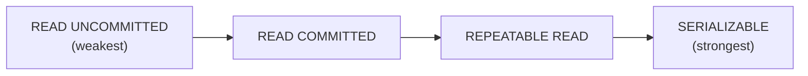
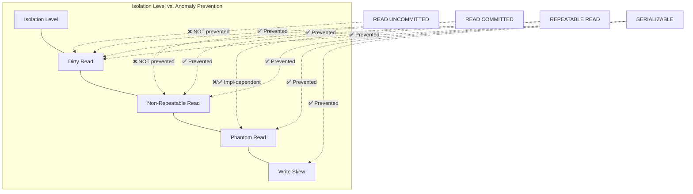

# Isolation Levels and Anomalies

## Why This Topic Exists

Databases run thousands of transactions every second. Those transactions overlap in time. Without isolation, they step on each other in subtle and dangerous ways.

You transfer $100 from account A to account B. Simultaneously, someone else calculates your total balance. They might see the $100 leave A but not arrive in B — temporarily showing you as $100 poorer. Another transaction might modify the same row you are working on between two reads in your transaction. A report query might count rows that did not exist when your transaction started.

These are not theoretical edge cases. They are real bugs that cause incorrect billing, double bookings, data corruption, and audit failures. SQL defines four **isolation levels** that protect against these **anomalies** — and understanding which level prevents which anomaly is a core skill for any backend engineer.

---

## Learning Objectives

By the end of this file you will be able to:

- Describe four transaction anomalies: dirty read, non-repeatable read, phantom read, write skew
- Explain what each anomaly looks like with a concrete example
- Name the four SQL isolation levels and what each one prevents
- Read an "isolation level vs. anomaly" matrix and explain it
- Choose the right isolation level for a given use case

---

## Prerequisites

- Basic understanding of database transactions (ACID properties)
- What "concurrent transactions" means (two transactions executing at the same time)

---

## Introduction

ACID stands for Atomicity, Consistency, Isolation, Durability. The I — Isolation — is the one most people underestimate. Isolation controls how much concurrent transactions can see of each other's in-progress work.

Perfect isolation means transactions run as if they were completely sequential — one finishes before the next starts. This is the `SERIALIZABLE` isolation level. It is the safest but also the most expensive.

The SQL standard defines four isolation levels (from weakest to strongest): `READ UNCOMMITTED`, `READ COMMITTED`, `REPEATABLE READ`, and `SERIALIZABLE`. Each level prevents more anomalies at the cost of more overhead and lower concurrency.

---

## Real-World Analogy

Imagine four bank tellers handling your account at the same time:

- **Teller 1** is processing a transfer that has not finished yet
- **Teller 2** is calculating your balance for a statement
- **Teller 3** is running a report of all accounts
- **Teller 4** is checking if you qualify for a loan based on your balance

What happens when Teller 2 reads the balance in the middle of Teller 1's transfer? What happens when Teller 4 reads your balance, then Teller 1 finishes and changes it, and Teller 4 reads again?

These are the anomalies. Each isolation level is a set of rules about which tellers have to wait for each other.

---

## Core Concepts

### The Four Anomalies

#### Anomaly 1: Dirty Read

**Definition:** A transaction reads data that has been written by another transaction but not yet committed. If that other transaction rolls back, the first transaction read data that never officially existed.

**Example:**

| Time | Transaction 1 (Transfer) | Transaction 2 (Balance Report) |
|------|--------------------------|--------------------------------|
| T1 | BEGIN | |
| T2 | Update: account A balance = $900 (was $1000) | |
| T3 | | BEGIN |
| T4 | | Read account A: sees $900 (dirty read!) |
| T5 | ROLLBACK (transfer failed) | |
| T6 | | Reports $900 as account A balance |

Transaction 2 reported $900, but Transaction 1 rolled back — account A is actually $1000. Transaction 2 read a value that never was committed. This is a dirty read.

**Real-world impact:** A loan eligibility check sees a temporarily low balance, rejects the loan — even though the underlying transfer failed and the balance was never actually low.

---

#### Anomaly 2: Non-Repeatable Read

**Definition:** A transaction reads the same row twice and gets different values. Another transaction committed a change to that row between the two reads.

**Example:**

| Time | Transaction 1 (Loan Check) | Transaction 2 (Deposit) |
|------|----------------------------|------------------------|
| T1 | BEGIN | |
| T2 | Read account A: $1000 | |
| T3 | | BEGIN |
| T4 | | Update account A: $1200 (deposit) |
| T5 | | COMMIT |
| T6 | Read account A again: $1200 | |

Transaction 1 read account A twice within the same transaction and got different values. The read was "non-repeatable."

**Real-world impact:** A report that reads multiple tables sees inconsistent data — revenue calculated at $1000 in one part of the query, but $1200 by the time another part of the same query runs. The report is internally inconsistent.

---

#### Anomaly 3: Phantom Read

**Definition:** A transaction runs a query twice with the same filter and gets different rows. Another transaction committed inserts (or deletes) of rows that match the filter between the two queries.

**Example:**

| Time | Transaction 1 (Inventory Report) | Transaction 2 (New Order) |
|------|----------------------------------|--------------------------|
| T1 | BEGIN | |
| T2 | SELECT * WHERE price > 100: returns 5 rows | |
| T3 | | BEGIN |
| T4 | | INSERT product (price=150) |
| T5 | | COMMIT |
| T6 | SELECT * WHERE price > 100: returns 6 rows | |

Transaction 1 ran the same query twice and got a different number of rows — a "phantom" row appeared.

**Note:** Phantom reads are different from non-repeatable reads. Non-repeatable reads involve a changed value in an existing row. Phantom reads involve new (or deleted) rows appearing or disappearing.

**Real-world impact:** A seat reservation system checks "how many seats are taken" twice in one transaction and gets different counts. Or an analytics query produces inconsistent totals.

---

#### Anomaly 4: Write Skew

**Definition:** Two transactions read the same data, each make a decision based on what they read, and then each writes — but their combined effect violates a constraint that each individual write would have satisfied alone.

Write skew is the most subtle anomaly and is NOT prevented by `REPEATABLE READ` — only by `SERIALIZABLE`.

**Example:** On-call scheduling rule: at least one doctor must always be on call.

| Time | Transaction 1 (Doctor Alice) | Transaction 2 (Doctor Bob) |
|------|------------------------------|---------------------------|
| T1 | BEGIN | BEGIN |
| T2 | Read: {Alice: on-call, Bob: on-call} | Read: {Alice: on-call, Bob: on-call} |
| T3 | Alice wants to go off-call. Checks: 2 doctors on call, removing Alice leaves 1. OK. | Bob wants to go off-call. Checks: 2 doctors on call, removing Bob leaves 1. OK. |
| T4 | Update: Alice = off-call | Update: Bob = off-call |
| T5 | COMMIT | COMMIT |
| T6 | Result: {Alice: off-call, Bob: off-call} | ← violation! No doctors on call. |

Both transactions read the same valid state, made a valid-looking decision, and committed a valid-looking write. But their combined effect violated the invariant.

**Real-world impact:** Double-booking (two users book the last seat), overdrafting (two withdrawals both pass the balance check), race conditions in any "check then act" pattern.

---

## The Four Isolation Levels



#### Level 1: READ UNCOMMITTED

Transactions can read uncommitted changes from other transactions.

**Prevents:** Nothing. All four anomalies can occur.
**Use case:** Almost never used in practice. Only appropriate for rough analytics where approximate counts are acceptable and performance is paramount.

**Database support:** Most databases support it but discourage it. Even then, MySQL's READ UNCOMMITTED still prevents dirty writes (two uncommitted transactions writing the same row).

---

#### Level 2: READ COMMITTED

Transactions can only read committed data. If another transaction is in the middle of a write, you see the old (pre-write) value.

**Prevents:** Dirty reads.
**Does NOT prevent:** Non-repeatable reads, phantom reads, write skew.
**Use case:** The default in PostgreSQL, Oracle, SQL Server, and most enterprise databases. Suitable for most OLTP workloads.

**How it works:** PostgreSQL uses MVCC (Multi-Version Concurrency Control). Every row stores multiple versions. A read sees the latest committed version at the time of the read. A write creates a new version without blocking readers.

---

#### Level 3: REPEATABLE READ

Within a transaction, the same row read twice always returns the same value.

**Prevents:** Dirty reads, non-repeatable reads.
**Does NOT prevent:** Phantom reads (in the SQL standard), write skew.
**Use case:** When a transaction must see a consistent snapshot of a row throughout its lifetime. Useful for reports and batch jobs.

**Important note:** MySQL's InnoDB implements REPEATABLE READ using a snapshot, which incidentally also prevents most phantom reads (though the SQL standard says REPEATABLE READ allows phantoms). This is an implementation detail, not a standard guarantee.

**How it works:** When a transaction starts, it gets a snapshot of the database at that point. All reads within the transaction see that snapshot. Other committed writes do not become visible.

---

#### Level 4: SERIALIZABLE

Transactions execute as if they were completely sequential — one at a time.

**Prevents:** Dirty reads, non-repeatable reads, phantom reads, write skew.
**Use case:** When correctness is non-negotiable — financial transactions, inventory management, seat booking, anything where two concurrent transactions could violate a business rule.

**How it works:** Two main approaches:
1. **2PL (Two-Phase Locking):** Transactions acquire locks as they proceed (growing phase) and release all locks when they commit (shrinking phase). A shared lock for reads, an exclusive lock for writes. If a write conflicts with any lock, it waits. Prevents all anomalies but has high contention.
2. **SSI (Serializable Snapshot Isolation):** PostgreSQL's approach. Transactions run with snapshot isolation but the database detects when two transactions have a dependency cycle (read-write cycle) that would cause write skew. If detected, one transaction is aborted and retried. Much lower contention than 2PL.

---

## Visual Diagram



**Summary table:**

| Isolation Level | Dirty Read | Non-Repeatable Read | Phantom Read | Write Skew |
|----------------|:----------:|:-------------------:|:------------:|:----------:|
| READ UNCOMMITTED | Possible | Possible | Possible | Possible |
| READ COMMITTED | Prevented | Possible | Possible | Possible |
| REPEATABLE READ | Prevented | Prevented | Possible* | Possible |
| SERIALIZABLE | Prevented | Prevented | Prevented | Prevented |

*MySQL InnoDB prevents phantom reads at REPEATABLE READ; the SQL standard does not require it.

---

## Deep Explanation

### MVCC: How Most Databases Implement Isolation

Most modern databases (PostgreSQL, MySQL InnoDB, Oracle) use **Multi-Version Concurrency Control (MVCC)** rather than traditional locking.

With MVCC:
- Every write creates a new *version* of a row, not an in-place update
- Every row stores the transaction ID that created it and the transaction ID that deleted/updated it (if any)
- Reads do not block writes; writes do not block reads
- Each transaction gets a "snapshot" — it sees only rows committed before the transaction started

This is why READ COMMITTED and REPEATABLE READ have excellent concurrency in PostgreSQL — readers never wait for writers and writers never wait for readers. Only writer-writer conflicts require waiting.

### The Cost of SERIALIZABLE

SERIALIZABLE is the most expensive level because it must prevent write skew. Write skew requires detecting "anti-dependency" cycles between transactions — reading what another transaction will write, or writing what another transaction will read.

Under 2PL, transactions must hold locks on every row they read until they commit. Under heavy load with many transactions, lock contention causes high wait times and potential deadlocks.

PostgreSQL's SSI is more efficient: transactions run freely (like REPEATABLE READ), but the database tracks read/write dependencies. If a cycle is detected, it aborts the transaction with the fewest committed writes (to minimize wasted work). Applications must handle these serialization failures and retry.

---

## Step-by-Step Example

**Scenario:** A flight booking system. 2 seats left on flight UA123. Two users try to book simultaneously.

**Without SERIALIZABLE (READ COMMITTED):**

```
User A Transaction:
  Read available_seats WHERE flight='UA123': 2
  Decide: 2 > 0, book a seat
  Update: available_seats = 1
  INSERT booking (user=A, flight=UA123)
  COMMIT

User B Transaction (concurrent):
  Read available_seats WHERE flight='UA123': 2  ← reads 2 (User A not committed yet)
  Decide: 2 > 0, book a seat
  Update: available_seats = 1
  INSERT booking (user=B, flight=UA123)
  COMMIT

Result: available_seats = 1 but TWO bookings exist! (write skew / lost update)
```

**With SERIALIZABLE:**

Database detects that A and B both read `available_seats=2` and both wrote `available_seats=1`. This is a serialization conflict. One transaction is aborted:

```
User A COMMIT: success
User B COMMIT: ROLLBACK — serialization failure
User B retry: Read available_seats = 1. Book it. COMMIT.
Final: available_seats = 0, exactly 2 bookings.
```

---

## Advantages / Disadvantages / Trade-offs

| Level | Throughput | Safety | Use Case |
|-------|-----------|--------|----------|
| READ UNCOMMITTED | Highest | Lowest | Approximate analytics only |
| READ COMMITTED | High | Medium | Most OLTP (default for most DBs) |
| REPEATABLE READ | Medium | Medium-High | Reports, batch jobs, snapshot queries |
| SERIALIZABLE | Lower | Highest | Financial, booking, inventory |

---

## When to Use / When NOT to Use

**Use READ COMMITTED (default) when:**
- Standard OLTP operations with no multi-read consistency requirements
- Performance is important and phantom/write-skew risks are low
- You can handle stale reads at the application level

**Use REPEATABLE READ when:**
- A transaction must read the same row multiple times consistently
- Long-running read-heavy transactions (reports)
- You know write skew is not a concern for your use case

**Use SERIALIZABLE when:**
- Multiple transactions can interact in ways that violate business rules
- You are implementing "check then act" logic (check seat, then book)
- Financial calculations, inventory management, scheduling
- You cannot tolerate any anomaly

**Avoid READ UNCOMMITTED unless:**
- You are doing best-effort monitoring with approximate counts
- You explicitly accept dirty reads as a trade-off for speed

---

## Common Interview Questions

**Q: What isolation level does PostgreSQL use by default?**
A: READ COMMITTED.

**Q: What is write skew? Which isolation level prevents it?**
A: Write skew occurs when two transactions each read the same data, make valid-looking decisions, and write — but their combined effect violates a constraint. Only SERIALIZABLE prevents write skew.

**Q: What is the difference between a non-repeatable read and a phantom read?**
A: Non-repeatable read: the same row returns different values in the same transaction (an existing row was updated by another committed transaction). Phantom read: the same query returns different rows (new rows were inserted or deleted by another committed transaction).

**Q: How does PostgreSQL implement SERIALIZABLE?**
A: Using Serializable Snapshot Isolation (SSI). Transactions run with snapshot isolation but the database tracks read-write dependencies. If a dependency cycle is detected, one transaction is aborted with a serialization failure. Applications must retry.

---

## Common Beginner Mistakes

**Mistake 1: Assuming READ COMMITTED is safe for all use cases.**
READ COMMITTED prevents dirty reads but not non-repeatable reads, phantom reads, or write skew. For any "check then act" logic, you likely need REPEATABLE READ or SERIALIZABLE.

**Mistake 2: Confusing the isolation level with the consistency level in distributed systems.**
SQL isolation levels describe concurrent transaction behavior on a single database node. Consistency models (eventual, linearizable) describe distributed replication behavior. They are different concepts.

**Mistake 3: Thinking higher isolation means better performance.**
Higher isolation means less concurrency — more waiting, more lock contention, more aborted transactions. SERIALIZABLE has the best correctness but the lowest throughput under contention.

**Mistake 4: Forgetting that SERIALIZABLE can abort your transaction.**
With SSI, your transaction might be aborted with a serialization failure. Your code must handle this and retry. Many ORMs and application frameworks do not do this automatically.

---

## Summary

Concurrent transactions can interfere with each other in four ways: dirty reads (reading uncommitted data), non-repeatable reads (same row returns different values), phantom reads (same query returns different rows), and write skew (combined effect of two valid-looking transactions violates a constraint).

The SQL standard defines four isolation levels. READ UNCOMMITTED prevents nothing. READ COMMITTED prevents dirty reads (default for most databases). REPEATABLE READ also prevents non-repeatable reads. SERIALIZABLE prevents all four anomalies.

The right isolation level is a trade-off between correctness and throughput. Most applications use READ COMMITTED. Systems with "check then act" logic or complex multi-row invariants need SERIALIZABLE.

---

## Key Takeaways

- Four anomalies: dirty read, non-repeatable read, phantom read, write skew
- Four isolation levels: READ UNCOMMITTED, READ COMMITTED, REPEATABLE READ, SERIALIZABLE
- READ COMMITTED (default for most DBs) prevents only dirty reads
- REPEATABLE READ also prevents non-repeatable reads
- SERIALIZABLE prevents all four anomalies, including write skew
- Write skew is the trickiest — two individually valid transactions with a combined invalid effect
- PostgreSQL uses SSI for SERIALIZABLE — transactions can be aborted with serialization failures
- Applications using SERIALIZABLE must handle and retry on serialization failure

---

## Related Topics

- [07. Linearizability vs Serializability](./07.%20Linearizability%20vs%20Serializability%20(ADV).md)
- [01. Consistency Models](./01.%20Consistency%20Models%20(INTERMEDIATE).md)
- [05. Paxos Algorithm](./05.%20Paxos%20Algorithm%20(ADV).md)
- [Chapter 11: Distributed Transactions](../11.%20Distributed%20Transactions/README.md)
