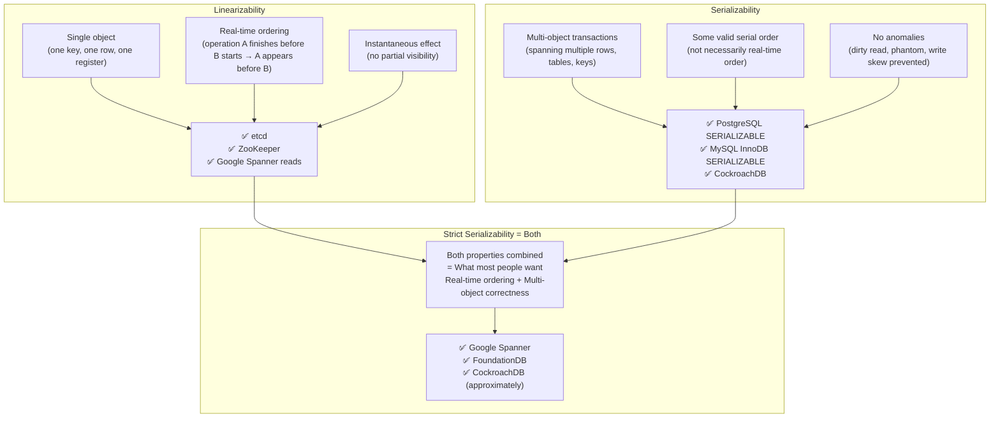

# Linearizability vs Serializability

## Why This Topic Exists

These two terms end in "-ability." Both sound like they mean "things happen in a consistent order." In interviews, candidates use them interchangeably. Database papers use them inconsistently. Even experienced engineers often cannot explain the difference clearly.

But they describe completely different properties of completely different systems. Mixing them up leads to wrong architecture decisions — like claiming "PostgreSQL is linearizable" or "etcd is serializable" — both of which are false.

This file draws a clean, sharp line between the two. After reading it, you will be able to state the definition of each, explain what they apply to, describe a system that has one but not the other, and correct someone who uses them interchangeably.

---

## Learning Objectives

By the end of this file you will be able to:

- Give the precise definition of linearizability
- Give the precise definition of serializability
- Explain what "single object" vs. "multi-object" means in this context
- Give an example of a system that is linearizable but not serializable
- Give an example of a system that is serializable but not linearizable
- Explain what "strict serializability" means and why it is what most people want
- Avoid the most common interview trap on this topic

---

## Prerequisites

- [01. Consistency Models](./01.%20Consistency%20Models%20(INTERMEDIATE).md) — linearizability is one of those models
- [06. Isolation Levels and Anomalies](./06.%20Isolation%20Levels%20and%20Anomalies%20(INTERMEDIATE).md) — serializability is the SERIALIZABLE isolation level

---

## Introduction

Here is the one-sentence version of the difference:

> **Linearizability** is about *individual operations on a single object* appearing instantaneous and ordered by real time. **Serializability** is about *transactions spanning multiple objects* appearing to execute one at a time (in some valid serial order).

Neither one implies the other. You need both to get what most people intuitively want: "the database does the right thing." That combination is called **strict serializability** (or sometimes "external consistency").

Let us unpack this carefully.

---

## Real-World Analogy

**Linearizability:** Imagine a single shared whiteboard in a room. When anyone writes something, everyone in the room sees it immediately — there is no delay, no one sees a partial write, and the order of writes on the whiteboard matches the real-world clock order in which they were made. That is linearizability: a single object (the whiteboard), instantaneous effect, real-time ordering.

**Serializability:** Imagine a multi-step bank transaction: debit account A, credit account B, log the transaction. These three steps touch three different objects. Serializability says these three steps, along with all other concurrent bank transactions, appear to have happened in some valid sequential order — as if all transactions ran one after another. The specific serial order might not match wall-clock time, but it is consistent.

---

## Core Concepts

### Linearizability: The Precise Definition

Linearizability is a property of a **single object and its operations** (reads and writes).

A system is linearizable if: for every operation, you can assign it a single "linearization point" — a moment in real time when the operation appears to take effect instantaneously. All reads and writes are consistent with those linearization points being in real-time order.

Concretely:
- If operation A **completes** before operation B **starts** (in wall-clock time), then A must appear before B in the linearized order
- Every read must return the value written by the most recent write that linearized before it

**What it applies to:** Single objects. One register, one key in a key-value store, one row in a database.

**What it guarantees:** Real-time ordering. If you finish writing and then someone reads, they see your write. This is the "recency" guarantee.

**Example:** etcd stores a single value for the Kubernetes cluster leader. etcd is linearizable — any read to etcd returns the current leader, and once a write (leader change) completes, all subsequent reads see the new leader. The linearization point of the write is when etcd confirms it.

---

### Serializability: The Precise Definition

Serializability is a property of **transactions** (groups of operations, potentially spanning multiple objects).

A database is serializable if: the result of executing a set of concurrent transactions is the same as if those transactions had been executed in *some* sequential (serial) order.

Note the word "some." Serializability does not specify which serial order — only that some valid serial order exists that produces the same result. The order does not have to match wall-clock time.

**What it applies to:** Multi-object transactions. A transaction that reads from Table A and writes to Table B.

**What it guarantees:** Correctness across multiple objects. No anomalies (dirty reads, phantom reads, write skew). But it does not say anything about real time.

**Example:** A banking application where one transaction transfers $100 from Account A to Account B, and another transaction calculates the total balance across all accounts. Serializability ensures these two transactions appear to run in some sequential order — so the total balance is always correct (either before or after the transfer, never "in between").

---

## Visual Diagram



---

## Deep Explanation

### A System Can Have One Without the Other

This is the key insight that confuses most people.

#### Linearizable but NOT Serializable

**etcd** (and ZooKeeper) are linearizable key-value stores. Every read returns the most recently written value (real-time ordered, single object). But etcd does not support multi-key transactions. You cannot atomically read key A and write key B based on the result. etcd has no serializability — it has no transaction concept that spans multiple objects.

**Cassandra with QUORUM consistency** is also linearizable for single-key reads/writes (under the right quorum configuration). But Cassandra's "lightweight transactions" (compare-and-set) apply to single keys. Multi-key atomicity requires Cassandra's batch statements, which are NOT serializable — they are applied atomically at the partition level but can produce anomalies across partitions.

#### Serializable but NOT Linearizable

**PostgreSQL at SERIALIZABLE isolation level** prevents all transaction anomalies (dirty reads, phantom reads, write skew) for multi-row transactions. But it is NOT linearizable.

Why? Consider this sequence:

1. Transaction T1 writes row X = 100 and commits at wall-clock T
2. Transaction T2 starts after T (in wall-clock time) and reads row X

With PostgreSQL SERIALIZABLE, T2 might still read X = 0 (the value before T1's write). Why? Because T2 might be running with a snapshot taken before T1 committed. The serialized order of T1 and T2 is consistent — T1 appears to run before T2 — but T2 does NOT see T1's write even though T2 started after T1 committed in real time.

This violates linearizability's real-time ordering requirement.

In other words: PostgreSQL SERIALIZABLE ensures transactions appear to run in *some* consistent serial order. But it does not ensure that order matches the real-world wall-clock order.

---

### Strict Serializability: Getting Both

**Strict serializability** = linearizability + serializability.

It means:
1. Transactions appear to execute one at a time (serializable)
2. The order matches real-world time (linearizable)

This is what most engineers think they have when they say "our database is strongly consistent." In reality, getting strict serializability requires significant engineering effort.

**Google Spanner** achieves strict serializability using TrueTime — GPS receivers and atomic clocks in every datacenter that bound clock uncertainty to ±7ms. Spanner assigns each transaction a commit timestamp and waits until TrueTime guarantees that timestamp is in the past before committing. This ensures the linearization order matches the real-world order.

**FoundationDB** also achieves strict serializability. Every transaction sees a consistent snapshot and commits are serialized in real time.

---

### Why the Distinction Matters in Practice

**Scenario 1:** You are building a distributed lock using etcd.

etcd is linearizable. You use a compare-and-swap operation: "Set lock_holder = 'Alice' only if current value is null." This is a single-key operation. Linearizability guarantees that this CAS is atomic and real-time ordered. If Alice and Bob both try to acquire the lock, exactly one of them succeeds. The lock works correctly.

Here you need linearizability, not serializability. etcd is the right tool.

**Scenario 2:** You are building a banking application.

You need: "Transfer $100 from Account A to Account B atomically." This touches two rows. You need serializability — the debit and credit must be atomic, and no concurrent transaction should see a state where A is debited but B is not yet credited.

PostgreSQL at SERIALIZABLE is the right tool. You do NOT need linearizability here — a slight reordering of when transactions appear to run is fine, as long as they are correct.

**Scenario 3:** You need distributed transactions across microservices with strict ordering.

This is the hardest case. You need strict serializability: both real-time ordering and multi-object atomicity. Google Spanner is designed for this. CockroachDB approximates it using Hybrid Logical Clocks.

---

### The Interview Trap

Interviewers at senior/staff level often ask:

"Is PostgreSQL linearizable?"

The trap answer: "Yes, it's serializable, and serializable is the strongest isolation level, so yes."

The correct answer: "No. PostgreSQL at SERIALIZABLE isolation is serializable — it prevents transaction anomalies for multi-object transactions. But it is NOT linearizable. A transaction that starts after another transaction commits might not see that commit, because PostgreSQL uses snapshot isolation. Linearizability requires that a read starting after a write completes must see that write. PostgreSQL does not guarantee this for transactions."

Another trap: "Is etcd serializable?"

Correct answer: "No. etcd is linearizable — individual reads and writes are globally ordered by real time. But etcd does not support multi-key ACID transactions. Serializability is a property of transactions, and etcd does not have that concept across multiple keys."

---

## Step-by-Step Example

**Showing PostgreSQL is NOT linearizable:**

```
Wall clock time →

T=0:  Transaction 1 starts
T=1:  Transaction 2 starts (snapshot taken: sees DB at T=0 state)
T=2:  Transaction 1 writes: key = "new_value" and COMMITS
T=3:  Transaction 2 reads key

Even though Transaction 2 reads at T=3 (after Transaction 1 committed at T=2),
Transaction 2 sees key = "old_value" because its snapshot was taken at T=1.

This violates linearizability: a read at T=3 must see the write that completed at T=2.
PostgreSQL SERIALIZABLE uses snapshot isolation, which violates linearizability's real-time constraint.
```

**Showing etcd IS linearizable:**

```
T=0: Write: key = "old_value" completes
T=1: Read: key → must return "new_value" (cannot return "old_value")

etcd uses Raft consensus. The read goes to the Raft leader (or uses a linearizable
read that confirms the leader has the latest entries). The read at T=1 is guaranteed
to see any write that completed before T=1.
```

---

## Advantages / Disadvantages / Trade-offs

| Property | What it guarantees | What it does not guarantee | Example systems |
|----------|-------------------|---------------------------|----------------|
| **Linearizability** | Real-time ordering of single-object operations | Multi-object atomicity | etcd, ZooKeeper, Cassandra LWT |
| **Serializability** | Multi-object transaction correctness | Real-time ordering | PostgreSQL SERIALIZABLE, MySQL SERIALIZABLE |
| **Strict Serializability** | Both | Nothing — it's the strongest | Google Spanner, FoundationDB |
| **Neither** | Nothing | Everything | Most NoSQL defaults |

---

## When to Use / When NOT to Use

**Need linearizability (not necessarily serializability):**
- Distributed locks (single key, real-time ordering required)
- Leader election (single "who is leader" key)
- Counters that must be atomic per-key (CAS operations)
- Use etcd, ZooKeeper

**Need serializability (not necessarily linearizability):**
- Financial transactions (debit A, credit B atomically)
- Inventory management (check stock, reserve it)
- Any business logic that touches multiple rows/tables in one operation
- Use PostgreSQL SERIALIZABLE, MySQL SERIALIZABLE, CockroachDB

**Need strict serializability:**
- Globally distributed ACID transactions
- Real-time ordering across datacenters
- Use Google Spanner, FoundationDB, CockroachDB (approximate)

---

## Common Interview Questions

**Q: What is the difference between linearizability and serializability?**
A: Linearizability applies to single-object operations and requires real-time ordering — a read after a write completes must see that write. Serializability applies to multi-object transactions and requires that concurrent transactions produce the same result as some valid sequential execution. Linearizability is about recency; serializability is about atomicity across objects.

**Q: Can a system be serializable but not linearizable?**
A: Yes. PostgreSQL at SERIALIZABLE is serializable but not linearizable. A transaction using snapshot isolation might not see a write that committed before the transaction's read, because the snapshot was taken earlier. This violates linearizability's real-time constraint.

**Q: What is strict serializability?**
A: Both linearizability and serializability combined. Transactions span multiple objects (serializable) and their order matches real-world time (linearizable). Google Spanner achieves this using TrueTime.

**Q: Is etcd serializable?**
A: No. etcd is linearizable — single-key reads and writes are real-time ordered. But etcd does not support multi-key ACID transactions, so serializability does not apply.

---

## Common Beginner Mistakes

**Mistake 1: Using "linearizable" and "serializable" interchangeably.**
They are different. Linearizability is about single objects and real-time ordering. Serializability is about transactions and consistent serial ordering. Using them interchangeably leads to incorrect statements about what a system guarantees.

**Mistake 2: Thinking SERIALIZABLE isolation means linearizable.**
It does not. SERIALIZABLE isolation prevents transaction anomalies. It does not guarantee that a transaction starting after another commits will see that commit. Snapshot isolation (which underlies PostgreSQL SERIALIZABLE) can return stale reads.

**Mistake 3: Claiming distributed databases with "strong consistency" are always linearizable.**
"Strong consistency" is a marketing term. Always ask: does the system provide real-time ordering guarantees? Or does it provide transaction atomicity? Or both?

**Mistake 4: Thinking you always need strict serializability.**
Strict serializability is expensive — it requires coordination across all replicas for every operation. Most systems only need one property or the other. A distributed lock needs linearizability. A banking app needs serializability. Using strict serializability everywhere is overengineering.

---

## Summary

Linearizability and serializability are two distinct correctness properties that are frequently confused.

Linearizability applies to individual operations on a single object. It requires that operations appear instantaneous and that their order matches real-world wall-clock time. Systems like etcd and ZooKeeper are linearizable.

Serializability applies to transactions spanning multiple objects. It requires that concurrent transactions produce the same result as if they ran in some sequential order. It does not require that order to match real-world time. PostgreSQL at SERIALIZABLE isolation level is serializable but not linearizable.

Strict serializability combines both: multi-object transactions that also respect real-world time order. Google Spanner achieves this using GPS and atomic clocks. It is the strongest and most expensive property.

In interviews, this distinction is a senior-level filter. Candidates who know the difference demonstrate that they understand distributed systems at a deep level.

---

## Key Takeaways

- Linearizability = single object, real-time ordering, instantaneous effect
- Serializability = multi-object transactions, some valid serial order (not necessarily real-time)
- Neither implies the other — a system can have one without the other
- etcd: linearizable, not serializable
- PostgreSQL SERIALIZABLE: serializable, not linearizable
- Strict serializability = both = what Google Spanner provides
- "Strong consistency" is a vague marketing term — always clarify which property you mean
- This distinction is a common senior-level interview test

---

## Related Topics

- [01. Consistency Models](./01.%20Consistency%20Models%20(INTERMEDIATE).md)
- [05. Paxos Algorithm](./05.%20Paxos%20Algorithm%20(ADV).md)
- [06. Isolation Levels and Anomalies](./06.%20Isolation%20Levels%20and%20Anomalies%20(INTERMEDIATE).md)
- [Chapter 11: Distributed Transactions](../11.%20Distributed%20Transactions/README.md)
- [Chapter 9: CAP Theorem and PACELC](../09.%20CAP%20Theorem%20and%20PACELC/README.md)
