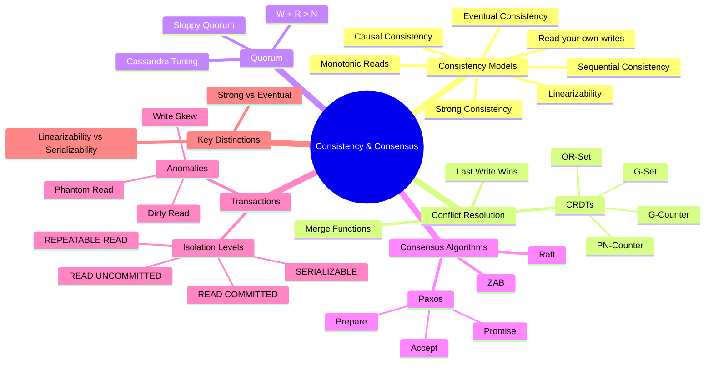

# Chapter 10: Consistency and Consensus

## Why This Chapter Exists

Distributed systems are built from multiple machines. Those machines can fail, go out of sync, or disagree with each other. The hardest part of building distributed systems is not making them fast — it is making them *correct*.

When two users update the same bank account at the same time, which update wins? When a database crashes mid-write, does the data survive? When two datacenters see different versions of your profile photo, which one is "right"?

These are questions of **consistency** and **consensus**. This chapter gives you the vocabulary, the algorithms, and the trade-offs you need to answer them — at the whiteboard, in interviews, and in production.

---

## What You Will Learn

This chapter takes you from "I know what a database is" to "I can reason about distributed correctness at a senior/staff level." You will learn:

- The **spectrum of consistency models** — from the weakest (eventual) to the strongest (linearizable)
- Why **eventual consistency** is used at scale and how conflicts are resolved
- How **quorum reads and writes** give you tunable consistency
- What **CRDTs** are and why they are the mathematician's solution to conflicts
- How the **Paxos algorithm** gets distributed nodes to agree on one value
- What transaction **isolation levels** protect you from
- The subtle but critical difference between **linearizability and serializability**

---

## Prerequisites

Before reading this chapter, you should be comfortable with:

- Basic database concepts (reads, writes, transactions)
- What replication is (Chapter 7: Replication)
- The CAP theorem (Chapter 9: CAP Theorem and PACELC)
- What a network partition is

---

## How This Chapter Is Organized

| File | Title | Level | Description |
|------|-------|-------|-------------|
| [01. Consistency Models](./01.%20Consistency%20Models%20(INTERMEDIATE).md) | Consistency Models | Intermediate | The full consistency spectrum from strong to eventual |
| [02. Eventual Consistency Deep Dive](./02.%20Eventual%20Consistency%20Deep%20Dive%20(INTERMEDIATE).md) | Eventual Consistency Deep Dive | Intermediate | How eventual consistency works in practice and how conflicts are resolved |
| [03. Quorum Consensus](./03.%20Quorum%20Consensus%20(INTERMEDIATE).md) | Quorum Consensus | Intermediate | W + R > N and how to tune consistency vs. availability |
| [04. CRDTs](./04.%20CRDTs%20-%20Conflict-free%20Replicated%20Data%20Types%20(ADV).md) | CRDTs — Conflict-free Replicated Data Types | Advanced | Data structures that merge without conflicts |
| [05. Paxos Algorithm](./05.%20Paxos%20Algorithm%20(ADV).md) | Paxos Algorithm | Advanced | The foundational distributed consensus algorithm |
| [06. Isolation Levels and Anomalies](./06.%20Isolation%20Levels%20and%20Anomalies%20(INTERMEDIATE).md) | Isolation Levels and Anomalies | Intermediate | Concurrent transaction problems and SQL isolation levels |
| [07. Linearizability vs Serializability](./07.%20Linearizability%20vs%20Serializability%20(ADV).md) | Linearizability vs Serializability | Advanced | Two concepts that look similar but are fundamentally different |

---

## The Big Picture

Before diving in, here is the landscape of the entire chapter in one diagram:

---

## Why This Is Hard

Most software engineers learn about databases in single-server contexts. In a single server:

- There is one clock
- There is one memory space
- Operations happen one at a time (or appear to)

In a distributed system, all three of those assumptions break:

- **No single clock** — servers drift and there is no globally agreed "now"
- **No shared memory** — nodes communicate only by sending messages
- **No single order** — events on different nodes happen independently and concurrently

This is why consistency is hard. You cannot just "be consistent" — you have to choose *how* consistent you want to be, because every stronger consistency guarantee costs you something (availability, latency, throughput).

---

## Recommended Reading Order

For a beginner starting this chapter for the first time:

1. Start with **01. Consistency Models** to learn the vocabulary
2. Read **02. Eventual Consistency Deep Dive** to understand what most large-scale systems actually use
3. Read **03. Quorum Consensus** to understand how systems tune consistency
4. Read **06. Isolation Levels and Anomalies** if you come from a SQL background — this bridges the gap
5. Then tackle the advanced topics: **04. CRDTs**, **05. Paxos**, **07. Linearizability vs Serializability**

---

## Key Vocabulary

| Term | One-sentence definition |
|------|------------------------|
| Consistency | All nodes agree on the same data at the same time |
| Consensus | A group of nodes agrees on a single value despite failures |
| Replica | A copy of data on a different node |
| Quorum | A majority (or configured subset) of replicas |
| CRDT | A data structure that merges without conflicts |
| Linearizability | Operations appear instantaneous and globally ordered |
| Serializability | Transactions appear to execute one at a time |
| Isolation | Transactions do not interfere with each other |

---

## Related Chapters

- [Chapter 7: Replication](../07.%20Replication/README.md) — How data is copied across nodes
- [Chapter 8: Sharding and Partitioning](../08.%20Sharding%20and%20Partitioning/README.md) — How data is split across nodes
- [Chapter 9: CAP Theorem and PACELC](../09.%20CAP%20Theorem%20and%20PACELC/README.md) — The fundamental consistency vs. availability trade-off
- [Chapter 11: Distributed Transactions](../11.%20Distributed%20Transactions/README.md) — Two-phase commit and saga patterns
