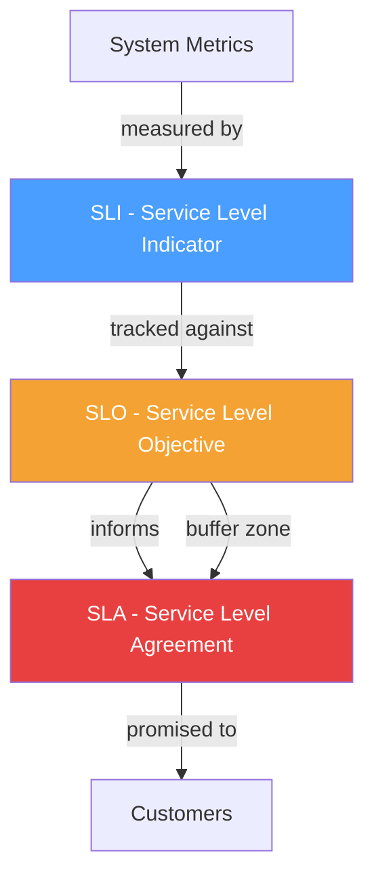
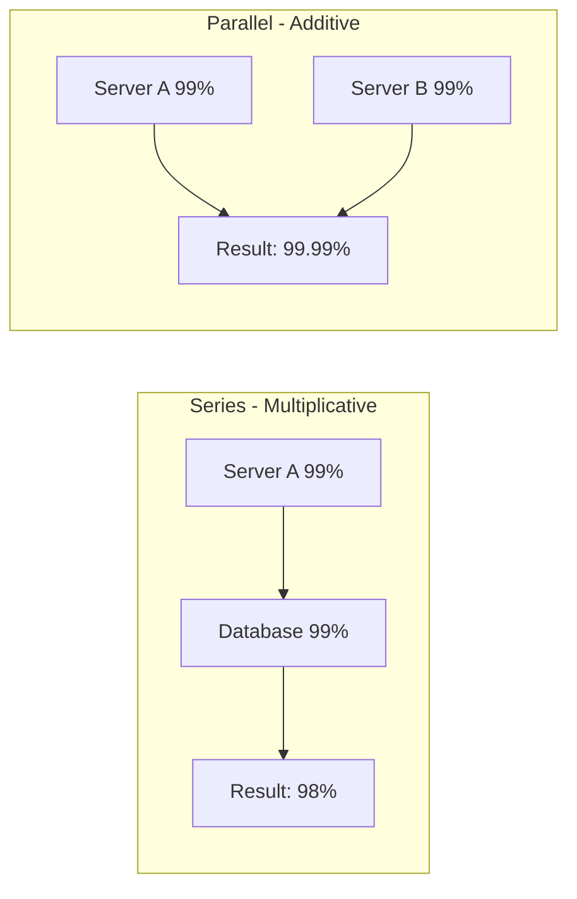

# Availability and SLAs

## Why This Topic Exists

When a company offers a software service, customers need to know one thing: "Can I count on this being there when I need it?"

The answer to that question is called **availability**. It is a number — a percentage — that tells you how often the system is working versus broken.

But availability is also a promise. When you sign a contract with AWS, Google Cloud, or Stripe, they promise you a certain level of availability. That promise is called a **Service Level Agreement (SLA)**. If they break it, you get money back.

Understanding availability is not just an academic exercise. It directly affects architecture decisions. A system promising 99.999% availability needs to be built completely differently from one promising 99%. Learning to reason about availability teaches you to think like a senior engineer — one who asks "what happens when this breaks?" before a single line of code is written.

---

## Learning Objectives

- Calculate availability percentages and convert them to actual downtime hours per year
- Explain what "five nines" means and why it is extremely difficult to achieve
- Distinguish between SLA, SLO, and SLI
- Calculate combined availability for components in series and parallel
- Understand why redundancy dramatically improves availability

---

## Prerequisites

- Basic understanding of what a server and a web service are
- Familiarity with percentages

---

## Introduction

"Our system has 99% availability" sounds impressive at first. Ninety-nine percent! That is almost perfect.

But let's do the math. There are 8,760 hours in a year. One percent of 8,760 is 87.6 hours. That means a system with 99% availability can be down for **87 hours and 36 minutes every year**. That is more than three and a half days.

Suddenly 99% does not sound so great.

This is why engineers talk about availability in "nines." Adding another nine — going from 99% to 99.9% — cuts downtime by a factor of ten. Going to 99.99% cuts it by another factor of ten. Each additional nine is significantly harder and more expensive to achieve.

---

## Real-World Analogy

Think about electricity in your home.

Basic residential electricity might have a few outages per year — a storm, a blown transformer, maintenance work. That is roughly equivalent to 99.9% availability (about 8-9 hours of downtime per year).

A hospital cannot accept that. A hospital uses backup generators, redundant power feeds from multiple substations, and uninterruptible power supplies on critical equipment. Hospital-grade power is closer to 99.999% — five nines — because a power failure during surgery is catastrophic.

The hospital does not get five-nines power for free. It costs enormously more in equipment, maintenance, and redundant infrastructure. That is the fundamental trade-off: higher availability requires more money, more complexity, and more engineering effort.

---

## Core Concepts

### The Nines of Availability

| Availability | Name | Downtime per Year | Downtime per Month | Downtime per Week |
|---|---|---|---|---|
| 99% | Two nines | 87.6 hours | 7.3 hours | 1.68 hours |
| 99.9% | Three nines | 8.76 hours | 43.8 minutes | 10.1 minutes |
| 99.99% | Four nines | 52.6 minutes | 4.38 minutes | 1.01 minutes |
| 99.999% | Five nines | 5.26 minutes | 26.3 seconds | 6.05 seconds |
| 99.9999% | Six nines | 31.5 seconds | 2.63 seconds | 0.6 seconds |

**Five nines (99.999%)** is the gold standard for critical infrastructure like banking systems, emergency services, and telecoms. It allows less than 6 seconds of downtime per week.

Achieving five nines requires:
- No single point of failure anywhere in the system
- Automated failover that completes in milliseconds
- Zero-downtime deployments
- Extremely rigorous change management
- 24/7 on-call engineering teams

Most consumer web applications target **three nines (99.9%)** — under 9 hours of downtime per year. This is achievable at reasonable cost and complexity.

---

### SLA, SLO, and SLI

These three terms are often confused. They represent three different levels of the same reliability conversation.

**SLI — Service Level Indicator**

An SLI is a measurement. It is a specific metric you track to understand how your system is performing.

Examples of SLIs:
- Request success rate (percentage of HTTP requests returning 2xx)
- Latency (percentage of requests completing in under 200ms)
- Error rate (percentage of requests returning 5xx errors)
- Availability (percentage of time the health check endpoint returns 200)

SLIs are the raw data. They answer the question: "What is actually happening right now?"

**SLO — Service Level Objective**

An SLO is an internal target. It is the number your engineering team commits to hitting.

Examples of SLOs:
- "99.9% of requests will succeed per month"
- "95% of requests will complete in under 300ms"
- "Error rate will stay below 0.1%"

SLOs are internal. They are not contractual promises to customers — they are engineering goals. Your SLO should be slightly stricter than your SLA, so you have a buffer before violating your customer contract.

**SLA — Service Level Agreement**

An SLA is an external contract. It is a legal commitment to a customer, with consequences (usually financial credits) if you fail to meet it.

Examples of SLAs:
- AWS EC2 promises 99.99% availability per month; if they miss it, you get service credits
- Google Cloud promises 99.9% uptime for Cloud SQL
- Stripe promises 99.99% uptime for its payment API

The relationship between the three:

```
SLI (measurement) → feeds into → SLO (internal target) → drives → SLA (customer promise)
```

Your SLA should always be weaker than your SLO. You promise customers 99.9%, but internally you aim for 99.95%. This gives you room to handle incidents without immediately violating customer contracts.

---

## Visual Diagram (Mermaid)





---

## Deep Explanation

### Series vs Parallel Availability

One of the most important — and most counterintuitive — concepts in availability is how availability compounds across multiple components.

**Components in Series**

When a request must pass through multiple components in sequence (Component A AND Component B AND Component C), the availabilities multiply together.

Formula: `Combined Availability = A1 × A2 × A3 × ...`

Example: A web application with three components, each at 99% availability:
- Web server: 99% (0.99)
- Application server: 99% (0.99)
- Database: 99% (0.99)
- Combined: 0.99 × 0.99 × 0.99 = **0.970 = 97%**

This is bad news. Three components that each seem reliable combine to only 97% availability — nearly 263 hours of downtime per year. This is why adding more components to a critical path reduces overall reliability.

**Components in Parallel (Redundancy)**

When multiple components can handle a request (Component A OR Component B), failure requires ALL of them to fail simultaneously. The formula is:

`Combined Availability = 1 - ((1 - A1) × (1 - A2) × ...)`

Example: Two servers, each at 99% availability:
- Probability that Server A fails: 1%
- Probability that Server B fails: 1%
- Probability that BOTH fail simultaneously: 0.01 × 0.01 = 0.0001 = 0.01%
- Combined availability: 1 - 0.0001 = **99.99%**

Two 99% servers in parallel give you 99.99% availability — jumping from two nines to four nines just by adding redundancy. This is the fundamental argument for replication and redundancy in distributed systems.

**Practical Implication**

This math reveals the core strategy for building highly available systems:
1. Keep the critical path (series chain) as short as possible
2. Add redundancy (parallel components) for every element in that path

A system with 10 components each at 99.9% availability, all in series, has 99% combined availability. That same system with each component duplicated in parallel approaches 99.9999%.

---

## Step-by-Step Example

Let us calculate the availability of a simple e-commerce checkout flow.

**Step 1: Identify all components in the critical path**

For a checkout request to succeed, all of these must work:
- Load balancer (99.99%)
- Web server (99.9%)
- Payment service (99.9%)
- Inventory service (99.9%)
- Database (99.95%)
- External payment gateway (99.9%)

**Step 2: Calculate series availability**

0.9999 × 0.999 × 0.999 × 0.999 × 0.9995 × 0.999 = **0.9954 = 99.54%**

That is about 39 hours of downtime per year for the checkout flow.

**Step 3: Identify where to add redundancy**

The weakest links are the components with lowest individual availability. Adding a second web server and a database replica:

- Load balancer: 99.99% → no change (it is already the highest)
- Web servers (2 × 99.9% in parallel): 1 - (0.001 × 0.001) = **99.9999%**
- Database (2 × 99.95% in parallel): 1 - (0.0005 × 0.0005) = **99.999975%**

**Step 4: Recalculate**

0.9999 × 0.999999 × 0.999 × 0.999 × 0.99999975 × 0.999 ≈ **99.74%**

Still not great. The external payment gateway is now the single biggest weak point at 99.9% — you cannot control that because it is a third party. This is a real-world limitation: your availability is capped by the least available dependency you cannot control.

---

## Advantages / Disadvantages / Trade-offs

| Aspect | Lower Availability Target | Higher Availability Target |
|---|---|---|
| Cost | Lower — fewer redundant components | Higher — more servers, more complexity |
| Complexity | Simpler architecture | More moving parts, harder to operate |
| Deployment | Can deploy with downtime | Requires zero-downtime deployments |
| Recovery | Manual recovery is acceptable | Requires automated failover |
| Team | Smaller on-call rotation | 24/7 dedicated on-call |
| Appropriate for | Internal tools, dev environments | Payment systems, healthcare, telecoms |

---

## When to Use / When NOT to Use

**Design for high availability (99.99%+) when:**
- Users lose money if the service is down (payment processing, trading platforms)
- Safety depends on the system (medical devices, emergency dispatch)
- Downtime causes regulatory penalties
- The business cannot function without the system (core checkout for an e-commerce company)

**Three nines (99.9%) is often sufficient when:**
- The service is a nice-to-have feature, not business-critical
- Users can wait a few minutes without significant impact
- The cost of five-nines infrastructure exceeds the cost of occasional downtime

**Do NOT over-engineer availability when:**
- You are building an MVP or internal tool
- The cost of higher availability exceeds the business value
- The system depends on external APIs that cap your achievable availability anyway

---

## Common Interview Questions

**Q: What does "five nines" mean, and is it achievable?**

A: Five nines means 99.999% availability, which allows less than 5.26 minutes of downtime per year. It is achievable but extremely expensive, requiring complete redundancy at every layer, automated failover in milliseconds, and zero-downtime deployments. It is appropriate for telecoms, banking core systems, and emergency services.

**Q: What is the difference between SLA, SLO, and SLI?**

A: SLI is a measurement (e.g., request success rate). SLO is an internal target (e.g., 99.95% success rate). SLA is an external contractual promise with consequences for failure (e.g., 99.9% uptime promised to customers). The SLO should always be stricter than the SLA to provide a buffer.

**Q: Two servers each at 99% availability — what is combined availability if they are in parallel?**

A: Combined availability = 1 - (0.01 × 0.01) = 1 - 0.0001 = 99.99%. Both servers would need to fail simultaneously for the system to go down, and the probability of that is 0.01%.

**Q: Why does adding more components to a request path reduce availability?**

A: Because each component in series adds another chance of failure. If every component in a five-step pipeline has 99.9% availability, the combined availability is 0.999^5 ≈ 99.5%. Every step in the critical path multiplies the risk.

---

## Common Beginner Mistakes

**Mistake 1: Thinking 99% is good enough**
99% availability means 87 hours of downtime per year — more than 3.5 days. For a business-critical system, that is unacceptable.

**Mistake 2: Not understanding how availabilities compound in series**
Engineers often assume three 99.9% components give 99.9% overall. They give 99.7%. This is a meaningful difference and affects architecture decisions.

**Mistake 3: Confusing SLA with SLO**
The SLA is what you promise customers. The SLO is your internal, stricter target. You must hit your SLO consistently to avoid violating your SLA.

**Mistake 4: Setting an availability target without understanding cost**
Every additional nine of availability roughly multiplies infrastructure and operational cost by 10x. Picking a target without understanding the cost is a common mistake in early system design.

**Mistake 5: Ignoring external dependency availability**
Your system's availability cannot exceed the availability of its least reliable uncontrolled dependency. If you use a payment gateway at 99.9%, your checkout availability is capped at 99.9% regardless of how reliable everything else is.

---

## Summary

Availability is the percentage of time a system is working. It is measured in "nines" — each additional nine reduces allowable downtime by 10x. Five nines (99.999%) allows less than 6 seconds of downtime per week and requires significant engineering investment.

SLIs are measurements, SLOs are internal targets, and SLAs are external contracts. Always keep your SLO stricter than your SLA.

Components in series multiply their availabilities (reducing overall availability). Components in parallel dramatically improve availability — two 99% servers in parallel give 99.99%.

The architecture principle: minimize the critical path (series chain) and add redundancy (parallel components) at every critical step.

---

## Key Takeaways

- 99% availability = 87 hours of downtime per year. It is not as good as it sounds.
- Five nines (99.999%) = less than 6 seconds of downtime per week. Very hard to achieve.
- SLI measures, SLO targets, SLA promises. SLO must be stricter than SLA.
- Series availability: multiply. Parallel availability: `1 - (product of failure probabilities)`.
- Two 99% servers in parallel = 99.99% availability. Redundancy is powerful.
- Your availability is capped by your least reliable uncontrolled dependency.

---

## Related Topics (Relative Markdown Links)

- [Chapter Overview](./README.md)
- [Fault Tolerance Patterns](./02.%20Fault%20Tolerance%20Patterns%20(INTERMEDIATE).md) — How to handle failures when they happen
- [Disaster Recovery](./03.%20Disaster%20Recovery%20(INTERMEDIATE).md) — RTO and RPO define your recovery commitments
- [Rate Limiting](./06.%20Rate%20Limiting%20(INTERMEDIATE).md) — Rate limiting protects your availability from abuse
