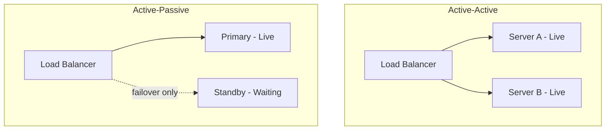
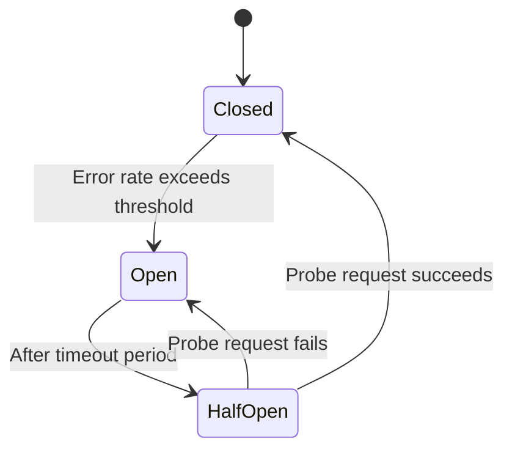
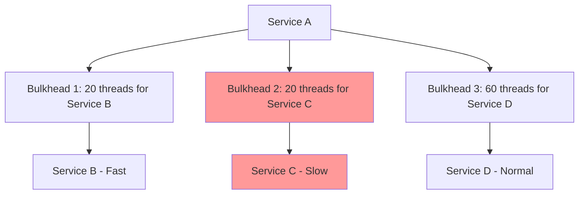
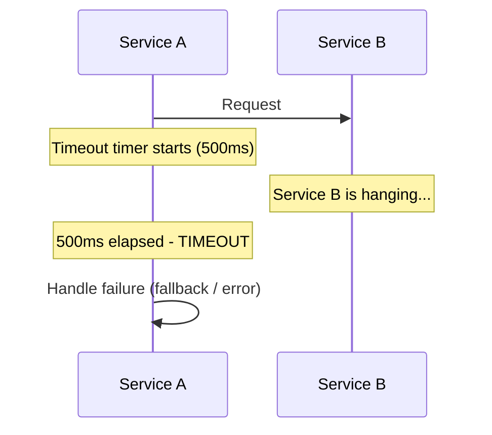
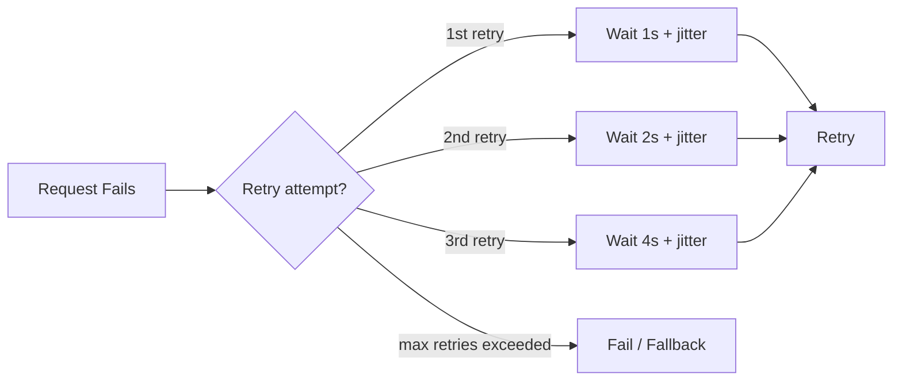
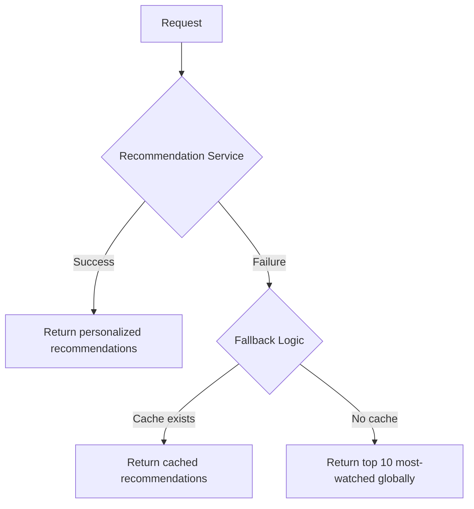

# Fault Tolerance Patterns

## Why This Topic Exists

In a distributed system, failure is not an edge case — it is the normal operating condition.

Your payment service will sometimes be slow. Your database will occasionally time out. A third-party API you depend on will have outages. A network partition will silently drop packets between two services that need to talk to each other.

Without deliberate fault tolerance design, these small failures cascade. One slow service makes everything that calls it slow. Threads pile up waiting for responses. The thread pool exhausts. The entire application becomes unresponsive. What started as a hiccup in one service has brought down your entire platform.

Fault tolerance patterns are battle-tested strategies for containing failures so they do not spread. Netflix, Amazon, and Google have built their reliability on these patterns. Learning them is essential for designing any system that must survive in the real world.

---

## Learning Objectives

- Explain the difference between active-active and active-passive redundancy
- Describe how a circuit breaker prevents cascade failures
- Apply the bulkhead pattern to isolate failures between services
- Configure appropriate timeouts to prevent resource exhaustion
- Implement retry logic with exponential backoff and jitter
- Design fallback responses that degrade gracefully

---

## Prerequisites

- [Availability and SLAs](./01.%20Availability%20and%20SLAs%20(BEGINNER).md) — Understanding why failures matter
- Basic knowledge of microservices and HTTP requests

---

## Introduction

When Netflix launched its streaming service, a single server failure could take down the recommendation system, which would block the home page from loading, which would make the entire app unresponsive. One failure cascaded into a complete outage.

Netflix's engineering team studied these failures and built a library called **Hystrix** — a collection of fault tolerance patterns that prevented individual service failures from becoming platform-wide outages. By 2018, Hystrix was protecting every service call at Netflix.

The patterns Hystrix implemented are universal. They work regardless of your language, framework, or cloud provider. This file explains each pattern, why it exists, and how to apply it.

---

## Real-World Analogy

Think about how a modern office building handles electrical failures.

- **Circuit breakers** in the breaker box cut power to a circuit that is drawing too much current, preventing a fire. The rest of the building keeps working.
- **Bulkheads** separate sections of the building into fire zones. A fire in one zone does not automatically spread to others.
- **Generators** are the fallback — when grid power fails, the generator provides degraded but functional power.
- **Redundant power feeds** come from two different substations (redundancy).

A distributed system needs the same layered approach. No single failure should propagate unchecked through the system.

---

## Core Concepts

### 1. Redundancy

Redundancy means having duplicate components so that if one fails, another takes over.

**Active-Active Redundancy**

All instances are running and serving traffic simultaneously. Load is distributed across all of them. If one fails, the remaining instances absorb its traffic.

- Pros: Full capacity even during failure, no failover delay
- Cons: All instances must be kept in sync, more complex

**Active-Passive Redundancy**

One instance is active (serving traffic). One or more instances are passive (on standby). If the active fails, a passive takes over.

- Pros: Simpler to operate, passive instance does not need to handle live traffic
- Cons: Failover takes time (seconds to minutes), passive capacity is "wasted" during normal operation



---

### 2. Failover

Failover is the automatic process of switching from a failed component to a healthy backup.

Failover can be triggered by:
- Health check failures (the load balancer stops seeing successful pings)
- Timeout (no response within N seconds)
- Error rate threshold (more than 5% of requests are failing)

Failover time is critical. It is part of your Recovery Time Objective (RTO). A failover that takes 30 seconds means 30 seconds of downtime every time a server dies.

---

### 3. Circuit Breaker

The circuit breaker pattern is the most important fault tolerance pattern for microservices.

**The Problem:** Service A calls Service B. Service B starts responding slowly — taking 10 seconds per request instead of 100ms. Service A's threads pile up waiting. Soon Service A has 1000 threads all stuck waiting on Service B. Service A itself becomes unresponsive. Every service that calls Service A also fails. One slow service has cascaded into a complete outage.

**The Solution:** A circuit breaker sits between Service A and Service B. It monitors the health of calls to Service B. When it detects that Service B is failing (high error rate or high latency), it "trips" — it stops forwarding requests to Service B immediately. Instead of waiting 10 seconds for a timeout, Service A gets an immediate failure response. Service A can handle this gracefully (show cached data, show an error message) instead of hanging.

**Three States of a Circuit Breaker:**



- **Closed (normal):** Requests pass through. Failures are counted.
- **Open (tripped):** Requests are immediately rejected. No calls made to the failing service.
- **Half-Open (testing recovery):** A single test request is allowed through. If it succeeds, the circuit closes. If it fails, the circuit opens again.

**Netflix Hystrix** implemented circuit breakers for every service-to-service call. When a downstream service degraded, Hystrix would trip the circuit within seconds, preventing the cascade, and automatically test for recovery.

---

### 4. Bulkhead

The bulkhead pattern isolates failures to prevent them from consuming shared resources.

**The Problem:** Service A has a shared thread pool of 100 threads. It calls both Service B (fast, critical) and Service C (slow, non-critical). Service C becomes slow. Its calls consume more and more threads. Eventually, all 100 threads are occupied waiting on Service C. Service B calls have no threads available and fail — even though Service B itself is perfectly healthy.

**The Solution:** Assign separate thread pools (bulkheads) to different downstream services.



When Service C becomes slow and exhausts Bulkhead 2's 20 threads, calls to Service B and Service D continue working with their own threads.

**The Titanic Analogy:** Ships have watertight bulkhead compartments. When one compartment floods, the watertight doors close and the other compartments stay dry. The Titanic sank not because it hit an iceberg, but because too many compartments were breached. A well-designed bulkhead system contains the flood to one compartment. Similarly, a well-designed service limits resource exhaustion to one dependency's bulkhead.

---

### 5. Timeout

Always set timeouts on network calls. Never wait indefinitely.

**The Problem:** Service A calls Service B. Service B is completely unresponsive — no response at all. Without a timeout, Service A's thread waits forever. This is indistinguishable from the cascade failure problem above.

**The Solution:** Set a timeout. If no response arrives within N milliseconds, assume failure and handle it.



**Guidelines for setting timeouts:**
- Base it on your SLO: if your 99th percentile latency target is 200ms, set timeout at 300-500ms
- Different operations need different timeouts (a quick lookup vs a report generation)
- Timeouts that are too short cause false failures; too long and you lose the benefit

---

### 6. Retry with Exponential Backoff and Jitter

When a request fails, retrying it immediately often does not help — the service that failed is still failing. Retry with exponential backoff means waiting progressively longer between attempts.

**Exponential Backoff Formula:**
```
wait_time = base_delay * 2^(attempt_number)

Attempt 1 fails: wait 1 second
Attempt 2 fails: wait 2 seconds
Attempt 3 fails: wait 4 seconds
Attempt 4 fails: wait 8 seconds
```

**The Problem with Pure Exponential Backoff:** If 10,000 clients all fail at the same moment and all retry at exactly the same intervals, they create synchronized "thundering herds" — waves of requests that can overwhelm the recovering service.

**Jitter:** Add a random amount to each wait time to desynchronize clients.

```
wait_time = base_delay * 2^(attempt_number) + random(0, max_jitter)
```



**Important:** Only retry idempotent operations. Retrying a payment charge can result in double-charging the customer. (See [Idempotency](./05.%20Idempotency%20(INTERMEDIATE).md).)

---

### 7. Fallback

A fallback is what your service does when the thing it depends on is unavailable. Instead of propagating the failure upward, it returns a degraded but functional response.

**Types of fallbacks:**

- **Cached response:** Return the last successful response from cache. Slightly stale data is better than an error.
- **Default value:** Return a sensible default. (Netflix shows top picks from static list instead of personalized recommendations.)
- **Stub response:** Return an empty or minimal response that lets the UI degrade gracefully.
- **Fail silently:** For non-critical features, simply skip the feature if the service is down.



**Netflix Example:** When the personalization service is unavailable, Netflix falls back to showing popular content in your region. It is not personalized, but the app still works and you can still watch something. Most users do not even notice.

---

## Deep Explanation

### How These Patterns Compose Together

In a real system, you use all these patterns together in layers:

1. **Timeout** prevents any single call from hanging indefinitely
2. **Retry with backoff + jitter** gives transient failures a chance to resolve
3. **Circuit breaker** stops retrying when a service is clearly broken
4. **Bulkhead** isolates the damage to the resources allocated for that service
5. **Fallback** provides a degraded response so users experience reduced functionality, not an error

This is the defensive architecture that makes Netflix resilient. Each layer catches what the previous one missed.

### Why Circuit Breakers Are the Most Critical Pattern

The circuit breaker is uniquely important because it is the pattern that prevents cascade failures — the most dangerous type of distributed systems failure.

Without circuit breakers, one slow service can bring down an entire platform in minutes as the latency cascades through all calling services. With circuit breakers, a failing service is isolated within seconds, and the rest of the platform continues operating in a degraded but functional state.

---

## Step-by-Step Example

**Scenario:** An e-commerce site. The product page calls: Inventory Service, Reviews Service, Recommendation Service.

**Without fault tolerance:**
1. Reviews Service slows down (database overload)
2. Product page waits 10 seconds for reviews on every request
3. Thread pool exhausted
4. Product page becomes unresponsive
5. Checkout also becomes unresponsive (shares infrastructure)
6. Complete site outage

**With fault tolerance patterns:**
1. Reviews Service slows down
2. Timeout fires after 500ms — call to Reviews Service fails fast
3. Circuit breaker trips after 50% of reviews calls fail
4. Circuit breaker immediately rejects all new reviews calls
5. Fallback: product page renders without reviews ("Reviews temporarily unavailable")
6. Bulkhead: Reviews Service failures cannot consume threads allocated to Inventory Service
7. Inventory and Checkout continue working perfectly
8. Circuit breaker tests recovery every 30 seconds; when Reviews Service recovers, it reopens

**Result:** Users see a slightly degraded page (no reviews) instead of a complete outage. The business continues operating.

---

## Advantages / Disadvantages / Trade-offs

| Pattern | Advantage | Disadvantage |
|---|---|---|
| Active-Active Redundancy | No failover delay, full capacity | Complex synchronization |
| Active-Passive Redundancy | Simple, tested pattern | Failover time, wasted passive capacity |
| Circuit Breaker | Prevents cascade failures | Adds complexity, needs tuning |
| Bulkhead | Isolates failure scope | Increases memory/thread usage |
| Timeout | Prevents resource exhaustion | Must be carefully tuned |
| Retry + Backoff | Handles transient failures | Can amplify load during partial outages |
| Fallback | Graceful degradation | Requires extra coding for each dependency |

---

## When to Use / When NOT to Use

**Use fault tolerance patterns when:**
- Building microservices that call other services over the network
- Your system has dependencies on third-party APIs
- High availability is required

**Do NOT use retry for:**
- Non-idempotent operations (payments, user creation) unless you implement idempotency keys
- Operations where the error is definitely permanent (404 Not Found, 401 Unauthorized)

**Do NOT set circuit breaker thresholds too sensitive:**
- A circuit that trips on 1% error rate will trip constantly and cause more failures than it prevents
- Start with 50% error rate threshold and tune from there

---

## Common Interview Questions

**Q: What is a circuit breaker and why is it critical?**

A: A circuit breaker monitors calls to a dependency and stops making calls when the dependency is failing. This prevents cascade failures where one slow service exhausts all threads in calling services. It has three states: closed (normal), open (failing fast), and half-open (testing recovery).

**Q: What is the difference between a circuit breaker and a retry?**

A: Retry handles transient failures by trying again. Circuit breaker handles sustained failures by stopping to try. They complement each other: retry first, and if the failure persists long enough to trip the circuit breaker, stop retrying and use a fallback.

**Q: What is exponential backoff with jitter and why is jitter necessary?**

A: Exponential backoff increases wait time between retries (1s, 2s, 4s, 8s). Jitter adds randomness to desynchronize clients. Without jitter, all clients that failed at the same time retry at the same intervals, creating synchronized load spikes ("thundering herd") that can prevent recovery.

---

## Common Beginner Mistakes

**Mistake 1: Not setting timeouts**
Every network call needs a timeout. Leaving timeouts unset is one of the most common causes of cascade failures.

**Mistake 2: Retrying non-idempotent operations**
Retrying a payment without idempotency keys causes double charges. Always check whether an operation is safe to retry before adding retry logic.

**Mistake 3: Setting circuit breaker thresholds too aggressively**
A circuit breaker that trips on 5% error rate will cause more problems than it solves. Start conservative (50% threshold) and tune based on real traffic patterns.

**Mistake 4: Fallback that also fails**
A fallback that calls another potentially failing service is not a true fallback. Fallbacks should be simple, local operations (cache lookup, static data) that cannot fail.

---

## Summary

Fault tolerance patterns prevent individual component failures from cascading into system-wide outages. The key patterns are:

- **Redundancy** (active-active or active-passive) ensures no single point of failure
- **Circuit breaker** prevents cascade failures by failing fast when a dependency is broken
- **Bulkhead** isolates resource consumption per dependency
- **Timeout** prevents threads from waiting indefinitely
- **Retry with exponential backoff and jitter** handles transient failures safely
- **Fallback** provides degraded but functional responses when dependencies fail

Netflix's Hystrix library pioneered these patterns at scale, and they remain the foundation of reliable microservice architecture.

---

## Key Takeaways

- One slow service can bring down an entire platform — circuit breakers prevent this.
- Always set timeouts. Waiting forever is not a strategy.
- Retry + backoff handles transient failures; circuit breaker handles sustained ones.
- Bulkheads stop resource exhaustion from spreading between dependencies.
- Fallbacks turn "complete failure" into "degraded functionality."
- Use all patterns together in layers — each catches what the previous one missed.

---

## Related Topics (Relative Markdown Links)

- [Chapter Overview](./README.md)
- [Availability and SLAs](./01.%20Availability%20and%20SLAs%20(BEGINNER).md) — Understanding what availability means
- [Disaster Recovery](./03.%20Disaster%20Recovery%20(INTERMEDIATE).md) — Recovery when entire regions fail
- [Chaos Engineering](./04.%20Chaos%20Engineering%20(INTERMEDIATE).md) — Testing that these patterns actually work
- [Idempotency](./05.%20Idempotency%20(INTERMEDIATE).md) — Making retries safe
