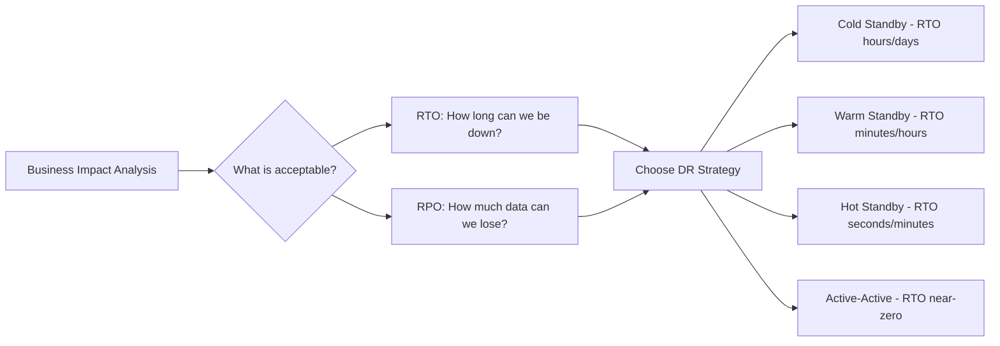
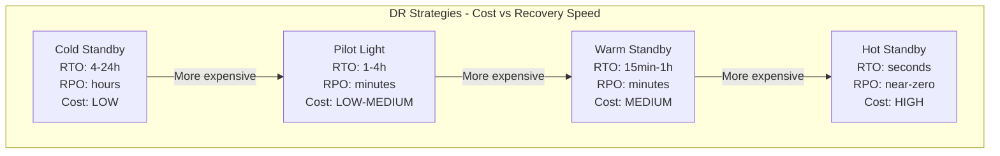
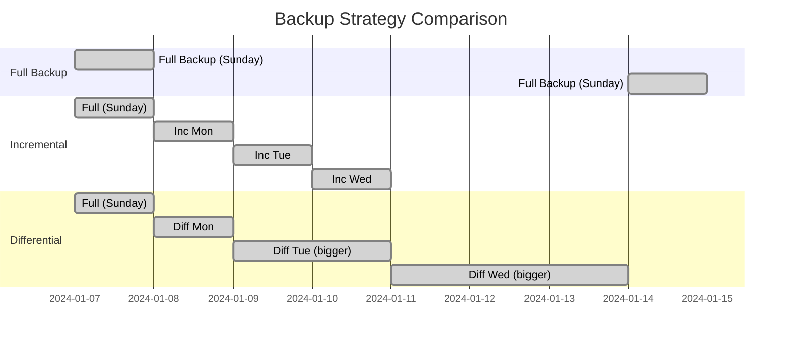

# Disaster Recovery

## Why This Topic Exists

Fault tolerance patterns handle everyday failures — a slow service, a crashed server, a momentary network blip. But what about bigger disasters?

On December 11, 2017, a fire at an AWS data center in the US-East-1 region caused widespread outages affecting thousands of companies. On March 10, 2021, an OVH data center in Strasbourg burned down completely, destroying servers with no backups for some customers. In 2011, a major earthquake and tsunami struck Japan, taking down multiple data centers simultaneously.

Disaster recovery (DR) is the plan for what happens when an entire facility, region, or infrastructure provider becomes unavailable. Unlike fault tolerance (which handles component-level failures automatically), disaster recovery handles catastrophic, multi-system failures that require deliberate planning, investment, and sometimes manual intervention.

Every business must answer two questions before disaster strikes: "How long can we be down?" and "How much data can we afford to lose?" The answers to those questions determine which disaster recovery strategy is appropriate — and how much it will cost.

---

## Learning Objectives

- Define RTO (Recovery Time Objective) and RPO (Recovery Point Objective)
- Compare the four main DR strategies: cold standby, pilot light, warm standby, hot standby
- Choose the right strategy based on business requirements and cost constraints
- Explain the three types of backups: full, incremental, differential
- Describe how geo-redundancy protects against regional failures

---

## Prerequisites

- [Availability and SLAs](./01.%20Availability%20and%20SLAs%20(BEGINNER).md) — SLAs define the recovery commitments DR must meet
- [Fault Tolerance Patterns](./02.%20Fault%20Tolerance%20Patterns%20(INTERMEDIATE).md) — DR is the plan when fault tolerance is not enough

---

## Introduction

Disaster recovery planning is often deferred because it is expensive, unglamorous, and "we hope we never need it." But companies that defer DR planning discover its importance the hard way — during an actual disaster, with customers watching and revenue disappearing by the minute.

The goal of disaster recovery is not just "come back online." It is to come back online within a time your business can survive, with data loss your business can tolerate. Those constraints — time and data — are the foundation of DR planning.

---

## Real-World Analogy

Think about house insurance and fire planning.

Every homeowner hopes their house never burns down. But most also have:
- **Fire insurance** — financial recovery when it does (analogous to having a DR plan)
- **Fire extinguisher** — handle small fires before they spread (fault tolerance)
- **Smoke detectors** — early warning (monitoring)
- **Important documents stored off-site** — so records are not lost even if the house is (backups)
- **A meeting point for the family** — so everyone knows the plan and acts together (runbook / DR playbook)

A business without a DR plan is a homeowner with no insurance, no fire extinguisher, and documents stored in the one place most likely to burn — the kitchen.

---

## Core Concepts

### RTO — Recovery Time Objective

RTO is the maximum amount of time your business can tolerate being offline after a disaster.

**Formal definition:** The time between disaster declaration and full restoration of service.

Examples:
- A banking transaction system might have RTO of 15 minutes — customers will notice and regulators will act if they are down longer
- An internal analytics dashboard might have RTO of 24 hours — employees can work around it for a day
- A healthcare patient record system might have RTO of 4 hours — long enough to manage emergencies, short enough to restore normal operations

RTO directly determines your DR strategy. An RTO of 15 minutes requires a hot standby. An RTO of 24 hours can use cold standby. Shorter RTO = more expensive infrastructure.

---

### RPO — Recovery Point Objective

RPO is the maximum amount of data loss your business can tolerate.

**Formal definition:** The time between the last successful backup (or replica sync) and the disaster event. Any data written in that window is lost.

Examples:
- A stock trading platform might have RPO of 0 — literally no data loss is acceptable. Every transaction must be replicated before it is confirmed.
- A news website might have RPO of 1 hour — losing one hour of articles is unfortunate but not catastrophic
- An email archive might have RPO of 24 hours — nightly backups are sufficient

RPO directly determines your data replication strategy. RPO of 0 requires synchronous replication (write is confirmed only when both primary and replica have written it). RPO of 1 hour allows asynchronous replication with periodic sync.

---

### The RTO/RPO Matrix

---

## Visual Diagram (Mermaid)

---

## Deep Explanation

### The Four DR Strategies

#### Strategy 1: Cold Standby

**What it is:** No infrastructure running in the DR site. When disaster strikes, you provision infrastructure from scratch (or restore from backups) and bring the system online.

**How it works:**
1. Disaster declared
2. Team spins up servers in DR region (could take hours)
3. Databases restored from latest backup
4. DNS updated to point to DR environment
5. System online

**RTO:** 4-24 hours (time to provision + time to restore data)
**RPO:** Hours (depends on backup frequency)
**Cost:** Very low — you only pay for storage of backups, not running infrastructure

**When to use:** Internal tools, non-critical systems, systems where hours of downtime are acceptable

**Real example:** A company stores daily database backups to S3. If their data center burns down, they launch new EC2 instances in another region and restore the latest backup. They lose up to 24 hours of data and are down for 6-8 hours while restoration completes.

---

#### Strategy 2: Pilot Light

**What it is:** A minimal version of the core system is always running in the DR site — just enough to restart quickly. Like a pilot light on a gas stove: the flame is tiny, barely consuming fuel, but it can ignite the full stove instantly.

**How it works:**
- Databases are continuously replicated to DR site (so data is nearly current)
- Core database and essential services run in DR (but not application servers — they are stopped)
- When disaster strikes, application servers are rapidly launched and pointed at the replicated database
- DNS updated

**RTO:** 1-4 hours (no data restoration needed; just launch application servers)
**RPO:** Minutes (data replication is near-continuous)
**Cost:** Low to medium — you pay for database instances and replication, but not full application server fleet

**When to use:** Systems that need reasonably fast recovery but can tolerate a few hours of downtime, with minimal data loss

---

#### Strategy 3: Warm Standby

**What it is:** A reduced-scale but fully functional version of the production system runs continuously in the DR site. It handles no traffic during normal operations, but it is ready.

**How it works:**
- Complete system running in DR site at 20-50% of production capacity
- Data continuously replicated
- When disaster strikes, scale up the DR environment to full capacity and redirect traffic
- RTO is limited to DNS propagation + scale-up time

**RTO:** 15 minutes to 1 hour
**RPO:** Minutes (continuous replication)
**Cost:** Medium — you pay for a continuously running scaled-down system

**When to use:** Systems that need recovery in under an hour with near-zero data loss

---

#### Strategy 4: Hot Standby / Active-Active

**What it is:** The DR site is a fully operational, full-scale copy of production that handles live traffic continuously. When the primary fails, the DR site simply handles all traffic.

**How it works:**
- Both regions run at full capacity and handle production traffic
- Data is synchronously replicated between regions (for RPO of zero) or asynchronously (for near-zero RPO)
- Load balancer routes traffic across both regions
- When one region fails, 100% of traffic automatically routes to the surviving region

**RTO:** Seconds (just DNS/routing change)
**RPO:** Near-zero or zero (with synchronous replication)
**Cost:** High — you are paying for double the infrastructure, running all the time

**When to use:** Payment systems, healthcare, trading platforms, any system where minutes of downtime is unacceptable

**AWS Example:** AWS Route 53 health checks + failover routing policies. Two ELB endpoints in different regions. If the primary region becomes unhealthy, Route 53 automatically routes all traffic to the secondary region within seconds.

---

### Strategy Comparison Table

| Strategy | RTO | RPO | Cost | Complexity |
|---|---|---|---|---|
| Cold Standby | 4-24 hours | Hours | $ | Low |
| Pilot Light | 1-4 hours | Minutes | $$ | Medium |
| Warm Standby | 15 min - 1 hour | Minutes | $$$ | Medium-High |
| Hot Standby (Active-Active) | Seconds | Near-zero | $$$$ | High |

---

### Backup Strategies

Backups are the foundation of cold and pilot light strategies, and a safety net for all strategies.

**Full Backup**

Copy everything. Every file, every database row.

- Pros: Simple to restore — one file contains everything
- Cons: Slow and storage-intensive. A 1TB database takes a long time to back up fully every night.
- Frequency: Weekly (too slow and expensive to run daily for large systems)

**Incremental Backup**

Copy only what changed since the last backup (full or incremental).

- Pros: Fast and storage-efficient
- Cons: Restore requires the last full backup plus every incremental since then. More complex to restore.
- Frequency: Daily or multiple times per day

**Differential Backup**

Copy everything that changed since the last full backup.

- Pros: Faster than full, simpler to restore than incremental (just the full + one differential)
- Cons: Gets larger over time as more changes accumulate since the last full backup
- Frequency: Daily

**Backup Best Practices:**
- Follow the **3-2-1 rule**: 3 copies of data, 2 different storage media, 1 offsite
- Test your backups regularly — an untested backup is not a backup
- Store backups in a different physical location and, ideally, a different cloud region
- Encrypt backups at rest

---

### Geo-Redundancy

Geo-redundancy means deploying infrastructure across multiple geographic locations — different cities, countries, or continents.

**Why geography matters:**
- Natural disasters (earthquake, hurricane, flood) are geographically localized
- Power grid failures are regional
- Network cable cuts can take down connectivity to a local area
- Regulatory requirements may mandate data residency in specific regions

**AWS Multi-Region Setup:**
- Primary: `us-east-1` (N. Virginia)
- Secondary: `us-west-2` (Oregon)
- Route 53 routes traffic to `us-east-1`; if health checks fail, automatically routes to `us-west-2`
- RDS Multi-Region Read Replica in `us-west-2` with continuous replication
- S3 Cross-Region Replication copies all objects to `us-west-2` bucket
- If `us-east-1` experiences a regional failure, Route 53 DNS failover routes all traffic to `us-west-2` within 60 seconds

---

## Step-by-Step Example

**Scenario:** An online payment processor. Business requirements: RTO 30 minutes, RPO 5 minutes.

**Step 1: Choose strategy**
RTO 30 minutes and RPO 5 minutes → Warm Standby is appropriate (Hot Standby would work too but costs more)

**Step 2: Set up warm standby in secondary region**
- Launch scaled-down application servers (25% of production capacity) in `eu-west-1`
- Set up RDS Multi-AZ with a cross-region read replica — data replicates asynchronously with ~5 minute lag
- Configure Route 53 with health checks and failover routing

**Step 3: Disaster strikes — primary region us-east-1 fails**
- Route 53 health checks detect failure within 1 minute
- Route 53 automatically switches DNS to `eu-west-1`
- Operations team promotes the `eu-west-1` read replica to primary (2-3 minutes)
- Operations team scales up application servers to full capacity (10-15 minutes)
- System fully operational: total time ~20 minutes

**Step 4: Data loss assessment**
- Last replication sync was 4 minutes before disaster
- RPO requirement is 5 minutes
- RPO met: 4 minutes of data loss, within the 5-minute budget

---

## Advantages / Disadvantages / Trade-offs

| Strategy | Best For | Trade-off |
|---|---|---|
| Cold Standby | Internal tools, dev systems | Long RTO — hours to recover |
| Pilot Light | Moderate criticality systems | Still requires manual intervention |
| Warm Standby | E-commerce, SaaS applications | Costs ongoing infrastructure |
| Hot Standby | Payments, healthcare, trading | Very expensive, complex to sync data |

---

## When to Use / When NOT to Use

**Use hot standby when:**
- Regulatory requirements mandate near-zero RTO/RPO
- Revenue loss per minute of downtime is very high
- Customer-facing systems where any downtime is visible

**Use cold standby when:**
- The system is internal, non-critical, or used during business hours only
- Budget is severely constrained
- Rebuilding from scratch in a few hours is acceptable

**Do NOT skip DR planning because:**
- "We're on AWS / Azure / GCP so we're safe" — cloud providers guarantee region availability up to 99.99%, but actual regional failures do occur
- "We've never had a disaster" — the absence of past disasters does not reduce future risk

---

## Common Interview Questions

**Q: What is the difference between RTO and RPO?**

A: RTO is how long you can be offline (Recovery Time Objective). RPO is how much data you can lose (Recovery Point Objective). Both are defined by business requirements and directly drive DR strategy selection.

**Q: Compare hot standby and warm standby.**

A: Hot standby runs a full-scale replica that handles live traffic continuously, giving near-zero RTO and RPO. Warm standby runs a scaled-down replica that handles no traffic, requiring scale-up and DNS switchover, giving RTO of 15-60 minutes. Hot standby costs roughly double due to full-scale parallel infrastructure.

**Q: What is the 3-2-1 backup rule?**

A: 3 copies of data, stored on 2 different media types, with 1 copy offsite. This ensures that no single failure — hardware, fire, regional disaster — can destroy all copies.

---

## Common Beginner Mistakes

**Mistake 1: Never testing disaster recovery**
A DR plan that has never been tested is just a wish. Run DR drills at least annually. The first time you run through a DR procedure should not be during an actual disaster.

**Mistake 2: Setting RTO/RPO without business input**
Technical teams often set their own RTO/RPO targets. The right targets come from business stakeholders: finance (revenue loss per hour), legal (regulatory requirements), and operations (manual workarounds available).

**Mistake 3: Storing backups in the same region as production**
If the disaster takes out your primary region and your backups are also in that region, you have neither a system nor a backup. Backups must be geographically separate.

**Mistake 4: Assuming cloud providers handle DR for you**
Cloud providers protect against hardware failure (availability zones). They do not protect against regional failures, human errors that delete data, or ransomware that encrypts your data. DR is your responsibility.

---

## Summary

Disaster recovery ensures your business can survive catastrophic infrastructure failures. The two key parameters are RTO (how long you can be down) and RPO (how much data you can lose).

Four DR strategies exist on a cost-vs-recovery-speed spectrum: cold standby (cheap, slow), pilot light (low cost, faster), warm standby (moderate cost, fast), and hot standby/active-active (expensive, near-instant).

Backup strategies — full, incremental, differential — protect your data with different trade-offs between backup speed, restoration speed, and storage cost.

Geo-redundancy, exemplified by AWS multi-region deployments, protects against regional disasters by maintaining infrastructure in geographically separate locations.

---

## Key Takeaways

- RTO = how long you can be down. RPO = how much data you can lose. Both are business decisions, not technical ones.
- Cold standby is cheapest but has RTO of hours. Hot standby is most expensive but recovers in seconds.
- The 3-2-1 backup rule: 3 copies, 2 media, 1 offsite.
- Test your DR plan. An untested DR plan is not a DR plan.
- Cloud providers protect against hardware failure. Regional failure DR is your responsibility.
- Match your DR investment to your actual business requirements — hot standby for a blog is overkill.

---

## Related Topics (Relative Markdown Links)

- [Chapter Overview](./README.md)
- [Availability and SLAs](./01.%20Availability%20and%20SLAs%20(BEGINNER).md) — SLAs define the commitments DR must meet
- [Fault Tolerance Patterns](./02.%20Fault%20Tolerance%20Patterns%20(INTERMEDIATE).md) — Component-level failures vs. regional disasters
- [Chaos Engineering](./04.%20Chaos%20Engineering%20(INTERMEDIATE).md) — Proactively testing failure handling, including DR procedures
