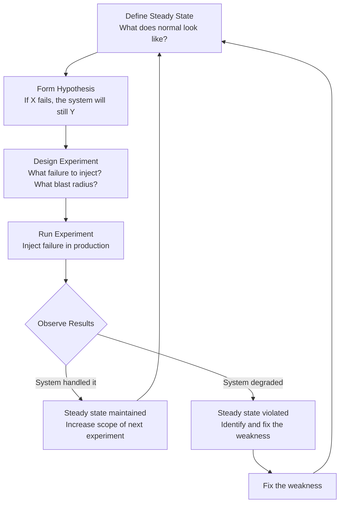
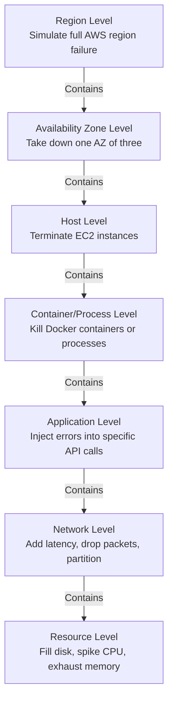

# Chaos Engineering

## Why This Topic Exists

Every engineering team believes their system is reliable — right up until it is not.

Traditional reliability practice is reactive: something breaks, engineers fix it, everyone learns from the post-mortem. But by the time you learn from a production failure, your customers have already experienced the outage.

Chaos engineering flips this on its head. Instead of waiting for failures to happen, you cause them deliberately — in controlled conditions, during business hours, with engineers watching. You find the weaknesses before your customers do.

This might sound reckless. Deliberately breaking production systems? But Netflix, Amazon, Google, and Microsoft all run chaos engineering programs, and they do it precisely because it makes their systems more reliable, not less. The insight is simple: a system that has survived known, planned failures is far more trustworthy than one that has only ever run in perfect conditions.

---

## Learning Objectives

- Explain what chaos engineering is and why it improves reliability
- Describe the chaos engineering experiment loop
- Identify the different levels at which chaos can be injected
- Explain Netflix's Simian Army tools and their purposes
- Describe a Game Day and how to run one
- Understand why intentional failure testing builds confidence in distributed systems

---

## Prerequisites

- [Fault Tolerance Patterns](./02.%20Fault%20Tolerance%20Patterns%20(INTERMEDIATE).md) — Chaos engineering verifies that these patterns actually work
- [Disaster Recovery](./03.%20Disaster%20Recovery%20(INTERMEDIATE).md) — Game Days often test DR procedures

---

## Introduction

In 2010, Netflix completed its migration from its own data centers to AWS. They now had a highly distributed system running on cloud infrastructure that could — and would — fail at any time.

The engineering team faced a dilemma. They had built redundancy and fault tolerance patterns, but how could they be sure those patterns actually worked? They could not just hope. The only way to know was to test.

So they wrote **Chaos Monkey** — a service that randomly selects and terminates production EC2 instances during business hours. The name was intentional: it evokes a chaotic, unpredictable force wreaking havoc in your infrastructure.

The result? Netflix engineers learned which parts of their system were not actually as resilient as they thought. They fixed those weaknesses. Then they ran Chaos Monkey again. The cycle continued until the system could genuinely handle random instance terminations without affecting customers.

Chaos Monkey became the founding tool of a discipline now called chaos engineering.

---

## Real-World Analogy

Consider how the military trains soldiers for combat. You do not send soldiers into battle having only trained in a peaceful, obstacle-free environment. You run drills. You simulate enemy fire. You train in adverse weather. You run exercises where communications are cut off to test whether units can operate independently.

All of this training happens in controlled conditions — not actual combat — so you can learn from mistakes without paying the ultimate price.

Chaos engineering is the same philosophy applied to software systems. You run "fire drills" for your infrastructure. You simulate the failure modes you fear most. You practice your incident response. You discover that your circuit breaker was misconfigured, your fallback returns null instead of a default, or your DR runbook references a tool that no longer exists — and you fix all of it before a real disaster occurs.

---

## Core Concepts

### What Chaos Engineering Is (and Is Not)

**Chaos engineering IS:**
- Deliberately injecting known failure conditions into a system to verify it handles them correctly
- A scientific process: form a hypothesis, run an experiment, observe results, learn
- A practice for production systems where controlled failure reveals real behavior
- A continuous discipline, not a one-time test

**Chaos engineering IS NOT:**
- Random, uncontrolled destruction
- Something you do without monitoring and an abort plan
- Testing in a staging environment only (staging does not match production load and dependencies)
- A substitute for good system design

The key word in chaos engineering is **controlled**. You have a hypothesis ("the system will continue serving traffic even if one of three web servers is terminated"), you define a "blast radius" (limit the impact to 10% of traffic), you have a kill switch ready, and you have monitoring showing you what is happening in real time.

---

### The Chaos Engineering Experiment Loop

**Step 1: Define Steady State**

Before you break anything, define what "normal" looks like in measurable terms.

Examples:
- "95% of homepage requests complete in under 500ms"
- "Payment success rate is above 99.9%"
- "No customer-visible errors on the checkout page"

Steady state metrics come from your monitoring system. If you do not have good monitoring, chaos engineering is impossible — you cannot tell whether your experiment affected the system.

**Step 2: Form a Hypothesis**

A hypothesis states what you expect to happen during the experiment.

Example hypotheses:
- "If we terminate one of three web server instances, request latency will remain below 500ms"
- "If we inject 500ms of network latency between the API and the database, the circuit breaker will trip and the fallback will serve cached data"
- "If we take down the recommendations service, users will still see the home page (with default popular content)"

**Step 3: Design the Experiment**

Define:
- What failure to inject (server termination, network latency, disk full, CPU spike, etc.)
- The blast radius (what percentage of traffic is affected? Start small: 1%, then 5%, then 10%)
- Duration of the experiment
- Abort criteria (at what point do you immediately stop?)
- Monitoring to watch during the experiment

**Step 4: Run and Observe**

Execute the failure injection while actively monitoring. Have an engineer watching dashboards. Have a kill switch ready to abort if the blast radius expands unexpectedly.

**Step 5: Learn and Improve**

If the hypothesis held: the system handled it correctly. Document the result. Plan a more aggressive experiment next time.

If the hypothesis failed: you found a weakness. Fix it. This is the entire point of the exercise. Log the finding, create a ticket, fix the issue, and run the experiment again to verify the fix.

---

### Levels of Chaos

Chaos can be injected at many levels, from individual processes up to entire geographic regions.

| Level | Example Experiment | Tool |
|---|---|---|
| Region | Simulate entire AWS us-east-1 failure | Manual DNS failover drill |
| Availability Zone | Take down one AZ | Chaos Monkey / AWS Fault Injection |
| Host | Randomly terminate EC2 instances | Chaos Monkey |
| Container | Kill random Docker containers | Pumba |
| Network | Add 200ms latency between services | tc netem / Toxiproxy |
| Application | Return errors on 10% of API calls | Gremlin / custom middleware |
| Resource | Fill disk to 95% on database server | Gremlin |

Start at the lowest, most contained level and work up. Do not start with region-level experiments — start with a single container.

---

## Deep Explanation

### Netflix's Simian Army

Netflix did not stop at Chaos Monkey. They built an entire "Simian Army" — a collection of services each designed to test a different aspect of resilience.

**Chaos Monkey**
Randomly terminates production EC2 instances during business hours. Tests that the system handles individual server failures automatically without human intervention.

**Chaos Gorilla**
Simulates the failure of an entire AWS Availability Zone. Tests that the system can redistribute traffic to the remaining AZs without affecting availability.

**Chaos Kong**
Simulates the failure of an entire AWS Region. The most aggressive experiment — tests full cross-region failover.

**Latency Monkey**
Introduces artificial network delays between services. Tests circuit breakers, timeouts, and fallbacks. Slow failures are harder to detect than outright failures, making Latency Monkey particularly valuable.

**Doctor Monkey**
Runs health checks and removes unhealthy instances from rotation. Unlike Chaos Monkey (random kills), Doctor Monkey targets instances that are already exhibiting health problems.

**Conformity Monkey**
Checks that all services follow Netflix's best practices (circuit breakers configured, fallbacks implemented, health checks present). Shuts down non-conforming instances during business hours to force compliance.

**Security Monkey**
Scans for security vulnerabilities and misconfigurations — open security groups, unencrypted data stores, expired certificates. Not strictly chaos, but part of the automated resilience enforcement culture.

The Simian Army represents a philosophy: reliability is not achieved once and maintained forever. It must be continuously tested, enforced, and improved.

---

### Game Days

A Game Day is a planned, structured event where a team deliberately causes a major failure scenario and practices their response.

**What happens during a Game Day:**
1. A scenario is chosen (e.g., "Primary database is unavailable for 2 hours")
2. Engineers notify all stakeholders (no one is surprised)
3. The scenario is triggered in production or a production-like environment
4. All engineers practice their incident response procedures
5. Debrief afterward: what worked, what did not, what needs fixing

**Why Game Days matter:**
- DR runbooks that have never been executed contain errors. You will find them during a Game Day drill, not during an actual disaster.
- Incident response muscle memory. When an actual disaster happens at 3am, engineers who have practiced during Game Days respond faster and more calmly.
- Cross-team dependencies surface. Team A's recovery procedure requires Team B to take an action. Team B does not know this until a Game Day reveals it.
- Tool familiarity. The runbook says "log in to the monitoring dashboard." During the Game Day, you discover that the monitoring dashboard access requires a password that 80% of the on-call team does not have.

Amazon uses Game Days extensively. Their engineers regularly simulate major service failures to practice response and validate that their runbooks are accurate and complete.

---

## Step-by-Step Example

**Scenario:** An e-commerce platform wants to verify its payment service circuit breaker works correctly.

**Step 1: Define steady state**
- Payment success rate: 99.9%
- Homepage load time p95: under 400ms
- No payment errors visible to customers

**Step 2: Form hypothesis**
"If the payment service returns errors for 60% of requests, the circuit breaker will trip within 10 seconds, calls will be rejected immediately (fail fast), and users will see a graceful error message ('Payment service temporarily unavailable, please try again') rather than a timeout."

**Step 3: Design experiment**
- Blast radius: 5% of production traffic
- Method: Deploy a fault injection middleware on the payment service that returns HTTP 500 for 60% of calls
- Duration: 5 minutes
- Abort criteria: If payment success rate drops below 95% overall (circuit breaker not protecting the rest of traffic)
- Monitoring: Watch payment success rate, circuit breaker state dashboard, error logs, user-facing error rate

**Step 4: Run**
- 09:00 — Fault injection enabled for 5% of traffic
- 09:00:08 — Circuit breaker trips (8 seconds — within the 10-second hypothesis)
- 09:00:10 — Payment requests are immediately rejected with fail-fast response
- 09:00:12 — User-facing error message appears: "Payment service temporarily unavailable"
- 09:05 — Fault injection disabled
- 09:05:45 — Circuit breaker moves to half-open, test request succeeds
- 09:06:00 — Circuit breaker closes, normal payment processing resumes

**Step 5: Learn**
- Hypothesis confirmed: circuit breaker tripped in 8 seconds (within the 10-second target)
- Finding: The error message showed a technical error code that should be hidden from users
- Action item: Update the fallback error message before next experiment

---

## Advantages / Disadvantages / Trade-offs

| Aspect | Benefit | Cost / Risk |
|---|---|---|
| Production testing | Reveals real behavior under real load | Risk of wider blast radius if misconfigured |
| Continuous practice | Keeps incident response skills sharp | Requires significant engineering investment |
| Automated chaos | Scales to thousands of services | Requires mature monitoring to be safe |
| Pre-discovery of weaknesses | Fix issues before customers hit them | Can surface many weaknesses at once — overwhelming backlog |

---

## When to Use / When NOT to Use

**Start chaos engineering when:**
- You have good monitoring (you cannot observe what chaos does without it)
- You have circuit breakers and fault tolerance patterns deployed
- Your team is ready to respond to and learn from failures
- You have a culture where failures are learning opportunities, not causes for blame

**Do NOT run chaos experiments when:**
- You have no monitoring — you will be flying blind
- You have no fault tolerance patterns — chaos will just cause outages with no learning
- Your team treats failures as punishable offenses — the team will resist it
- You are running a critical event (product launch, Black Friday) — bad time for chaos experiments

**Start small:**
- First experiment: kill one container in your dev environment
- Second: kill one container in staging
- Third: kill one container in production with 1% blast radius
- Only move to region-level experiments after you have proven the lower levels work

---

## Common Interview Questions

**Q: What is chaos engineering and why does Netflix practice it?**

A: Chaos engineering is the practice of deliberately injecting failures into production systems to verify that fault tolerance mechanisms work. Netflix practices it because distributed systems are too complex to reason about theoretically — the only way to know the system handles failure correctly is to test it. Finding weaknesses during a controlled experiment is far better than finding them during an actual outage.

**Q: What is the difference between chaos engineering and just causing outages?**

A: Chaos engineering is scientific and controlled: you form a hypothesis, define a blast radius, have monitoring in place, have an abort plan, and you learn from the results. Uncontrolled chaos is just breaking things. The "controlled" aspect is what makes chaos engineering safe and valuable.

**Q: What is the Chaos Monkey?**

A: Chaos Monkey is a Netflix tool that randomly terminates production EC2 instances during business hours. It tests whether the system can survive individual server failures without human intervention. It was the first tool in Netflix's "Simian Army" of chaos engineering tools.

---

## Common Beginner Mistakes

**Mistake 1: Starting without monitoring**
Running a chaos experiment without monitoring is reckless. You need dashboards showing your steady-state metrics so you can see whether the experiment is affecting the system as expected.

**Mistake 2: Starting too big**
Terminating all servers in a region on your first experiment is how you cause a major outage. Start by killing one container in a dev environment. Work your way up over weeks and months.

**Mistake 3: Not having an abort plan**
Every chaos experiment needs a clearly defined abort condition and a single command that stops the experiment immediately. If the blast radius starts expanding, you stop immediately.

**Mistake 4: Treating results as blame**
If a chaos experiment reveals that your service has a bug, that is a success — you found it before a customer did. Teams that punish engineers for weaknesses found in chaos experiments will stop running them, which is the worst outcome.

---

## Summary

Chaos engineering is the practice of deliberately injecting failures into production systems to verify that fault tolerance mechanisms work in real conditions. It follows a scientific loop: define steady state, form hypothesis, design experiment, run and observe, learn and fix.

Netflix pioneered chaos engineering with Chaos Monkey (random server termination) and expanded to the full Simian Army covering AZ failures, region failures, network latency, and security checks.

Game Days extend chaos engineering into planned exercises where teams practice full disaster scenarios and validate their runbooks and incident response procedures.

The counterintuitive insight of chaos engineering: deliberately breaking systems makes them stronger, because every weakness discovered and fixed during a controlled experiment is a weakness that will not cause an unexpected outage.

---

## Key Takeaways

- Chaos engineering is controlled, scientific failure injection — not random destruction.
- The loop: define steady state → hypothesis → experiment → observe → fix → repeat.
- Start small: one container in dev, then staging, then 1% production blast radius.
- Monitoring is a prerequisite — chaos without monitoring is just causing outages.
- Netflix's Simian Army: Chaos Monkey (servers), Chaos Gorilla (AZ), Chaos Kong (region), Latency Monkey (network).
- Game Days practice incident response before real incidents force the practice.
- Breaking things on purpose is how you build confidence that the system handles failure correctly.

---

## Related Topics (Relative Markdown Links)

- [Chapter Overview](./README.md)
- [Fault Tolerance Patterns](./02.%20Fault%20Tolerance%20Patterns%20(INTERMEDIATE).md) — The patterns that chaos engineering verifies
- [Disaster Recovery](./03.%20Disaster%20Recovery%20(INTERMEDIATE).md) — Game Days test DR procedures
- [Availability and SLAs](./01.%20Availability%20and%20SLAs%20(BEGINNER).md) — Chaos engineering helps you maintain your SLAs
