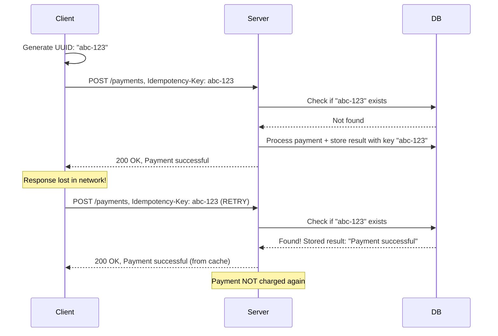
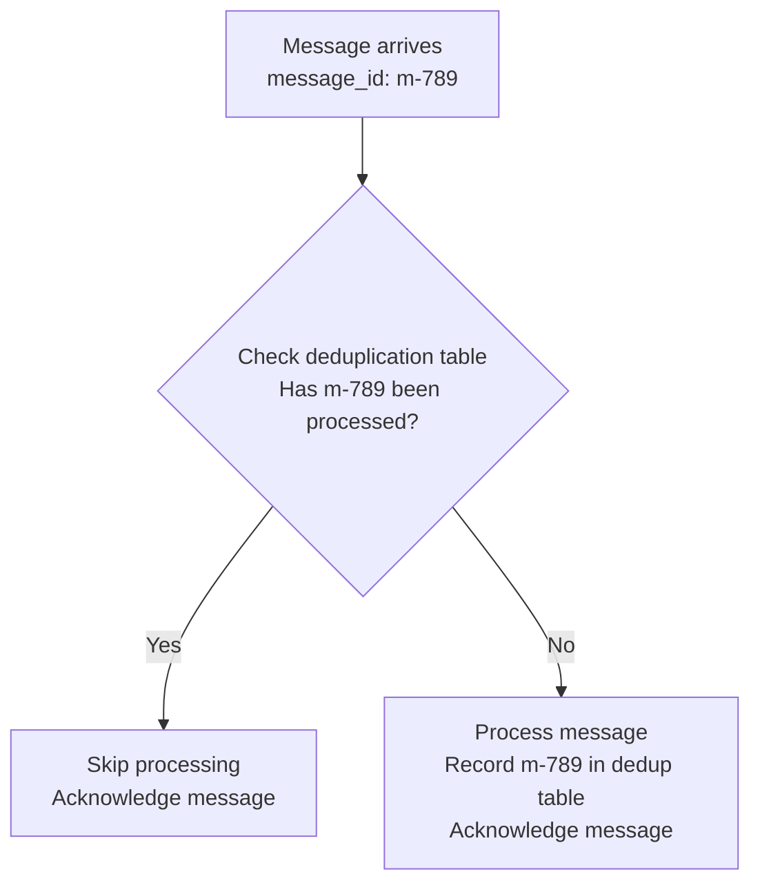

# Idempotency

## Why This Topic Exists

Networks are unreliable. A request leaves your client, travels through routers, and arrives at a server. The server processes it and sends a response. The response gets lost. Your client never received it.

Now what?

Your client does not know whether the server processed the request or not. The request could have failed before reaching the server (safe to retry). Or the server could have processed it and the response got lost (dangerous to retry — could cause duplicates).

Without idempotency, retrying safe operations — which you must do to handle network failures — can cause catastrophic side effects. A customer gets charged twice. An order gets placed twice. An email gets sent twice.

Idempotency is the property that makes retries safe. An idempotent operation can be called any number of times and the result is the same as calling it exactly once. It is one of the most important properties for building reliable distributed systems.

---

## Learning Objectives

- Define idempotency and explain why it is critical for distributed systems reliability
- Identify which HTTP methods are naturally idempotent and which are not
- Implement idempotency keys for non-idempotent operations like payments
- Design idempotent database operations using upsert patterns
- Explain how Stripe uses idempotency keys to prevent double charges
- Build deduplication systems using unique message IDs

---

## Prerequisites

- [Fault Tolerance Patterns](./02.%20Fault%20Tolerance%20Patterns%20(INTERMEDIATE).md) — Retries are the reason idempotency matters
- Basic understanding of HTTP methods (GET, POST, PUT, DELETE)

---

## Introduction

The word "idempotent" comes from Latin: *idem* (same) + *potens* (power). In mathematics, an idempotent operation is one where applying it multiple times has the same result as applying it once.

Examples from everyday math:
- `|x|` (absolute value): applying it twice gives the same result as once. `||x|| = |x|`
- Setting a value to a constant: `x = 5; x = 5` leaves x at 5, not 10

In software systems, idempotency means: "If this operation is called multiple times with the same input, the outcome is as if it was called exactly once."

This matters enormously for reliability because in distributed systems, "at least once delivery" is easy to achieve, but "exactly once delivery" is theoretically impossible. The network can always fail after a message is delivered but before the acknowledgment returns. The only way to achieve exactly-once *semantics* is to make your operations idempotent, so that receiving them multiple times has the same effect as receiving them once.

---

## Real-World Analogy

**Pressing an elevator button:**
You press the button for floor 5. The elevator registers your request. You press it again. Does anything change? No — the elevator was already going to floor 5. Pressing the button multiple times has the same effect as pressing it once. The elevator button is idempotent.

**Pressing a car horn:**
You press the horn. It beeps. You press it again. It beeps again. Each press causes a new beep. The horn is not idempotent — each call produces a new side effect.

Now imagine the elevator button worked like a car horn: each press of "floor 5" counted as a separate trip request. You accidentally pressed it three times while walking over, and now the elevator thinks three separate people want floor 5 and makes three separate trips. That would be wrong — and in payment systems, the equivalent mistake charges customers three times.

**The double payment analogy:**
You tap your phone to pay for coffee. The payment app sends a charge request to your bank. The bank processes it and deducts $5. But the response gets lost — the payment app never received confirmation. So the app retries. The bank receives the request again. If the payment operation is not idempotent, the bank deducts $5 again. You paid $10 for a $5 coffee.

---

## Core Concepts

### Idempotency in HTTP Methods

HTTP defines several methods (verbs), and they have well-defined idempotency characteristics by specification.

| HTTP Method | Idempotent? | Safe? | Description |
|---|---|---|---|
| GET | Yes | Yes | Reading data never changes state |
| HEAD | Yes | Yes | Same as GET but returns only headers |
| PUT | Yes | No | Sets a resource to an exact value — setting it twice gives same result |
| DELETE | Yes | No | Deleting something twice leaves it deleted (second call is a no-op) |
| POST | No | No | Creates a new resource — calling twice creates two resources |
| PATCH | Depends | No | Depends on implementation (see below) |

**GET is idempotent:** Fetching user profile 100 times returns the same profile 100 times. Nothing changes on the server.

**PUT is idempotent:** `PUT /users/123` with body `{"name": "Alice"}` sets the user's name to Alice. Sending the same PUT twice leaves the name as Alice — the second call changes nothing.

**DELETE is idempotent:** `DELETE /users/123` deletes user 123. Calling it again on an already-deleted user should return 404 — the user no longer exists, which is the desired state. The state of the system is the same: user 123 does not exist.

**POST is NOT idempotent:** `POST /orders` creates a new order. Calling it twice creates two orders. This is the fundamental problem.

**PATCH idempotency depends on implementation:**
- `PATCH /counter {"increment": 1}` is NOT idempotent — calling twice increments by 2
- `PATCH /user/123 {"name": "Alice"}` IS idempotent — setting name to Alice twice leaves name as Alice

---

### The Idempotency Key Pattern

The idempotency key pattern makes non-idempotent operations (like POST) safe to retry.

**How it works:**

1. The client generates a unique ID (UUID) for the operation before making the request
2. The client sends this ID in a request header: `Idempotency-Key: <uuid>`
3. The server checks if it has seen this key before
4. If YES: the server returns the stored result of the original operation without executing it again
5. If NO: the server executes the operation, stores the result keyed by the idempotency key, then returns the result



The key insight: the server recognizes the duplicate request by the idempotency key and returns the cached result instead of processing it again.

---

### Stripe's Idempotency Key Pattern

Stripe — one of the world's largest payment processors — uses idempotency keys for all payment operations. Their implementation is the gold standard for this pattern.

**Stripe's rules:**
- Generate a unique idempotency key per attempted charge (typically a UUID v4)
- Send it in the `Idempotency-Key` header with every payment request
- Stripe stores the response keyed by the idempotency key for 24 hours
- If Stripe receives the same key again within 24 hours, it returns the stored response immediately
- If you use an idempotency key with different request parameters, Stripe returns a 422 error (the key is for that specific operation)

```
POST /v1/charges
Idempotency-Key: e4d66b99-4c63-4a79-86b1-df0bf54bc3cd

{
  "amount": 500,
  "currency": "usd",
  "source": "tok_visa",
  "description": "Coffee at Brew Co"
}
```

If the network drops after Stripe processes the charge but before you receive the response, you retry with the same idempotency key. Stripe sees it has already processed a charge with that key, and returns the original success response. No double charge.

---

### Database Idempotency: Upsert

At the database level, idempotency often comes down to using UPSERT (INSERT OR UPDATE) instead of plain INSERT.

**The problem with plain INSERT:**
```sql
INSERT INTO users (id, email, name) VALUES (123, 'alice@example.com', 'Alice');
-- Run it twice: ERROR - duplicate key violation (if you're lucky)
-- Or: two identical rows (if you're unlucky and there's no unique constraint)
```

**Upsert (INSERT ON CONFLICT):**
```sql
INSERT INTO users (id, email, name) VALUES (123, 'alice@example.com', 'Alice')
ON CONFLICT (id) DO UPDATE SET email = excluded.email, name = excluded.name;
-- Run it twice: second execution updates the same row to the same values
-- Result is identical to running once
```

**INSERT OR IGNORE / ON CONFLICT DO NOTHING:**
```sql
INSERT INTO user_events (user_id, event_id, created_at)
VALUES (123, 'evt_456', NOW())
ON CONFLICT (user_id, event_id) DO NOTHING;
-- If we've already recorded this event, ignore the duplicate
```

This is how message processing systems achieve idempotency: assign each message a unique ID, store processed message IDs, and use ON CONFLICT DO NOTHING when recording them.

---

### Distributed Idempotency: Message Deduplication

In event-driven systems and message queues, the same message can be delivered multiple times (at-least-once delivery semantics). To process each message exactly once, you need deduplication.

**The pattern:**
1. Each message has a unique `message_id`
2. When processing a message, first check a deduplication table: "Have I already processed `message_id = X`?"
3. If YES: skip processing, acknowledge the message
4. If NO: process the message, record `message_id = X` in the deduplication table, acknowledge



**AWS SQS** has built-in deduplication for FIFO queues. You provide a `MessageDeduplicationId`; SQS will not deliver the same ID twice within a 5-minute window.

**Kafka** achieves idempotent producers with sequence numbers: each producer has an ID, and each message has a sequence number. The broker deduplicates messages with duplicate producer ID + sequence number combinations.

---

## Deep Explanation

### Why "Exactly Once" is Impossible and Idempotency is the Practical Solution

In a distributed system, you cannot guarantee that a message is processed exactly once. Here is why:

The "two generals problem" in distributed systems states that no communication protocol can guarantee message delivery in the presence of unreliable channels. You can get at-most-once delivery (fire and forget) or at-least-once delivery (retry until acknowledged), but not exactly once.

At-most-once delivery: you send the request and accept that it might be lost. You do not retry. Simple, but requests get lost.

At-least-once delivery: you retry until you receive an acknowledgment. But the acknowledgment can get lost even after the request was processed, causing duplicate processing.

The practical solution is: use at-least-once delivery (retry on failure) AND make your operations idempotent. Then duplicate processing has no effect, and you achieve exactly-once semantics even without exactly-once delivery.

This is why idempotency is listed alongside availability and consistency as a core property of reliable distributed systems.

---

### Idempotency Key Expiration

Idempotency keys cannot be stored forever — that would require infinite storage. The typical pattern:

- Store idempotency keys with a TTL (time to live) — typically 24-72 hours
- After expiration, the key can be reused (though in practice, UUIDs are unique enough that this is not a concern)
- Stripe stores keys for 24 hours, which covers the window of any realistic retry loop

---

## Step-by-Step Example

**Scenario:** A user purchases a $99 course. Build an idempotent payment endpoint.

**Step 1: Client generates idempotency key**
```
idempotency_key = generate_uuid()  # e.g., "f47ac10b-58cc-4372-a567-0e02b2c3d479"
```

**Step 2: Client sends request**
```
POST /api/purchases
Idempotency-Key: f47ac10b-58cc-4372-a567-0e02b2c3d479
Content-Type: application/json

{
  "user_id": 123,
  "course_id": 456,
  "amount": 9900
}
```

**Step 3: Server checks for existing idempotency key**
```sql
SELECT response FROM idempotency_keys
WHERE key = 'f47ac10b-...' AND expires_at > NOW();
```

Result: no row found. Proceed with processing.

**Step 4: Process within a database transaction**
```sql
BEGIN;

-- Charge the customer
INSERT INTO payments (user_id, amount, status) VALUES (123, 9900, 'completed');

-- Grant course access
INSERT INTO user_courses (user_id, course_id) VALUES (123, 456)
ON CONFLICT (user_id, course_id) DO NOTHING;

-- Store idempotency key with response
INSERT INTO idempotency_keys (key, response, expires_at)
VALUES ('f47ac10b-...', '{"purchase_id": 789, "status": "completed"}', NOW() + INTERVAL '24 hours');

COMMIT;
```

**Step 5: Network drops — client retries**
```
POST /api/purchases
Idempotency-Key: f47ac10b-58cc-4372-a567-0e02b2c3d479
(same request)
```

**Step 6: Server finds existing key**
```sql
SELECT response FROM idempotency_keys
WHERE key = 'f47ac10b-...' AND expires_at > NOW();
```

Result: `{"purchase_id": 789, "status": "completed"}`

Server returns this stored response without processing the payment again. Customer is charged exactly once.

---

## Advantages / Disadvantages / Trade-offs

| Aspect | Benefit | Cost |
|---|---|---|
| Retries are safe | Can retry freely on network failure | Requires storing idempotency keys (storage cost) |
| Duplicate protection | No double charges, no duplicate orders | Key lookup adds latency to every request |
| Simpler client logic | Client can retry without complex state management | Server-side implementation adds complexity |
| At-least-once + idempotency = exactly-once semantics | Reliable distributed processing | Race conditions between concurrent requests with same key |

---

## When to Use / When NOT to Use

**Always use idempotency keys for:**
- Payment operations
- Order creation
- Email sending (prevent duplicate emails)
- Any operation with financial or user-visible side effects

**Use upsert (not insert) for:**
- Database writes that might be retried
- Message deduplication tables
- Event recording

**You do not need explicit idempotency for:**
- Read operations (GET requests) — they are naturally idempotent
- PUT operations that set absolute values — they are naturally idempotent
- Operations with no observable side effects

---

## Common Interview Questions

**Q: What does idempotent mean and why does it matter in distributed systems?**

A: An idempotent operation produces the same result whether called once or many times. It matters because networks are unreliable — requests must be retried — and retrying non-idempotent operations causes side effects like double charges. Idempotency makes retries safe.

**Q: Which HTTP methods are idempotent and which are not?**

A: GET, PUT, HEAD, DELETE are idempotent. POST is not. PUT sets a resource to an exact value (idempotent). POST creates a new resource (calling twice creates two).

**Q: How does Stripe prevent double charges?**

A: Stripe uses idempotency keys — a unique UUID included in the request header. Stripe stores the response keyed by this UUID for 24 hours. If the same key arrives again (retry), Stripe returns the cached response without charging again.

**Q: What is the difference between at-least-once delivery and exactly-once delivery?**

A: At-least-once delivery guarantees the message is processed but may process it multiple times. Exactly-once delivery guarantees it is processed exactly once, but is impossible to achieve perfectly in distributed systems. The practical solution is at-least-once delivery with idempotent message handlers.

---

## Common Beginner Mistakes

**Mistake 1: Relying on database unique constraints as the only protection**
Unique constraints catch duplicate INSERTs, but they throw errors rather than gracefully handling retries. Use ON CONFLICT DO NOTHING or idempotency key tables for graceful handling.

**Mistake 2: Using the same idempotency key for different operations**
An idempotency key is tied to one specific operation. Using the same key for a retry of a different amount or different user violates the contract and Stripe will return an error.

**Mistake 3: Not handling the race condition**
Two concurrent requests with the same idempotency key can both pass the "key exists?" check before either stores the result. Handle this with database-level locking or atomic insert operations.

**Mistake 4: Thinking GET requests need idempotency keys**
GET requests are naturally idempotent — they have no side effects. Adding idempotency keys to GET requests is unnecessary complexity.

---

## Summary

Idempotency is the property that makes retrying operations safe. In distributed systems, network failures force retries, and retrying non-idempotent operations causes duplicate side effects — double charges, duplicate orders, duplicate emails.

The idempotency key pattern solves this for POST operations: the client generates a unique UUID per operation, sends it in the request header, and the server stores the result keyed by that UUID. Retries return the stored result without re-executing the operation.

At the database level, upsert (INSERT ON CONFLICT) ensures that duplicate writes produce the correct final state without errors.

Stripe's idempotency key implementation is the gold standard for payment systems. Message deduplication using unique message IDs achieves idempotency in event-driven architectures.

The fundamental insight: exactly-once delivery is impossible, but exactly-once semantics are achievable through at-least-once delivery combined with idempotent operations.

---

## Key Takeaways

- Idempotent = same result whether called once or one hundred times.
- Networks fail, retries happen — idempotency makes retries safe.
- GET, PUT, DELETE are naturally idempotent. POST is not.
- Idempotency key pattern: client generates UUID, server stores result by UUID, retries return stored result.
- Stripe uses idempotency keys in the `Idempotency-Key` header for all payment operations.
- Database idempotency: use upsert (INSERT ON CONFLICT) instead of INSERT.
- Exactly-once delivery is impossible; exactly-once semantics = at-least-once + idempotency.

---

## Related Topics (Relative Markdown Links)

- [Chapter Overview](./README.md)
- [Fault Tolerance Patterns](./02.%20Fault%20Tolerance%20Patterns%20(INTERMEDIATE).md) — Retries are the reason idempotency exists
- [Rate Limiting](./06.%20Rate%20Limiting%20(INTERMEDIATE).md) — Rate limiting and idempotency both protect against repeated requests
- [Availability and SLAs](./01.%20Availability%20and%20SLAs%20(BEGINNER).md) — Idempotency helps maintain availability through safe retries
