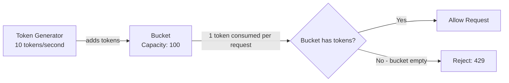
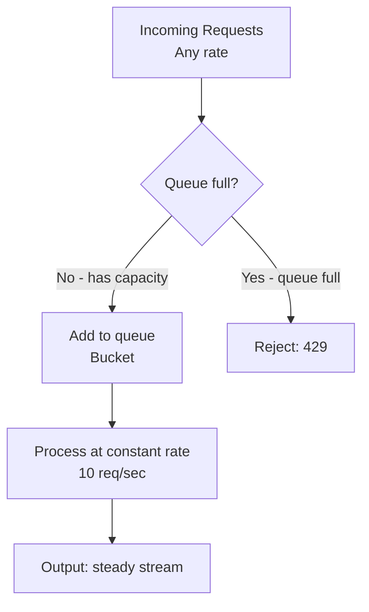
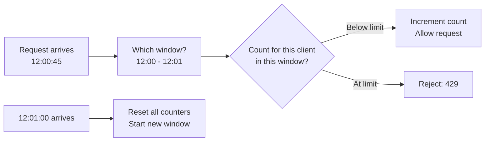
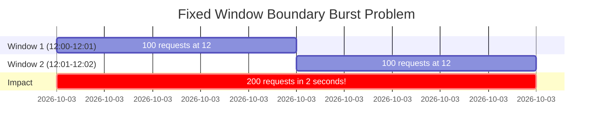
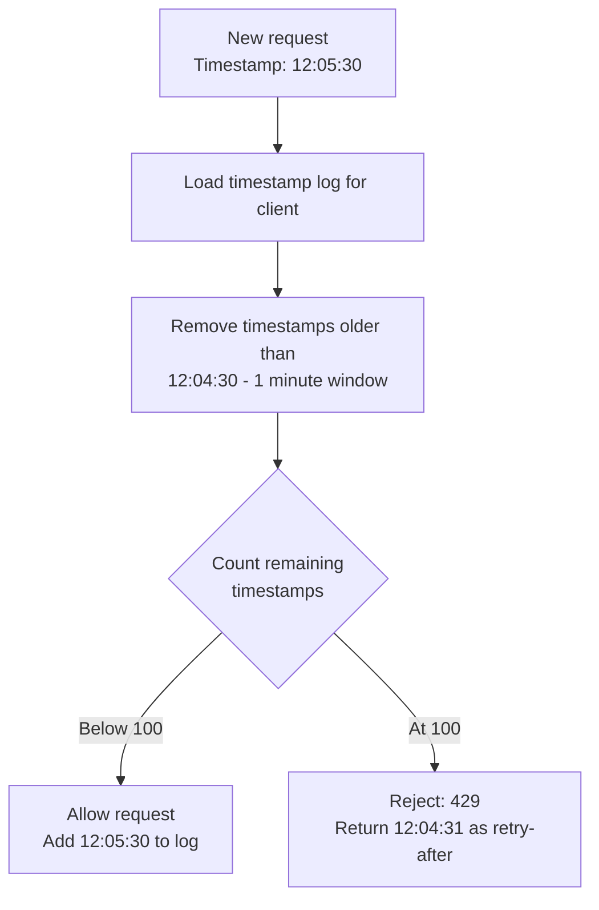
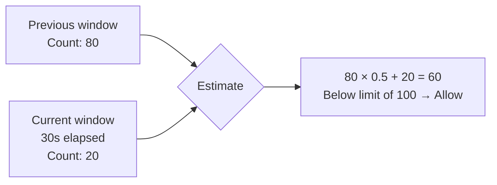
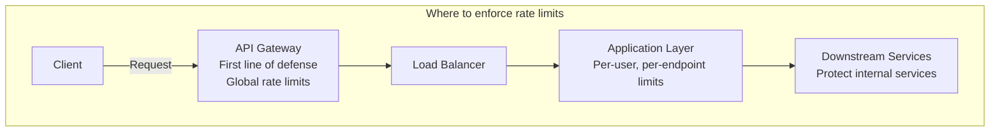
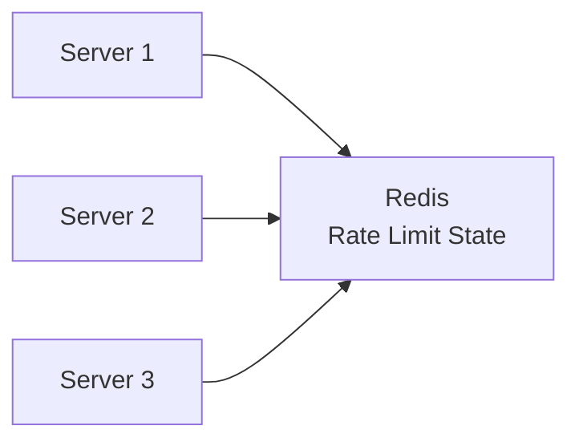

# Rate Limiting

## Why This Topic Exists

Imagine you run a popular API. One afternoon, a client accidentally deploys a bug — an infinite retry loop that sends 10,000 requests per second to your service. Within minutes, your servers are overwhelmed. Every other client's requests are timing out. Your system is down.

Or imagine a malicious actor launches a DDoS (Distributed Denial of Service) attack — millions of requests from thousands of IPs, designed to exhaust your resources and make your service unavailable to legitimate users.

Or imagine a "free tier" user discovers they can scrape your entire database by making requests constantly, consuming resources they are not paying for.

All three scenarios share a common problem: uncontrolled request rates destroy system reliability. Rate limiting is the solution.

Rate limiting controls how many requests a client can make within a time period. It is a fundamental building block of production APIs — virtually every public API in the world implements it. Understanding rate limiting algorithms is essential for designing reliable systems and for answering system design interview questions.

---

## Learning Objectives

- Explain why rate limiting is essential for system reliability and fairness
- Describe five rate limiting algorithms: token bucket, leaky bucket, fixed window counter, sliding window log, sliding window counter
- Compare the trade-offs of each algorithm in a table
- Identify where in the system architecture to enforce rate limits
- Apply rate limiting to real API design decisions

---

## Prerequisites

- [Availability and SLAs](./01.%20Availability%20and%20SLAs%20(BEGINNER).md) — Rate limiting protects the availability you are promising
- [Fault Tolerance Patterns](./02.%20Fault%20Tolerance%20Patterns%20(INTERMEDIATE).md) — Rate limiting prevents overload failures

---

## Introduction

Rate limiting is not just about blocking malicious users. It serves multiple purposes:

1. **System protection:** Prevent any single client from overwhelming shared infrastructure
2. **Fairness:** Ensure all clients get equitable access to resources
3. **Cost control:** Prevent runaway automated processes from generating enormous cloud bills
4. **Quality of service:** Ensure that premium clients get better service than free-tier clients
5. **DDoS mitigation:** Make large-scale attacks harder (not a complete solution, but a layer of defense)

When a rate limit is exceeded, the server typically responds with HTTP 429 Too Many Requests, often with a `Retry-After` header indicating when the client can try again.

---

## Real-World Analogy

**Token bucket** — think of a coffee shop with a loyalty punch card that gives you 10 drinks per week. The card refills every Monday. You can have all 10 drinks on Monday if you want, or spread them throughout the week. Once you have used all 10, you wait until Monday for more.

**Leaky bucket** — think of a water tank with a hole in the bottom. You can pour water in as fast as you want, but it only drains through the hole at a constant rate. If you pour too fast, the tank overflows and water is lost.

**Fixed window** — think of a parking garage that allows 100 cars per hour. At the top of each hour, the counter resets. If 100 cars arrive in the first 10 minutes, the next 50 minutes the gate stays closed. No matter when in the hour you arrived, the window is the same for everyone.

**Sliding window** — think of a bouncer at a club who keeps track of the last 100 people who entered. If you want to enter and the last 100 entries were in the past hour, you have to wait. If some of those entries were over an hour ago, there is room for new arrivals. The window "slides" with time.

---

## Core Concepts

### Why HTTP 429 and Not Other Codes?

When a rate limit is exceeded, the correct HTTP response is **429 Too Many Requests**. This is explicit and allows clients to implement proper backoff.

A well-designed rate-limited API includes these headers in the 429 response:
```
HTTP/1.1 429 Too Many Requests
Retry-After: 60
X-RateLimit-Limit: 100
X-RateLimit-Remaining: 0
X-RateLimit-Reset: 1704067200
```

These headers tell the client:
- `Retry-After`: wait 60 seconds before retrying
- `X-RateLimit-Limit`: your limit is 100 requests per window
- `X-RateLimit-Remaining`: you have 0 requests left in this window
- `X-RateLimit-Reset`: the window resets at this Unix timestamp

---

## The Five Rate Limiting Algorithms

### Algorithm 1: Token Bucket

**How it works:**
- A "bucket" holds tokens, up to a maximum capacity (e.g., 100 tokens)
- Tokens are added to the bucket at a constant rate (e.g., 10 tokens per second)
- Each incoming request consumes one token
- If the bucket has tokens: request is allowed, one token removed
- If the bucket is empty: request is rejected (429)
- The bucket never exceeds its maximum capacity (tokens "overflow")



**Allows bursting:** If a client has been quiet for a while, tokens accumulate. They can then burst — send many requests quickly — up to the bucket capacity. This is often desirable: a client that was inactive for 10 seconds can send up to 100 requests rapidly (the accumulated tokens), reflecting real usage patterns like a user opening an app and loading many things at once.

**Properties:**
- Smooth average rate: requests cannot exceed token generation rate in the long run
- Allows short bursts: up to bucket capacity
- Memory efficient: just store the current token count and last refill time per client
- Can handle multiple consuming rates (e.g., some operations cost 1 token, expensive operations cost 10)

**Used by:** AWS API Gateway, Stripe, most major cloud providers

---

### Algorithm 2: Leaky Bucket

**How it works:**
- Requests enter a queue (the "bucket")
- Requests are processed (leak) from the queue at a constant rate
- If the queue is full, new requests are rejected
- Regardless of how fast requests arrive, they leave at a steady rate



**Smooths traffic:** Unlike token bucket, leaky bucket produces a perfectly steady outflow regardless of burstiness in input. This is ideal when the downstream service cannot handle any burst — you want a constant, predictable request rate.

**Properties:**
- Guaranteed constant output rate — ideal for protecting sensitive downstream systems
- Does NOT allow bursting — even if you have been quiet, you cannot send a burst
- Queue can introduce latency for requests waiting in line
- Requests in queue may wait and then expire (timeout)

**Difference from token bucket:** Token bucket smooths the average but allows bursts. Leaky bucket forces a constant output rate regardless of input pattern.

---

### Algorithm 3: Fixed Window Counter

**How it works:**
- Divide time into fixed windows (e.g., each minute: 12:00-12:01, 12:01-12:02, ...)
- Count requests per client per window
- If count exceeds limit, reject requests until the next window
- At the start of each window, reset all counters to zero



**Simple to implement:** Just a counter per client per time window. Easy to store in Redis with TTL.

**The boundary burst problem:** This algorithm has a well-known weakness. A client can send the maximum allowed requests at the very end of one window and the maximum again at the very start of the next window, effectively doubling the allowed rate at the window boundary.

Example: Limit is 100 requests per minute.
- Client sends 100 requests at 12:00:59 (end of first window)
- Window resets at 12:01:00
- Client sends 100 requests at 12:01:00 (start of second window)
- In a 2-second span, the client sent 200 requests — double the intended limit



---

### Algorithm 4: Sliding Window Log

**How it works:**
- For each client, maintain a log (list) of the exact timestamps of recent requests
- When a new request arrives, remove all entries older than the window size
- Count remaining entries. If count is below limit, allow and add the current timestamp. If at limit, reject.



**Perfectly accurate:** No boundary burst problem. At any point in time, the request count over the past minute is exactly correct.

**Memory intensive:** Storing exact timestamps for every request is expensive. For a client sending 1000 requests per minute, you store 1000 timestamps per client. At scale (millions of clients), this is significant.

**Used when:** Accuracy is critical and the number of clients is manageable.

---

### Algorithm 5: Sliding Window Counter

**How it works:**

A hybrid approach that approximates the sliding window log without storing every timestamp.

- Maintain a counter for the current fixed window and the previous fixed window
- When processing a new request, calculate the estimated request count as a weighted combination:

```
estimated_count = 
  (previous_window_count × fraction of previous window still in the current window)
  + current_window_count
```

Example: Limit is 100 requests per minute. Window is 12:00-12:01.
- Previous window (11:59-12:00) had 80 requests
- Current window (12:00-12:01, 30 seconds in) has 20 requests
- Current time is 30 seconds into the current window, so 50% of the previous window is still "in range"
- Estimated count = (80 × 0.5) + 20 = 40 + 20 = 60 requests

If this is below 100, allow. This gives a much more accurate estimate than fixed window without storing every timestamp.



**Best of both worlds:** Accurate (close to sliding window log), memory efficient (just two counters), and handles the boundary burst problem well.

**Slight approximation:** The "fraction of previous window" is a linear approximation of actual traffic patterns, which are rarely uniform. But in practice, this approximation is close enough for nearly all use cases.

---

## Comparison Table

| Algorithm | Accuracy | Memory Usage | Allows Bursting | Complexity | Best For |
|---|---|---|---|---|---|
| Token Bucket | High | Low (2 values per client) | Yes | Low | Most APIs — balanced burst + average |
| Leaky Bucket | High | Medium (queue per client) | No | Medium | Downstream protection — constant rate |
| Fixed Window Counter | Low (boundary burst) | Very low (1 counter + TTL) | Yes (at boundary) | Very low | Simple use cases, internal APIs |
| Sliding Window Log | Perfect | High (timestamps per client) | No | Medium | When accuracy is critical |
| Sliding Window Counter | High (approximate) | Low (2 counters per client) | No | Medium | General purpose, production APIs |

---

## Visual Diagram (Mermaid)



---

## Deep Explanation

### Where to Implement Rate Limiting

Rate limiting can be enforced at multiple layers, and the right choice depends on what you are protecting against.

**API Gateway (e.g., AWS API Gateway, Kong, Nginx)**
- Best for: Global rate limits, DDoS protection, IP-based blocking
- Advantages: Catches requests before they reach application servers, protects all services uniformly
- Disadvantages: May not have access to user identity for user-specific limits

**Application Layer**
- Best for: Per-user, per-endpoint, per-plan limits based on authenticated identity
- Advantages: Full context (who the user is, what plan they are on, what operation they are doing)
- Disadvantages: Requests have already consumed resources (routing, authentication) before being rejected

**Infrastructure Layer (e.g., Cloudflare, AWS Shield)**
- Best for: Large-scale DDoS mitigation, geographic blocking
- Advantages: Stops traffic before it reaches your infrastructure entirely
- Disadvantages: Too blunt for application-specific rate limiting

In most production systems, you have rate limiting at multiple layers:
1. Infrastructure layer: blocks obviously malicious traffic (millions of requests/second from one IP)
2. API Gateway: enforces plan-based limits (100 requests/minute for free tier, 1000 for paid)
3. Application layer: enforces per-user, per-endpoint limits with business logic

---

### Distributed Rate Limiting

When your application runs on multiple servers, each server must share rate limit state. Without sharing, a client can make N requests per server and effectively multiply their allowed rate by the number of servers.

**The solution: centralized state store (Redis)**

All servers increment and check the same counter in Redis. Redis is fast enough (microseconds per operation) that the overhead of a Redis round-trip per request is acceptable.



**Redis atomic operations for rate limiting:**
- `INCR key` — atomically increment counter
- `EXPIRE key seconds` — set TTL on the counter
- `EVAL` — execute Lua script atomically (check + increment in one operation)

For token bucket in Redis:
```
current_tokens, last_refill = GET token_state_for_client
refill_amount = (now - last_refill) * refill_rate
current_tokens = min(capacity, current_tokens + refill_amount)
if current_tokens >= 1:
    current_tokens -= 1
    SET token_state = (current_tokens, now)
    ALLOW
else:
    DENY
```

---

### Twitter API Rate Limits: A Real Example

Twitter's API uses a rate limiting system that reflects real-world complexity:

- **Different limits per endpoint:** Reading tweets is limited separately from posting tweets. You might be allowed 300 GET requests per 15 minutes but only 300 POST requests per 3 hours.
- **Different limits per authentication level:** App-only auth gets higher limits than user auth for read operations.
- **Different limits per API tier:** The Basic tier gets 1 million tweet reads per month; Enterprise gets custom limits.
- **Response headers on every call:** Every Twitter API response includes headers showing current limit, remaining requests, and reset time.

```
X-Rate-Limit-Limit: 300
X-Rate-Limit-Remaining: 147
X-Rate-Limit-Reset: 1704067200
```

This gives well-behaved API clients the information they need to pace their requests and avoid hitting limits.

---

## Step-by-Step Example

**Scenario:** Design rate limiting for a public weather API. Free tier: 100 requests/day. Paid tier: 10,000 requests/day. Enterprise: unlimited.

**Step 1: Choose algorithm**

Daily limits are well-suited to fixed window counter (per-day window). The boundary burst problem (requests at midnight) is acceptable for a weather API.

**Step 2: Choose where to enforce**

API Gateway handles authentication and routing. Implement rate limiting at the API Gateway layer, keyed on the user's API key.

**Step 3: Design the counter structure**

Redis key: `rate_limit:{api_key}:{date}` (e.g., `rate_limit:key_abc123:2024-01-15`)
- Set with `INCR` on each request
- Set `EXPIRE` to 86400 seconds (24 hours) on first creation

**Step 4: Logic on each request**
```
key = "rate_limit:{api_key}:{today}"
count = INCR(key)
if count == 1:
    EXPIRE(key, 86400)  # Set TTL on first request of the day

limit = get_limit_for_user(api_key)  # 100 / 10000 / unlimited

if count > limit:
    return 429, headers: {
        "X-RateLimit-Limit": limit,
        "X-RateLimit-Remaining": 0,
        "X-RateLimit-Reset": tomorrow_midnight_unix_timestamp,
        "Retry-After": seconds_until_midnight
    }
else:
    return process_request(), headers: {
        "X-RateLimit-Limit": limit,
        "X-RateLimit-Remaining": limit - count
    }
```

**Step 5: Handle edge cases**
- Race condition: `INCR` in Redis is atomic, so no race condition
- Clock skew between servers: all servers use the same Redis clock
- Redis failure: decide your fallback policy (fail open — allow requests, or fail closed — reject requests). For a weather API, fail open is appropriate.

---

## Advantages / Disadvantages / Trade-offs

| Aspect | Benefit | Risk |
|---|---|---|
| DDoS protection | Absorbs attack traffic | Does not prevent sophisticated attacks |
| Fairness | Prevents one client from hogging resources | Can frustrate legitimate high-volume users |
| Cost control | Prevents runaway automation bills | May limit legitimate batch workloads |
| Quality of service | Premium users get better service | Need to maintain per-user state |
| Redis dependency | Fast, centralized state | Redis failure affects all rate limiting |

---

## When to Use / When NOT to Use

**Always implement rate limiting for:**
- Public APIs accessible by external clients
- APIs that trigger expensive operations (ML inference, report generation)
- APIs that access billable resources (database queries, cloud storage)

**Choose the right algorithm:**
- Most APIs: token bucket (allows natural bursting, easy to implement)
- Protecting fragile downstream services: leaky bucket (constant output rate)
- Simple internal tools: fixed window counter (easy, acceptable accuracy)
- Financial or compliance APIs: sliding window log (perfect accuracy)
- Production public APIs: sliding window counter (accurate + memory efficient)

**Do NOT rate limit harshly in:**
- Internal health checks (health check endpoints should be exempt from rate limiting)
- Your own monitoring and alerting systems
- Critical safety-related operations

---

## Common Interview Questions

**Q: What is the difference between token bucket and leaky bucket?**

A: Token bucket allows bursting — a client can accumulate tokens during quiet periods and spend them quickly. Leaky bucket enforces a perfectly constant output rate regardless of input rate. Token bucket is better for most APIs (natural usage is bursty). Leaky bucket is better when the downstream system absolutely cannot handle any burst.

**Q: What is the boundary burst problem with fixed window rate limiting?**

A: A client can send the full allowed rate at the end of window N and again at the start of window N+1, effectively doubling their allowed rate in a short period. Sliding window algorithms eliminate this by using a window that moves continuously with time.

**Q: Where should rate limiting be implemented in a microservices architecture?**

A: At multiple layers. The API Gateway enforces plan-based limits and blocks obvious abuse. Individual services may enforce their own limits to protect against internal misuse. Infrastructure-level tools (Cloudflare, AWS Shield) handle large-scale DDoS. Each layer catches different classes of problems.

**Q: How do you implement distributed rate limiting when requests can go to any of N servers?**

A: Use a centralized state store (typically Redis). All servers check and update the same counters. Redis's atomic INCR operation prevents race conditions. The trade-off is that every rate limit check requires a Redis round-trip.

---

## Common Beginner Mistakes

**Mistake 1: Implementing rate limiting per server instead of globally**
With 10 servers and a 100 request/minute limit enforced per server, clients can make 1000 requests/minute by spreading requests across servers. Rate limit state must be shared (Redis).

**Mistake 2: Not including rate limit headers in responses**
Well-behaved clients need to know their current usage to pace requests. Without headers like `X-RateLimit-Remaining`, clients cannot self-throttle and will keep hitting 429 errors.

**Mistake 3: Applying the same limits to all endpoints**
Reading a user profile and generating a large report have very different server costs. Rate limit by endpoint and by cost, not just by client.

**Mistake 4: Forgetting to exempt internal systems**
Health checks, monitoring, and alerting systems that hit 429 errors will misreport false positives. Exempt internal system IPs and credentials from rate limiting.

**Mistake 5: Not having a strategy for Redis failure**
If Redis goes down, your rate limiting layer fails. Decide your policy: fail open (allow all requests — risky during an attack), fail closed (reject all requests — risky for legitimate users), or degrade to per-server limiting.

---

## Summary

Rate limiting controls how many requests a client can make in a given time period, protecting systems from overload, abuse, and unfair resource consumption.

Five algorithms exist for implementing rate limits, each with different trade-offs:
- **Token bucket:** Allows bursting, efficient, ideal for most APIs
- **Leaky bucket:** Constant output rate, protects fragile downstream services
- **Fixed window counter:** Simple but has boundary burst problem
- **Sliding window log:** Perfect accuracy, high memory cost
- **Sliding window counter:** Approximate accuracy, memory efficient — best general-purpose choice

Rate limiting should be implemented at multiple layers (infrastructure, API gateway, application) for defense in depth. Centralized state (Redis) is required for distributed rate limiting across multiple servers.

Twitter's tiered rate limiting — different limits per endpoint, per authentication type, and per subscription plan — illustrates how real-world systems combine multiple dimensions of rate limiting.

---

## Key Takeaways

- Without rate limiting, one client can bring down your entire system.
- Token bucket allows bursting (tokens accumulate). Leaky bucket forces constant rate (no bursting).
- Fixed window is simple but has boundary burst problem. Sliding window fixes it.
- Rate limit state must be shared across servers — use Redis.
- Always include rate limit headers in responses so clients can self-throttle.
- Rate limit at multiple layers: infrastructure → API gateway → application.
- HTTP 429 Too Many Requests is the correct response code for rate limit violations.

---

## Related Topics (Relative Markdown Links)

- [Chapter Overview](./README.md)
- [Availability and SLAs](./01.%20Availability%20and%20SLAs%20(BEGINNER).md) — Rate limiting protects the availability you are promising
- [Fault Tolerance Patterns](./02.%20Fault%20Tolerance%20Patterns%20(INTERMEDIATE).md) — Rate limiting is a layer of protection alongside circuit breakers
- [Idempotency](./05.%20Idempotency%20(INTERMEDIATE).md) — Rate limited clients retry — idempotency makes those retries safe
