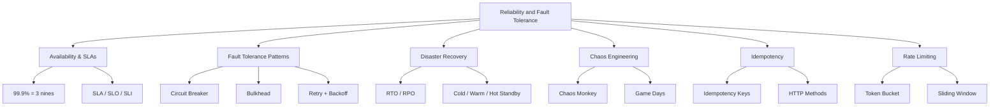

# Chapter 11: Reliability and Fault Tolerance

## Why This Chapter Exists

Every system will fail at some point. Servers crash. Networks drop. Databases slow down. Hard drives die. The question is not "will something go wrong?" — the question is "what happens when something goes wrong?"

A reliable system is one that keeps working even when parts of it break. A fault-tolerant system is one that handles failures gracefully instead of collapsing entirely.

This chapter teaches you how to build systems that your users can depend on — systems that stay online, recover quickly, and degrade gracefully instead of falling apart.

---

## Learning Objectives

By the end of this chapter, you will be able to:

- Define availability and explain what "five nines" means in practice
- Read and write SLA, SLO, and SLI definitions
- Apply fault tolerance patterns like circuit breakers, bulkheads, and retries
- Choose the right disaster recovery strategy for a given business requirement
- Explain chaos engineering and why breaking things on purpose makes systems stronger
- Design idempotent APIs that are safe to retry
- Implement rate limiting using the right algorithm for your use case

---

## Who This Chapter Is For

This chapter is for engineers who want to go beyond "it works on my machine" and build systems that work in the real world — under traffic, under failure, under pressure.

| Level | What You Will Get |
|-------|-------------------|
| Beginner | Understanding of availability numbers, SLAs, and why reliability matters |
| Intermediate | Practical patterns for handling failures in distributed systems |
| Advanced | Confidence answering reliability questions in staff-level system design interviews |

---

## Chapter Overview

### Topic 1: Availability and SLAs (Beginner)

**File:** [01. Availability and SLAs (BEGINNER).md](./01.%20Availability%20and%20SLAs%20(BEGINNER).md)

**Summary:** Availability is the percentage of time a system is working. 99% sounds excellent until you realize it means 87 hours of downtime per year. This file covers the "nines" of availability (99%, 99.9%, 99.99%, 99.999%), what each level means in real downtime hours, and how systems composed of multiple components compound their availability. It also covers SLA (Service Level Agreement), SLO (Service Level Objective), and SLI (Service Level Indicator) — the three key terms that define reliability contracts between systems and their users.

**Key Concepts:** Availability nines, series vs parallel availability, SLA/SLO/SLI

---

### Topic 2: Fault Tolerance Patterns (Intermediate)

**File:** [02. Fault Tolerance Patterns (INTERMEDIATE).md](./02.%20Fault%20Tolerance%20Patterns%20(INTERMEDIATE).md)

**Summary:** When a service you depend on starts failing, what does your system do? Does it crash? Does it wait forever? Does it bring down every other service with it? Fault tolerance patterns are proven strategies for isolating failures and keeping the rest of your system running. This file covers redundancy, failover, circuit breakers, bulkheads, timeouts, retry with exponential backoff, and fallback responses — with real examples from Netflix's Hystrix library.

**Key Concepts:** Circuit breaker, bulkhead, retry with backoff, fallback, timeout

---

### Topic 3: Disaster Recovery (Intermediate)

**File:** [03. Disaster Recovery (INTERMEDIATE).md](./03.%20Disaster%20Recovery%20(INTERMEDIATE).md)

**Summary:** When an entire data center goes offline — fire, flood, earthquake, power failure — how quickly can you restore service? How much data can you afford to lose? Disaster recovery planning answers these questions before disaster strikes. This file covers RTO (Recovery Time Objective), RPO (Recovery Point Objective), four DR strategies ranked from cheapest to most expensive, backup approaches, and geo-redundancy with real AWS examples.

**Key Concepts:** RTO, RPO, cold standby, warm standby, hot standby, pilot light, backup strategies

---

### Topic 4: Chaos Engineering (Intermediate)

**File:** [04. Chaos Engineering (INTERMEDIATE).md](./04.%20Chaos%20Engineering%20(INTERMEDIATE).md)

**Summary:** Netflix engineers randomly kill servers in production — on purpose. This is called chaos engineering, and it is one of the most powerful reliability practices in the industry. The idea is simple: if your system can survive controlled failures during business hours, when your team is watching and ready to respond, it will survive real failures at 3am. This file covers the chaos engineering loop, Netflix's Simian Army tools, Game Days, and how breaking things deliberately makes systems stronger.

**Key Concepts:** Chaos Monkey, Simian Army, Game Days, chaos experiment loop, failure injection

---

### Topic 5: Idempotency (Intermediate)

**File:** [05. Idempotency (INTERMEDIATE).md](./05.%20Idempotency%20(INTERMEDIATE).md)

**Summary:** When a network call fails, you do not know if the server received your request before failing. So you retry. But what if the server did receive it? Did you just charge the customer twice? Idempotency is the property that makes retries safe — calling an operation multiple times has the same effect as calling it once. This file covers why idempotency is critical, which HTTP methods are naturally idempotent, and how to implement idempotency keys for operations that are not naturally safe to repeat.

**Key Concepts:** Idempotency keys, HTTP idempotency, upsert patterns, Stripe's idempotency header, deduplication

---

### Topic 6: Rate Limiting (Intermediate)

**File:** [06. Rate Limiting (INTERMEDIATE).md](./06.%20Rate%20Limiting%20(INTERMEDIATE).md)

**Summary:** Without rate limiting, a single misbehaving client — or an attacker — can send millions of requests and bring your entire system down. Rate limiting controls how many requests a client can make in a time period. This file covers five rate limiting algorithms (token bucket, leaky bucket, fixed window, sliding window log, sliding window counter), compares their trade-offs in a table, and explains where to enforce rate limits in your architecture.

**Key Concepts:** Token bucket, leaky bucket, fixed window, sliding window, API gateway rate limiting

---

## How to Use This Chapter

**If you are new to reliability concepts**, start with Topic 1 (Availability and SLAs) and read straight through. Each topic builds on the previous one.

**If you are preparing for a system design interview**, pay special attention to the "Common Interview Questions" sections in each file. These are the exact questions interviewers ask about reliability.

**If you are designing a real system**, jump directly to the topic that matches your current problem — the files are written to be self-contained.

---

## Key Reliability Principles (Preview)

Before diving in, here are five core ideas that run through this entire chapter:

1. **Assume everything will fail.** Networks drop, servers crash, dependencies slow down. Design for it.
2. **Fail fast.** A system that fails quickly and loudly is easier to fix than one that fails silently and slowly.
3. **Isolate failures.** One broken component should not be able to break everything else.
4. **Make operations safe to retry.** Idempotency means retries cannot cause duplicate side effects.
5. **Test your failures.** If you have never seen your system fail, you do not know how it will fail.

---

## Chapter Diagram

---

## Related Chapters

- [Chapter 4: Caching](../04.%20Caching/README.md) — Caching can serve as a fallback when the database is down
- [Chapter 6: Load Balancing](../06.%20Load%20Balancing/README.md) — Load balancers enable failover and redundancy
- [Chapter 9: Databases](../09.%20Databases/README.md) — Database replication is a core reliability technique
- [Chapter 12: Monitoring and Observability](../12.%20Monitoring%20and%20Observability/README.md) — You cannot fix what you cannot see
