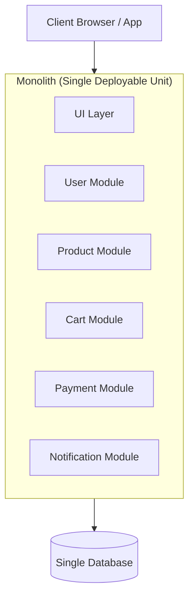
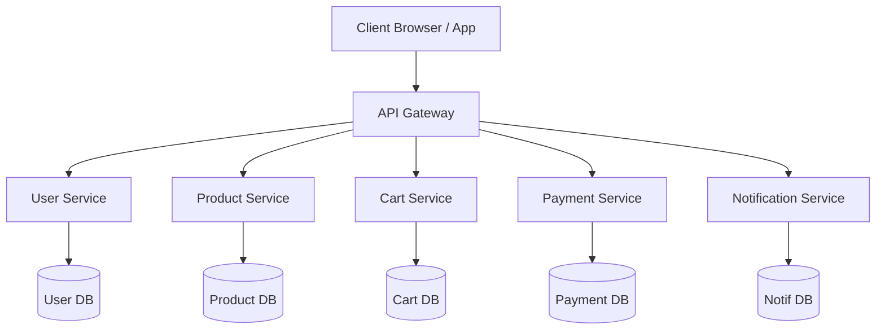
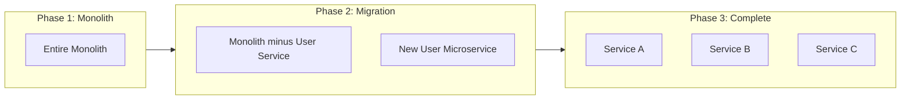

# Monolith vs Microservices

## Why This Topic Exists

Every application starts small. A startup builds one codebase, one database, one deployable unit. This works great — until it doesn't. When you have 200 engineers pushing code to the same repository, every deployment becomes a high-risk event. A bug in the billing module can crash the entire platform. One slow team blocks everyone else.

Microservices emerged as the answer to this scaling problem. But like all architectural decisions, they come with trade-offs. Understanding when to use microservices — and when not to — is what separates a good engineer from a great one.

## Learning Objectives

- Explain what a monolithic architecture is and its pros and cons
- Explain what microservices are and how they differ from a monolith
- Describe the Strangler Fig migration pattern
- Know Martin Fowler's rule: "Don't start with microservices"
- Recognize when an organization is ready for microservices

## Prerequisites

- Basic understanding of web applications (frontend, backend, database)
- Basic understanding of [horizontal vs vertical scaling](../03.%20Scalability/README.md)

## Introduction

Imagine you are building an e-commerce website like Amazon. In the beginning you have a product catalog, a cart, payments, and user accounts. You build it all in one application. One codebase, one database, one server. This is a **monolith**.

Now fast-forward five years. You have 500 engineers, 50 teams, and millions of customers. The payment team made a change that broke the search feature. A Black Friday deployment took the whole site down because of a bug in the recommendation engine. The catalog team wants to rewrite their service in Go, but everything is in Java.

This is why companies like Netflix, Amazon, and Uber moved to **microservices** — not for technical reasons, but for organizational ones.

## Real-World Analogy

Think of a **Swiss Army knife** versus a **set of specialized tools**.

A Swiss Army knife is a monolith: one compact unit that does everything — knife, scissors, screwdriver, can opener. It is perfect for a camping trip (small teams, simple needs). But a professional chef, carpenter, and surgeon all need specialized, high-quality tools for their specific jobs.

Microservices are like specialized tools: each one does one thing exceptionally well, can be upgraded independently, and can be replaced without affecting the others. The downside? You need a toolbox to organize them, and the toolbox itself becomes complex to manage.

## Core Concepts

### What Is a Monolith?

A monolith is a single deployable unit where all functionality lives together. All the code runs as one process. There are three types:

| Type | Description |
|------|-------------|
| **Single-process monolith** | All code in one process on one machine |
| **Modular monolith** | Code split into modules internally, but still deployed as one unit |
| **Distributed monolith** | Multiple services that must be deployed together — worst of both worlds |

### What Are Microservices?

Microservices is an architectural style where an application is built as a collection of small, independent services that:

- Run in their own process
- Have their own database (database per service)
- Communicate over the network (HTTP, gRPC, message queues)
- Can be deployed independently
- Are owned by a single team

The key insight: each microservice is a **mini-application** with its own lifecycle.

## Visual Diagram (Mermaid)

### Monolithic Architecture

### Microservices Architecture

## Deep Explanation

### Monolith: The Full Picture

**Advantages of a monolith:**

- **Simple to develop**: All code is in one place, easy to run locally, easy to debug. No network calls between modules.
- **Simple to test**: You can write end-to-end tests against a single process. No need to mock remote services.
- **Simple to deploy**: One artifact to build, one thing to push, one thing to roll back.
- **High performance**: Module-to-module communication is a function call, not a network round trip.
- **No distributed system problems**: No partial failures, no eventual consistency headaches.

**Disadvantages of a monolith at scale:**

- **Deployment risk**: To deploy one module's change, you redeploy the entire application. If a bug slips through, everything goes down.
- **Slow deployments**: As the codebase grows, build and test times balloon. A 50-minute CI pipeline for a one-line bug fix is demoralizing.
- **Team bottleneck**: 50 teams all merging into one repository creates constant merge conflicts. A slow team blocks a fast team.
- **Technology lock-in**: You cannot use a different programming language or database for a specific module. You are stuck with the decisions made on day one.
- **Scaling inefficiency**: You cannot scale just the payment module — you must scale the entire application, even if only payments are under load.
- **Reliability**: A memory leak in the recommendation engine can crash the entire application, bringing down payments and user accounts with it.

### Microservices: The Full Picture

**Advantages of microservices:**

- **Independent deployment**: The payment team deploys 20 times a day without touching the catalog team.
- **Independent scaling**: Scale only the services under load. The video encoding service at a streaming company needs 100x more resources than the account settings service.
- **Technology freedom**: Each team picks the right tool. Recommendation engine in Python/ML, core API in Go, legacy reporting service stays in Java.
- **Fault isolation**: A bug in the recommendation service does not crash payments.
- **Team ownership**: Conway's Law — "Organizations design systems that mirror their communication structure." Small teams owning small services move faster.

**Disadvantages of microservices:**

- **Distributed system complexity**: Network calls fail. Services need retry logic, circuit breakers, timeouts. None of this exists in a monolith.
- **Data consistency**: No shared database means no ACID transactions across services. You need patterns like SAGA.
- **Operational overhead**: 50 services means 50 CI/CD pipelines, 50 monitoring dashboards, 50 places for bugs to hide.
- **Latency**: A single user request might chain through 10 services, each adding network latency.
- **Testing difficulty**: Integration testing across services requires a complex test environment.
- **Service discovery and communication**: Services need to find each other. You need an API Gateway, service registry, load balancer.

### The Organizational Requirement

Microservices do not just require technical changes — they require organizational maturity. You need:

- A DevOps culture (teams own their services end-to-end, including production)
- Mature CI/CD pipelines (automated testing, canary deployments)
- Strong observability (distributed tracing, centralized logging, metrics)
- Service ownership model (each service has a clear team that is on-call for it)

Without these, microservices create chaos, not speed.

## Step-by-Step Example

### How Netflix Migrated from Monolith to Microservices

**2007:** Netflix is a DVD-by-mail company launching streaming. They build a monolith — standard approach for a new product.

**2008:** A major database corruption event makes Netflix unavailable for 3 days. The monolith's shared database is a single point of failure.

**2009-2012:** Netflix begins migrating to microservices. They do not rewrite everything at once. Instead, they use the **Strangler Fig pattern**:

1. Identify a boundary in the monolith (e.g., user preferences)
2. Build a new microservice that handles user preferences
3. Redirect traffic from the monolith to the new service
4. Delete the old code from the monolith
5. Repeat for the next boundary

By 2012, Netflix had hundreds of microservices running on AWS. Their famous open-source tools — Hystrix (circuit breaker), Eureka (service discovery), Zuul (API gateway) — were all born from this migration.

**The result:** Netflix can now deploy thousands of times per day. A failure in the subtitle service does not affect video playback.

### The Strangler Fig Pattern

The Strangler Fig is a tree that grows around another tree and eventually replaces it. In software:

You never have a "big bang rewrite." You chip away at the monolith one service at a time. The monolith shrinks until it disappears.

## Advantages / Disadvantages / Trade-offs

| Dimension | Monolith | Microservices |
|-----------|----------|---------------|
| Development speed (small team) | Fast | Slow (infrastructure overhead) |
| Development speed (large team) | Slow (bottlenecks) | Fast (independence) |
| Deployment risk | High | Low per service |
| Operational complexity | Low | High |
| Scaling granularity | Coarse (all or nothing) | Fine (per service) |
| Fault isolation | Poor | Good |
| Data consistency | Easy (ACID) | Hard (eventual consistency) |
| Technology flexibility | None | High |
| Testing simplicity | Simple | Complex |
| Debugging | Easy | Hard (distributed tracing needed) |

## When to Use / When NOT to Use

### Use microservices when:

- You have multiple teams (ideally 5+ people per service — the "two-pizza team" rule)
- Parts of your system need to scale independently at very different rates
- You have different performance or technology requirements per service
- You need independent deployment velocity (teams should not block each other)
- You have a mature DevOps organization

### Do NOT use microservices when:

- You are building a new product or startup — the overhead slows you down
- You have one small team — a modular monolith is better
- You do not have CI/CD, monitoring, or on-call culture in place
- Your domain boundaries are unclear — premature decomposition creates the worst of both worlds (a "distributed monolith")
- You cannot build and operate the monolith effectively

**Martin Fowler's Rule:** *"Don't start with microservices. Only consider microservices when you have problems managing complexity in a monolith."*

**Sam Newman's Rule:** *"If you can't build a monolith, you can't build microservices."*

## Common Interview Questions

**Q: What is the difference between a monolith and microservices?**
A monolith is a single deployable unit containing all functionality. Microservices split functionality into small, independent services that communicate over the network. The key trade-off is operational simplicity (monolith) vs deployment independence and scalability (microservices).

**Q: How would you migrate a monolith to microservices?**
Use the Strangler Fig pattern: identify a bounded context in the monolith, extract it as a new service, redirect traffic, and delete the monolith code. Repeat incrementally. Never do a big-bang rewrite.

**Q: What are the drawbacks of microservices?**
Distributed system complexity (network failures, partial failures), data consistency challenges (no cross-service ACID), high operational overhead (50 services = 50 CI/CD pipelines), increased latency, and difficult integration testing.

**Q: What is a "distributed monolith"?**
A system that looks like microservices (multiple services, network calls) but behaves like a monolith — you must deploy all services together because they are tightly coupled. This is the worst possible architecture: you get the drawbacks of both without the benefits of either.

**Q: When would you recommend a monolith over microservices?**
For new products, small teams, or teams without strong DevOps culture. A monolith is faster to build, simpler to operate, and easier to refactor. Start with a well-structured modular monolith and extract services when specific pain points emerge.

## Common Beginner Mistakes

**Mistake 1: Splitting too early and too finely**
Creating 50 microservices for a 3-person team is not a good idea. The overhead of service discovery, API gateways, distributed tracing, and inter-service communication drowns you. Start with 3-5 services at most.

**Mistake 2: Sharing a database between microservices**
If Service A and Service B share the same database table, they are not independent. A schema change by Team A breaks Team B. Each microservice must own its own database.

**Mistake 3: Synchronous calls everywhere**
Chaining 10 synchronous HTTP calls for one user request means a failure anywhere breaks the whole request. Use async messaging (queues) where possible and design for partial failure.

**Mistake 4: Ignoring the organizational requirement**
Microservices require team ownership, on-call rotations, CI/CD pipelines, and observability tooling. Deploying microservices without these in place creates a maintenance nightmare.

**Mistake 5: Confusing microservices with "small services"**
The "micro" in microservices is about responsibility, not lines of code. A service that owns the user domain might have 50,000 lines of code. What matters is that it has a single, clear responsibility and is owned by one team.

## Summary

A monolith is a single deployable application — simple to build but hard to scale for large organizations. Microservices decompose applications into small, independent services owned by separate teams. The trade-off is deployment independence and scalability in exchange for significant infrastructure and operational complexity.

Never start with microservices. Use the Strangler Fig pattern to migrate from a monolith when you have clear pain points. Microservices require organizational maturity: strong DevOps culture, CI/CD pipelines, and good observability.

## Key Takeaways

- A monolith is one deployable unit; microservices are many independent units
- Microservices solve **organizational** scaling problems, not just technical ones
- Conway's Law: your architecture will mirror your team structure
- The Strangler Fig pattern: migrate incrementally, never big-bang rewrite
- "Don't start with microservices" — Martin Fowler
- Each microservice must have its own database (database per service pattern)
- Microservices trade code complexity for infrastructure complexity

## Related Topics (relative markdown links)

- [README - Chapter Overview](./README.md)
- [Service Discovery](./02.%20Service%20Discovery%20%28INTERMEDIATE%29.md)
- [API Gateway](./03.%20API%20Gateway%20%28INTERMEDIATE%29.md)
- [Containers and Docker](./06.%20Containers%20and%20Docker%20%28BEGINNER%29.md)
- [Chapter 9: Message Queues](../09.%20Message%20Queues/README.md)
- [Chapter 10: Consistency and Consensus](../10.%20Consistency%20and%20Consensus/README.md)
