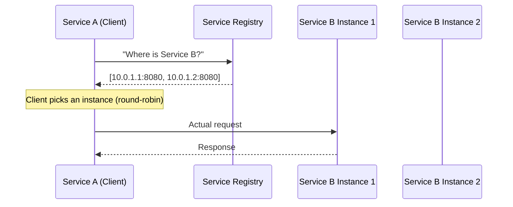
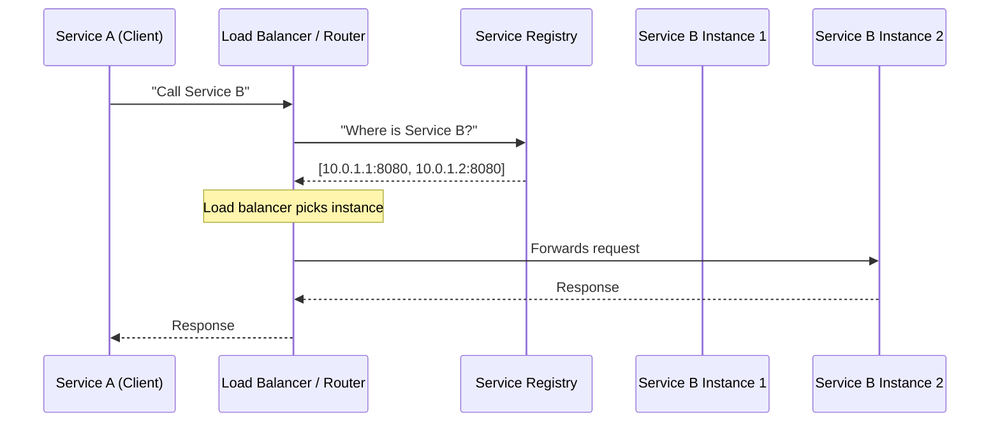
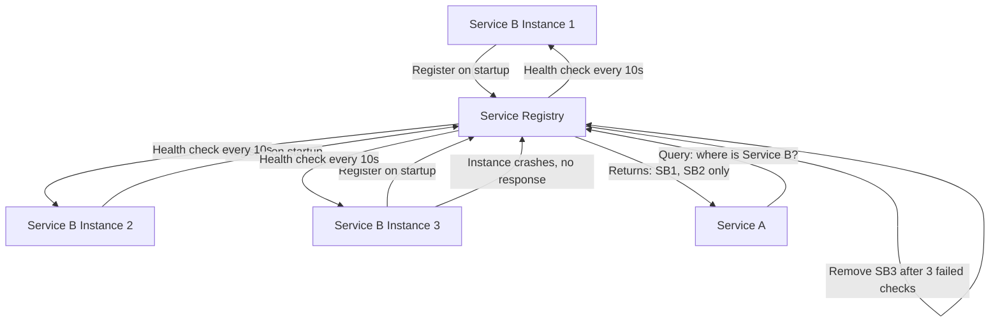
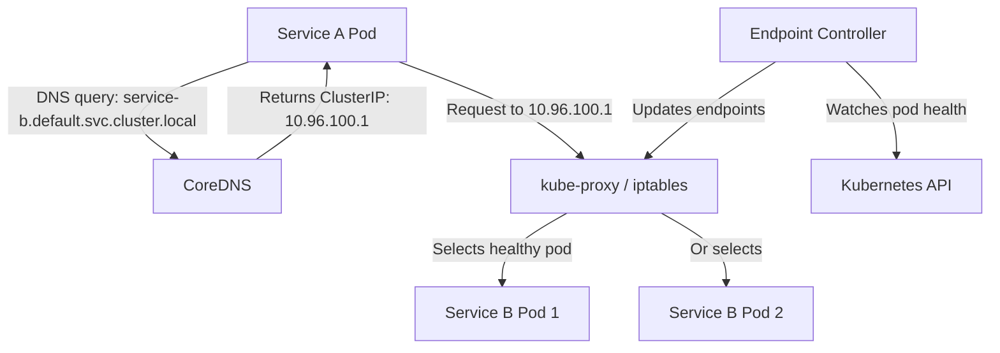

# Service Discovery

## Why This Topic Exists

In a microservices system, Service A needs to call Service B. In a monolith, this is a function call — zero configuration needed. In microservices, it is a network call, which means you need an IP address and a port number.

The problem: in cloud environments, servers come and go. Services scale up and down. A container running Payment Service at IP `10.0.2.47:8080` today might be gone tomorrow and replaced by three instances at different IPs. You cannot hardcode IP addresses.

Service discovery is the mechanism by which services automatically find each other. It is the phone book of a microservices system.

## Learning Objectives

- Explain why service discovery is necessary in microservices
- Compare client-side and server-side discovery patterns
- Explain what a service registry is and how it works
- Describe how health checking works
- Explain how Kubernetes handles service discovery with kube-dns
- Know the tools: Eureka, Consul, etcd, AWS ALB

## Prerequisites

- [Monolith vs Microservices](./01.%20Monolith%20vs%20Microservices%20%28BEGINNER%29.md)
- Basic understanding of DNS (domain names resolve to IP addresses)
- Basic understanding of load balancing ([Chapter 6](../06.%20Load%20Balancing/README.md))

## Introduction

Imagine you are calling a friend. In the old days, you looked up their phone number in a phone book and dialed it. If they moved and got a new number, you would be calling the wrong person.

In microservices, the same problem exists at massive scale. There may be 20 instances of the Order Service running at any moment, spread across 5 servers. Three of them might crash, and 10 new ones might spin up. The API Gateway or the Inventory Service needs to know which Order Service instances are alive and where they are.

This is service discovery.

## Real-World Analogy

Think of a **taxi dispatch system** before Uber.

- You call the dispatch center and say "I need a taxi to 123 Main Street"
- The dispatch center checks which taxis are available, where they are, and assigns one to you
- You do not need to know each taxi's ID or location — the dispatch center knows

In service discovery:
- The **client** (Service A) asks "I need to reach the Payment Service"
- The **service registry** (dispatch center) responds with "Payment Service has instances at these IPs"
- The client connects to one of those instances

## Core Concepts

### The Problem: Dynamic Environments

In cloud deployments, especially with containers and auto-scaling:
- Instances start and stop constantly (containers are ephemeral)
- IP addresses are assigned dynamically
- The same service might have 2 instances at 9am and 20 instances at noon
- Instances can fail silently (the process crashed but no one cleaned up the registry)

You cannot manage this with static config files. You need an automated system.

### Service Registry

A service registry is a database that maps service names to their current live instances. Every service instance:
1. **Registers** itself when it starts up ("I am Payment Service v2, running at 10.0.3.5:8080")
2. **Sends heartbeats** regularly to prove it is still alive
3. **Deregisters** itself when it shuts down (or gets deregistered automatically when heartbeats stop)

Popular service registries:
| Tool | Description |
|------|-------------|
| **Eureka** | Netflix OSS, Java-based, client-side discovery |
| **Consul** | HashiCorp, multi-datacenter, supports DNS and HTTP |
| **etcd** | CNCF, key-value store, used internally by Kubernetes |
| **ZooKeeper** | Apache, older, complex but battle-tested |
| **AWS Cloud Map** | AWS-native service registry |

### Health Checking

A service that is registered but not responding is worse than no service at all — it causes errors for callers. Health checking solves this:

- **Active health check**: The registry probes each service instance (e.g., every 10 seconds, sends an HTTP GET `/health`)
- **Passive health check**: The load balancer marks a service unhealthy if it sees consecutive failures from callers
- **Heartbeat**: Each service instance sends a "I am alive" signal to the registry on a timer

If a service fails three health checks in a row, the registry removes it from the list of available instances.

## Visual Diagram (Mermaid)

### Client-Side Discovery

### Server-Side Discovery

### Service Registration and Health Check

## Deep Explanation

### Client-Side Discovery

In client-side discovery, the client (the calling service) is responsible for querying the service registry and choosing which instance to call.

**How it works:**
1. Service A needs to call Service B
2. Service A queries the service registry: "Give me all instances of Service B"
3. The registry returns a list: `[10.0.1.1:8080, 10.0.1.2:8080, 10.0.1.3:8080]`
4. Service A applies its own load-balancing logic (round-robin, least connections, etc.) and picks one
5. Service A calls that instance directly

**Netflix Eureka** is the classic example. Each service runs a Eureka client library that handles registration and lookups. The client library caches the registry locally so it does not need to query Eureka on every request.

**Pros:**
- Simple infrastructure (no extra hop through a router)
- Client can make intelligent routing decisions (pick geographically closest, pick lowest latency)
- Registry failure does not immediately break all requests (client has a local cache)

**Cons:**
- Client-side complexity: every service must implement discovery and load-balancing logic
- Every language/framework needs its own discovery library
- Harder to change discovery logic (must redeploy all services)

### Server-Side Discovery

In server-side discovery, the client sends requests to a fixed address (a load balancer or router). The load balancer queries the service registry and forwards the request to an available instance.

**How it works:**
1. Service A needs to call Service B
2. Service A sends a request to the load balancer for Service B (`service-b.internal:8080`)
3. The load balancer queries the service registry for available Service B instances
4. The load balancer picks an instance and forwards the request
5. The response comes back through the load balancer to Service A

**AWS Application Load Balancer (ALB)** with AWS Cloud Map, or **Kubernetes Services**, are examples of server-side discovery.

**Pros:**
- Client is simple — no discovery logic needed, just call a fixed address
- Works with any language or framework without a special library
- Load-balancing logic can be changed centrally without touching services

**Cons:**
- Extra network hop (load balancer adds latency)
- Load balancer becomes a potential bottleneck
- Must ensure the load balancer is highly available

### DNS-Based Service Discovery

The simplest form of server-side discovery uses DNS. Each service gets a DNS name. A DNS query returns the IP addresses of available instances (as A records) or a single hostname (as a CNAME that points to a load balancer).

**Pros:** Works with every language, framework, and tool — DNS is universal.
**Cons:** DNS has TTLs (time-to-live). If an instance dies, clients may continue routing to it until the DNS cache expires (can be 30 seconds or more). Fine-grained control is limited.

### How Kubernetes Does Service Discovery

Kubernetes uses a combination of server-side discovery and DNS, and it is the most widely used approach today.

**Kubernetes Services**: When you deploy a set of pods (containers), you create a Kubernetes Service object. The Service gets a stable IP address (called a ClusterIP) and a DNS name within the cluster.

**kube-dns / CoreDNS**: Kubernetes runs an in-cluster DNS server (CoreDNS). When Service A wants to call Service B, it uses the DNS name `service-b.namespace.svc.cluster.local`. CoreDNS resolves this to the Service's ClusterIP.

**kube-proxy**: Runs on every node. It watches the Kubernetes API for Service and Pod changes. When a request arrives at the Service ClusterIP, kube-proxy redirects it to one of the healthy pods behind the service using iptables or IPVS rules.

**Endpoint Controller**: Watches for pod health. When a pod fails a health check or dies, it is removed from the Service's Endpoints list. kube-proxy stops routing to it within seconds.

This is transparent to Service A. It just calls `http://service-b/api/orders` and Kubernetes handles everything else.

## Step-by-Step Example

### Eureka Client-Side Discovery

**Scenario**: An Order Service needs to call a Payment Service in a Spring Boot microservices system using Netflix Eureka.

**Step 1: Eureka Server starts**
A dedicated Eureka Server process starts. It is the service registry — a simple HTTP server with a registry in memory.

**Step 2: Payment Service starts and registers**
Payment Service starts, its Eureka client library sends a POST to Eureka: "I am PAYMENT-SERVICE, running at 10.0.3.5:8080, I am UP". Eureka stores this.

**Step 3: Payment Service sends heartbeats**
Every 30 seconds, Payment Service's Eureka client sends a heartbeat. If Eureka misses 3 heartbeats, it removes the instance.

**Step 4: Order Service queries Eureka**
Order Service's Eureka client fetches the full registry on startup and then refreshes every 30 seconds. It caches the registry locally.

**Step 5: Order Service calls Payment Service**
When Order Service needs to call Payment Service, its Ribbon (Netflix load balancer library) picks an instance from the local cache. It sends the HTTP request directly to `10.0.3.5:8080`.

**Step 6: Payment Service instance crashes**
10.0.3.5 crashes. Order Service's local cache still has it. For up to 30 seconds, some requests might be routed to the dead instance and fail. Ribbon detects this via connection errors and temporarily marks the instance bad. Eureka eventually removes it after 3 missed heartbeats (~90 seconds). After the refresh cycle, Order Service stops routing to it.

This lag between failure and discovery is an inherent trade-off in service discovery systems.

## Advantages / Disadvantages / Trade-offs

| Approach | Pros | Cons |
|----------|------|------|
| Client-side (Eureka) | No extra hop, smart routing | Client complexity, per-language libraries |
| Server-side (ALB, k8s) | Simple client, centralized control | Extra hop, LB is a bottleneck |
| DNS-based | Universal, zero library | TTL lag on failures, limited control |
| Kubernetes built-in | No extra tooling, tight integration | Only works inside k8s cluster |

## When to Use / When NOT to Use

### Use service discovery when:
- You have more than 3-4 microservices
- You are running in a cloud environment with dynamic IPs
- You use containers and auto-scaling (services start/stop constantly)
- You are on Kubernetes (use Kubernetes Services — built in, no extra work)

### Do NOT need explicit service discovery when:
- You are running a monolith
- You have static infrastructure where IPs never change (rare in cloud)
- You are using a PaaS that handles it for you (AWS ECS, Cloud Run)
- You only have 2 services talking to each other — hardcode for now, add discovery later

## Common Interview Questions

**Q: What is service discovery and why is it needed?**
Service discovery is the mechanism by which services automatically find each other in a dynamic environment. It is needed because cloud services have dynamic IP addresses — instances start and stop constantly, so static configuration fails.

**Q: What is the difference between client-side and server-side service discovery?**
In client-side discovery (Eureka), the calling service queries the registry and picks an instance itself. In server-side discovery (Kubernetes Service, ALB), the caller uses a fixed address and a load balancer handles registry lookups and routing.

**Q: How does Kubernetes handle service discovery?**
Kubernetes uses DNS (CoreDNS) and kube-proxy. Each Service gets a stable DNS name and ClusterIP. CoreDNS resolves service names to ClusterIPs. kube-proxy uses iptables to redirect ClusterIP traffic to healthy pods, updated in near-real-time as pods start and stop.

**Q: What happens if the service registry goes down?**
Clients with local caches (like Eureka's client-side cache) can continue operating for a while. New instances cannot register and dead instances may not be removed. In Kubernetes, CoreDNS is a critical component — it is run with multiple replicas and is treated as infrastructure.

## Common Beginner Mistakes

**Mistake 1: Ignoring health checks**
Registering a service but not health-checking it means dead instances stay in the registry. Always configure both active health checks (registry polls the service) and readiness checks (don't route until service is ready to handle traffic).

**Mistake 2: Too short or too long TTLs**
DNS TTLs that are too long mean failures are not detected quickly. Too short means excessive DNS query load. 5-30 seconds is typical for internal service discovery.

**Mistake 3: Not handling stale cache entries in client-side discovery**
If a client caches the registry for too long, it will route to dead instances. Implement retry logic with circuit breaking on the client side, and refresh the registry cache frequently.

**Mistake 4: Treating service discovery as optional until later**
If you deploy microservices without service discovery, you will hardcode IPs or hostnames in config files and constantly break things. Add service discovery from the start.

## Summary

Service discovery solves the problem of services finding each other in dynamic cloud environments where IP addresses change constantly. The two main patterns are client-side discovery (service queries registry and picks instance) and server-side discovery (load balancer queries registry and routes traffic). Kubernetes provides built-in service discovery via CoreDNS and kube-proxy — the most common approach today.

## Key Takeaways

- Services cannot use static IPs in cloud environments — instances come and go
- A service registry is the phone book: services register themselves, clients query it
- Client-side: client picks the instance (Eureka, Ribbon)
- Server-side: load balancer picks the instance (Kubernetes Service, AWS ALB)
- Health checking is essential: remove dead instances quickly
- Kubernetes does service discovery transparently via DNS (CoreDNS) + kube-proxy
- There is always a lag between failure and registry update — design for it

## Related Topics (relative markdown links)

- [Monolith vs Microservices](./01.%20Monolith%20vs%20Microservices%20%28BEGINNER%29.md)
- [API Gateway](./03.%20API%20Gateway%20%28INTERMEDIATE%29.md)
- [Service Mesh](./04.%20Service%20Mesh%20%28ADV%29.md)
- [Kubernetes Basics](./07.%20Kubernetes%20Basics%20%28INTERMEDIATE%29.md)
- [Chapter 6: Load Balancing](../06.%20Load%20Balancing/README.md)
