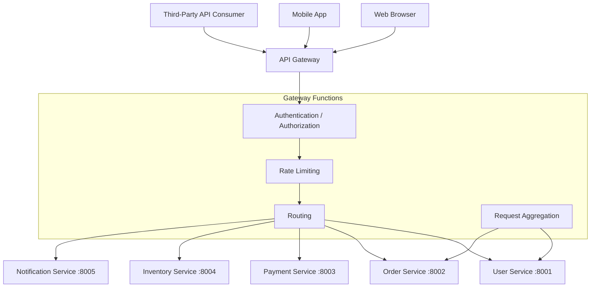
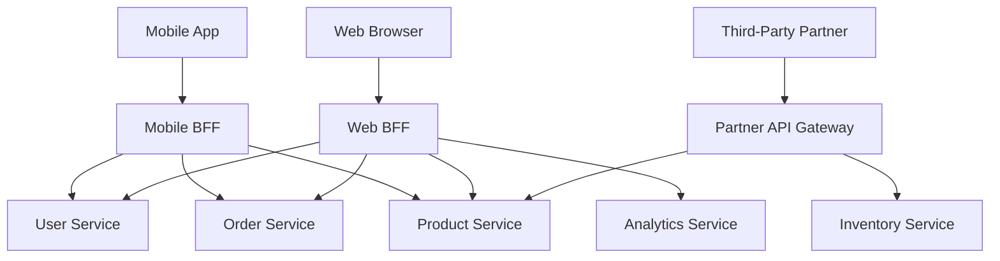

# API Gateway

## Why This Topic Exists

A microservices system might have 50 internal services: User Service, Order Service, Payment Service, Inventory Service, Notification Service, and 45 more. Without an API Gateway, every client (mobile app, web browser, third-party partner) would need to:

- Know the address of all 50 services
- Handle authentication for each service separately
- Make 10 separate API calls to compose a single screen
- Deal with each service's different protocols and response formats

This is unworkable. The API Gateway is the **single entry point** that shields clients from the internal complexity of your microservices.

## Learning Objectives

- Explain what an API Gateway does and why it exists
- List the core responsibilities of an API Gateway
- Compare API Gateway vs reverse proxy vs load balancer
- Explain the Backend for Frontend (BFF) pattern
- Know real-world tools: Netflix Zuul, AWS API Gateway, Kong, Nginx

## Prerequisites

- [Monolith vs Microservices](./01.%20Monolith%20vs%20Microservices%20%28BEGINNER%29.md)
- [Service Discovery](./02.%20Service%20Discovery%20%28INTERMEDIATE%29.md)
- Basic understanding of HTTP, REST, authentication concepts

## Introduction

Think of a large hotel. Hundreds of guests arrive every day. Each guest has different needs: some want room service, some need the concierge, some want the pool. If every guest had to find the right department on their own — walk to the kitchen for food, walk to the concierge desk for tours, walk to the maintenance room for towels — it would be chaos.

Instead, all guests interact with the **front desk**. The front desk routes requests to the right department, handles check-in (authentication), gives room keys (authorization), and sometimes combines information from multiple departments to answer a single question.

The API Gateway is the front desk of a microservices system.

## Real-World Analogy

The API Gateway is like the **front desk of a large hotel**:

- Every guest (client) talks to the front desk (API Gateway)
- The front desk verifies who you are (authentication)
- The front desk knows which room/department to send you to (routing)
- The front desk limits how many requests you can make (rate limiting)
- The front desk translates between guest language and hotel-internal procedures
- The front desk can combine information from multiple departments into one answer (aggregation)

## Core Concepts

### What an API Gateway Does

| Responsibility | Description |
|---------------|-------------|
| **Routing** | Route `/api/orders/*` to Order Service, `/api/users/*` to User Service |
| **Authentication** | Verify JWT tokens or API keys before requests reach services |
| **Authorization** | Enforce which clients can call which endpoints |
| **Rate Limiting** | Limit each client to N requests per second to prevent abuse |
| **SSL Termination** | Handle HTTPS at the gateway; internal services communicate over HTTP |
| **Request Aggregation** | Combine multiple service calls into one response for the client |
| **Protocol Translation** | Client speaks REST; internal service uses gRPC |
| **Caching** | Cache common responses to reduce load on downstream services |
| **Logging and Monitoring** | Single place to log all incoming requests |
| **Circuit Breaking** | Stop forwarding requests to a failing service |
| **Request/Response Transformation** | Add headers, reshape JSON, strip sensitive fields |

### Real-World Tools

| Tool | Description |
|------|-------------|
| **Netflix Zuul / Zuul2** | Netflix's open-source gateway, JVM-based, supports filters |
| **AWS API Gateway** | Fully managed, integrates with Lambda, IAM auth |
| **Kong** | Open-source, plugin-based, runs on top of Nginx |
| **Nginx / OpenResty** | Reverse proxy often used as a lightweight gateway |
| **Traefik** | Cloud-native, auto-discovers routes from container labels |
| **Apigee** | Google's enterprise API management platform |
| **Azure API Management** | Microsoft's managed API gateway |

## Visual Diagram (Mermaid)

### API Gateway Architecture

### BFF Pattern

## Deep Explanation

### Routing

The most fundamental job of an API Gateway is to route incoming requests to the correct backend service based on the URL path, HTTP method, headers, or query parameters.

Example routing rules:
- `GET /api/users/**` routes to User Service
- `POST /api/orders` routes to Order Service
- `GET /api/products/**` routes to Product Service
- `GET /internal/admin/**` routes to Admin Service (only accessible from internal network)

This means clients never need to know about internal service addresses. The API Gateway is the only publicly exposed address.

### Authentication and Authorization

Every microservice does not need to implement its own authentication. Instead, the API Gateway acts as the authentication layer:

1. Client sends a request with a JWT token in the `Authorization` header
2. API Gateway validates the JWT (checks signature, expiry, issuer)
3. If valid, gateway extracts user ID and roles from the token and adds them as headers (`X-User-Id: 123`, `X-User-Role: admin`)
4. Gateway forwards the request to the downstream service
5. Downstream service trusts these headers — it does not re-validate the JWT

This centralizes authentication logic. When you change your auth system, you change one place.

### Rate Limiting

Rate limiting prevents any single client from overwhelming your system. The API Gateway can enforce rules like:

- A free-tier user can make 100 API calls per hour
- A paid user can make 10,000 API calls per hour
- A specific IP sending suspicious traffic is blocked

Rate limits are tracked in a fast cache (Redis) keyed by client ID or IP. If a client exceeds their limit, the gateway returns `429 Too Many Requests`.

### SSL Termination

In production, all external traffic travels over HTTPS (TLS encryption). Handling TLS is computationally expensive — it requires cryptographic key negotiation on every new connection.

With SSL termination at the API Gateway:
- The gateway receives HTTPS, decrypts it, and forwards plain HTTP to internal services
- Internal network is trusted (private VPC), so HTTP is acceptable internally
- This removes TLS overhead from every individual microservice

### Request Aggregation

A mobile app's home screen might need data from 5 different services: user profile, order history, product recommendations, cart count, and notifications. Without aggregation, the mobile app would make 5 separate API calls.

With the API Gateway as an aggregator:
1. Mobile app makes one call: `GET /api/home-screen`
2. Gateway calls User Service, Order Service, Recommendation Service, Cart Service, Notification Service in parallel
3. Gateway assembles the responses into a single JSON object
4. Mobile app gets everything in one response

This reduces the number of round trips for the client, which is especially important on mobile networks.

### API Gateway vs Reverse Proxy vs Load Balancer

These terms are often confused. Here is the clear distinction:

| Component | Primary Job | Application Awareness |
|-----------|------------|----------------------|
| **Load Balancer** | Distribute traffic across identical servers | No — distributes at TCP/HTTP level |
| **Reverse Proxy** | Forward requests to backend servers, hide backend details | Minimal — URL routing only |
| **API Gateway** | Full API management: auth, rate limiting, aggregation, transformation | High — understands API semantics |

A load balancer distributes load. A reverse proxy hides your servers. An API Gateway manages your API. In practice, a single product (like Nginx or Kong) can perform all three roles, but conceptually they are different concerns.

### Netflix's Zuul and Zuul2

Netflix handles over 1 billion API calls per day. Their API Gateway, Zuul, is the entry point for all traffic.

- **Zuul 1** uses a thread-per-request model. Each incoming request gets a thread. At Netflix's scale this requires a large number of threads and significant memory.
- **Zuul 2** uses a non-blocking, async/reactive model (Netty). It handles far more concurrent connections with fewer threads.

Zuul supports a **filter chain**: pre-filters (run before routing — auth, rate limit), routing filters (select the backend), post-filters (run after response — logging, header modification), and error filters.

## Step-by-Step Example

### A Request Through an API Gateway

**Scenario**: User opens the mobile app and loads their order history.

**Step 1: Client sends request**
The client sends `GET https://api.example.com/api/orders?limit=20` with a JWT token in the Authorization header.

**Step 2: API Gateway receives the request**
The gateway's TLS termination layer decrypts the HTTPS traffic.

**Step 3: Authentication filter runs**
Gateway validates the JWT. It decodes the token and finds: `user_id: 12345, role: customer, expiry: valid`. Token is valid.

**Step 4: Rate limiting check**
Gateway checks Redis: user 12345 has made 47 API calls this hour. Their limit is 1000. Request proceeds.

**Step 5: Routing decision**
The URL `/api/orders` matches the routing rule: forward to Order Service at `order-service.internal:8002`.

**Step 6: Request forwarded with enriched headers**
Gateway adds `X-User-Id: 12345` and `X-User-Role: customer` headers and forwards to Order Service.

**Step 7: Order Service responds**
Order Service returns a JSON list of 20 orders. It trusts the `X-User-Id` header — it does not re-validate the JWT.

**Step 8: Gateway logs and returns response**
Gateway logs the request (method, path, user ID, response time, status code) and returns the response to the client.

Total time: perhaps 15ms, of which 2ms was in the gateway and 13ms was in the Order Service.

## The Backend for Frontend (BFF) Pattern

A single API Gateway serving web, mobile, and third-party partners faces a problem: different clients have different needs.

- **Web browser**: Has a large screen, fast network, can handle complex responses.
- **Mobile app**: Has a small screen, slow and expensive network. Needs small, optimized responses. Benefits from combined calls to reduce round trips.
- **Third-party partner**: Has security restrictions, needs a stable contract, different rate limits.

The BFF (Backend for Frontend) pattern creates a separate API Gateway for each type of client. Each BFF is owned by the team building that client:

- **Mobile BFF**: Optimizes responses for mobile — small payloads, combined calls
- **Web BFF**: Richer responses, more data, full-page loading patterns
- **Partner API**: Stable versioned API, strict rate limits, separate auth

The BFF pattern was popularized by Sam Newman (the author of "Building Microservices"). It solves the problem of a single gateway becoming a bottleneck that every team fights over to add conflicting features.

## Advantages / Disadvantages / Trade-offs

| Dimension | Detail |
|-----------|--------|
| **Pro** | Single entry point — clients are decoupled from internal topology |
| **Pro** | Centralized authentication, rate limiting, logging |
| **Pro** | Can change internal services without changing client contracts |
| **Pro** | Protocol translation (REST client to gRPC backend) |
| **Con** | Single point of failure — must be highly available |
| **Con** | Potential performance bottleneck — every request passes through it |
| **Con** | Increases complexity (another system to configure, monitor, debug) |
| **Con** | Can become a "dumping ground" for business logic (anti-pattern) |

### The API Gateway Anti-Pattern

The API Gateway should handle **cross-cutting concerns** (auth, logging, rate limiting, routing). It should NOT contain **business logic** (calculating discounts, applying business rules, orchestrating workflows). When business logic creeps into the gateway, it becomes impossible to test, hard to change, and owned by no team.

If you find yourself putting business logic in the API Gateway, consider moving that logic into a dedicated orchestration service or using the SAGA pattern.

## When to Use / When NOT to Use

### Use an API Gateway when:
- You have multiple microservices and multiple types of clients
- You need centralized authentication across services
- You need rate limiting to protect services from overload
- You want to hide internal service topology from clients
- You need protocol translation (e.g., REST to gRPC)

### Do NOT need an API Gateway when:
- You have a monolith — no internal services to route to
- You have only 2-3 services — a simple reverse proxy (Nginx) is sufficient
- All clients are internal (service-to-service) — use service discovery instead
- You are building a very early-stage product — add it later when complexity warrants it

## Common Interview Questions

**Q: What is an API Gateway and what does it do?**
An API Gateway is a server that acts as the single entry point for all client requests to a microservices system. It handles routing, authentication, rate limiting, SSL termination, request aggregation, and protocol translation. It shields clients from internal service complexity.

**Q: What is the difference between an API Gateway and a load balancer?**
A load balancer distributes traffic across identical server instances for scalability. An API Gateway routes traffic to different services based on the request and adds application-level features like authentication and rate limiting. They operate at different conceptual levels, though some tools do both.

**Q: What is the Backend for Frontend (BFF) pattern?**
Instead of one API Gateway for all clients, BFF creates a separate gateway per client type (mobile, web, third-party). Each BFF is optimized for its client's needs. This avoids one gateway trying to serve contradictory requirements from different teams.

**Q: What are the risks of an API Gateway?**
It is a single point of failure (must be deployed with redundancy), a potential performance bottleneck (every request passes through it), and a potential dumping ground for business logic (anti-pattern that makes the gateway unmaintainable).

**Q: How does an API Gateway handle authentication?**
The gateway validates JWT tokens or API keys. If valid, it extracts user identity and adds it as trusted headers (e.g., `X-User-Id`). Downstream services trust these headers without re-validating the original token, centralizing auth logic in one place.

## Common Beginner Mistakes

**Mistake 1: Putting business logic in the API Gateway**
The gateway should handle cross-cutting concerns only. When business logic goes in the gateway, it becomes untestable, unownable, and a source of bugs. Move business logic to dedicated services.

**Mistake 2: Forgetting high availability**
The API Gateway is a single entry point — if it goes down, all clients lose access to all services. Run multiple gateway instances behind a load balancer with health checks and automatic failover.

**Mistake 3: Single gateway for all clients**
Mobile and web have fundamentally different needs. A single gateway becomes a battlefield where every team's request conflicts. Adopt the BFF pattern when you have multiple client types with significantly different requirements.

**Mistake 4: Routing internal service-to-service calls through the public gateway**
Service-to-service calls should NOT go through the public API Gateway — that adds latency and routes traffic unnecessarily. Service mesh or direct service discovery handles internal traffic.

## Summary

The API Gateway is the single entry point for all client traffic into a microservices system. It provides routing, authentication, rate limiting, SSL termination, request aggregation, and protocol translation. It decouples clients from internal service topology. The BFF pattern extends this by creating separate gateways for different client types. The API Gateway should handle cross-cutting concerns only — never business logic.

## Key Takeaways

- API Gateway = single entry point + routing + auth + rate limiting + SSL termination
- Clients should never need to know about internal service addresses
- API Gateway vs Load Balancer: gateway routes to different services; LB distributes across identical instances
- BFF pattern: separate gateway per client type (mobile, web, partner)
- Never put business logic in the API Gateway
- The gateway must be highly available — it is the single point of entry
- Netflix Zuul, AWS API Gateway, Kong, Traefik are common implementations

## Related Topics (relative markdown links)

- [Monolith vs Microservices](./01.%20Monolith%20vs%20Microservices%20%28BEGINNER%29.md)
- [Service Discovery](./02.%20Service%20Discovery%20%28INTERMEDIATE%29.md)
- [Service Mesh](./04.%20Service%20Mesh%20%28ADV%29.md)
- [Kubernetes Basics](./07.%20Kubernetes%20Basics%20%28INTERMEDIATE%29.md)
- [Chapter 6: Load Balancing](../06.%20Load%20Balancing/README.md)
- [Chapter 14: Security](../14.%20Security/README.md)
