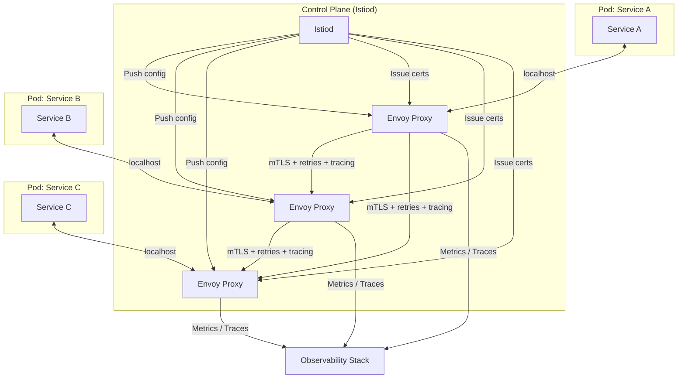
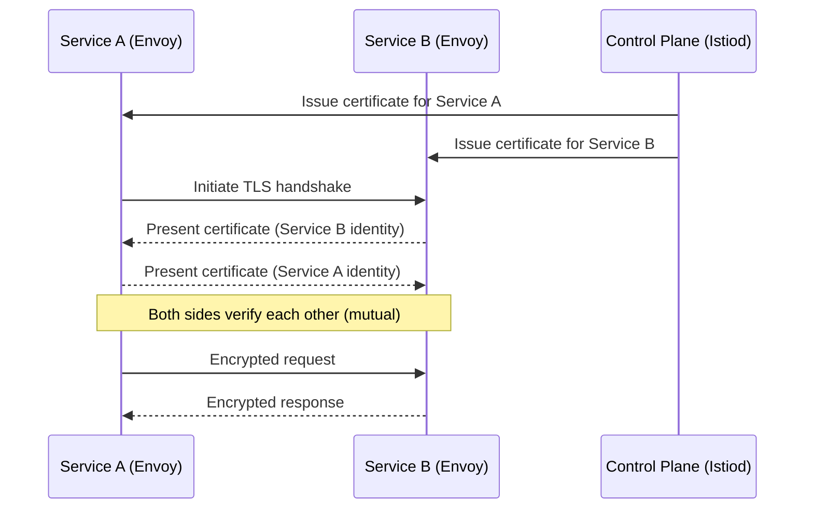

# Service Mesh

## Why This Topic Exists

When you have 50 microservices, every service needs to handle the same set of concerns when talking to other services: retries when a call fails, timeouts so you do not wait forever, circuit breaking so you stop calling a failing service, mutual TLS so services authenticate each other, and distributed tracing so you can debug a request that touched 10 services.

The naive approach: every developer implements all of this in their service code. You write it in Java for your service, your colleague writes it in Python, another team writes it in Go. The implementations differ, bugs differ, and updating security policies requires touching 50 codebases.

A service mesh solves this by moving all of that logic out of application code and into infrastructure — a sidecar proxy that runs alongside every service and handles inter-service communication transparently.

## Learning Objectives

- Explain what a service mesh is and why it exists
- Describe the sidecar proxy pattern
- Distinguish between the control plane and data plane
- List the features a service mesh provides: mTLS, traffic management, circuit breaking, observability
- Know the tools: Istio, Linkerd, Envoy
- Know when a service mesh is overkill

## Prerequisites

- [Monolith vs Microservices](./01.%20Monolith%20vs%20Microservices%20%28BEGINNER%29.md)
- [Service Discovery](./02.%20Service%20Discovery%20%28INTERMEDIATE%29.md)
- [API Gateway](./03.%20API%20Gateway%20%28INTERMEDIATE%29.md)
- Basic understanding of TLS/HTTPS
- [Containers and Docker](./06.%20Containers%20and%20Docker%20%28BEGINNER%29.md)

## Introduction

As a microservices system grows, service-to-service communication becomes complicated fast. You need retries and timeouts, or one slow service makes everything slow. You need circuit breakers, or one failed service cascades and takes down everything. You need mTLS (mutual TLS), or a compromised container can impersonate any service. You need distributed tracing, or debugging a request that touched 8 services is nearly impossible.

Building all of this into every service is expensive and error-prone. A **service mesh** extracts this communication logic into a dedicated infrastructure layer, making it transparent to application developers.

## Real-World Analogy

Imagine a large corporation with offices in different cities. Employees need to communicate with each other constantly. Without infrastructure:
- Every employee manages their own phone, fax, and encryption
- Every team has different security standards
- IT cannot audit communication or enforce policies uniformly

With a **corporate communications infrastructure** (service mesh):
- All communication goes through standardized infrastructure that IT controls
- Encryption is automatic — employees do not think about it
- IT can monitor all communication, set policies, and audit access
- Employees just make calls — the infrastructure handles the rest

The service mesh is the corporate communications infrastructure for your microservices. Every service just calls other services. The mesh handles encryption, retries, observability, and policy enforcement transparently.

## Core Concepts

### What Goes Wrong Without a Service Mesh

In a system without a service mesh, every service team must implement:

| Concern | What You Need | What Happens Without It |
|---------|--------------|------------------------|
| Retries | Retry failed requests with backoff | Transient failures cause user-facing errors |
| Timeouts | Give up after N milliseconds | One slow service blocks all callers |
| Circuit breaking | Stop calling a failing service | Cascading failures bring down the system |
| mTLS | Mutual TLS between services | A compromised container can impersonate any service |
| Distributed tracing | Propagate trace IDs across service calls | Cannot debug multi-service requests |
| Load balancing | Spread requests across service instances | Some instances are overwhelmed, others idle |
| Rate limiting | Limit calls between services | One service can overload another |

Each of these must be implemented consistently across all services, in all languages. A service mesh does this once, at the infrastructure level.

### The Sidecar Pattern

A sidecar proxy is a small proxy container that runs **alongside** each service container, in the same pod (in Kubernetes). All traffic going into or out of the service passes through the sidecar proxy.

The service itself does not know the sidecar exists. The sidecar intercepts all traffic transparently using iptables rules that redirect traffic through the proxy without any application code change.

The most widely used sidecar proxy is **Envoy** (from Lyft, now part of the CNCF). Envoy is a high-performance proxy written in C++ that powers the data plane of Istio and other service meshes.

### Control Plane vs Data Plane

A service mesh has two distinct layers:

**Data Plane**: The collection of all the sidecar proxies. This is where actual network traffic flows. Envoy proxies intercept, inspect, encrypt, and forward packets. The data plane is the "muscles" — it does the work.

**Control Plane**: A centralized management system that configures all the sidecar proxies. You tell the control plane "add a retry policy for calls to Payment Service" and it pushes that configuration to every Envoy proxy in the cluster. The control plane is the "brain" — it makes the decisions.

In Istio:
- **Data Plane**: Envoy sidecars in every pod
- **Control Plane**: Istiod (combines Pilot, Citadel, and Galley from older versions)

## Visual Diagram (Mermaid)

### Service Mesh Architecture

### mTLS (Mutual TLS) Flow

## Deep Explanation

### Mutual TLS (mTLS)

Regular TLS (HTTPS) is one-directional: the client verifies the server's certificate. Your browser verifies that the certificate for `google.com` is legitimate.

mTLS is two-directional: **both sides present certificates and verify each other**. Service A proves it is Service A to Service B, and Service B proves it is Service B to Service A.

Why does this matter for microservices? Without mTLS:
- A compromised container can send requests to any other service pretending to be a trusted caller
- There is no cryptographic proof that the caller is who it claims to be (even if you trust headers like `X-Service-Name`, those can be forged)

With mTLS managed by the service mesh:
- Every service automatically gets a certificate (Istio's Citadel/Istiod acts as a Certificate Authority)
- Certificate rotation happens automatically — no human has to manage certificate expiry
- All service-to-service communication is encrypted, even within the cluster
- If a service presents an invalid or expired certificate, the connection is rejected

The key is that **developers do not write any TLS code**. The Envoy sidecar handles mTLS completely transparently.

### Traffic Management

The service mesh control plane lets you configure how traffic flows between services:

**Canary Deployments**: Route 5% of traffic to the new version of a service, 95% to the old version. Gradually increase to 100% after monitoring for errors.

**Traffic Mirroring**: Send a copy of production traffic to a new service version for testing without affecting real users.

**Fault Injection**: Deliberately inject failures (timeouts, errors) into service calls for chaos engineering and resilience testing.

**Retries and Timeouts**: Configure globally: "all calls to Payment Service should retry once on 5xx errors and time out after 3 seconds." No application code needed.

**Circuit Breaking**: If Payment Service has more than 50% error rate, open the circuit — stop routing to it and return a default response. Close the circuit again after it recovers.

### Observability: Distributed Tracing

When a request flows through Service A → Service B → Service C → Service D, and it is slow or failing, which service is the problem?

Without distributed tracing, you have four separate log files with no connection between them. With distributed tracing:
- Each request gets a unique trace ID (e.g., `trace-id: abc123`)
- Every sidecar automatically propagates this trace ID on all outbound calls
- Every sidecar reports timing data for each hop to a central collector (Jaeger, Zipkin)
- You can see the entire request tree: Service A took 2ms, called Service B which took 15ms, which called Service C that took 14ms (Service C is the bottleneck)

The service mesh provides this automatically. Developers do not need to instrument their code (though they may add application-level span data for richer traces).

### Istio and Linkerd

**Istio** is the most feature-rich service mesh. It uses Envoy as the data plane proxy and Istiod as the control plane. It supports all the features described above. The downside: Istio is complex. The control plane has significant resource overhead, and the learning curve is steep.

**Linkerd** is a lighter-weight service mesh, purpose-built for simplicity. It uses its own Rust-based proxy (lighter than Envoy). Linkerd focuses on the core features (mTLS, observability, load balancing) without Istio's full feature set. Easier to get started with, less resource overhead.

**Envoy** is the underlying proxy that powers Istio (and many other systems). You can use Envoy standalone, but managing it directly is complex — that is what service mesh control planes are for.

## Step-by-Step Example

### Adding mTLS to a Kubernetes Cluster with Istio

**Before Istio**: Service A calls Service B over plain HTTP. Any compromised container could intercept or forge requests.

**Step 1: Install Istio control plane**
Istiod is deployed in the `istio-system` namespace.

**Step 2: Label namespaces for automatic sidecar injection**
You label your namespace: `istio-injection: enabled`. Now every new pod in this namespace automatically gets an Envoy sidecar injected — no Dockerfile changes needed.

**Step 3: Deploy Service A and Service B**
Kubernetes creates pods. Istio's admission webhook intercepts the pod creation and injects an Envoy container. Each pod now has two containers: the service and the Envoy proxy.

**Step 4: Istiod issues certificates**
Istiod's certificate authority issues x.509 certificates to both Envoy proxies, identifying them as Service A and Service B.

**Step 5: Service A calls Service B**
Service A's application code calls `http://service-b/api/data` (plain HTTP). The iptables rules in the pod redirect this traffic to the local Envoy proxy. Envoy looks up the destination, initiates a mTLS handshake with Service B's Envoy, verifies certificates, and sends the request over an encrypted connection. Service B's Envoy receives the encrypted request, terminates TLS, and delivers plain HTTP to the Service B application.

**The result**: The developers changed no application code. All service-to-service traffic is now mutually authenticated and encrypted.

**Step 6: Apply a traffic policy**
You apply a `DestinationRule` config: "all calls to Payment Service should retry once on connection errors, time out after 2 seconds, and circuit-break if more than 10 pending requests." Istiod pushes this config to all Envoy proxies.

## Advantages / Disadvantages / Trade-offs

| Dimension | Detail |
|-----------|--------|
| **Pro** | mTLS with zero application code changes |
| **Pro** | Consistent retry, timeout, circuit-breaking policies across all services |
| **Pro** | Automatic distributed tracing and metrics |
| **Pro** | Canary deployments and traffic splitting at the infrastructure level |
| **Con** | Significant complexity — Istio especially has a steep learning curve |
| **Con** | Resource overhead — every pod has an extra sidecar proxy consuming CPU and memory |
| **Con** | Additional latency — every network call passes through two proxies |
| **Con** | Debugging is harder — the mesh intercepts traffic, making packet-level debugging complex |
| **Con** | Operational burden — the mesh itself must be upgraded, monitored, and maintained |

## When to Use / When NOT to Use

### Use a service mesh when:
- You have 20+ microservices with complex service-to-service communication
- Security requirements mandate encryption and mutual authentication between services (regulated industries: finance, healthcare)
- You need fine-grained traffic control (canary deployments, A/B testing at the network layer)
- Your team has the operational maturity to run Istio or Linkerd in production

### Do NOT use a service mesh when:
- You have fewer than 10 services — the overhead is not worth it
- Your team is new to Kubernetes — learn Kubernetes basics first
- Your service-to-service communication is simple and infrequent
- You are a startup trying to move fast — service mesh complexity slows you down
- Your services are mostly public-facing (API Gateway handles that layer)

A common mistake is adopting Istio because it is trendy, before your organization is ready to operate it. The service mesh is infrastructure — it needs a dedicated team to own it.

## Common Interview Questions

**Q: What is a service mesh?**
A service mesh is an infrastructure layer that handles service-to-service communication in a microservices system. It uses sidecar proxies (Envoy) deployed alongside each service to provide mTLS, retries, timeouts, circuit breaking, distributed tracing, and traffic management — without any application code changes.

**Q: What is the sidecar pattern?**
A sidecar is a helper container that runs alongside a main application container in the same pod. It intercepts all network traffic to/from the main container and adds cross-cutting capabilities (encryption, observability, traffic management). The application is unaware of the sidecar.

**Q: What is the difference between a service mesh and an API Gateway?**
An API Gateway manages north-south traffic (external clients to internal services). A service mesh manages east-west traffic (service-to-service communication within the cluster). They solve different problems and are complementary — most production systems have both.

**Q: What is mTLS and why does a service mesh use it?**
Mutual TLS means both sides of a connection present and verify certificates. In microservices, this ensures that only legitimate services can call each other — a compromised container cannot impersonate another service. The service mesh manages mTLS automatically, including certificate issuance and rotation.

**Q: When would you recommend against using a service mesh?**
For small systems (under 10-20 services), early-stage products, or teams without strong Kubernetes expertise. The operational complexity and resource overhead of a service mesh (especially Istio) only pays off at significant scale.

## Common Beginner Mistakes

**Mistake 1: Thinking the service mesh replaces the API Gateway**
The service mesh handles east-west traffic (service to service). The API Gateway handles north-south traffic (clients to services). They are complementary, not competing.

**Mistake 2: Adopting Istio before your team understands Kubernetes**
Istio is significantly more complex than Kubernetes. Teams that jump to Istio before mastering Kubernetes end up with a system nobody understands. Learn Kubernetes first, then evaluate whether a service mesh is necessary.

**Mistake 3: Ignoring the latency overhead**
Every service call passes through two Envoy proxies. At p99 latency this adds up. Benchmark your system with and without the mesh. For high-frequency, low-latency service calls, the overhead matters.

**Mistake 4: Using a service mesh instead of fixing bad service design**
A service mesh cannot fix services that are poorly designed (too many dependencies, synchronous chains that should be async). Fix the design first.

## Summary

A service mesh is an infrastructure layer that handles service-to-service communication transparently via sidecar proxies. The data plane (Envoy proxies) handles actual traffic. The control plane (Istiod) configures the proxies. The key features are mTLS (mutual authentication and encryption), traffic management (retries, timeouts, circuit breaking, canary deployments), and observability (distributed tracing, metrics). Service meshes are powerful but operationally complex — only adopt them when your system is large enough and your team mature enough to benefit.

## Key Takeaways

- Service mesh = infrastructure layer for service-to-service communication
- Sidecar pattern: Envoy proxy runs next to every service, intercepts all traffic
- Control plane (Istiod) manages configuration; data plane (Envoy) handles traffic
- mTLS: both sides authenticate — zero application code needed
- Traffic management: retries, timeouts, circuit breaking, canary deployments via config
- Distributed tracing: automatic, no code changes
- API Gateway handles north-south (external) traffic; service mesh handles east-west (internal) traffic
- Istio is powerful but complex; Linkerd is simpler and lighter
- Do not adopt a service mesh until you have 20+ services and strong operational maturity

## Related Topics (relative markdown links)

- [Service Discovery](./02.%20Service%20Discovery%20%28INTERMEDIATE%29.md)
- [API Gateway](./03.%20API%20Gateway%20%28INTERMEDIATE%29.md)
- [Kubernetes Basics](./07.%20Kubernetes%20Basics%20%28INTERMEDIATE%29.md)
- [Chapter 11: Reliability and Fault Tolerance](../11.%20Reliability%20and%20Fault%20Tolerance/README.md)
- [Chapter 15: Observability](../15.%20Observability/README.md)
- [Chapter 14: Security](../14.%20Security/README.md)
