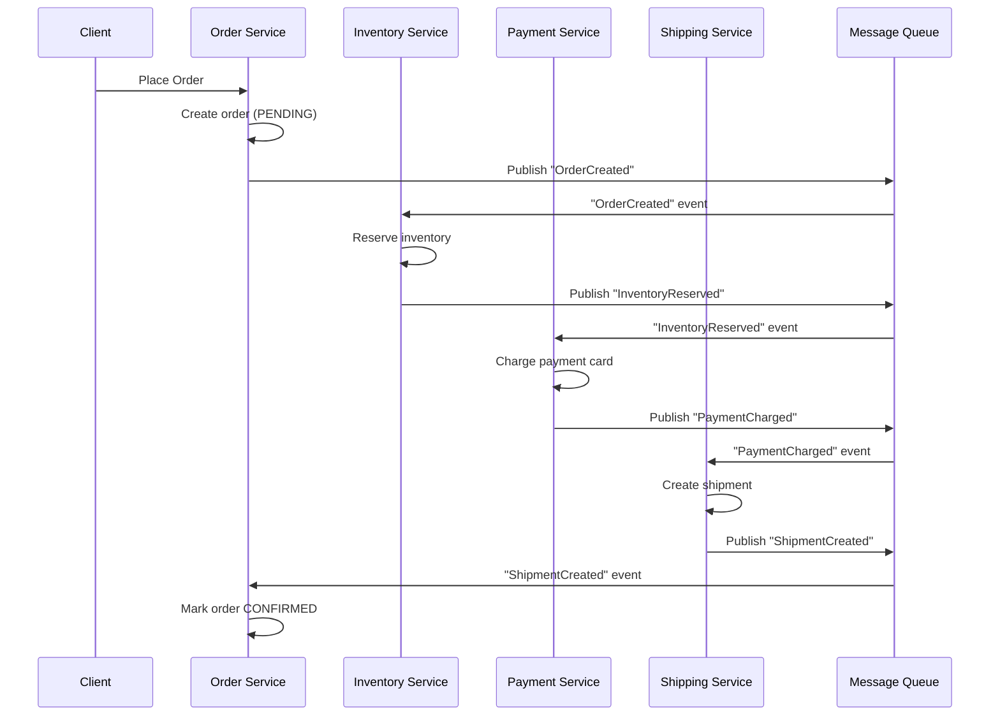
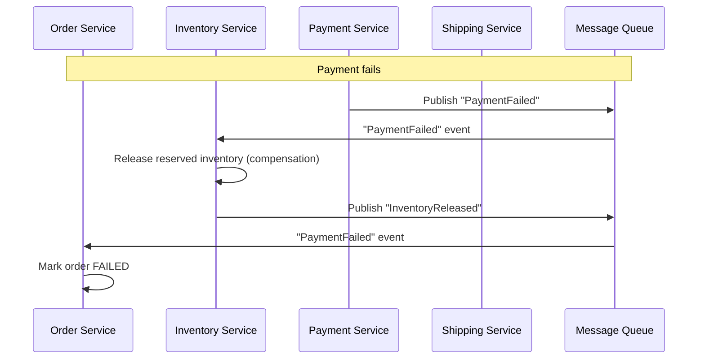
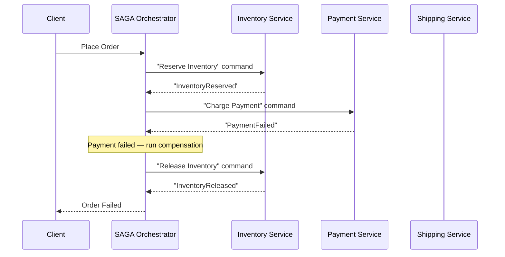

# SAGA Pattern

## Why This Topic Exists

In a monolith with a single database, you can use ACID transactions: a sequence of operations that either all succeed or all fail, with no partial states. If you charge a customer's card and then the shipment fails, the database rolls back the charge automatically.

In microservices, each service has its own database. There is no single database transaction that can span multiple services. If you charge the customer's card (Payment Service updates its database) and then the shipment fails (Shipping Service fails), the charge has already been committed. You cannot roll it back from outside the Payment Service's database.

Two-Phase Commit (2PC) is the traditional solution to distributed transactions — but it is slow, fragile, and does not work well across independent microservices with different databases. The SAGA pattern provides a practical alternative.

## Learning Objectives

- Explain why distributed transactions are hard in microservices
- Explain why 2PC is not suitable for microservices
- Define the SAGA pattern and how it ensures eventual consistency
- Compare choreography-based vs orchestration-based SAGAs
- Explain compensating transactions and how rollback works in SAGAs
- Apply the SAGA pattern to a real e-commerce order scenario

## Prerequisites

- [Monolith vs Microservices](./01.%20Monolith%20vs%20Microservices%20%28BEGINNER%29.md)
- [Chapter 9: Message Queues](../09.%20Message%20Queues/README.md) — events and async messaging
- [Chapter 10: Consistency and Consensus](../10.%20Consistency%20and%20Consensus/README.md) — ACID vs eventual consistency

## Introduction

Imagine booking a vacation package: you need a flight, a hotel, and a rental car. All three must be confirmed or the whole booking fails. If you book the flight and hotel but the rental car company has no cars, you need to cancel the flight and hotel too.

In a microservices system: Flight Service, Hotel Service, and Car Rental Service each have their own databases. There is no distributed transaction that can lock all three at once and roll back atomically.

The SAGA pattern handles this by breaking the big transaction into a sequence of smaller local transactions, each with a corresponding **compensating transaction** that undoes it if something goes wrong later.

## Real-World Analogy

Think of a **relay race**. Each runner (service) runs their leg and passes the baton (event/message) to the next runner. If a runner drops the baton, the team needs to "undo" the work already done (the previous runners cannot un-run their legs, but the team can take corrective action — like rerunning from the drop point).

In a SAGA, if the third step fails:
- Step 3 fails and triggers a compensation
- Step 2 undoes its work (compensating transaction 2)
- Step 1 undoes its work (compensating transaction 1)
- The system returns to the starting state

The key insight: **you cannot undo a database write that has already been committed**, but you can issue a new compensating write that logically reverses it.

## Core Concepts

### Why 2PC Does Not Work for Microservices

**Two-Phase Commit (2PC)** is a classic distributed transaction protocol:
- **Phase 1 (Prepare)**: A coordinator asks all participants "Are you ready to commit?" All participants lock their resources and say "Yes" or "No."
- **Phase 2 (Commit)**: If all participants said "Yes," the coordinator sends "Commit" and all participants apply their changes. If any said "No," it sends "Rollback."

**Why 2PC fails for microservices:**

| Problem | Description |
|---------|-------------|
| **Availability** | If the coordinator crashes between phases, all participants are locked waiting. The system is blocked until the coordinator recovers. |
| **Tight coupling** | All participants must be available simultaneously. One slow or unavailable service blocks the entire transaction. |
| **Different databases** | 2PC requires all databases to implement the same 2PC protocol. You cannot run 2PC across a PostgreSQL, a MongoDB, and a Kafka topic. |
| **Scalability** | 2PC holds locks across network round trips. At high throughput, lock contention kills performance. |

The conclusion: 2PC is not suitable for microservices. Use SAGA instead.

### What Is a SAGA?

A SAGA is a sequence of **local transactions**. Each local transaction updates a single service's database and publishes an event or sends a message to trigger the next step. If a step fails, the SAGA executes **compensating transactions** in reverse order to undo the completed steps.

There are two types of SAGA coordination:

| Type | How It Works | Analogy |
|------|-------------|---------|
| **Choreography** | Services react to events — no central coordinator | Jazz improvisation — musicians listen to each other and respond |
| **Orchestration** | A central SAGA orchestrator sends commands to services | Orchestra conductor — tells each musician exactly what to play and when |

### Compensating Transactions

A compensating transaction is an operation that logically reverses a previously committed local transaction.

It is NOT a rollback. The original transaction is already committed in the database. The compensating transaction is a new write that undoes the effect.

Examples:
- Reserve inventory → Compensating: Release (unreserve) inventory
- Charge payment card → Compensating: Issue refund to payment card
- Create shipment → Compensating: Cancel shipment
- Send welcome email → Compensating: (often not possible — you cannot un-send an email. Design carefully.)

Some operations are **non-compensatable** (you cannot un-send an email, you cannot un-notify a customer). These should happen **last** in the SAGA sequence so that compensation is only needed before they run.

## Visual Diagram (Mermaid)

### Choreography-Based SAGA (E-Commerce Order)

### Choreography-Based SAGA Rollback

### Orchestration-Based SAGA

## Deep Explanation

### Choreography-Based SAGA

In choreography, there is no central coordinator. Each service knows:
- What events it listens for
- What local transaction to run when it hears that event
- What event to publish next

**How it works for an e-commerce order:**
1. Order Service creates a PENDING order and publishes `OrderCreated` event
2. Inventory Service listens for `OrderCreated`, reserves inventory, publishes `InventoryReserved`
3. Payment Service listens for `InventoryReserved`, charges the card, publishes `PaymentCharged`
4. Shipping Service listens for `PaymentCharged`, creates shipment, publishes `ShipmentCreated`
5. Order Service listens for `ShipmentCreated`, marks order CONFIRMED

**Rollback (if payment fails):**
1. Payment Service publishes `PaymentFailed`
2. Inventory Service listens for `PaymentFailed`, releases reserved inventory, publishes `InventoryReleased`
3. Order Service listens for `PaymentFailed`, marks order FAILED

**Pros of choreography:**
- No single point of failure (no coordinator)
- Services are loosely coupled — they only communicate through events
- Easy to add new steps — just add a new service that listens to events

**Cons of choreography:**
- Hard to understand the overall flow — it is distributed across many services
- Hard to track state — which step is the saga currently on?
- Risk of cyclic event chains — Service A listens to Service B's event, which is triggered by Service A's event
- Debugging is harder — the business workflow is implicit in event subscriptions

### Orchestration-Based SAGA

In orchestration, a **SAGA orchestrator** (a separate service or component) is responsible for the entire workflow. It sends commands to each service and waits for replies.

**How it works:**
1. SAGA Orchestrator sends "Reserve Inventory" command to Inventory Service
2. Inventory Service replies "InventoryReserved"
3. Orchestrator sends "Charge Payment" command to Payment Service
4. Payment Service replies "PaymentFailed"
5. Orchestrator runs compensation: sends "Release Inventory" command to Inventory Service
6. Orchestrator marks the saga as FAILED

**Pros of orchestration:**
- Business logic is in one place — the orchestrator
- Easy to monitor saga state — the orchestrator tracks current step
- Easier to implement complex workflows (conditional branches, parallel steps)
- Testing is simpler — test the orchestrator in isolation

**Cons of orchestration:**
- The orchestrator is a central point that can become a bottleneck
- Higher coupling — services must be aware of the orchestrator
- The orchestrator can become a god object that contains too much business logic
- More code to write and maintain

**Which to choose?**
- **Simple linear workflows**: Choreography works well
- **Complex workflows with branches, parallel steps, or long-running processes**: Orchestration is clearer
- **Large teams where services are owned by different teams**: Choreography is more autonomous
- **Need for workflow monitoring and debugging**: Orchestration is easier to introspect

### Ensuring Exactly-Once Execution

A critical challenge in SAGAs: what if the same event is delivered twice? What if the network delivers the `OrderCreated` event to Inventory Service twice?

**Idempotency**: Each step must be idempotent — running it twice produces the same result as running it once. This usually means:
- Store a unique event/command ID in the database
- Before processing, check if this ID has already been processed
- If yes, return the same result without reprocessing

This is also called the **idempotency key** pattern.

## Step-by-Step Example

### E-Commerce Order SAGA

**Scenario**: A customer orders a laptop. The system must:
1. Reserve the laptop in inventory
2. Charge the customer's credit card
3. Create a shipment
4. Update the order to CONFIRMED

If any step fails, all previous steps must be compensated.

**The happy path (orchestration):**

| Step | Service | Action | Compensating Action |
|------|---------|--------|-------------------|
| 1 | Inventory Service | Reserve 1 laptop (reduce available count) | Release 1 laptop (increase available count) |
| 2 | Payment Service | Charge $999 to card XXXX-4567 | Refund $999 to card XXXX-4567 |
| 3 | Shipping Service | Create shipment SHP-8912 | Cancel shipment SHP-8912 |
| 4 | Order Service | Set order status = CONFIRMED | Set order status = FAILED |

**The failure path (shipment fails after payment):**

1. Inventory Service reserves laptop — SUCCESS
2. Payment Service charges card — SUCCESS
3. Shipping Service tries to create shipment — FAILURE (no couriers available)
4. Orchestrator detects failure, begins compensation in reverse:
   - Step 2 compensate: Payment Service issues refund of $999
   - Step 1 compensate: Inventory Service releases reserved laptop
5. Order Service marks order as FAILED
6. Customer receives notification: "Order failed, refund issued"

**What the customer sees**: The order failed and a refund appeared. The system is consistent — they were not charged for something that could not be shipped.

**The important detail**: At step 3, the payment was already committed to the Payment Service's database. The system does not "un-commit" it. Instead, it creates a new refund record. The customer sees two entries on their statement: a charge and a refund.

## Advantages / Disadvantages / Trade-offs

| Dimension | SAGA | 2PC |
|-----------|------|-----|
| **Availability** | High — no locking across services | Low — participants lock until coordinator responds |
| **Performance** | Good — local transactions, no distributed locks | Poor — network locks at every step |
| **Complexity** | High — compensating transactions, idempotency | Medium — protocol is well-defined |
| **Consistency** | Eventual — temporary inconsistency possible | Strong — all-or-nothing |
| **Failure handling** | Explicit compensating transactions | Automatic rollback |
| **Database support** | Any database (no 2PC support needed) | Requires 2PC-capable databases |
| **Suitable for microservices** | Yes | No |

## When to Use / When NOT to Use

### Use the SAGA pattern when:
- You have distributed transactions spanning multiple microservices with separate databases
- You need high availability and cannot afford locking across services
- You are using databases that do not support distributed 2PC (most modern databases)
- You are implementing workflows that may take minutes or hours (e.g., order processing, user onboarding)

### Do NOT use SAGA when:
- All data is in a single database — use ACID transactions instead (simpler, stronger consistency)
- You need strict ACID consistency with no temporary inconsistency (use a distributed database like Google Spanner instead)
- Your workflow is very simple (2 steps) — might be overkill

### Design tips:
- Put non-compensatable steps (sending emails, sending SMS) LAST in the saga
- Design compensating transactions to be idempotent
- Use unique IDs for each saga instance to track state
- Monitor saga completion rates and failure rates — sagas that get stuck need investigation

## Common Interview Questions

**Q: What is the SAGA pattern and why is it used instead of 2PC?**
SAGA is a sequence of local transactions where each step publishes an event to trigger the next. If a step fails, compensating transactions undo previous steps. It replaces 2PC because 2PC requires distributed locking which is incompatible with microservices architecture — services may have different databases, and long-lived locks harm availability and performance.

**Q: What is a compensating transaction?**
A compensating transaction logically reverses a previously committed transaction. Because the original transaction is already committed in its local database, you cannot roll it back from outside. Instead, you issue a new transaction that reverses the effect — for example, a refund reverses a payment charge.

**Q: What is the difference between choreography and orchestration in SAGAs?**
In choreography, services react to events without a central coordinator — each service knows which events to listen for and what to do. In orchestration, a central orchestrator sends commands to services and manages the workflow explicitly. Choreography is simpler for linear flows; orchestration is better for complex workflows that need centralized visibility.

**Q: How do you prevent a SAGA step from executing twice (idempotency)?**
Each event/command carries a unique ID. Before processing, the service checks if this ID was already processed (by looking it up in the database). If yes, it returns the same result without reprocessing. This ensures idempotency even if a message is delivered multiple times.

**Q: What happens if the SAGA orchestrator crashes mid-saga?**
The orchestrator stores its state durably (in a database or event log) after each step. When it restarts, it reads the last saved state and resumes from where it left off. This is why the orchestrator must be stateful and reliable.

## Common Beginner Mistakes

**Mistake 1: Making compensating transactions optional**
If you do not design compensation for every step, a failure leaves the system in a partially-committed state with no way to clean up. Every step that modifies data MUST have a compensating transaction.

**Mistake 2: Putting non-compensatable operations early in the saga**
If you send an email in step 2 and the saga fails at step 4, you cannot un-send the email. Put non-compensatable steps last, so they only execute when everything else has succeeded.

**Mistake 3: Not making steps idempotent**
Message queues deliver messages at-least-once. If your saga step is not idempotent (safe to run twice), you will double-charge customers, double-reserve inventory, etc. Always design for idempotency.

**Mistake 4: Forgetting to handle stuck sagas**
What if a service is down and never responds to the orchestrator? The saga waits forever. Implement timeouts and failure detection. A saga that does not complete within N minutes should be automatically failed and compensated.

## Summary

The SAGA pattern replaces distributed ACID transactions in microservices. Each saga is a sequence of local transactions where each step publishes an event or receives a command. If a step fails, compensating transactions run in reverse to undo previous steps. Choreography uses events with no central coordinator; orchestration uses a central orchestrator to command each step. Both approaches require idempotent steps and careful compensation design.

## Key Takeaways

- 2PC is not suitable for microservices — locks across services harm availability
- SAGA = sequence of local transactions with compensating transactions for rollback
- Compensating transactions are NEW writes that logically reverse previous writes
- Choreography: services react to events, no coordinator, loosely coupled
- Orchestration: central orchestrator sends commands, workflow is explicit
- All steps must be idempotent — messages can be delivered more than once
- Non-compensatable steps (send email) must go LAST
- Design for stuck sagas — implement timeouts and automatic failure handling

## Related Topics (relative markdown links)

- [Monolith vs Microservices](./01.%20Monolith%20vs%20Microservices%20%28BEGINNER%29.md)
- [API Gateway](./03.%20API%20Gateway%20%28INTERMEDIATE%29.md)
- [Chapter 9: Message Queues](../09.%20Message%20Queues/README.md)
- [Chapter 10: Consistency and Consensus](../10.%20Consistency%20and%20Consensus/README.md)
- [Chapter 11: Reliability and Fault Tolerance](../11.%20Reliability%20and%20Fault%20Tolerance/README.md)
