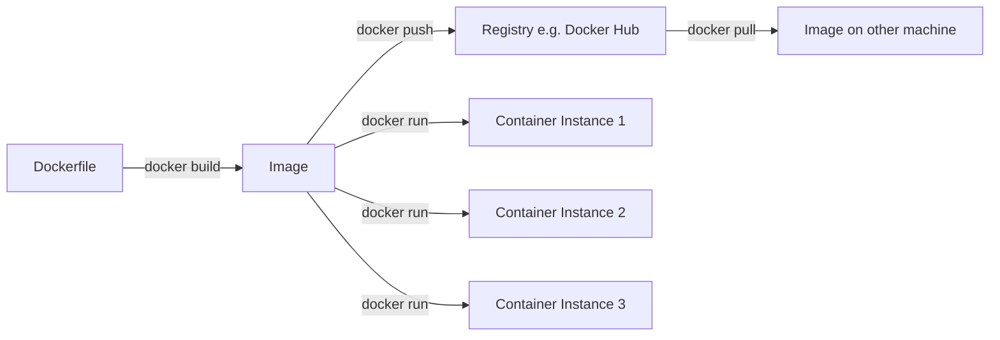
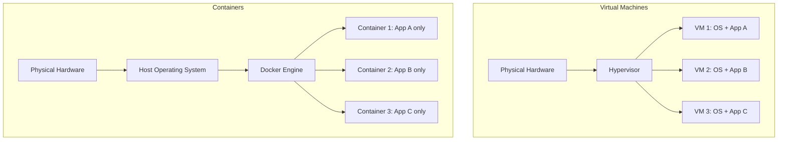
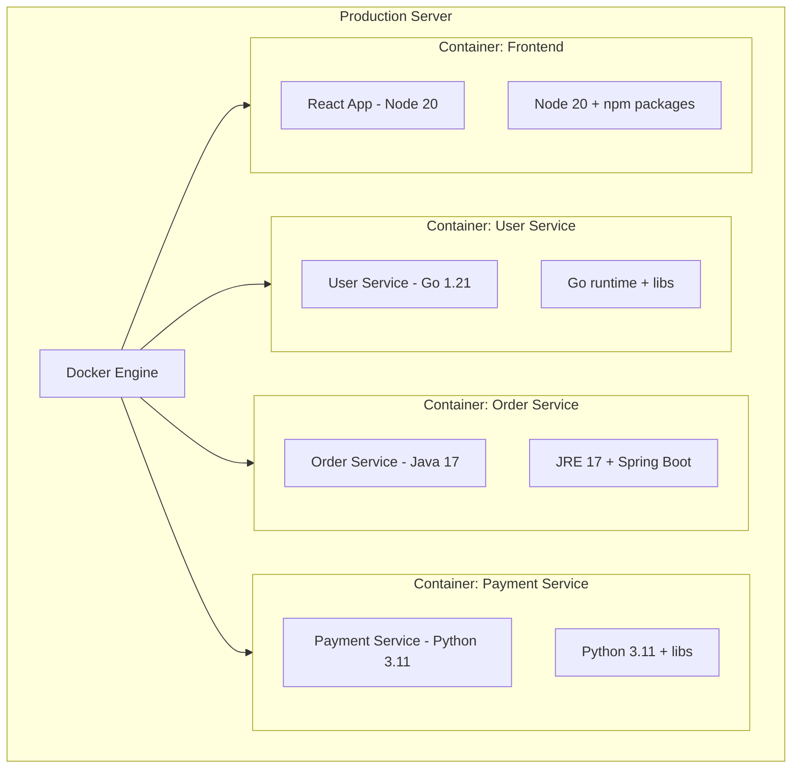

# Containers and Docker

## Why This Topic Exists

"It works on my machine" is one of the most common and frustrating problems in software development. A developer builds a service on their laptop (macOS, Python 3.11, library version X). It works perfectly. The same code is deployed to a Linux server (Python 3.8, different library versions, different environment variables). It crashes.

Containers solve this by packaging an application together with all its dependencies — the exact version of the runtime, libraries, and configuration — into a single portable unit. That unit runs identically on any machine that has a container runtime. Your laptop, a coworker's laptop, a test server, and the production cloud — all identical.

For microservices, containers are essential: each service has its own dependencies that might conflict with other services, and you need consistent, reproducible deployments at scale.

## Learning Objectives

- Explain the "it works on my machine" problem and how containers solve it
- Describe what a container is and how it differs from a virtual machine
- Explain the Docker building blocks: Dockerfile, image, container, registry
- Explain how containers help microservices deployments
- Write a basic Dockerfile and understand its instructions
- Use Docker Compose to run multiple services locally

## Prerequisites

- Basic understanding of operating systems (processes, filesystems)
- [Monolith vs Microservices](./01.%20Monolith%20vs%20Microservices%20%28BEGINNER%29.md) — understanding why we have multiple services
- No prior Docker experience needed

## Introduction

In the early days of software deployment, you would set up a server by hand: install the operating system, install the language runtime, install libraries, set environment variables, and copy the application code. If you had 20 servers, you did this 20 times — and each one was slightly different.

Configuration management tools (Chef, Puppet, Ansible) improved this, but the fundamental problem remained: the environment the application runs in is separate from the application itself.

Containers changed everything by bundling the application and its environment into one artifact. The container image is the deployment unit — you build it once, and it runs identically everywhere.

## Real-World Analogy

Think of **shipping containers** in global trade.

Before standardized shipping containers existed (before 1956), every ship, truck, and train had different systems. Cargo had to be manually loaded and unloaded — repacked at every transfer point. This was slow, expensive, and error-prone.

Standardized shipping containers changed this: a container packed in Shanghai can be loaded onto a ship, transferred to a train, loaded onto a truck, and delivered to a warehouse — all without anyone unpacking and repacking it. The interface is standardized; the contents do not matter.

Docker containers work the same way:
- The developer packs their application into a container (like loading a shipping container)
- That container can run on any machine with Docker installed (any ship, train, truck)
- The contents (application, dependencies, runtime) are packaged together and never need to be repacked

## Core Concepts

### What Is a Container?

A container is an **isolated process** on a Linux (or Windows) host. It has:
- Its own filesystem (can see only its own files, not the host's files)
- Its own network stack (its own IP address, ports)
- Its own process namespace (cannot see other containers' processes)
- Resource limits (CPU, memory quotas)

Crucially, containers **share the host operating system kernel**. They are not separate operating systems. This is what makes them lightweight.

### Container vs Virtual Machine

| Feature | Container | Virtual Machine |
|---------|-----------|----------------|
| **What it virtualizes** | Application and dependencies | Entire operating system |
| **Shares OS kernel** | Yes — shares host OS kernel | No — runs its own kernel |
| **Startup time** | Milliseconds | Minutes |
| **Size** | Megabytes (10-500MB) | Gigabytes (5-20GB) |
| **Performance overhead** | Near-zero | Significant hypervisor overhead |
| **Isolation** | Process-level (strong, not perfect) | Full OS-level (stronger) |
| **Use case** | Running many services on one host | Running different operating systems |

A container is like a **room** in a building: separate space, its own furniture (dependencies), shares the building's plumbing and electricity (OS kernel).

A VM is like a **separate building**: completely independent, but much more expensive to build and maintain.

For microservices, you typically run 10-50 containers on one server. You could not run 50 VMs on the same server — they would consume all the memory.

### Docker Building Blocks

**Dockerfile**: A text file with instructions to build an image. Like a recipe.

**Image**: A read-only template built from a Dockerfile. Contains the application code, runtime, libraries, and configuration. Like a snapshot or a blueprint.

**Container**: A running instance of an image. Like a house built from a blueprint. You can run multiple containers from the same image.

**Registry**: A storage service for Docker images. Docker Hub is the public registry. You can also run private registries (AWS ECR, Google Artifact Registry, GitLab Registry).

**Docker Engine**: The daemon that runs on the host, manages containers, pulls images, and handles networking.



## Visual Diagram (Mermaid)

### Container vs VM Architecture



### Microservices with Docker



## Deep Explanation

### How a Dockerfile Works

A Dockerfile is a sequence of instructions that build up an image layer by layer. Each instruction adds a new layer to the image. Layers are cached — if an instruction has not changed since the last build, Docker reuses the cached layer.

```dockerfile
# Start from an official base image
FROM node:20-alpine

# Set the working directory inside the container
WORKDIR /app

# Copy dependency files first (for layer caching)
COPY package*.json ./

# Install dependencies
RUN npm ci --production

# Copy the application code
COPY . .

# Tell Docker which port this container uses (documentation only)
EXPOSE 3000

# Command to run when the container starts
CMD ["node", "server.js"]
```

**Layer caching**: `COPY package*.json` and `RUN npm ci` are separate from `COPY . .`. If only application code changes (not package.json), Docker reuses the cached `npm ci` layer — the build is fast. This is why you copy dependency files before application code.

### The Immutable Infrastructure Principle

Containers embody **immutable infrastructure**: once an image is built and tested, it never changes. To deploy a new version:
1. Build a new image with a new version tag (e.g., `myapp:v1.2.3`)
2. Run containers from the new image
3. Stop containers running the old image

You never modify a running container. If something is wrong, you roll back by running the old image. This makes deployments predictable and rollbacks trivial.

### Container Networking

Each container gets its own virtual network interface. Docker creates a virtual network bridge. Containers can communicate with each other over this bridge.

- Each container gets an IP address on the Docker network
- Containers can reference each other by container name (DNS resolution built into Docker)
- Ports are published: `-p 3000:3000` maps the host's port 3000 to the container's port 3000

### How Containers Help Microservices

Each microservice runs in its own container. This provides:

**Dependency isolation**: User Service can use Python 3.8, Order Service can use Python 3.11, Payment Service can use Java 17. No conflicts.

**Consistent environments**: The same container image runs in development, CI, staging, and production. "It works on my machine" means it works everywhere.

**Fast deployment**: Container startup is milliseconds. Deploy a new version by starting new containers and stopping old ones — zero-downtime deployment is straightforward.

**Resource efficiency**: 50 microservices each in their own container on one machine. With VMs, this would be impractical.

**Easy rollback**: If the new version of Order Service has a bug, run `docker run order-service:v1.2.2` (the previous version). Done.

### Docker Compose for Local Development

Running 10 services manually with individual `docker run` commands is tedious. Docker Compose lets you define all your services in a single YAML file and start everything with one command.

```yaml
version: '3.8'
services:
  user-service:
    build: ./user-service
    ports:
      - "8001:8001"
    environment:
      - DATABASE_URL=postgres://user-db:5432/users
    depends_on:
      - user-db

  order-service:
    build: ./order-service
    ports:
      - "8002:8002"
    environment:
      - DATABASE_URL=postgres://order-db:5432/orders
      - USER_SERVICE_URL=http://user-service:8001
    depends_on:
      - order-db

  user-db:
    image: postgres:15
    environment:
      - POSTGRES_DB=users
      - POSTGRES_PASSWORD=secret

  order-db:
    image: postgres:15
    environment:
      - POSTGRES_DB=orders
      - POSTGRES_PASSWORD=secret
```

Running `docker compose up` starts all services, creates all containers, and sets up the networking. `docker compose down` stops and removes everything. This gives every developer an identical local environment.

### Image Layers and Optimization

Docker images are composed of read-only layers. When you run a container, Docker adds a writable layer on top. Multiple containers can share the same read-only layers.

**Optimization tip: Multi-stage builds**

For compiled languages (Go, Java, TypeScript), you need a build environment with compilers and build tools — but the final image only needs the compiled artifact.

```dockerfile
# Stage 1: Build
FROM golang:1.21 AS builder
WORKDIR /app
COPY go.mod go.sum ./
RUN go mod download
COPY . .
RUN go build -o server .

# Stage 2: Run (much smaller image)
FROM alpine:3.18
COPY --from=builder /app/server /server
CMD ["/server"]
```

The final image is just Alpine Linux (5MB) + the compiled binary. It does not contain the Go compiler or source code. This produces images that are 10x smaller — faster to pull, less attack surface.

## Step-by-Step Example

### Containerizing a Node.js Microservice

**Goal**: Package a Node.js Order Service into a Docker container.

**Step 1: Write the Dockerfile** (in the `order-service/` directory)
```dockerfile
FROM node:20-alpine
WORKDIR /app
COPY package*.json ./
RUN npm ci --production
COPY . .
EXPOSE 8002
CMD ["node", "index.js"]
```

**Step 2: Build the image**
```bash
docker build -t order-service:v1.0.0 .
```
Docker executes each instruction and creates a layered image tagged `order-service:v1.0.0`.

**Step 3: Run the container locally**
```bash
docker run -p 8002:8002 -e DATABASE_URL=postgres://localhost/orders order-service:v1.0.0
```
The container starts in milliseconds. The service is accessible at `localhost:8002`.

**Step 4: Push to a registry**
```bash
docker tag order-service:v1.0.0 registry.example.com/order-service:v1.0.0
docker push registry.example.com/order-service:v1.0.0
```

**Step 5: Deploy on the production server**
```bash
docker pull registry.example.com/order-service:v1.0.0
docker run -d --name order-service -p 8002:8002 registry.example.com/order-service:v1.0.0
```
The production server runs the exact same image that was built and tested in CI. Zero "works on my machine" surprises.

## Advantages / Disadvantages / Trade-offs

| Dimension | Detail |
|-----------|--------|
| **Pro** | Eliminates environment inconsistency — same image everywhere |
| **Pro** | Fast startup (milliseconds vs minutes for VMs) |
| **Pro** | Lightweight — many containers per host |
| **Pro** | Dependency isolation — services do not conflict |
| **Pro** | Easy rollback — just run the previous image version |
| **Pro** | Immutable deployments — predictable and auditable |
| **Con** | Learning curve for Dockerfile best practices |
| **Con** | Persistent data needs special handling (volumes) |
| **Con** | Networking can be confusing (bridge, host, overlay networks) |
| **Con** | Security: containers share the host kernel — a kernel vulnerability affects all containers |
| **Con** | Managing many containers requires an orchestrator (Kubernetes) |

## When to Use / When NOT to Use

### Use containers when:
- Deploying microservices (each service in its own container)
- You have inconsistent environments between development and production
- You need to run multiple services with conflicting dependencies on the same machine
- You want fast, reproducible deployments and easy rollbacks
- You are deploying to Kubernetes (requires containers)

### Containers are less critical when:
- You have a simple monolith on a single server (still useful, but not essential)
- You are using a PaaS like Heroku or Render that manages environments for you
- The overhead of learning Docker is too high for the immediate benefit

## Common Interview Questions

**Q: What is a Docker container and how does it differ from a virtual machine?**
A container is an isolated process sharing the host OS kernel, packaged with its application and dependencies. A VM virtualizes the entire OS and runs on a hypervisor. Containers are far lighter (MB vs GB, milliseconds startup vs minutes) and more efficient (50+ containers per host vs a handful of VMs), but provide less isolation since they share the kernel.

**Q: What is the difference between a Docker image and a container?**
An image is a read-only template — a snapshot of the application and its environment. A container is a running instance of an image. One image can produce many containers. Image is to container as a class is to an object.

**Q: How do containers help with microservices?**
Each microservice runs in its own container with its own dependencies, eliminating conflicts between services using different language runtimes or library versions. Container images ensure the development, testing, and production environments are identical. Containers start in milliseconds, enabling fast deployments and scaling.

**Q: What is a Docker registry and why is it important?**
A registry (Docker Hub, AWS ECR, Google Artifact Registry) stores container images. The build pipeline pushes images to the registry. Deployment pulls images from the registry. This creates a single source of truth for versioned, immutable application images — you can always pull and run any past version.

## Common Beginner Mistakes

**Mistake 1: Running databases inside application containers**
Application containers are ephemeral — they stop and restart. Databases store persistent state and should run in dedicated containers with volume mounts for data persistence, or use managed database services entirely.

**Mistake 2: Not using multi-stage builds**
Building a Go application in a container without multi-stage builds produces a 1GB image (including the Go compiler). With multi-stage builds, the image is 15MB. Smaller images pull faster, deploy faster, and have less security attack surface.

**Mistake 3: Running as root inside containers**
By default, containers run as root. If an attacker escapes the container, they have root on the host. Always add `USER appuser` in your Dockerfile to run as a non-root user.

**Mistake 4: Putting secrets in Dockerfiles or images**
Never put API keys, passwords, or certificates in a Dockerfile or image. Anyone who pulls the image can extract them. Use environment variables passed at runtime, or use secret management tools (Kubernetes Secrets, AWS Secrets Manager, Vault).

**Mistake 5: Not tagging images with specific versions**
`docker pull myapp:latest` in production is a footgun — the "latest" tag changes with every build, so two servers pulling at different times get different images. Always use specific version tags (`v1.2.3`) in production.

## Summary

Containers solve the "it works on my machine" problem by packaging an application with all its dependencies into a single portable unit. Docker provides the tooling to build images (Dockerfile), run containers, and share images via registries. Containers are lightweight (share the host OS kernel), start in milliseconds, and enable each microservice to have its own isolated environment. Docker Compose enables running multi-service systems locally. For production at scale, containers need an orchestrator — that is what Kubernetes provides.

## Key Takeaways

- Containers solve environment inconsistency — same image runs identically everywhere
- Container = isolated process + its own filesystem/network, sharing the host OS kernel
- VM = full OS + hypervisor — heavier, stronger isolation, slower
- Dockerfile → Image (build artifact) → Container (running instance)
- Registry stores versioned, immutable images — the source of truth for deployments
- Each microservice runs in its own container = dependency isolation
- Multi-stage builds produce small, production-ready images
- Never run as root, never put secrets in images, always use version tags
- Docker Compose for local multi-service development
- Containers alone do not solve production orchestration — that is Kubernetes

## Related Topics (relative markdown links)

- [Monolith vs Microservices](./01.%20Monolith%20vs%20Microservices%20%28BEGINNER%29.md)
- [Kubernetes Basics](./07.%20Kubernetes%20Basics%20%28INTERMEDIATE%29.md)
- [Service Discovery](./02.%20Service%20Discovery%20%28INTERMEDIATE%29.md)
- [Chapter 17: Cloud and Infrastructure](../17.%20Cloud%20and%20Infrastructure/README.md)
