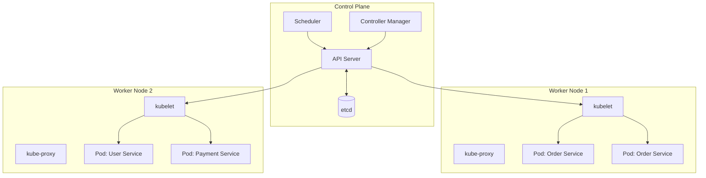
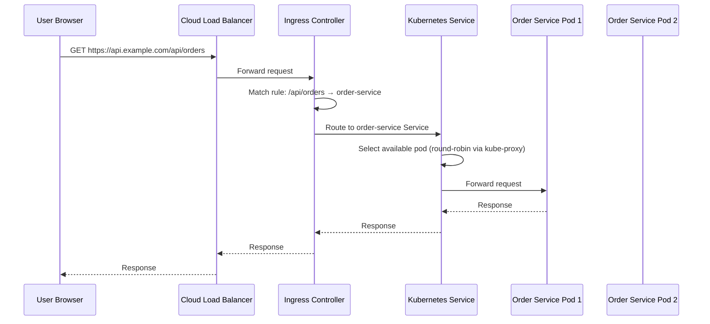
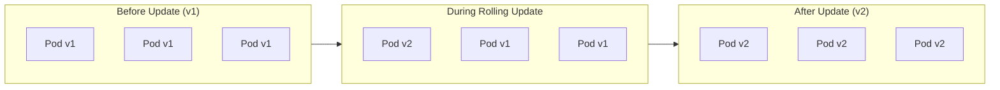

# Kubernetes Basics

## Why This Topic Exists

Docker containers solve the packaging problem. But when you have 100 microservices, each with multiple container instances, running across 20 servers, Docker alone is not enough. Who decides which server each container runs on? Who restarts a container when it crashes? Who scales services up during peak traffic and down at night? Who routes traffic to the right containers? Who handles deployments without downtime?

Kubernetes (k8s) is the platform that answers all of these questions. It is the operating system for container clusters. Kubernetes is why modern engineering teams can run hundreds of services at scale without an army of operators.

## Learning Objectives

- Explain what problem Kubernetes solves
- Describe the core Kubernetes objects: Pod, Deployment, Service, Ingress, ConfigMap, Secret
- Trace how a request flows through a Kubernetes cluster
- Explain Horizontal Pod Autoscaler (HPA) and how auto-scaling works
- Know the Kubernetes control plane components (at a conceptual level)
- Recognize why Kubernetes is complex but ubiquitous

## Prerequisites

- [Containers and Docker](./06.%20Containers%20and%20Docker%20%28BEGINNER%29.md) — you must understand containers before Kubernetes
- [Service Discovery](./02.%20Service%20Discovery%20%28INTERMEDIATE%29.md) — how services find each other
- [Chapter 3: Scalability](../03.%20Scalability/README.md) — horizontal scaling concepts

## Introduction

Imagine you are the manager of a warehouse with 100 workers (containers) spread across 20 buildings (servers). Your job is:
- Assign each worker to a building based on available space
- When a worker quits, immediately hire a replacement
- When it is busy, hire more workers; when it is quiet, let some go
- Make sure each building's workers have their tools (environment variables, config)
- Route customer requests to the right workers

Doing this manually is impossible at scale. You need an **operations manager** — software that automates all of these decisions. That is Kubernetes.

## Real-World Analogy

**Kubernetes is like an airline operations manager.**

An airline has thousands of flights (services), hundreds of planes (containers), and dozens of airports (servers/nodes). The operations manager:
- Decides which planes fly which routes (schedules containers on nodes)
- If a plane breaks down, dispatches a replacement (restarts failed containers)
- Adds more flights when demand spikes (autoscaling)
- Updates the fleet gradually (rolling deployments — retires old planes, brings in new ones one at a time)
- Makes sure each plane has the right fuel, crew, and configuration (configures containers)

Pilots (application code) do not think about any of this — they just fly. Kubernetes makes sure the infrastructure is always in the desired state so developers just write and deploy code.

## Core Concepts

### The Desired State Model

Kubernetes works on a **desired state** (also called declarative) model. You tell Kubernetes what you want ("I want 5 replicas of Order Service running at all times"), and Kubernetes makes it happen and keeps it that way.

If 2 replicas crash, Kubernetes automatically starts 2 new ones. If you update the desired count to 8, Kubernetes starts 3 more. You never manually run or stop containers — you declare intent, and Kubernetes reconciles reality to match.

This is fundamentally different from **imperative** ("start this container, stop that one, move this to that server"). Declarative intent is far easier to manage at scale.

### Key Kubernetes Objects

#### Pod

The smallest deployable unit in Kubernetes. A pod is one or more containers that:
- Always run on the same node
- Share network namespace (same IP address)
- Share storage volumes

In practice, most pods contain one container. You rarely run multiple containers in a pod unless they are tightly coupled (e.g., a sidecar proxy in a service mesh).

Pods are ephemeral — they can die and be replaced at any time. Never rely on a specific pod's IP address. Use a Service instead.

#### Deployment

A Deployment manages a set of identical pod replicas. You tell the Deployment "I want 5 replicas of this pod spec." It creates and manages them.

Features of Deployments:
- **Desired replica count**: If a pod dies, the Deployment creates a replacement
- **Rolling updates**: When you update the container image, it replaces pods one by one (zero downtime)
- **Rollback**: If the new version has problems, roll back with one command

A Deployment is the standard way to run stateless services in Kubernetes.

#### Service

A Kubernetes Service provides a stable network identity (IP address and DNS name) for a set of pods. Pods come and go, but the Service's IP stays constant.

Types of Services:
| Type | Description |
|------|-------------|
| **ClusterIP** | Stable internal IP, accessible only within the cluster. Default type. |
| **NodePort** | Exposes the service on a port of every node in the cluster. Accessible from outside. |
| **LoadBalancer** | Creates an external cloud load balancer (AWS ELB, GCP LB). For production external traffic. |

The Service uses a **label selector** to find pods. Pods with label `app: order-service` are selected by the Service with selector `app: order-service`. When pods are replaced during rolling updates, the new pods have the same label — the Service automatically routes to them.

#### Ingress

An Ingress manages external HTTP/HTTPS traffic routing into the cluster. It is essentially the API Gateway / load balancer for incoming traffic.

```
External traffic:
  example.com/api/orders → Order Service
  example.com/api/users  → User Service
  example.com/api/products → Product Service
```

An Ingress needs an **Ingress Controller** (e.g., Nginx Ingress Controller, Traefik) to implement the routing rules.

#### ConfigMap and Secret

**ConfigMap**: Stores non-sensitive configuration as key-value pairs or files. Example: database hostname, feature flags, environment-specific settings.

**Secret**: Stores sensitive data (passwords, API keys, TLS certificates) — stored base64-encoded (and optionally encrypted at rest). Injected into containers as environment variables or volume-mounted files.

This separation means your container image is environment-agnostic. The same image runs in dev (with dev database URL), staging, and production (different URLs injected via ConfigMap).

#### Namespace

A namespace is a logical partition within a Kubernetes cluster. You can group services by team, environment, or domain:
- `namespace: production` — live services
- `namespace: staging` — pre-production testing
- `namespace: team-payments` — payments team's services

Namespaces provide isolation, resource quotas, and access control boundaries.

## Visual Diagram (Mermaid)

### Kubernetes Cluster Architecture



### Request Flow Through Kubernetes



### Deployment Rolling Update



## Deep Explanation

### The Control Plane

The Kubernetes control plane is the "brain" of the cluster. Key components:

**API Server**: The front door to the entire cluster. All tools (kubectl, the scheduler, the controller manager) communicate exclusively through the API server. When you run `kubectl apply -f deployment.yaml`, you are sending a request to the API server.

**etcd**: A distributed key-value store that holds all cluster state — what pods exist, what their desired state is, what nodes are available. If etcd is corrupted, the cluster state is lost. In production, etcd is run with 3 or 5 replicas for high availability.

**Scheduler**: Watches for newly created pods that have not been assigned to a node yet. Picks the best node based on resource availability (CPU, memory), affinity rules, and constraints.

**Controller Manager**: Runs control loops that continuously compare desired state (what you declared) to actual state (what is running). If a pod dies, the ReplicaSet controller notices there are 4 pods instead of 5 and creates a new one.

### Worker Nodes

Each worker node runs:

**kubelet**: An agent that takes instructions from the control plane (API server) and manages pods on the node. It starts/stops containers, reports pod health, and mounts volumes.

**kube-proxy**: Manages network rules on the node. When a Service receives traffic for `order-service`, kube-proxy's iptables rules redirect it to one of the service's pods. This is the low-level implementation of Kubernetes service discovery.

**Container Runtime**: Usually containerd or Docker — the software that actually runs containers.

### How kubectl Works

`kubectl` is the command-line tool for interacting with Kubernetes. It communicates with the API server.

Common commands:
```bash
# Apply a configuration (create or update resources)
kubectl apply -f deployment.yaml

# Get pods in the default namespace
kubectl get pods

# Get pods in a specific namespace
kubectl get pods -n production

# See pod logs
kubectl logs order-service-7d9f4-xyz

# Execute a command inside a running container
kubectl exec -it order-service-7d9f4-xyz -- /bin/sh

# Scale a deployment
kubectl scale deployment order-service --replicas=10

# Rolling update (update image version)
kubectl set image deployment/order-service order-service=order-service:v1.2.3
```

### Horizontal Pod Autoscaler (HPA)

The HPA automatically scales the number of pod replicas based on observed metrics — typically CPU utilization or custom application metrics.

**How it works:**
1. You create an HPA: "Keep Order Service at average 50% CPU. Minimum 2 replicas, maximum 20 replicas."
2. The HPA controller checks CPU usage every 15 seconds
3. If average CPU is 80% (above 50% target), the HPA adds more replicas: `needed_replicas = current_replicas * (current_cpu / target_cpu) = 4 * (80/50) = 6.4 → scale to 7`
4. If CPU drops to 20% (well below target), HPA scales down: wait 5 minutes to avoid flapping, then scale to `4 * (20/50) = 1.6 → scale to 2` (minimum)

The HPA uses the Kubernetes Metrics Server (or Prometheus) to get CPU/memory data.

**Custom metrics**: You can scale on application-level metrics too — queue depth, request latency, active sessions. A video processing service might scale based on the number of videos waiting in a queue.

### Deployments and Rolling Updates

A Deployment with `strategy: RollingUpdate` (the default) updates pods one by one:

1. Create 1 new pod with the new image version
2. Wait for it to pass health checks and become Ready
3. Terminate 1 old pod
4. Repeat until all pods are updated

Configuration:
```yaml
strategy:
  type: RollingUpdate
  rollingUpdate:
    maxSurge: 1        # Max extra pods during update
    maxUnavailable: 0  # Zero downtime: never reduce below desired count
```

If the new version fails health checks, the rollout stops. You roll back with `kubectl rollout undo deployment/order-service`.

### Health Checks

Kubernetes uses two types of health probes to manage pod lifecycle:

**Liveness Probe**: "Is this container alive?" If it fails, Kubernetes kills and restarts the container. Use for detecting deadlocks or infinite loops.

**Readiness Probe**: "Is this container ready to serve traffic?" If it fails, Kubernetes removes the pod from the Service's endpoints — traffic stops being routed to it. Use to prevent routing traffic to a container that is starting up or temporarily overloaded.

```yaml
livenessProbe:
  httpGet:
    path: /health/live
    port: 8080
  initialDelaySeconds: 30
  periodSeconds: 10

readinessProbe:
  httpGet:
    path: /health/ready
    port: 8080
  initialDelaySeconds: 10
  periodSeconds: 5
```

## Step-by-Step Example

### Deploying Order Service to Kubernetes

**Step 1: Write the Deployment manifest**
```yaml
apiVersion: apps/v1
kind: Deployment
metadata:
  name: order-service
  namespace: production
spec:
  replicas: 3
  selector:
    matchLabels:
      app: order-service
  template:
    metadata:
      labels:
        app: order-service
    spec:
      containers:
      - name: order-service
        image: registry.example.com/order-service:v1.2.3
        ports:
        - containerPort: 8002
        env:
        - name: DATABASE_URL
          valueFrom:
            secretKeyRef:
              name: order-service-secrets
              key: database-url
        resources:
          requests:
            cpu: "100m"
            memory: "128Mi"
          limits:
            cpu: "500m"
            memory: "512Mi"
        readinessProbe:
          httpGet:
            path: /health/ready
            port: 8002
          initialDelaySeconds: 10
          periodSeconds: 5
```

**Step 2: Write the Service manifest**
```yaml
apiVersion: v1
kind: Service
metadata:
  name: order-service
  namespace: production
spec:
  selector:
    app: order-service
  ports:
  - port: 80
    targetPort: 8002
  type: ClusterIP
```

**Step 3: Apply to the cluster**
```bash
kubectl apply -f order-service-deployment.yaml
kubectl apply -f order-service-service.yaml
```

Kubernetes creates 3 pods and a Service. The Service gets a ClusterIP and a DNS name: `order-service.production.svc.cluster.local`.

**Step 4: Add autoscaling**
```bash
kubectl autoscale deployment order-service --cpu-percent=50 --min=2 --max=20
```

**Step 5: Deploy a new version**
```bash
kubectl set image deployment/order-service order-service=registry.example.com/order-service:v1.2.4
```
Kubernetes performs a rolling update. Old pods are replaced one by one. Zero downtime.

**Step 6: Rollback if needed**
```bash
kubectl rollout undo deployment/order-service
```

## Advantages / Disadvantages / Trade-offs

| Dimension | Detail |
|-----------|--------|
| **Pro** | Self-healing — failed pods restart automatically |
| **Pro** | Rolling deployments — zero-downtime updates built in |
| **Pro** | Horizontal autoscaling — handles traffic spikes automatically |
| **Pro** | Declarative configuration — desired state, not imperative commands |
| **Pro** | Rich ecosystem — Helm, Prometheus, Istio, Argo CD all integrate |
| **Pro** | Ubiquitous — every major cloud provider offers managed Kubernetes (EKS, GKE, AKS) |
| **Con** | Steep learning curve — many concepts (Pod, Deployment, Service, Ingress, HPA, RBAC) |
| **Con** | Significant operational complexity — maintaining the control plane is non-trivial |
| **Con** | Overkill for small systems — single-service applications do not need Kubernetes |
| **Con** | Resource overhead — the control plane itself consumes resources |
| **Con** | YAML configuration is verbose and error-prone |

## When to Use / When NOT to Use

### Use Kubernetes when:
- You have 5+ microservices that need independent deployment and scaling
- You need zero-downtime deployments, autoscaling, and self-healing
- Your team has the operational maturity to manage a k8s cluster (or you use a managed service like EKS/GKE)
- You need consistent deployment across multiple environments (dev, staging, production)

### Do NOT use Kubernetes when:
- You have a simple monolith or 1-3 services — it is massive overkill
- You are a startup in early stages — the operational overhead slows you down
- You do not have the team to manage and operate it — a poorly managed Kubernetes cluster is worse than no cluster
- Use managed alternatives instead: AWS ECS, Google Cloud Run, AWS Fargate, Railway, Render

## Common Interview Questions

**Q: What problem does Kubernetes solve?**
Kubernetes solves container orchestration at scale: scheduling containers across a cluster, restarting failed containers, scaling based on load, performing zero-downtime rolling deployments, managing configuration, and providing service discovery and load balancing. Without Kubernetes, running 50 microservices as containers requires massive manual effort.

**Q: What is the difference between a Pod and a Deployment?**
A Pod is the smallest unit — one or more containers. A Deployment manages a set of identical pod replicas, ensures the desired count is always running, and handles rolling updates and rollbacks. In practice, you never create pods directly — you create Deployments that manage pods for you.

**Q: What is a Kubernetes Service and why do you need it?**
A Service provides a stable IP address and DNS name for a set of pods. Pods are ephemeral — they get replaced during updates with new IPs. The Service IP never changes. It also load-balances traffic across the healthy pods. Without a Service, callers would have to track individual pod IPs, which change constantly.

**Q: How does Kubernetes autoscaling work?**
The Horizontal Pod Autoscaler (HPA) monitors metrics (usually CPU utilization via Metrics Server). When the average CPU of pods exceeds the target, it calculates how many pods are needed and increases the replica count. When load drops, it scales back down. You set min and max replica bounds.

**Q: What is the difference between a ConfigMap and a Secret?**
Both store configuration data for containers. ConfigMap stores non-sensitive data (hostnames, feature flags). Secret stores sensitive data (passwords, API keys, certificates). Secrets are base64-encoded and can be encrypted at rest in etcd. In practice, both are injected as environment variables or mounted as files in containers.

## Common Beginner Mistakes

**Mistake 1: Not setting resource requests and limits**
Without `resources.requests` and `resources.limits`, the scheduler cannot make good decisions about pod placement, and one runaway pod can starve other pods on the same node. Always set resource requests and limits.

**Mistake 2: Using Deployments for stateful services (databases)**
Deployments are for stateless services. Databases need stable network identities and persistent storage. Use **StatefulSets** for databases, Kafka, ZooKeeper, etc.

**Mistake 3: Putting secrets in ConfigMaps or environment variable defaults**
ConfigMaps are not encrypted. API keys and passwords go in Secrets, not ConfigMaps. Better yet, use an external secret manager (Vault, AWS Secrets Manager) with the Kubernetes External Secrets operator.

**Mistake 4: Ignoring resource quotas**
Without resource quotas on namespaces, one team's runaway deployment can consume all cluster resources and starve other teams' services.

**Mistake 5: Not setting readiness probes**
Without readiness probes, Kubernetes routes traffic to pods that are still starting up or temporarily unable to serve requests. Always implement readiness probes.

## Summary

Kubernetes is the container orchestration platform that makes microservices production-ready. It schedules containers across a cluster, restarts failed pods, performs rolling deployments without downtime, autoscales based on load, and provides service discovery via DNS and kube-proxy. The core objects are: Pod (single unit), Deployment (manages pod replicas), Service (stable network identity), Ingress (external traffic routing), ConfigMap/Secret (configuration), and HPA (autoscaling). Kubernetes is complex but ubiquitous — every major cloud provider offers a managed version.

## Key Takeaways

- Kubernetes solves container orchestration: scheduling, self-healing, scaling, deployments
- Desired state model: declare what you want, Kubernetes makes it happen
- Pod = smallest deployable unit; Deployment = manages pod replicas with rolling updates
- Service = stable network identity (IP + DNS name) for a set of pods
- Ingress = HTTP routing for external traffic into the cluster
- ConfigMap = non-sensitive config; Secret = sensitive config
- HPA autoscales pod count based on CPU/memory/custom metrics
- Service discovery: CoreDNS resolves service names, kube-proxy routes traffic
- Health probes: liveness (is it alive?) and readiness (is it ready for traffic?)
- Use managed Kubernetes (EKS, GKE, AKS) in production — do not manage the control plane yourself
- Overkill for small systems — use ECS, Cloud Run, or Fargate for simpler needs

## Related Topics (relative markdown links)

- [Containers and Docker](./06.%20Containers%20and%20Docker%20%28BEGINNER%29.md)
- [Service Discovery](./02.%20Service%20Discovery%20%28INTERMEDIATE%29.md)
- [API Gateway](./03.%20API%20Gateway%20%28INTERMEDIATE%29.md)
- [Service Mesh](./04.%20Service%20Mesh%20%28ADV%29.md)
- [Chapter 3: Scalability](../03.%20Scalability/README.md)
- [Chapter 15: Observability](../15.%20Observability/README.md)
- [Chapter 17: Cloud and Infrastructure](../17.%20Cloud%20and%20Infrastructure/README.md)
