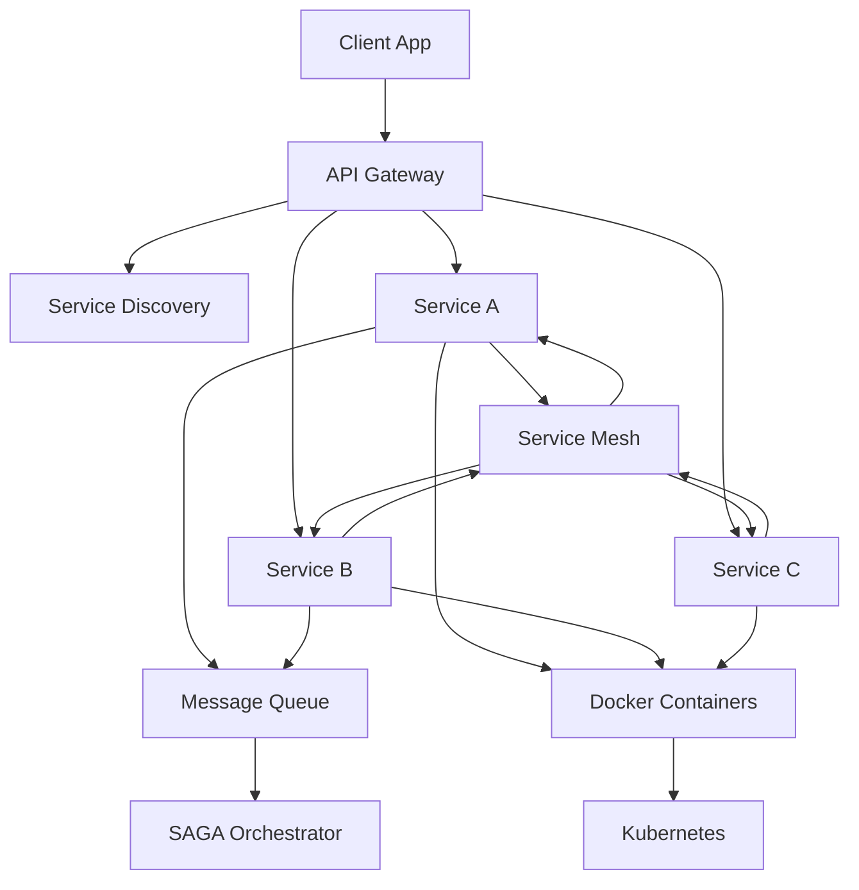

# Chapter 12: Microservices

## Why This Chapter Exists

Modern software systems are built by dozens or hundreds of engineers working simultaneously. A single monolithic application becomes a bottleneck: one team's change can break another team's feature, deployments take hours and carry huge risk, and a bug in the payment module can crash the entire system including the search page.

Microservices is the architectural style that solves this by breaking large applications into small, independently deployable services. Netflix, Amazon, Uber, and Airbnb all migrated from monoliths to microservices — not because microservices are trendy, but because their engineering organizations could no longer move fast with a single codebase.

This chapter teaches you microservices from the ground up: why they exist, how they communicate, how they are deployed, and what problems they introduce. By the end you will be able to design, discuss, and critique microservices architectures in interviews and on the job.

## Learning Objectives

By completing this chapter you will be able to:

- Explain why microservices exist and when they are the wrong choice
- Design a service discovery strategy for a distributed system
- Describe what an API Gateway does and why every microservices system needs one
- Explain service meshes and when they are worth the complexity
- Design a distributed transaction using the SAGA pattern
- Explain containers and Docker at an interview level
- Describe Kubernetes and what problem it solves

## Prerequisites

Before starting this chapter, you should be comfortable with:

- [Chapter 3: Scalability](../03.%20Scalability/README.md) — horizontal vs vertical scaling
- [Chapter 4: Databases](../04.%20Databases/README.md) — how databases work
- [Chapter 9: Message Queues](../09.%20Message%20Queues/README.md) — async communication
- [Chapter 10: Consistency and Consensus](../10.%20Consistency%20and%20Consensus/README.md) — distributed system guarantees

## Topics in This Chapter

| # | File | Level | Description |
|---|------|-------|-------------|
| 01 | [Monolith vs Microservices](./01.%20Monolith%20vs%20Microservices%20%28BEGINNER%29.md) | Beginner | What are microservices, why do they exist, and when are they the wrong choice |
| 02 | [Service Discovery](./02.%20Service%20Discovery%20%28INTERMEDIATE%29.md) | Intermediate | How services find each other when IPs change dynamically |
| 03 | [API Gateway](./03.%20API%20Gateway%20%28INTERMEDIATE%29.md) | Intermediate | Single entry point for clients, routing, auth, rate limiting |
| 04 | [Service Mesh](./04.%20Service%20Mesh%20%28ADV%29.md) | Advanced | Infrastructure layer for service-to-service communication |
| 05 | [SAGA Pattern](./05.%20SAGA%20Pattern%20%28INTERMEDIATE%29.md) | Intermediate | Distributed transactions without 2PC |
| 06 | [Containers and Docker](./06.%20Containers%20and%20Docker%20%28BEGINNER%29.md) | Beginner | Packaging services as containers for consistent deployment |
| 07 | [Kubernetes Basics](./07.%20Kubernetes%20Basics%20%28INTERMEDIATE%29.md) | Intermediate | Orchestrating hundreds of containers in production |

## Recommended Reading Order

If you are new to microservices, read in order from 01 to 07. Each topic builds on the previous:

1. Start with **Monolith vs Microservices** to understand the problem microservices solve
2. Learn **Service Discovery** because services need to find each other before anything else
3. Learn **API Gateway** because every real system has one
4. Jump to **Containers and Docker** (06) before **Kubernetes** (07) if you have never used containers — you need Docker concepts before k8s makes sense
5. Return to **Service Mesh** (04) and **SAGA Pattern** (05) — these are advanced topics that assume you already understand the basics

## Chapter Overview

### The Core Problem

Imagine a company with 500 engineers all working in the same Git repository on the same deployable application. Every week, merging hundreds of changes together is a nightmare. Every deployment is a "big bang" release that can fail for any of a hundred reasons. The database schema is shared by every team, so a change by the payments team can break the recommendations team.

Microservices solve this by giving each team ownership of their own service, their own database, their own deployment pipeline.

### The Core Trade-off

Microservices replace **complexity of code** with **complexity of infrastructure**. A monolith is hard to change at scale. Microservices are easy to change but require service discovery, API gateways, distributed tracing, container orchestration, and a mature DevOps culture.

Martin Fowler's famous quote applies here: **"Don't start with microservices."** Build a monolith first. When the monolith hurts — when multiple teams are blocked by each other, when you need to scale one part independently — then migrate using the Strangler Fig pattern.

### How the Pieces Fit Together

- The **API Gateway** is the front door — all client traffic enters here
- **Service Discovery** lets the gateway and services find each other dynamically
- The **Service Mesh** handles service-to-service communication transparently
- **SAGA** handles distributed transactions across services
- **Docker** packages each service into a portable container
- **Kubernetes** runs and manages all those containers in production

## Key Vocabulary

| Term | Definition |
|------|-----------|
| Monolith | A single deployable application containing all functionality |
| Microservice | A small, independently deployable service with a single responsibility |
| Service Registry | A database of available service instances and their locations |
| API Gateway | A server that acts as the single entry point for all client requests |
| Sidecar | A proxy container deployed alongside each service to handle cross-cutting concerns |
| Orchestration | A central coordinator telling services what to do |
| Choreography | Services reacting to events without a central coordinator |
| Pod | The smallest deployable unit in Kubernetes — one or more containers |
| Container | An isolated process with its own filesystem and network stack |

## Common Interview Topics in This Chapter

- "Design Twitter's backend" — requires microservices decomposition
- "How would you migrate a monolith to microservices?" — Strangler Fig
- "How do microservices communicate?" — sync (REST/gRPC) vs async (events)
- "How do you handle distributed transactions?" — SAGA pattern
- "What is a service mesh and when would you use it?" — Istio, sidecar proxies
- "What problem does Kubernetes solve?" — container orchestration

## Related Chapters

- [Chapter 9: Message Queues](../09.%20Message%20Queues/README.md) — core communication mechanism for microservices
- [Chapter 10: Consistency and Consensus](../10.%20Consistency%20and%20Consensus/README.md) — why distributed transactions are hard
- [Chapter 13: API Design](../13.%20API%20Design/README.md) — designing APIs between microservices
- [Chapter 15: Observability](../15.%20Observability/README.md) — distributed tracing across microservices
- [Chapter 17: Cloud and Infrastructure](../17.%20Cloud%20and%20Infrastructure/README.md) — running microservices in the cloud
