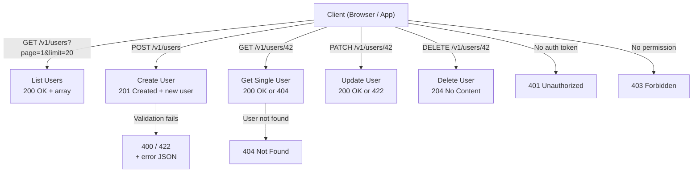

# REST API Design Best Practices

## Why This Topic Exists

REST (Representational State Transfer) is the most widely used architectural style for building web APIs. But REST is not a strict protocol — it is a set of constraints and guidelines. That flexibility is both its strength and its weakness.

Because REST has no enforced rules, two teams can both call their API "RESTful" while designing it completely differently. One team uses `/getUsers`, the other uses `/users`. One returns a 200 status for everything — including errors. Another uses 42 different status codes correctly. The difference in API quality between these teams is enormous.

This topic exists because writing a REST API that is clean, predictable, and easy to use by other developers is a real skill. It is also a skill that shows up directly in system design interviews and code reviews at senior level.

---

## Learning Objectives

By the end of this file you will be able to:

- Name REST resources correctly (nouns not verbs)
- Apply the right HTTP method to the right operation
- Use HTTP status codes accurately and consistently
- Design URL versioning and other versioning strategies
- Implement pagination (cursor-based vs offset-based)
- Format error responses consistently
- Explain idempotency and why it matters

---

## Prerequisites

- Understanding of HTTP request/response cycle
- Familiarity with JSON
- Basic knowledge of what an API is

---

## Introduction

REST was defined by Roy Fielding in his 2000 doctoral dissertation. At its core, REST treats everything in your system as a **resource** — a user, an order, a product, a post. Each resource has a unique URL. You interact with resources using standard HTTP methods (GET, POST, PUT, PATCH, DELETE). The server sends back a representation of the resource (usually JSON).

This sounds simple. And it is simple — until you have 50 endpoints and a team of 10 engineers who each have their own opinions about how to do things.

REST best practices are the shared conventions that keep teams consistent and clients happy.

---

## Real-World Analogy

Think of a public library.

Every book has a unique location: Section → Shelf → Row → Book number. You do not say "go get me that book about dragons." You say "Section B, Shelf 3, Row 2, Book 17."

The way you interact with books is also standardized:
- **Check out** a book (you create a loan — POST)
- **Read** a book in place (you look at data — GET)
- **Return** a book (you delete a loan — DELETE)
- **Renew** a book (you update a loan — PATCH)

Nobody goes to the librarian and says "executeBookRetrieval" or "performLoanCreation." They use the standard verbs and the standard location system. REST works the same way.

---

## Core Concepts

### 1. Resource Naming — Nouns, Not Verbs

Resources are things (nouns). HTTP methods are actions (verbs). Never put actions in your URL.

| Wrong (verb in URL) | Correct (noun in URL) |
|---------------------|----------------------|
| GET /getUsers | GET /users |
| POST /createUser | POST /users |
| POST /deleteUser/5 | DELETE /users/5 |
| GET /fetchOrdersByUser/3 | GET /users/3/orders |

Use plurals for collections: `/users` not `/user`. Use nesting for sub-resources: `/users/5/orders` means "the orders belonging to user 5."

Keep nesting to 2 levels maximum. `/users/5/orders/12/items/3` is too deep — flatten it to `/order-items/3` with a query param for context.

### 2. HTTP Method Semantics

| Method | Use For | Idempotent? | Safe? |
|--------|---------|-------------|-------|
| GET | Read a resource | Yes | Yes |
| POST | Create a new resource | No | No |
| PUT | Replace a resource entirely | Yes | No |
| PATCH | Update part of a resource | No (can be designed to be) | No |
| DELETE | Remove a resource | Yes | No |

**Idempotent** means: calling it once or 100 times produces the same result. GET /users/5 always returns the same user (or 404 if they do not exist). DELETE /users/5 deletes the user. Calling it again still results in the user not existing — so it is idempotent.

**Safe** means the operation has no side effects on the server state. GET and HEAD are safe. Nothing else is.

### 3. HTTP Status Codes

Status codes tell the client what happened. Using them correctly is one of the biggest differences between amateur and professional API design.

| Range | Meaning | Examples |
|-------|---------|---------|
| 2xx | Success | 200 OK, 201 Created, 204 No Content |
| 3xx | Redirect | 301 Moved Permanently, 304 Not Modified |
| 4xx | Client error | 400 Bad Request, 401 Unauthorized, 403 Forbidden, 404 Not Found, 409 Conflict, 422 Unprocessable Entity, 429 Too Many Requests |
| 5xx | Server error | 500 Internal Server Error, 502 Bad Gateway, 503 Service Unavailable |

**Common mistakes:**
- Returning 200 for everything and hiding errors in the response body — do not do this
- Using 401 and 403 interchangeably — 401 means "not logged in," 403 means "logged in but not allowed"
- Using 500 for validation errors — use 400 or 422

### 4. Versioning Strategies

APIs evolve. When you make a breaking change, you need to version your API so existing clients are not broken.

**Option A: URL path versioning (most common)**
```
GET /v1/users
GET /v2/users
```
Simple. Visible in logs and browser history. Easy to route. The GitHub REST API uses this. Recommended for most teams.

**Option B: Query parameter versioning**
```
GET /users?version=1
GET /users?version=2
```
Cleaner URLs, but version can be accidentally omitted. Harder to enforce at the routing layer.

**Option C: Custom request header**
```
GET /users
X-API-Version: 2
```
URL stays clean. But version is invisible in browser history. Harder to test manually.

**Option D: Content negotiation (Accept header)**
```
GET /users
Accept: application/vnd.mycompany.v2+json
```
Academically the most "correct" REST approach. Very hard to use in practice — most HTTP clients and developers do not handle this well.

**Recommendation:** Use URL path versioning (`/v1/`, `/v2/`) for public APIs. It is the most visible, testable, and widely understood approach.

### 5. Pagination

Never return 1 million records in one API call. Always paginate.

**Offset-based pagination:**
```
GET /users?page=3&limit=20
```
Skip (page-1)*limit records, return next 20. Simple to understand. But it has a problem: if records are inserted or deleted between page 1 and page 3, the user sees duplicates or skipped items.

**Cursor-based pagination (better for large, live datasets):**
```
GET /users?cursor=eyJ1c2VySWQiOiAxMjM0fQ==&limit=20
```
The cursor encodes a position in the dataset (e.g., the ID of the last item seen). The next page starts after that item, regardless of insertions/deletions. Twitter, Facebook, and Instagram all use cursor-based pagination.

Use cursor-based pagination for any feed or live dataset. Use offset for simpler, stable data.

### 6. Filtering and Sorting

Use query parameters for filters:
```
GET /products?category=electronics&inStock=true&minPrice=100&maxPrice=500
GET /users?sort=createdAt:desc&sort=name:asc
```

Keep filter names predictable and documented. Do not invent new conventions for every endpoint.

### 7. Idempotency Keys

For POST requests (which are not idempotent by default), you can make them safe to retry by supporting an idempotency key:

```
POST /payments
Idempotency-Key: a4b8c2d9-unique-uuid
```

If the client retries after a network timeout, the server recognizes the key and returns the original response without creating a duplicate payment. Stripe uses this pattern.

### 8. Consistent Error Response Format

Pick one error format and use it everywhere. Here is a good template:

```json
{
  "error": {
    "code": "VALIDATION_ERROR",
    "message": "Email address is required",
    "details": [
      { "field": "email", "issue": "required" }
    ],
    "requestId": "req_a1b2c3d4",
    "timestamp": "2025-07-08T10:30:00Z"
  }
}
```

The `requestId` field is critical — it lets you trace the exact request in your logs when a developer reports a bug.

---

## Visual Diagram (Mermaid)



---

## Deep Explanation

### Why GitHub's API Is a Model

The GitHub REST API (v3) is one of the most studied public APIs in the industry. It uses:
- URL versioning implied by Accept header: `Accept: application/vnd.github.v3+json`
- Cursor-based pagination via `Link` response headers with `rel="next"` and `rel="prev"`
- Consistent error format with `message` and `documentation_url`
- Rate limiting headers on every response: `X-RateLimit-Remaining`, `X-RateLimit-Reset`
- Idempotent methods used correctly

Studying the GitHub API docs is worth 30 minutes of your time if you are designing a public REST API.

### HATEOAS (Optional but Worth Knowing)

HATEOAS stands for Hypermedia As The Engine Of Application State. It means your API responses include links to related actions:

```json
{
  "id": 42,
  "name": "Alice",
  "_links": {
    "self": { "href": "/users/42" },
    "orders": { "href": "/users/42/orders" },
    "delete": { "href": "/users/42", "method": "DELETE" }
  }
}
```

In theory, this makes the API self-documenting and clients do not need to hardcode URLs. In practice, very few real-world APIs implement full HATEOAS because clients usually do hardcode URLs anyway and the overhead is high. Know the concept for interviews but do not stress about implementing it.

---

## Step-by-Step Example

Designing the API for a simple blog platform:

**Step 1: Identify resources**
- Articles, Users, Comments, Tags

**Step 2: Define endpoints**
```
GET    /v1/articles                    — list all articles (paginated)
POST   /v1/articles                    — create an article
GET    /v1/articles/slug-or-id         — get a specific article
PATCH  /v1/articles/slug-or-id         — update an article
DELETE /v1/articles/slug-or-id         — delete an article
GET    /v1/articles/slug/comments      — list comments on an article
POST   /v1/articles/slug/comments      — add a comment
```

**Step 3: Decide pagination**
For articles (a live feed), use cursor pagination.
For comments (smaller, stable), offset is fine.

**Step 4: Define error format** — pick one JSON structure and document it.

**Step 5: Decide versioning** — use `/v1/` prefix.

**Step 6: Document auth** — Bearer token in Authorization header for all write operations.

---

## Advantages / Disadvantages / Trade-offs

| Aspect | Detail |
|--------|--------|
| Advantage | Universally understood — every HTTP client can talk REST |
| Advantage | Stateless — each request carries all context, easy to scale horizontally |
| Advantage | Cacheable — GET responses can be cached at every layer |
| Disadvantage | Over-fetching — client may receive more data than it needs |
| Disadvantage | Under-fetching — client may need multiple round trips |
| Disadvantage | No strict schema enforcement without additional tooling (OpenAPI/Swagger) |
| Trade-off | URL versioning is simple but creates URL sprawl over time |
| Trade-off | Cursor pagination is better but harder to implement than offset |

---

## When to Use / When NOT to Use

**Use REST when:**
- Building a public API for external developers
- Your clients are web browsers or mobile apps
- Simplicity and cacheability are priorities
- You want widespread tooling support (Swagger, Postman, etc.)

**Do NOT use REST when:**
- You need real-time bidirectional communication (use WebSockets)
- Internal service-to-service calls prioritize raw performance (consider gRPC)
- Clients need custom data shapes frequently (consider GraphQL)
- You need complex querying with joins across resources (GraphQL may be better)

---

## Common Interview Questions

1. **What is the difference between PUT and PATCH?** PUT replaces the entire resource. PATCH updates specific fields. If you PUT a user with only a name field, the email is erased. If you PATCH with only a name field, email is preserved.

2. **What is idempotency and which HTTP methods are idempotent?** An operation is idempotent if repeating it produces the same result. GET, PUT, DELETE are idempotent. POST is not. PATCH can be designed to be.

3. **Why is cursor-based pagination better than offset for large datasets?** Offset pagination drifts when data changes between pages. Cursor pagination anchors to a specific record, so insertions and deletions between pages do not cause duplicates or skips.

4. **How would you version a REST API?** Describe URL path versioning as the most common approach, mention its trade-offs, and know the alternatives (header, query param, content negotiation).

5. **What is the difference between 401 and 403?** 401 = not authenticated (no valid credentials). 403 = authenticated but not authorized for this resource.

---

## Common Beginner Mistakes

- Putting verbs in URLs (`/createUser`, `/getOrder`) instead of using HTTP methods
- Returning 200 for every response, including errors
- Not versioning the API at all — painful when you need to make breaking changes
- Using POST for all operations including reads (breaks caching)
- Returning all fields for every endpoint instead of letting clients filter (leads to performance issues)
- Not documenting your error format — clients never know what structure to expect
- Using integers as IDs in responses — leaks information about your record count; prefer UUIDs or opaque strings

---

## Summary

REST is a style, not a strict protocol. Good REST API design means using nouns in URLs, correct HTTP methods, meaningful status codes, consistent error formats, and thoughtful versioning and pagination. The GitHub API is the best public example to study. REST works best for public APIs where simplicity and cacheability matter. For custom data requirements, consider GraphQL. For high-performance internal calls, consider gRPC.

---

## Key Takeaways

- Resources are nouns, HTTP methods are the verbs — never put actions in your URL
- GET/PUT/DELETE are idempotent, POST is not
- Return the right HTTP status code — do not use 200 for errors
- Version your API from day one using `/v1/` URL prefix
- Use cursor-based pagination for live feeds and large datasets
- Adopt one consistent error JSON format and use it everywhere
- Add an Idempotency-Key header for non-idempotent POST operations that must be safe to retry

---

## Related Topics

- [02. GraphQL](./02.%20GraphQL%20%28INTERMEDIATE%29.md) — Solves REST's over-fetching and under-fetching problems
- [03. gRPC](./03.%20gRPC%20%28INTERMEDIATE%29.md) — Binary, high-performance alternative to REST for internal services
- [04. API Versioning and Evolution](./04.%20API%20Versioning%20and%20Evolution%20%28INTERMEDIATE%29.md) — Deep dive into versioning strategies
- [05. API Security](./05.%20API%20Security%20%28INTERMEDIATE%29.md) — Securing REST endpoints with OAuth, JWT, and rate limiting
- [Chapter Overview](./README.md)
