# GraphQL

## Why This Topic Exists

REST was designed in 2000, long before mobile applications existed. Mobile clients often run on slow networks and need to minimize data transfer. But REST APIs return fixed shapes of data — you get the whole user object even if you only need the name and profile picture.

This problem has a name: **over-fetching**. Its opposite, **under-fetching**, happens when you need data that spans multiple resources — like a user with their posts and each post's comments — and you have to make 3 separate API calls.

Facebook engineers faced this problem at scale in 2012 when rebuilding their mobile app. They invented GraphQL as an internal solution. In 2015, Facebook open-sourced it. Today, GitHub's v4 API, Twitter, Shopify, and thousands of other companies use GraphQL.

GraphQL is not a replacement for REST in all situations. It is a powerful tool for specific problems. Understanding when to use it — and when not to — is what this file teaches.

---

## Learning Objectives

By the end of this file you will be able to:

- Explain what problem GraphQL solves that REST cannot
- Describe the GraphQL type system and schema
- Write basic queries, mutations, and subscriptions
- Explain how resolvers work
- Describe the N+1 problem and how DataLoader solves it
- Compare GraphQL and REST and justify which to choose

---

## Prerequisites

- Understanding of REST APIs (File 01 of this chapter)
- Familiarity with JSON
- Basic knowledge of client-server communication

---

## Introduction

GraphQL is a **query language for APIs** and a **runtime for executing those queries**. The key word is "query language" — the client writes a query that describes exactly the shape of data it wants, and the server returns exactly that shape.

This is fundamentally different from REST, where the server decides what data is returned and the client has to accept it.

With REST: the server is in control of response shape.
With GraphQL: the client is in control of response shape.

---

## Real-World Analogy

Imagine you walk into a restaurant.

**REST is like a fixed menu.** You order the "Burger Combo" and you get: burger, fries, coleslaw, and a drink. You wanted the burger and drink but not the fries and coleslaw. But that is what the combo comes with. Over-fetching.

You also wanted a dessert, but dessert is a separate menu item that requires a second trip to the counter. Under-fetching.

**GraphQL is like a build-your-own meal.** You tell the kitchen exactly what you want: "Give me a burger, a drink, and a slice of pie." The kitchen builds exactly that. No wasted fries. No second trip. You describe what you need, they bring it.

---

## Core Concepts

### 1. Schema and Type System

Everything in GraphQL is typed. You define your API in a schema using SDL (Schema Definition Language):

```graphql
type User {
  id: ID!
  name: String!
  email: String!
  posts: [Post!]!
}

type Post {
  id: ID!
  title: String!
  body: String!
  author: User!
  comments: [Comment!]!
}

type Comment {
  id: ID!
  text: String!
  author: User!
}

type Query {
  user(id: ID!): User
  users: [User!]!
  post(id: ID!): Post
}

type Mutation {
  createPost(title: String!, body: String!): Post!
  deletePost(id: ID!): Boolean!
}

type Subscription {
  newComment(postId: ID!): Comment!
}
```

The `!` means the field is non-nullable (it will never be null). `[Post!]!` means a non-null list of non-null posts.

### 2. Queries

A query is a read operation. The client sends a query describing the exact fields it wants:

```graphql
query {
  user(id: "42") {
    name
    email
    posts {
      title
    }
  }
}
```

Response:
```json
{
  "data": {
    "user": {
      "name": "Alice",
      "email": "alice@example.com",
      "posts": [
        { "title": "Hello World" },
        { "title": "My Second Post" }
      ]
    }
  }
}
```

The response shape exactly mirrors the query shape. The client asked for `name`, `email`, and post `title` only — that is all it gets.

### 3. Mutations

A mutation is a write operation (create, update, delete):

```graphql
mutation {
  createPost(title: "GraphQL is Great", body: "Here is why...") {
    id
    title
    createdAt
  }
}
```

You also specify what to return after the mutation — no need for a second GET request to see the newly created resource.

### 4. Subscriptions

Subscriptions are real-time operations. The client subscribes to an event stream over a WebSocket:

```graphql
subscription {
  newComment(postId: "99") {
    text
    author {
      name
    }
  }
}
```

When a new comment is posted on post 99, the server pushes the data to all subscribed clients.

### 5. Resolvers

Each field in a GraphQL schema is backed by a **resolver** — a function that fetches or computes the value for that field.

```javascript
const resolvers = {
  Query: {
    user: (parent, args, context) => {
      return db.users.findById(args.id);
    }
  },
  User: {
    posts: (parent, args, context) => {
      return db.posts.findByUserId(parent.id);
    }
  }
};
```

Resolvers are composable — the `User.posts` resolver receives the resolved `User` object as `parent` and uses its `id` to fetch posts.

---

## Visual Diagram (Mermaid)

```mermaid
flowchart TD
    Client["Client (Mobile / Web)"]
    GQL["GraphQL Server\n(Single Endpoint: POST /graphql)"]
    R1["Resolver: Query.users"]
    R2["Resolver: User.posts"]
    R3["Resolver: Post.comments"]
    DB1["Users Table"]
    DB2["Posts Table"]
    DB3["Comments Table"]

    Client -->|"query { users { name posts { title } } }"| GQL
    GQL --> R1
    R1 --> DB1
    R1 -->|for each user| R2
    R2 --> DB2
    R2 -->|if requested| R3
    R3 --> DB3
    GQL -->|"{ data: { users: [...] } }"| Client

    style Client fill:#4A90D9,color:#fff
    style GQL fill:#7B68EE,color:#fff
```



---

## Deep Explanation

### The N+1 Problem

This is the most important performance pitfall in GraphQL.

Imagine you query 100 users and their posts:

```graphql
query {
  users {       # returns 100 users
    name
    posts {     # for each user, loads their posts
      title
    }
  }
}
```

The `Query.users` resolver fires once and returns 100 user objects. Then the `User.posts` resolver fires **once for each user** — that is 100 separate database queries. Total: 1 + 100 = **101 queries**. This is the N+1 problem.

### DataLoader: The Solution to N+1

DataLoader is a batching library (created by Facebook, open-source). Instead of executing a query for each user individually, DataLoader collects all the user IDs that need to be looked up in a single "tick" of the event loop, then executes **one batched query** with all IDs.

```javascript
const postLoader = new DataLoader(async (userIds) => {
  // This runs once with all N userIds batched together
  const posts = await db.posts.findByUserIds(userIds);
  return userIds.map(id => posts.filter(p => p.userId === id));
});

// In resolver:
User: {
  posts: (parent) => postLoader.load(parent.id)
}
```

Now instead of 101 queries, you get 2: one for users, one for all their posts. DataLoader also adds caching within a request so the same ID is never loaded twice in one request.

### Introspection

GraphQL APIs are self-documenting through introspection. A client can query the schema itself:

```graphql
query {
  __schema {
    types {
      name
      fields {
        name
        type { name }
      }
    }
  }
}
```

Tools like GraphiQL and GraphQL Playground use introspection to provide interactive, auto-complete documentation. This is a major developer experience advantage.

### Caching Challenges

REST makes HTTP caching easy because GET requests have unique URLs. A CDN or browser can cache `GET /users/42` automatically.

GraphQL typically uses a single endpoint: `POST /graphql`. POST requests are not cached by HTTP infrastructure by default. Caching in GraphQL requires application-level solutions:

- **Persisted queries**: Pre-register known queries and assign them IDs. Clients send GET requests with the query ID. CDNs can now cache them.
- **Apollo Client**: Has built-in normalized cache at the client level.
- **CDN solutions**: Apollo Studio and Fastly have GraphQL-aware caching.

This complexity is a real cost of adopting GraphQL.

### GitHub v4 API — Real Example

GitHub's v4 API is GraphQL. Before v4, getting a repository's issues, labels, and assignees required multiple REST calls. With v4:

```graphql
query {
  repository(owner: "facebook", name: "react") {
    issues(first: 10, states: OPEN) {
      nodes {
        title
        labels(first: 5) { nodes { name } }
        assignees(first: 3) { nodes { login } }
      }
    }
  }
}
```

One request. Exactly the fields you asked for. This is why GitHub migrated to GraphQL for their v4 API.

---

## Step-by-Step Example

Building a GraphQL API for a blog:

**Step 1: Define the schema** — types for `User`, `Post`, `Comment` with their relationships

**Step 2: Set up resolvers** for each type and field

**Step 3: Add DataLoader** for any field that loads a collection in a parent resolver (this is the posts-per-user relationship)

**Step 4: Add authentication** via context — attach the authenticated user to every request's context object

**Step 5: Add query complexity limits** — clients could write deeply nested queries that are expensive. Use a library like `graphql-query-complexity` to reject queries above a cost threshold.

**Step 6: Enable introspection in development, disable in production** — introspection exposes your full schema, which can aid attackers.

---

## Advantages / Disadvantages / Trade-offs

| Aspect | Detail |
|--------|--------|
| Advantage | No over-fetching or under-fetching |
| Advantage | Self-documenting through introspection |
| Advantage | Single endpoint reduces REST URL sprawl |
| Advantage | Strong type system catches issues at schema design time |
| Disadvantage | N+1 problem requires DataLoader for every relationship |
| Disadvantage | HTTP caching is much harder than with REST |
| Disadvantage | File uploads require special handling (multipart form data is not native) |
| Disadvantage | Learning curve — schema design, resolvers, DataLoader |
| Disadvantage | Over-querying is still possible if clients request everything |
| Trade-off | Developer flexibility vs infrastructure caching complexity |

---

## When to Use / When NOT to Use

**Use GraphQL when:**
- Your clients (web and mobile) need different data shapes from the same API
- You want to reduce network round trips on mobile
- You are building a data-rich product with complex, nested relationships
- Developer experience and self-documentation are high priorities

**Do NOT use GraphQL when:**
- You need aggressive HTTP caching (static assets, CDN-heavy APIs — use REST)
- You have simple CRUD with uniform data needs
- File upload is a core use case
- Your team is small and the added complexity is not justified
- Public third-party developer API — REST is more widely understood

---

## Common Interview Questions

1. **What problem does GraphQL solve that REST does not?** Over-fetching (getting more data than needed) and under-fetching (needing multiple round trips for related data).

2. **What is the N+1 problem in GraphQL?** When querying a list of N items and each triggers a separate sub-query, resulting in N+1 total queries. Solved with DataLoader batching.

3. **How does GraphQL handle real-time data?** Through subscriptions, which maintain a WebSocket connection and push updates when events occur.

4. **Why is caching harder in GraphQL than REST?** REST uses unique GET URLs that HTTP infrastructure can cache. GraphQL uses a single POST endpoint, requiring application-level caching solutions.

5. **When would you choose REST over GraphQL?** When caching is important, when the API is public and simplicity is preferred, when data shapes are uniform, or when the team is not familiar with GraphQL's complexity.

---

## Common Beginner Mistakes

- Not adding DataLoader for relational fields — the N+1 problem kills performance silently
- Allowing unbounded nested queries — a client can write infinite recursion in a query; always add depth and complexity limits
- Exposing introspection in production — it reveals your full schema to potential attackers
- Treating GraphQL mutations like REST endpoints — mutations should still be named semantically (`createPost`, not `post`)
- Not validating input — the type system validates types but not business rules; add custom validation in resolvers
- Using subscriptions for everything — subscriptions add WebSocket complexity; use them only for genuinely real-time use cases

---

## Summary

GraphQL solves REST's over-fetching and under-fetching by letting clients request exactly the data shape they need. It uses a typed schema, queries for reads, mutations for writes, and subscriptions for real-time updates. The main performance challenge is the N+1 problem, solved by DataLoader. HTTP caching is harder than with REST and requires additional tooling. GraphQL shines in products with complex, nested data needs and multiple client types with different data requirements.

---

## Key Takeaways

- GraphQL lets the client define the response shape, not the server
- One endpoint (`/graphql`) handles all operations
- The N+1 problem is the most critical performance pitfall — always use DataLoader for relational fields
- HTTP caching requires extra work in GraphQL (persisted queries, Apollo Cache)
- Introspection provides automatic API documentation — disable in production
- GraphQL is best for complex, data-rich products; REST is better for simple, cacheable public APIs

---

## Related Topics

- [01. REST API Design Best Practices](./01.%20REST%20API%20Design%20Best%20Practices%20%28INTERMEDIATE%29.md) — The alternative to GraphQL
- [03. gRPC](./03.%20gRPC%20%28INTERMEDIATE%29.md) — Binary, high-performance RPC for internal services
- [05. API Security](./05.%20API%20Security%20%28INTERMEDIATE%29.md) — Securing GraphQL endpoints
- [Chapter Overview](./README.md)
