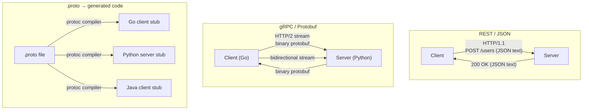

# gRPC

## Why This Topic Exists

REST sends JSON. JSON is text. Text is human-readable, which makes debugging easy. But text is also verbose and slow to parse. For a system where a mobile app calls one backend service, this is fine. For a system where a single user request triggers 20 microservice-to-microservice calls, every millisecond and every byte matters.

gRPC was designed by Google to solve this problem. Google runs one of the largest microservice architectures in the world. Their internal services were calling each other billions of times per second. They needed something faster than REST + JSON.

gRPC uses binary encoding (Protocol Buffers), multiplexed connections (HTTP/2), and generated client code. The result is typically 5-10x faster than REST/JSON for internal communication.

This topic is essential for senior engineers designing microservice architectures and for system design interviews where performance between services is discussed.

---

## Learning Objectives

By the end of this file you will be able to:

- Explain what Protocol Buffers are and how they differ from JSON
- Describe the four gRPC streaming patterns
- Explain why gRPC is faster than REST
- Identify when gRPC is the right choice vs REST or GraphQL
- Write a basic `.proto` schema definition
- Explain how gRPC handles cross-language polyglot systems

---

## Prerequisites

- Understanding of REST APIs (File 01 of this chapter)
- Basic understanding of microservices (Chapter 12)
- Conceptual knowledge of HTTP/1.1 vs HTTP/2 is helpful but not required

---

## Introduction

gRPC stands for **g**oogle **R**emote **P**rocedure **C**all. "Remote Procedure Call" means calling a function on another machine as if it were a local function call. Instead of thinking "I need to make an HTTP request to /users/42," you think "I need to call `GetUser(userId: 42)`."

gRPC is built on three key technologies:

1. **Protocol Buffers (Protobuf)** — a binary serialization format, much smaller and faster than JSON
2. **HTTP/2** — the transport layer, enabling multiplexing, header compression, and persistent connections
3. **Code generation** — `.proto` schema files generate type-safe client and server code in any language

Companies using gRPC internally include Google, Netflix, Square, Cisco, Cockroach Labs, Dropbox, and Kubernetes itself (which uses gRPC for all its internal component communication).

---

## Real-World Analogy

Think about how phone calls work versus sending letters.

**REST/JSON is like sending letters.** You write a letter (compose a JSON body), seal it in an envelope (HTTP request), send it, and wait for a reply letter. Each letter is self-contained, easy to read by anyone who intercepts it, but there is overhead for every message — envelope, address, stamp.

**gRPC is like a phone call.** You establish a connection once. You speak (send binary data) in real time. The communication is fast and continuous. You can have a two-way conversation (bidirectional streaming). The "language" you speak is compressed and structured (Protobuf). It is less readable to an eavesdropper, but far more efficient.

---

## Core Concepts

### 1. Protocol Buffers (Protobuf)

Protocol Buffers are Google's language-neutral, platform-neutral, extensible mechanism for serializing structured data. You define your data structures and service methods in a `.proto` file:

```protobuf
syntax = "proto3";

package user;

message User {
  string id = 1;
  string name = 2;
  string email = 3;
  int32 age = 4;
}

message GetUserRequest {
  string user_id = 1;
}

message GetUserResponse {
  User user = 1;
}

service UserService {
  rpc GetUser (GetUserRequest) returns (GetUserResponse);
  rpc ListUsers (ListUsersRequest) returns (stream User);
  rpc CreateUser (stream CreateUserRequest) returns (CreateUserResponse);
  rpc Chat (stream ChatMessage) returns (stream ChatMessage);
}
```

**Why is Protobuf faster than JSON?**

| Aspect | JSON | Protobuf |
|--------|------|---------|
| Format | Text | Binary |
| Field names | Sent with every message | Replaced by field numbers (1, 2, 3...) |
| Typical size | 100% baseline | 30-60% smaller |
| Parse speed | Slower (string parsing) | Faster (binary decoding) |
| Human readable | Yes | No (need tooling to inspect) |
| Schema required | No (flexible but risky) | Yes (strict but safe) |

In a simple user object, JSON might send `{"name": "Alice", "email": "alice@example.com"}` — the key names are repeated in every single message. Protobuf encodes `name` as field `2` (just the number) and `email` as field `3`. Over billions of messages, this adds up enormously.

### 2. Code Generation

You write one `.proto` file and the `protoc` compiler generates client and server code in any language you need: Go, Python, Java, C++, Node.js, Rust, Ruby, C#, and more.

A Go service and a Python service can both call the same gRPC server without writing any serialization/deserialization code. The generated stubs handle everything. This is called a **polyglot** system — multiple languages working together seamlessly.

### 3. The Four Streaming Patterns

gRPC supports four communication patterns, which is a major advantage over REST:

**Pattern 1: Unary (standard request-response)**
```
Client sends one request → Server sends one response
```
Equivalent to a REST call. Most common.

**Pattern 2: Server-side streaming**
```
Client sends one request → Server sends a stream of responses
```
Example: Subscribe to real-time stock price updates. The client asks once, the server keeps sending.

**Pattern 3: Client-side streaming**
```
Client sends a stream of requests → Server sends one response
```
Example: Uploading a large file in chunks. The client streams chunks, the server responds with a final acknowledgement.

**Pattern 4: Bidirectional streaming**
```
Client streams requests ↔ Server streams responses simultaneously
```
Example: A chat application, a collaborative editor, a live game. Both sides send messages independently without waiting for the other.

REST cannot natively support streaming without workarounds (Server-Sent Events, WebSockets, chunked transfer). gRPC has streaming built into the protocol.

### 4. HTTP/2 Advantages

gRPC runs over HTTP/2. HTTP/1.1 (what most REST APIs use) has a fundamental limitation: one request per connection at a time. To handle multiple parallel requests, browsers and clients open multiple TCP connections.

HTTP/2 solves this with **multiplexing**: multiple requests and responses can flow over a single TCP connection simultaneously, each as separate "streams." This eliminates the overhead of opening new connections and avoids head-of-line blocking.

Other HTTP/2 benefits gRPC uses:
- **Header compression (HPACK)**: Repeated headers (like auth tokens) are compressed, reducing overhead
- **Binary framing**: Data is transmitted in binary frames, faster to parse than text
- **Persistent connections**: Connection setup happens once, reused for all subsequent calls

---

## Visual Diagram (Mermaid)



---

## Deep Explanation

### How gRPC Works End-to-End

1. You write a `.proto` file defining your messages and service methods
2. Run `protoc` (the Protobuf compiler) to generate client stubs and server interfaces in your target languages
3. Implement the server interface — fill in the business logic
4. On the client, call the generated stub methods as if they were local functions
5. The gRPC framework handles: serializing arguments to binary, making the HTTP/2 call, deserializing the response, and surfacing errors

From the developer's perspective, calling a remote service looks like a local function call:

```go
// Go client code (generated stub)
response, err := userClient.GetUser(ctx, &pb.GetUserRequest{UserId: "42"})
if err != nil {
    log.Fatal(err)
}
fmt.Println(response.User.Name)
```

No URL construction. No JSON parsing. No HTTP status codes to interpret. The framework handles all of it.

### Error Handling in gRPC

gRPC has its own status codes (different from HTTP status codes):

| gRPC Code | Meaning |
|-----------|---------|
| OK | Success |
| NOT_FOUND | Resource not found |
| INVALID_ARGUMENT | Bad input from client |
| UNAUTHENTICATED | Not authenticated |
| PERMISSION_DENIED | Authenticated but not authorized |
| INTERNAL | Server-side error |
| UNAVAILABLE | Service is down |

### Real-World Usage: Kubernetes

Kubernetes uses gRPC throughout its internal architecture. The `kubelet` (node agent) communicates with the `Container Runtime Interface (CRI)` via gRPC. The `apiserver` communicates with `etcd` (the state store) via gRPC. When you run `kubectl get pods`, a chain of gRPC calls is triggered internally.

Why gRPC for Kubernetes? The control plane has to be fast and reliable. Multiple components written in different languages (some Go, some C++) need to communicate. Protobuf's strict schema means API compatibility can be enforced at compile time.

### gRPC vs REST: The Numbers

In benchmarks:
- Protobuf payloads are typically **3-10x smaller** than equivalent JSON
- gRPC deserialization is typically **5-7x faster** than JSON parsing
- HTTP/2 multiplexing eliminates connection overhead for high-frequency calls

For a service handling 100,000 RPC calls per second, this translates directly to hardware cost savings and latency reduction.

### gRPC-Web: Browser Support

gRPC uses HTTP/2 trailers (a feature not supported by browsers). To use gRPC from a browser, you need a proxy layer like **gRPC-Web** or **Envoy**. This is why gRPC is primarily used for server-to-server communication, not browser-to-server.

---

## Step-by-Step Example

Designing a gRPC payment service:

**Step 1: Write the .proto file**
```protobuf
service PaymentService {
  rpc ProcessPayment (PaymentRequest) returns (PaymentResponse);
  rpc StreamTransactions (StreamRequest) returns (stream Transaction);
}
```

**Step 2: Generate stubs** — run `protoc --go_out=. --go-grpc_out=. payment.proto`

**Step 3: Implement server** — implement the `ProcessPayment` and `StreamTransactions` methods in Go

**Step 4: Connect clients** — Java, Python, and Node.js services all import the generated stubs and call the methods

**Step 5: Add interceptors** (middleware) for logging, authentication, and distributed tracing

**Step 6: Set up load balancer** — use Envoy proxy for client-side load balancing across gRPC server replicas

---

## Advantages / Disadvantages / Trade-offs

| Aspect | Detail |
|--------|--------|
| Advantage | 5-10x smaller payload than JSON |
| Advantage | 5-7x faster serialization/deserialization |
| Advantage | Four streaming patterns built in |
| Advantage | Type-safe generated code in any language |
| Advantage | HTTP/2 multiplexing eliminates connection overhead |
| Disadvantage | Not human-readable — debugging requires special tooling (grpcurl, Postman gRPC support) |
| Disadvantage | No native browser support — requires gRPC-Web proxy |
| Disadvantage | Schema evolution requires care — field numbers must not be reused |
| Disadvantage | Larger learning curve than REST |
| Disadvantage | Not suitable for public APIs where third-party developers expect REST |
| Trade-off | Speed vs debuggability |

---

## When to Use / When NOT to Use

**Use gRPC when:**
- Internal microservice-to-microservice communication
- Performance is critical (high RPC volume, low latency requirements)
- Polyglot systems (multiple languages) — generated stubs keep things consistent
- You need bidirectional streaming (real-time pipelines, chat, telemetry)
- You want compile-time API contract validation

**Do NOT use gRPC when:**
- Building a public API for external developers (REST is more accessible)
- Browser clients are the primary consumer (use REST or GraphQL)
- Your team has no protobuf/gRPC experience and the system is simple
- Human-readable debugging in production is a high priority

---

## Common Interview Questions

1. **What is the difference between gRPC and REST?** gRPC uses binary Protobuf encoding over HTTP/2 with generated type-safe stubs. REST uses text JSON over HTTP/1.1 with manual client code. gRPC is faster and supports streaming; REST is simpler and browser-compatible.

2. **What are Protocol Buffers and why are they faster than JSON?** Protobuf is a binary serialization format. Field names are replaced with integer tags, data is encoded in binary instead of text. Smaller payloads and faster parsing.

3. **What are the four gRPC streaming modes?** Unary (1 request, 1 response), server-streaming (1 request, N responses), client-streaming (N requests, 1 response), bidirectional (N requests, N responses simultaneously).

4. **What is a gRPC stub?** Auto-generated code (from a .proto file) that provides a type-safe client interface for calling remote methods as if they were local functions.

5. **Why is gRPC not suitable for browsers?** Browsers do not support HTTP/2 trailers, which gRPC requires. A proxy layer (gRPC-Web, Envoy) is needed.

---

## Common Beginner Mistakes

- Reusing a field number in a `.proto` file after removing a field — this causes data corruption when old clients and new servers communicate; always tombstone removed fields with `reserved`
- Using gRPC for public APIs — external developers expect REST
- Forgetting to configure TLS — gRPC connections should be encrypted even in internal networks
- Not versioning `.proto` files — treat them like any other API contract
- Assuming gRPC is always faster — for very small payloads (tiny JSON), the overhead difference is negligible; only matters at scale

---

## Summary

gRPC is Google's high-performance RPC framework that uses Protocol Buffers (binary encoding) over HTTP/2. It is significantly faster than REST/JSON for internal microservice communication, supports four streaming patterns including bidirectional, and generates type-safe client/server code in any language through `.proto` files. It is ideal for internal services in polyglot architectures. It is not suitable for browser clients or public APIs. Companies like Kubernetes, Dropbox, and Cisco use gRPC for their internal infrastructure.

---

## Key Takeaways

- gRPC = Protobuf (binary encoding) + HTTP/2 + generated stubs
- Protobuf is 3-10x smaller than JSON and 5-7x faster to parse
- HTTP/2 multiplexing means multiple simultaneous calls over one connection
- Four streaming modes: unary, server-streaming, client-streaming, bidirectional
- Generate client code from `.proto` files in any language — ideal for polyglot systems
- Not browser-compatible natively; use for server-to-server communication
- Never reuse field numbers in `.proto` files after removing fields

---

## Related Topics

- [01. REST API Design Best Practices](./01.%20REST%20API%20Design%20Best%20Practices%20%28INTERMEDIATE%29.md) — The alternative to gRPC for public APIs
- [02. GraphQL](./02.%20GraphQL%20%28INTERMEDIATE%29.md) — Another alternative focused on flexible client queries
- [04. API Versioning and Evolution](./04.%20API%20Versioning%20and%20Evolution%20%28INTERMEDIATE%29.md) — Managing breaking changes, relevant to .proto evolution
- [Chapter Overview](./README.md)
