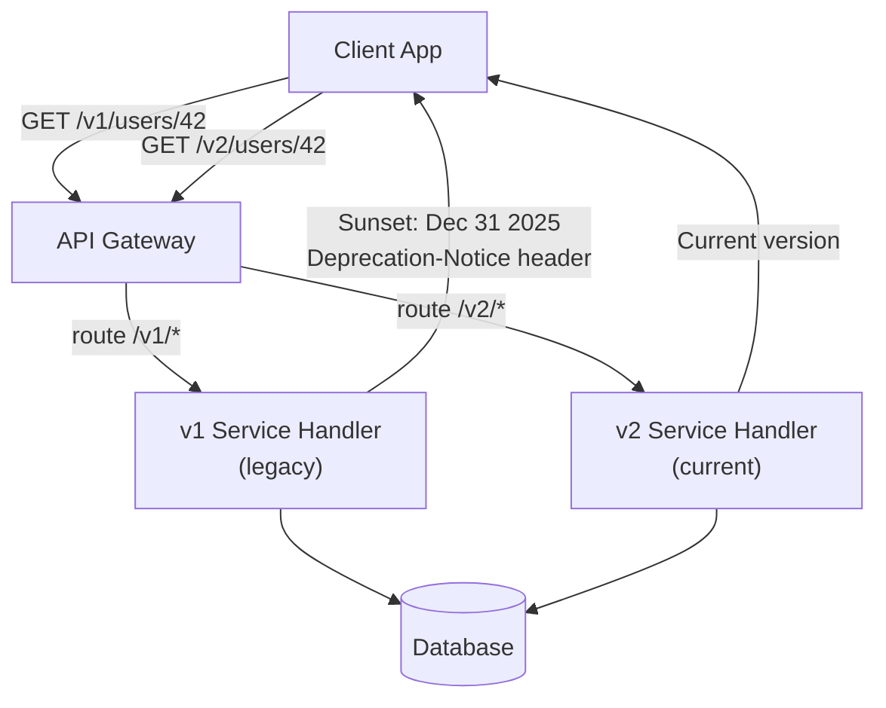

# API Versioning and Evolution

## Why This Topic Exists

The moment your API is used by someone outside your team, it becomes a contract. That contract says: "I promise that `/v1/users/42` will keep returning a user object with these fields in this format, indefinitely."

The problem is that software never stays still. Business requirements change. Bugs need fixes. Better data models emerge. Security issues require structural changes. Every time you change your API, you risk breaking every client that depends on it.

This is the tension at the heart of API evolution: your system needs to change, but your clients cannot afford to break.

This topic teaches you how to manage that tension professionally — through clear versioning strategies, careful distinction between breaking and non-breaking changes, and disciplined deprecation processes.

Senior engineers are expected to think about API compatibility before shipping any change. Staff engineers are expected to define the team's versioning policy. This topic is relevant at every level above beginner.

---

## Learning Objectives

By the end of this file you will be able to:

- Classify changes as breaking or non-breaking
- Compare the four main API versioning strategies with their trade-offs
- Design a deprecation strategy with sunset headers
- Explain semantic versioning in the context of APIs
- Handle API evolution in practice without breaking clients

---

## Prerequisites

- Understanding of REST APIs (File 01 of this chapter)
- Understanding of HTTP headers and request/response cycle
- Conceptual familiarity with what "clients" mean in API context

---

## Introduction

Imagine you ship an API for your payment service. Three mobile apps, two web clients, and five partner integrations immediately start using it. Six months later, you realize the `amount` field should have been a string (to preserve decimal precision) instead of a float. Changing it fixes a real bug — but it breaks all seven clients simultaneously.

This is the classic API evolution problem. The solution has multiple parts:

1. Know what changes are safe (non-breaking) vs dangerous (breaking)
2. Choose a versioning strategy before you ship v1
3. Plan a deprecation process so clients have time to migrate
4. Communicate changes clearly

---

## Real-World Analogy

Think of your API as a public road.

When the city repaves the road or adds lane markings, drivers do not even notice — the road is still there, same route, same rules. That is a **non-breaking change**.

When the city decides to move the road to a different location and demolish the old one, every driver who relied on the old route is now lost. That is a **breaking change**.

Good city planning means:
- Never demolishing the old road without building the new one first
- Giving months of notice with signs saying "This road will close on Date X"
- Keeping both roads running in parallel during the transition

Good API versioning works exactly the same way.

---

## Core Concepts

### 1. Breaking vs Non-Breaking Changes

This distinction is the foundation of everything else in this topic.

**Non-breaking changes (safe to release without a new version):**

| Change | Why It Is Safe |
|--------|---------------|
| Adding a new optional field to a response | Clients ignore fields they do not know about |
| Adding a new optional request parameter | Clients that do not send it still work |
| Adding a new endpoint | Does not affect existing endpoints |
| Adding a new enum value | Safe IF clients handle unknown enum values gracefully |
| Making a required field optional | Clients already send the field |

**Breaking changes (require a new API version):**

| Change | Why It Breaks |
|--------|--------------|
| Removing a field from a response | Clients reading that field get null/undefined and crash |
| Renaming a field | Clients using the old name get null |
| Changing a field's type (int → string) | Clients receive an unexpected type and crash |
| Changing a URL path | Clients get 404 errors |
| Making an optional parameter required | Clients that did not send it now get errors |
| Removing an endpoint | Clients calling it get 404 |
| Changing error codes or formats | Clients fail to parse errors |
| Changing authentication requirements | Clients get unexpected 401s |

**The golden rule:** If existing client code would continue to work without any changes, it is non-breaking. If any client code would need to change, it is breaking.

### 2. Semantic Versioning for APIs

Semantic versioning (semver) in the context of APIs:

- **Major version (v1 → v2)**: Breaking changes. Clients must actively migrate.
- **Minor version (v1.1 → v1.2)**: Non-breaking additions. Clients benefit but do not need to change.
- **Patch version (v1.1.1 → v1.1.2)**: Bug fixes that do not change the contract.

In practice, most public REST APIs only expose the major version (v1, v2) because minor and patch changes are backwards-compatible and do not require client updates.

### 3. The Four Versioning Strategies

**Strategy A: URL Path Versioning**
```
GET /v1/users/42
GET /v2/users/42
```

The version is part of the URL path. Both versions run simultaneously until v1 is retired.

Pros:
- Immediately visible in logs, browser history, curl commands
- Easy to route to different backend handlers
- Easy to test manually
- Most widely used and understood

Cons:
- Pollutes the URL — the version is technically not part of the resource identity
- Creates URL sprawl when you have many versions
- Tempts teams to version too eagerly

**Strategy B: Query Parameter Versioning**
```
GET /users/42?api-version=1
GET /users/42?api-version=2
```

Pros:
- URL path is clean
- Version is explicit and easy to set

Cons:
- Easy to forget the parameter — what is the default version?
- Harder to enforce at the routing layer
- Mixing versioning and filtering parameters in query strings is messy

**Strategy C: Custom Request Header**
```
GET /users/42
X-API-Version: 2
```

Pros:
- URL is completely clean
- Version can be changed without touching the URL

Cons:
- Not visible in browser history or most logging without extra configuration
- Harder to test in a browser (must use curl or Postman)
- Can be accidentally stripped by proxies and gateways

**Strategy D: Content Negotiation (Accept Header)**
```
GET /users/42
Accept: application/vnd.mycompany.v2+json
```

This is the academically "correct" REST approach — using the `Accept` header to specify the exact media type and version you expect.

Pros:
- Follows REST/HTTP spec most closely
- URL is clean and truly resource-focused

Cons:
- Almost no developers naturally use custom Accept headers
- Hard to construct in browsers and many HTTP client libraries
- Most proxies and CDNs do not vary caching on custom headers by default
- Very few real-world APIs use this successfully

**Comparison Table:**

| Strategy | Visibility | Caching | Ease of Use | Adoption |
|----------|-----------|---------|-------------|----------|
| URL Path | Excellent | Full CDN support | Easiest | Most common |
| Query Param | Good | CDN support with Vary | Good | Moderate |
| Custom Header | Poor (unless logging) | Requires Vary header | Moderate | Less common |
| Accept Header | Poor | Complex (Vary: Accept) | Hardest | Rare |

**Recommendation for most teams:** URL path versioning. It is visible, debuggable, and widely understood.

---

## Visual Diagram (Mermaid)



---

## Deep Explanation

### Deprecation Strategy in Practice

Deprecation is the process of signaling to clients that an old version will be removed, giving them time to migrate.

A professional deprecation process has these steps:

**Step 1: Announce via documentation and changelog**
Write a migration guide. Publish it. Email developer newsletter subscribers.

**Step 2: Add deprecation headers to responses**

The IETF has standardized two headers for this purpose (RFC 8594, RFC 9745):

```
Deprecation: Sun, 31 Dec 2025 23:59:59 GMT
Sunset: Sun, 31 Mar 2026 23:59:59 GMT
Link: <https://developer.yourapi.com/migration/v1-to-v2>; rel="deprecation"
```

- `Deprecation` header: The date when this version was deprecated (already happened)
- `Sunset` header: The date when this version will stop working
- `Link` header: Points to migration documentation

Client developers can parse these headers in their API clients and log warnings when calling deprecated endpoints.

**Step 3: Monitor adoption**
Track the percentage of your traffic still using the old version. Do not sunset until you are comfortable the remaining clients have either migrated or are inactive.

**Step 4: Sunset with grace**
On the sunset date, return `410 Gone` instead of the old response. This is friendlier than `404 Not Found` — it explicitly tells clients the endpoint was intentionally removed.

### Additive-Only Evolution

The safest long-term strategy is to design your API so it only ever needs additive changes:

- Never remove fields, only add new ones
- Never rename fields, add a new field with the right name alongside the old one
- When a field's meaning changes, add a new field with the new semantics and keep the old one

This is sometimes called the **Tolerant Reader pattern**: the server accepts old clients (ignore unknown request fields), and clients accept new server responses (ignore unknown response fields).

### API Evolution in Protobuf

In gRPC/Protobuf systems, evolution rules are strict but clear:
- Field numbers must never be reused after removal
- Use `reserved` keyword to prevent accidental reuse: `reserved 5;`
- Adding new fields with new numbers is always safe
- Renaming a field is safe (the field number, not the name, is what is serialized)

### Real-World Example: Stripe

Stripe's API is one of the best examples of professional API versioning. Stripe uses date-based version strings:

```
Stripe-Version: 2023-10-16
```

Each Stripe account is locked to the API version active when they created their account. When breaking changes are made, they are published as a new version date. Customers can opt into a newer version at their own pace. Old versions are maintained indefinitely for paying customers. This is extreme but shows what world-class API versioning looks like.

---

## Step-by-Step Example

Planning an API breaking change for a user service:

**Scenario:** You need to rename `fullName` (a string) to separate `firstName` and `lastName` fields.

**Step 1: Classify the change** — Removing `fullName` and adding `firstName`/`lastName` is breaking. Clients reading `fullName` will break.

**Step 2: Non-breaking transition plan:**
- In v1 (current): Add `firstName` and `lastName` as new optional fields alongside `fullName`. Populate all three.
- Give clients 6 months to migrate to using `firstName`/`lastName`.
- Add `Deprecation` and `Sunset` headers to v1 responses.

**Step 3: Create v2:**
- In v2: Remove `fullName` entirely. Only `firstName` and `lastName` exist.
- Route `/v2/` requests to the new handler.

**Step 4: Sunset v1:**
- 6 months after v2 launch, return `410 Gone` for `/v1/` endpoints.

---

## Advantages / Disadvantages / Trade-offs

| Aspect | Detail |
|--------|--------|
| URL versioning advantage | Simple, visible, widely supported |
| URL versioning disadvantage | URL contains version, which purists argue is not part of the resource identity |
| Header versioning advantage | Clean URLs |
| Header versioning disadvantage | Invisible in logs without special configuration |
| Additive-only evolution advantage | Clients never break |
| Additive-only evolution disadvantage | Old, deprecated fields accumulate over time ("schema rot") |
| Strict semver advantage | Clear signal to clients when breaking changes occur |
| Strict semver disadvantage | Overhead of managing multiple live versions simultaneously |

---

## When to Use / When NOT to Use

**Apply URL path versioning when:**
- Building a public API with external clients
- Your team is not yet experienced with API versioning (simplest to reason about)
- Debuggability and logging clarity are priorities

**Apply header-based versioning when:**
- You have a sophisticated internal tooling setup that can handle header visibility
- You want clean URLs and your client developers are all experienced

**Never make breaking changes without versioning when:**
- External clients depend on your API
- You cannot coordinate a synchronized rollout with all clients

---

## Common Interview Questions

1. **What is a breaking change in an API?** Any change that causes existing client code to stop working correctly without modification: removing fields, renaming fields, changing types, removing endpoints.

2. **What is the difference between URL versioning and header versioning?** URL versioning puts the version in the path (`/v1/`), making it visible everywhere. Header versioning puts it in a request header, keeping URLs clean but making the version less visible.

3. **How would you deprecate an API version?** Add `Deprecation` and `Sunset` response headers, publish migration docs, monitor old-version traffic, and sunset on the announced date returning `410 Gone`.

4. **What is the Tolerant Reader pattern?** Clients ignore unknown fields in responses; servers ignore unknown fields in requests. This enables additive, backwards-compatible evolution without versioning.

5. **Is adding a new optional field to a response a breaking change?** No — clients that do not know about the field will ignore it. Breaking changes only occur when you remove or change existing fields.

---

## Common Beginner Mistakes

- Making breaking changes without versioning ("it is just a small rename")
- Not documenting what version is the current stable version
- Sunsetting old versions too quickly — clients in production are slow to update
- Versioning every minor change unnecessarily — creates maintenance overhead
- Not adding deprecation headers — clients have no machine-readable signal that a version is ending
- Forgetting that SDK libraries wrap your API — renaming a field breaks the SDK even if JSON clients could theoretically adapt

---

## Summary

API versioning is the discipline of allowing your API to evolve without breaking existing clients. The core skill is classifying changes as breaking (require a new version) or non-breaking (safe to release without versioning). URL path versioning is the most practical strategy for most teams. A complete deprecation process includes documentation, `Deprecation`/`Sunset` headers, traffic monitoring, and a graceful `410 Gone` final state. The goal is to give clients enough time and signal to migrate safely.

---

## Key Takeaways

- Adding fields is safe; removing or renaming fields is breaking
- URL path versioning (`/v1/`, `/v2/`) is the most practical and widely understood strategy
- Use `Deprecation` and `Sunset` response headers to signal end-of-life to API clients
- Keep old versions running long enough for clients to migrate — measure traffic, do not guess
- Design for additive evolution from the start — avoid introducing fields you will need to remove
- Return `410 Gone` (not `404 Not Found`) when a deprecated endpoint is finally removed

---

## Related Topics

- [01. REST API Design Best Practices](./01.%20REST%20API%20Design%20Best%20Practices%20%28INTERMEDIATE%29.md) — Versioning strategies in the REST context
- [03. gRPC](./03.%20gRPC%20%28INTERMEDIATE%29.md) — Protobuf field number rules for schema evolution
- [05. API Security](./05.%20API%20Security%20%28INTERMEDIATE%29.md) — Auth changes are a common source of breaking changes
- [Chapter Overview](./README.md)
