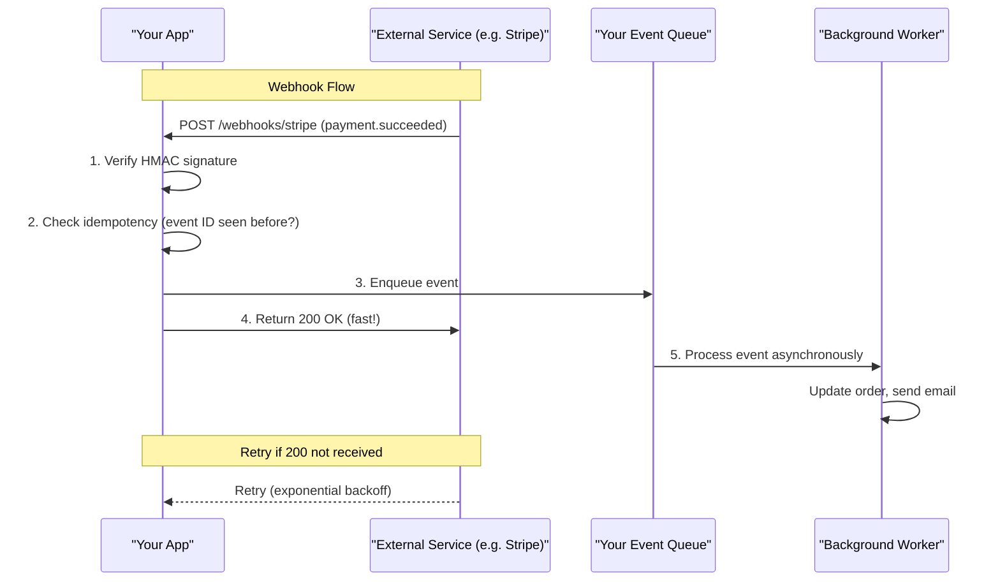

# Webhooks and Polling

## Why This Topic Exists

Most API calls follow a request-response pattern: your app asks for data, the server replies immediately. But what happens when you need to know about something that has not happened yet?

Examples:
- You need to know when a Stripe payment succeeds or fails
- You need to trigger a CI/CD build when code is pushed to GitHub
- You need to update your UI when an order status changes in a partner system

You cannot know when these events will occur. You have two options: keep asking "has it happened yet?" (polling) or register your address so the other system tells you when it happens (webhooks).

Both patterns are fundamental to building integrated, event-driven systems. Every senior engineer encounters them constantly. This file teaches you both — when to use each, how to design them properly, and the pitfalls that trip up beginners.

---

## Learning Objectives

By the end of this file you will be able to:

- Explain the difference between polling and webhooks
- Describe short polling and long polling patterns
- Design a robust webhook system with payload format, signature verification, and retry logic
- Explain why webhook consumers must be idempotent
- Choose between polling and webhooks for a given use case

---

## Prerequisites

- Basic understanding of HTTP (requests, responses, headers)
- Familiarity with what an API endpoint is
- No advanced knowledge required — this is a beginner-level topic

---

## Introduction

Imagine you ordered a pizza. You have two ways to track your order:

1. You keep calling the pizza shop every 5 minutes: "Is my pizza ready?" This is **polling**.
2. The pizza shop calls you when your pizza is ready. This is a **webhook**.

Both approaches work. But the phone call (webhook) is obviously more efficient — you do not have to keep calling, and you find out immediately when it is ready.

In software, the trade-offs are slightly more nuanced. Webhooks are more efficient but harder to implement correctly. Polling is simpler but wasteful. Knowing which to use and how to implement each well is what this file teaches.

---

## Real-World Analogy

**Polling = checking your email inbox every 5 minutes to see if you have a new message.**
You are the one doing the work. You might check 100 times before the message arrives. You know immediately when it arrives only if you happen to check at the right moment.

**Webhooks = having your email client send you a push notification the moment a new message arrives.**
The email server does the work. You get notified instantly. But you need to have configured push notifications — you need to have registered your "address" (endpoint) with the server.

---

## Core Concepts

### 1. Polling Patterns

Polling means your application periodically sends requests to check if something has changed.

**Short polling (simple polling):**

Your app sends a request, gets a response immediately (even if it says "nothing new"), and waits a fixed interval before asking again.

```
App → GET /api/order/42/status → Server responds: "status: pending"
[wait 5 seconds]
App → GET /api/order/42/status → Server responds: "status: pending"
[wait 5 seconds]
App → GET /api/order/42/status → Server responds: "status: completed"
```

When to use short polling:
- Simple integrations where webhook complexity is not justified
- When the event you are waiting for usually happens quickly
- When you control both sides and polling overhead is acceptable

Problems with short polling:
- Wasteful — most requests return "nothing changed"
- Adds load to the server (many clients polling frequently)
- Not real-time — you find out up to one polling interval after the event occurs

**Long polling (a more efficient variation):**

Your app sends a request, and the server holds the connection open until something changes or a timeout occurs (typically 20-60 seconds). When the event occurs, the server responds. If the timeout is reached with no event, the server responds with an empty result and the client immediately polls again.

```
App → GET /api/notifications?since=1721209600
[server holds connection...]
[20 seconds later: a new notification arrives]
Server → responds with new notification
App → immediately sends next request
```

Long polling is more efficient than short polling because:
- Fewer requests are made overall (no wasted "nothing new" responses every few seconds)
- Events are delivered almost instantly (no polling interval delay)
- Works over standard HTTP without WebSocket infrastructure

Long polling was widely used before WebSockets became standard. It is still useful when WebSockets are not available (some corporate firewalls block WebSocket upgrades).

**Comparison of polling approaches:**

| Aspect | Short Poll | Long Poll |
|--------|-----------|----------|
| Latency to detect event | Up to poll interval | Near-instant |
| Server load | High (many empty responses) | Lower (fewer requests) |
| Complexity | Very simple | Moderate |
| Works behind firewalls | Yes | Yes |
| Connection hold | No | Yes (up to timeout) |

### 2. Webhooks

A webhook is an HTTP callback. Instead of your app asking a server "did anything happen?", you register a URL with that server. When an event occurs, the server sends an HTTP POST request to your URL with event data.

**How webhooks work:**

1. **Registration**: You tell the external system "when event X occurs, send a POST to `https://yourapp.com/webhooks/stripe`"
2. **Event occurs**: Stripe charges a customer. Payment succeeds.
3. **Delivery**: Stripe sends `POST https://yourapp.com/webhooks/stripe` with a JSON payload describing the event
4. **Processing**: Your endpoint receives the event, validates it, updates your database
5. **Acknowledgment**: Your endpoint returns a `200 OK` within a few seconds

**Typical webhook payload:**
```json
{
  "id": "evt_1NxK7p2eZvKYlo2CasY8YBKR",
  "type": "payment_intent.succeeded",
  "created": 1721209600,
  "data": {
    "object": {
      "id": "pi_3NxK7p2eZvKYlo2C0AJJXXX",
      "amount": 2000,
      "currency": "usd",
      "status": "succeeded",
      "customer": "cus_NxK7XXXYYY"
    }
  }
}
```

**Real examples:**
- **GitHub webhooks**: When code is pushed to a repo, GitHub POSTs to your CI/CD system (Jenkins, GitHub Actions, CircleCI). The CI system then runs tests.
- **Stripe webhooks**: When a payment succeeds or fails, Stripe POSTs to your order system. You update the order status and send a confirmation email.

### 3. Webhook Signature Verification

When your endpoint receives a POST request claiming to be from Stripe or GitHub, how do you know it is actually from them? A malicious actor could POST to your webhook endpoint with a fake payload.

The solution is **signature verification**. The sender (Stripe, GitHub) computes an HMAC (Hash-based Message Authentication Code) signature over the payload using a shared secret. They include this signature in a request header. You verify it on your end.

**How it works (Stripe example):**

1. Stripe has a webhook signing secret (a random string) that only Stripe and you know
2. Stripe computes: `HMAC-SHA256(signingSecret, timestamp + "." + payload)`
3. Stripe sends the signature in the `Stripe-Signature` header:
   ```
   Stripe-Signature: t=1721209600,v1=a9b8c7d6e5f4...
   ```
4. Your endpoint:
   a. Extracts the timestamp and signature from the header
   b. Reconstructs the signed string: `timestamp + "." + raw_request_body`
   c. Computes HMAC-SHA256 with your signing secret
   d. Compares the result to the signature in the header
   e. Also checks the timestamp is within 5 minutes (prevents replay attacks)
   f. If it matches and the timestamp is fresh, the webhook is authentic

**Never skip signature verification.** Without it, anyone can post fake events to your endpoint.

### 4. Idempotency in Webhook Consumers

This is critical and often missed by beginners.

Webhooks are delivered **at least once**. Network failures, timeouts, and retries mean the same event can be delivered to your endpoint multiple times. If your endpoint is not idempotent, you will:
- Charge customers twice
- Create duplicate orders
- Send duplicate confirmation emails

**Making your webhook consumer idempotent:**

Every webhook event has a unique event ID. Before processing, check if you have already processed this event ID:

```javascript
async function handleWebhook(event) {
  // Check if we've seen this event before
  const alreadyProcessed = await db.processedEvents.findById(event.id);
  if (alreadyProcessed) {
    return { status: 200, message: 'Already processed' };
  }

  // Process the event
  await updateOrderStatus(event.data.object.id, 'paid');
  await sendConfirmationEmail(event.data.object.customer);

  // Mark as processed
  await db.processedEvents.create({ id: event.id, processedAt: new Date() });

  return { status: 200 };
}
```

Store processed event IDs in your database with a unique constraint. Duplicate delivery attempts hit the early-exit check and return 200 harmlessly.

### 5. Webhook Retry Logic

If your endpoint returns anything other than a 2xx response (or times out), the sender will retry. Stripe retries up to 36 hours later using exponential backoff. GitHub retries up to 3 times.

Your endpoint must:
- Return `200 OK` quickly (within 3-5 seconds)
- Not do heavy processing synchronously in the webhook handler
- Queue the event for background processing if needed:

```
Webhook arrives → Validate signature → Store raw event in queue → Return 200
Background worker → Process event from queue
```

This pattern ensures Stripe gets its fast acknowledgement even if your database is slow.

### 6. Event Ordering

Webhooks do not guarantee delivery order. If two events occur close together (payment.created then payment.succeeded), they might arrive in any order or even simultaneously.

Your consumer must handle out-of-order events gracefully:
- Use event timestamps to decide which event represents the most recent state
- Use database-level constraints to prevent impossible state transitions
- Design around the idea that any event could arrive at any time

---

## Visual Diagram (Mermaid)



---

## Deep Explanation

### When Polling Is the Right Choice

Despite webhooks being more elegant, polling makes sense in these situations:

- **You do not control the external system** and it does not support webhooks
- **The event happens very quickly** (within 1-2 seconds) and you only need one poll
- **Internal systems** where you control both sides and prefer simplicity
- **Batch processing** where you check for new items every hour and process them together
- **Development and debugging** — polling is much easier to test locally (no need for a public URL)

### GitHub CI/CD Webhooks — Real Example

When you push code to a GitHub repository:

1. GitHub fires a `push` event
2. GitHub POSTs the event to every configured webhook URL for that repo
3. Your CI system (e.g., Jenkins) receives the payload with branch name, commit SHA, changed files
4. CI validates the `X-Hub-Signature-256` HMAC header using your shared secret
5. CI queues a build job for that commit
6. Returns `200 OK` to GitHub immediately
7. The build runs asynchronously

This is why CI builds start within seconds of a push — GitHub webhooks are nearly instant.

### Stripe Payment Webhooks — Real Example

When building an e-commerce system with Stripe:

1. Customer clicks "Buy" — your backend creates a PaymentIntent
2. Customer pays — Stripe charges the card
3. Stripe fires `payment_intent.succeeded` webhook
4. Your endpoint receives it, validates signature, updates order to "paid", triggers fulfillment
5. Returns `200 OK`

But what if your server was down when Stripe tried to deliver? Stripe will retry for up to 36 hours. That is why idempotency matters — when your server comes back up and processes the retried event, it should not charge the customer twice.

---

## Advantages / Disadvantages / Trade-offs

| Aspect | Polling | Webhooks |
|--------|---------|---------|
| Real-time | No (up to poll interval delay) | Yes (instant) |
| Server load | High (wasted requests) | Low (only fires on events) |
| Complexity | Low | Higher (signature verification, idempotency, retries) |
| Reliability | Your app controls retries | Sender controls retries |
| Works without public URL | Yes | No (your endpoint must be publicly accessible) |
| Development/testing | Easy | Harder (needs ngrok or similar tunnel) |
| Delivery guarantee | You control it | At-least-once (handle duplicates) |

---

## When to Use / When NOT to Use

**Use webhooks when:**
- You need real-time or near-real-time notification of events from external systems
- The external system supports webhooks (Stripe, GitHub, Twilio, SendGrid, etc.)
- Event frequency is low to medium (not millions per second)
- Your server has a publicly accessible URL

**Use polling when:**
- The external system does not support webhooks
- You are building a simple integration and webhook overhead is not justified
- You are developing locally without a public URL
- The event happens quickly and you only need to check once or twice

**Do NOT use polling when:**
- Events are rare but latency matters (polling wastes resources)
- The external system charges per API call

---

## Common Interview Questions

1. **What is the difference between polling and webhooks?** Polling = your app repeatedly asks the server if something changed. Webhooks = the server calls your endpoint when something changes. Webhooks are more efficient and real-time.

2. **Why must webhook consumers be idempotent?** Webhooks are delivered at least once — the same event can be delivered multiple times due to retries. Processing the same event twice (charging a customer twice) is harmful. Idempotency using event IDs prevents duplicate processing.

3. **How do you verify that a webhook request is authentic?** Compute HMAC-SHA256 of the request body using a shared signing secret. Compare with the signature in the request header. Also verify the timestamp is recent to prevent replay attacks.

4. **What is long polling and how does it differ from short polling?** Short polling: client asks every N seconds, server responds immediately. Long polling: client sends one request, server holds the connection until an event occurs or a timeout is hit, then responds. Long polling is more efficient but more complex.

5. **What should you do if your webhook handler needs to perform a slow operation (like calling another API)?** Return 200 immediately after validating the signature and storing the event. Process it asynchronously in a background worker.

---

## Common Beginner Mistakes

- Not verifying the webhook signature — anyone can POST fake events to your endpoint
- Doing heavy processing synchronously in the webhook handler — this causes timeouts and triggers retries
- Not making the consumer idempotent — leads to duplicate actions (double charges, duplicate emails)
- Assuming webhook events arrive in order — they do not
- Not handling the case where your webhook endpoint is down during delivery — the sender will retry; make sure your retry handling works
- Using polling when a webhook is available — wastes resources and has higher latency

---

## Summary

Polling and webhooks are two patterns for detecting events in external systems. Polling is simple: your app asks "anything new?" on a schedule. Webhooks are event-driven: the external system calls your endpoint when something happens. Webhooks are more efficient and real-time but require signature verification (HMAC), idempotent consumers (duplicate delivery prevention using event IDs), and fast acknowledgement (return 200 quickly, process async). Polling is simpler and works without a public URL. Real-world systems like Stripe and GitHub rely heavily on webhooks for integration.

---

## Key Takeaways

- Polling = your app asks the server. Webhooks = the server tells your app.
- Always verify webhook signatures using HMAC — never skip this
- Webhook consumers must be idempotent because the same event can arrive multiple times
- Return 200 to the webhook sender immediately; do heavy work asynchronously
- Events can arrive out of order — design your consumer to handle this
- Long polling is more efficient than short polling: server holds connection until event or timeout
- Use webhooks when available; fall back to polling only when needed

---

## Related Topics

- [05. API Security](./05.%20API%20Security%20%28INTERMEDIATE%29.md) — HMAC signatures and security patterns
- [01. REST API Design Best Practices](./01.%20REST%20API%20Design%20Best%20Practices%20%28INTERMEDIATE%29.md) — REST patterns for polling endpoints
- [10. Consistency and Consensus](../10.%20Consistency%20and%20Consensus/README.md) — Idempotency and event ordering
- [09. Message Queues](../09.%20Message%20Queues/README.md) — Asynchronous processing for webhook consumers
- [Chapter Overview](./README.md)
