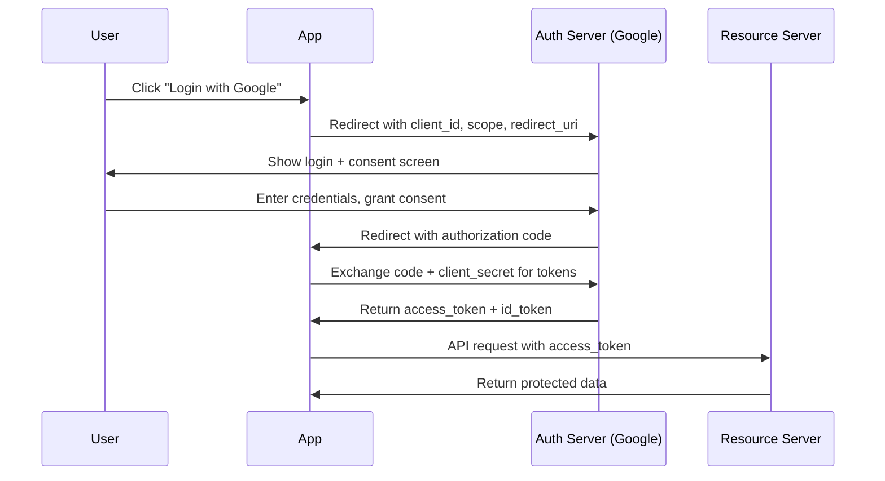

# Authentication and Authorization

## Why This Topic Exists

Imagine a bank vault with no lock on the door and no way to verify who is standing in front of it. That would be absurd. Yet countless systems have been built — and breached — because authentication and authorization were implemented poorly or not at all.

These two concepts are the front door and the internal access rules of every system you will ever design. They are also among the most commonly confused terms in software engineering. Getting them right is non-negotiable.

---

## Learning Objectives

- Clearly define and distinguish authentication from authorization
- Explain how passwords should be stored safely using hashing and salting
- Describe how session tokens and JWTs work and when to use each
- Walk through the OAuth 2.0 authorization code flow step by step
- Explain RBAC and ABAC and when to choose each
- Identify common attacks on authentication systems and their defenses

---

## Prerequisites

- Basic understanding of HTTP requests and responses
- Familiarity with what a database is
- No prior security knowledge required

---

## Introduction

Authentication and authorization are two words that sound similar but mean very different things.

**Authentication** (AuthN) answers: "Who are you?"
**Authorization** (AuthZ) answers: "What are you allowed to do?"

You must authenticate before you can be authorized. And being authenticated does not automatically mean you are authorized to do everything.

A system that confuses the two — or skips one — creates serious security vulnerabilities.

---

## Real-World Analogy

Think about visiting a corporate office building.

- At the front desk, you show your government-issued ID. The security guard checks that you are who you say you are. This is **authentication**.
- Once your identity is confirmed, you are given a visitor badge that only opens certain doors — maybe the lobby and the meeting room on floor 3, but not the server room or executive floor. This is **authorization**.

Your ID proves your identity. Your badge defines your access level. These are two separate, sequential steps.

---

## Core Concepts

### Authentication: Proving Who You Are

Authentication methods fall into three categories:

| Factor | Type | Examples |
|--------|------|---------|
| Something you know | Knowledge | Password, PIN, security question |
| Something you have | Possession | Phone (OTP), hardware token, smart card |
| Something you are | Inherence | Fingerprint, face scan, voice |

**Multi-Factor Authentication (MFA)** combines two or more of these. Even if an attacker steals your password, they still need your phone to get the second factor.

### How Passwords Should Be Stored

This is where many developers make critical mistakes. Here is what you must know:

**NEVER store plaintext passwords.** If your database is stolen, every user password is instantly exposed.

**NEVER use MD5 or SHA-1 for passwords.** These are fast hashing algorithms, which is actually a problem for passwords. An attacker with a stolen database can try billions of guesses per second.

**Use bcrypt, scrypt, or Argon2.** These algorithms are intentionally slow and include a built-in salt. They are specifically designed for password hashing.

**What is a salt?** A salt is a random string added to the password before hashing. This means even if two users have the same password, their hashed values will be different. It also defeats rainbow table attacks (pre-computed tables of hash values).

```
// What you store in the database
hash = bcrypt(password + random_salt, cost_factor=12)

// To verify a login
bcrypt.compare(submitted_password, stored_hash) → true/false
```

The cost factor (work factor) controls how slow bcrypt is. As hardware gets faster, you increase this number.

### Session Tokens vs JWT

After a user logs in, the server needs to remember them across requests. Two main approaches:

**Session Tokens (Stateful)**
- Server generates a random session ID
- Session ID stored in server memory or a Redis cache
- Client stores the session ID in a cookie
- Each request: client sends cookie, server looks up session in storage

Advantages: Easy to invalidate (just delete the session). Disadvantages: Server must store state; hard to scale across many servers.

**JSON Web Tokens / JWT (Stateless)**
- Server creates a signed token containing claims (user ID, roles, expiration)
- Token is signed with a secret key — it cannot be tampered with
- Client stores the JWT (usually in memory or localStorage)
- Each request: client sends JWT in Authorization header
- Server verifies the signature — no database lookup needed

JWT structure: `header.payload.signature` (three Base64-encoded parts)

Advantages: Stateless, scales horizontally. Disadvantages: Cannot be invalidated before expiration without extra infrastructure (token blacklist).

### OAuth 2.0

OAuth 2.0 is a framework that lets users grant third-party applications access to their data without sharing their password.

When you click "Sign in with Google" on a website, you are using OAuth 2.0.

**Authorization Code Flow** (for web apps with a backend):
1. User clicks "Login with Google"
2. App redirects user to Google's authorization server with a `client_id` and `redirect_uri`
3. User logs in at Google and consents to share their data
4. Google redirects back to app with a short-lived `code`
5. App server exchanges `code` + `client_secret` for an `access_token`
6. App uses `access_token` to call Google APIs on behalf of the user

The key insight: the user's credentials never touch the third-party app. The `code` exchange happens server-to-server, so the `client_secret` is never exposed to the browser.

**PKCE (Proof Key for Code Exchange)**: Used for mobile apps and SPAs that cannot store a `client_secret` safely. The app generates a random `code_verifier`, hashes it to get a `code_challenge`, and sends the challenge with the authorization request. When exchanging the code for a token, it sends the original verifier. This prevents authorization code interception attacks.

**Client Credentials Flow**: Used for machine-to-machine communication (no user involved). Service A authenticates directly with the authorization server using its own `client_id` and `client_secret` to get a token.

### OpenID Connect (OIDC)

OAuth 2.0 handles authorization (access to resources), but not identity. OpenID Connect is a layer on top of OAuth 2.0 that adds identity.

When you use OIDC, you receive both an `access_token` (for API access) and an `id_token` (a JWT containing the user's identity — name, email, etc.). This is the protocol behind "Sign in with Google/Apple/GitHub."

### Authorization: Controlling What Users Can Do

**Role-Based Access Control (RBAC)**

Users are assigned roles. Roles have permissions. Simple and easy to manage.

```
Roles: Admin, Editor, Viewer
Admin → can create, read, update, delete
Editor → can create, read, update
Viewer → can only read
```

Works well for most applications. Breaks down when you need fine-grained control — for example, "User A can edit documents they created, but not documents created by User B."

**Attribute-Based Access Control (ABAC)**

Access decisions are based on attributes of the user, the resource, and the environment.

```
Allow access IF:
  user.department == resource.department AND
  user.clearance_level >= resource.sensitivity AND
  time.current >= 9:00 AND time.current <= 18:00
```

Much more expressive and flexible than RBAC. Used in government, healthcare, and financial systems where complex access rules are needed. More complex to implement and reason about.

---

## Visual Diagram (Mermaid)



---

## Deep Explanation

### Why JWT Expiration Matters

JWTs cannot be invalidated once issued (unless you maintain a blacklist). This means if a user's account is compromised and you want to revoke their access, you cannot — until the token expires. This is why short expiration times (15 minutes to 1 hour for access tokens) are critical. Use long-lived refresh tokens stored securely to issue new access tokens.

### The RBAC vs ABAC Decision

Start with RBAC. It covers 80% of use cases and is straightforward to implement and audit. Move to ABAC only when you find yourself creating dozens of very specific roles, or when access decisions depend on resource attributes that change dynamically. Many production systems use a hybrid: RBAC for coarse-grained access, ABAC for fine-grained checks.

### OAuth 2.0 is Not an Authentication Protocol

This is a common confusion. OAuth 2.0 only tells you that a user has an access token — it does not tell you who the user is. To get identity information, you need OpenID Connect on top of OAuth 2.0.

---

## Step-by-Step Example

A user registers and logs in to your web application.

1. User fills out registration form with email and password
2. Server generates a random salt (e.g., 16 bytes of randomness)
3. Server computes: `hash = bcrypt(password + salt, cost=12)`
4. Server stores email, salt, and hash in the database (never the plaintext password)
5. User logs in with email and password
6. Server retrieves the stored hash for that email
7. Server calls `bcrypt.compare(submittedPassword, storedHash)` — returns true/false
8. If true, server generates a JWT: `{sub: userId, roles: ["editor"], exp: now+3600}`
9. Server signs the JWT with its private key and returns it to the client
10. Client stores the JWT and sends it in the `Authorization: Bearer <token>` header on subsequent requests
11. For each request, the server verifies the JWT signature and checks the `exp` claim

---

## Advantages / Disadvantages / Trade-offs

| Approach | Advantages | Disadvantages |
|----------|-----------|---------------|
| Session tokens | Easy to revoke, simple to understand | Requires server-side storage, harder to scale |
| JWT | Stateless, scales easily, self-contained | Cannot easily revoke before expiration |
| OAuth 2.0 | No password sharing, widely supported, delegated access | Complex flow, many moving parts |
| RBAC | Simple, easy to audit | Inflexible for complex access rules |
| ABAC | Very flexible, fine-grained control | Complex to implement and debug |

---

## When to Use / When NOT to Use

**Use session tokens when:** You need immediate revocation capability (banking apps, high-security systems).

**Use JWTs when:** You have multiple services that need to verify tokens independently, or you need stateless scaling.

**Use OAuth 2.0 when:** You are building a third-party integration or allowing users to authenticate via an existing identity provider.

**Use RBAC when:** Your access model is relatively straightforward with a small number of distinct roles.

**Use ABAC when:** You need fine-grained, context-aware access control that cannot be expressed cleanly with roles.

---

## Common Interview Questions

1. What is the difference between authentication and authorization?
2. How should passwords be stored in a database?
3. What is a JWT and how does it work? What are its limitations?
4. Walk me through the OAuth 2.0 Authorization Code flow.
5. What is PKCE and why is it needed?
6. Compare RBAC and ABAC — when would you choose each?
7. How would you implement "remember me" functionality securely?
8. How would you handle token revocation with JWTs?

---

## Common Beginner Mistakes

**Storing passwords in plaintext or using MD5.** Always use bcrypt, scrypt, or Argon2 with a sufficient cost factor.

**Confusing authentication and authorization.** They are separate steps. A user can be authenticated (proven identity) but not authorized (not permitted) to perform an action.

**Putting the JWT secret in your code or environment variables in plain sight.** Use a secrets manager. Rotate the key periodically.

**Not setting JWT expiration.** A JWT without an `exp` claim is valid forever. Always set a short expiration.

**Trusting client-side authorization checks alone.** Always enforce authorization on the server. Client-side checks are only for user experience; they provide no security.

**Using OAuth 2.0 for authentication without OIDC.** Having an access token does not tell you who the user is. Use OIDC for identity.

**Forgetting MFA on privileged accounts.** Admin accounts without MFA are a single-password breach away from total compromise.

---

## Summary

Authentication proves identity. Authorization controls access. These are sequential and distinct operations.

Passwords must be stored as slow hashes (bcrypt/Argon2) with salts — never plaintext, never MD5. Session tokens are stateful and revocable. JWTs are stateless, self-contained, and scalable but difficult to revoke. OAuth 2.0 enables delegated access without sharing passwords. OpenID Connect adds identity on top of OAuth 2.0. RBAC is simple and works for most systems; ABAC is powerful for complex, fine-grained access rules.

---

## Key Takeaways

- Authentication = "Who are you?" Authorization = "What can you do?"
- Use bcrypt or Argon2 for password hashing, never MD5 or plaintext
- JWT is stateless and scalable but requires careful expiration management
- OAuth 2.0 Authorization Code flow is the gold standard for web app SSO
- PKCE is required for public clients (mobile, SPA) that cannot store secrets
- RBAC for simplicity; ABAC for fine-grained, context-aware control
- Always enforce authorization server-side, never trust the client

---

## Related Topics

- [Encryption](./02.%20Encryption%20(BEGINNER).md) — How tokens and passwords are protected in transit and at rest
- [Common Attacks and Defenses](./03.%20Common%20Attacks%20and%20Defenses%20(INTERMEDIATE).md) — Credential stuffing, brute force, and phishing attacks
- [Zero Trust Security](./04.%20Zero%20Trust%20Security%20(INTERMEDIATE).md) — How authentication extends to service-to-service communication
- [Secrets Management](./05.%20Secrets%20Management%20(INTERMEDIATE).md) — How to manage the keys and secrets that authentication depends on
- [Security in Interviews](./06.%20Security%20in%20System%20Design%20Interviews%20(INTERMEDIATE).md) — How to discuss authentication and authorization in design interviews
