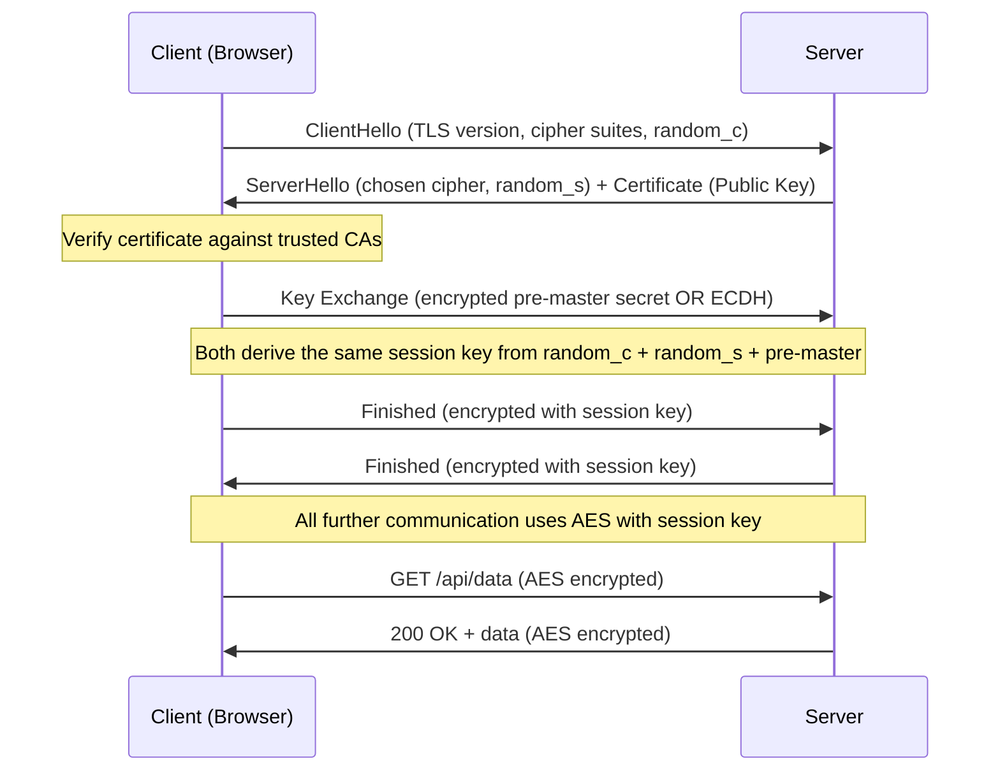

# Encryption

## Why This Topic Exists

Data travels over networks and sits in databases. Both locations are targets for attackers. Encryption is the technology that makes stolen data useless to anyone who does not have the key to unlock it. Without encryption, every password, credit card number, and private message is readable by anyone who intercepts it or steals the storage.

Understanding encryption does not mean you need to implement cryptographic algorithms yourself — you should never do that. But you do need to know which algorithms to choose, where to apply them, and why the wrong choices lead to catastrophic breaches.

---

## Learning Objectives

- Explain the difference between symmetric and asymmetric encryption with analogies
- Describe how TLS/SSL protects data in transit, step by step
- Distinguish between encryption at rest and encryption in transit
- Explain what hashing is and how it differs from encryption
- Describe what salting is and why it is necessary for password storage
- Name and describe the most important algorithms: AES, RSA, ECC, SHA-256

---

## Prerequisites

- Basic understanding of how networks and HTTP work
- Familiarity with the concept of a database
- No prior cryptography knowledge required

---

## Introduction

Encryption is the process of scrambling data using a mathematical algorithm so that only someone with the correct key can unscramble and read it.

There are two fundamentally different types of encryption:
- **Symmetric** encryption uses the same key to lock and unlock
- **Asymmetric** encryption uses two mathematically related keys: a public key and a private key

Additionally, **hashing** is a related but distinct concept: it transforms data into a fixed-length output that cannot be reversed. Hashing is used for passwords and data integrity, not for communication.

---

## Real-World Analogy

**Symmetric encryption** is like a house key. The same physical key both locks and unlocks the door. Anyone who has a copy of the key can open the door. The problem: how do you safely give someone a copy of the key without someone intercepting it in transit?

**Asymmetric encryption** is like a mailbox with a slot. Anyone can drop a letter in the slot (encrypt with the public key). But only the person with the private key (the owner) can open the mailbox door and read the letters. You can publish your mailbox location publicly — that is fine. Only you can open it.

**Hashing** is like a meat grinder. You can put a steak in, but you cannot reassemble the original steak from the ground meat. It is a one-way transformation. Useful for fingerprinting data, not for protecting it so it can be retrieved later.

---

## Core Concepts

### Symmetric Encryption

One key is used for both encryption and decryption. It is fast and efficient, making it suitable for encrypting large amounts of data.

**The key problem**: How do you securely share the key with the other party? If someone intercepts the key while you are sending it, they can decrypt everything. This is why symmetric encryption alone is not used for initial communication over untrusted networks.

**AES (Advanced Encryption Standard)** is the gold standard for symmetric encryption.
- Used in: file encryption, database encryption, disk encryption, the second phase of TLS
- Key sizes: 128-bit, 192-bit, or 256-bit (AES-256 is recommended for highest security)
- Modes: AES-GCM is preferred because it provides both encryption and authentication (verifies data was not tampered with)

### Asymmetric Encryption

Two mathematically linked keys: a public key (share it with anyone) and a private key (never share it with anyone).

- **Encrypt with public key → decrypt with private key** (sending private messages)
- **Sign with private key → verify with public key** (proving authenticity)

Asymmetric encryption is much slower than symmetric, so it is used to securely exchange a symmetric key — not to encrypt large payloads directly. This is exactly how TLS works.

**RSA (Rivest-Shamir-Adleman)** is the most widely known asymmetric algorithm.
- Based on the difficulty of factoring large prime numbers
- Key sizes: 2048-bit minimum, 4096-bit preferred
- Slower and produces larger outputs than ECC

**ECC (Elliptic Curve Cryptography)**
- Based on the mathematics of elliptic curves
- Provides the same security as RSA with much smaller key sizes (256-bit ECC ≈ 3072-bit RSA)
- Faster, more efficient — preferred for modern systems, especially mobile

### TLS/SSL: Encryption in Transit

TLS (Transport Layer Security) is the protocol that secures communication between a client (browser) and a server. SSL is the older predecessor; when people say SSL today, they usually mean TLS.

When you see `https://` in your browser, TLS is active.

**How the TLS Handshake Works:**

1. **Client Hello**: Client sends supported TLS versions, cipher suites, and a random value
2. **Server Hello**: Server picks the TLS version and cipher suite, sends its SSL certificate
3. **Certificate Verification**: Client verifies the certificate is signed by a trusted Certificate Authority (CA) and matches the domain
4. **Key Exchange**: Using asymmetric encryption (e.g., RSA or ECDH), both sides securely establish a shared symmetric key — the session key
5. **Finished**: Both sides use the session key (AES) for all further communication. The asymmetric encryption is only used for this initial key exchange.

The certificate contains the server's public key and is signed by a trusted Certificate Authority (like Let's Encrypt, DigiCert, or Comodo). Your browser has a built-in list of trusted CAs. If the certificate is signed by one of them, the browser trusts it.

### Encryption at Rest vs Encryption in Transit

| | Encryption in Transit | Encryption at Rest |
|---|---|---|
| What it protects | Data moving across a network | Data stored on disk, in databases, backups |
| Protocol/Method | TLS/HTTPS | AES-256, database encryption, full-disk encryption |
| Threat it stops | Network eavesdropping, man-in-the-middle | Physical theft, unauthorized storage access |
| Example | HTTPS connection to a website | Encrypted database columns, BitLocker |

Both are necessary. Encrypting in transit but not at rest means stolen backups expose all your data. Encrypting at rest but not in transit means network attackers can read everything.

### Hashing

A hash function takes any input and produces a fixed-size output (the hash or digest). It is deterministic (same input always produces same output) and one-directional (you cannot reverse-engineer the input from the output).

**Uses of hashing:**
- Password storage (store the hash, not the password)
- Data integrity verification (checksum a file to verify it was not corrupted or tampered with)
- Digital signatures (hash a document, then sign the hash)

**SHA-256 (Secure Hash Algorithm)**
- Produces a 256-bit (64 hex character) output
- Used in: TLS certificate fingerprints, digital signatures, blockchain, file integrity checks
- SHA-256 is fast — which is good for checksums but BAD for passwords (attackers can try billions of guesses per second)

### Salting

A salt is a random value added to the input before hashing. Salting defeats two specific attacks:

**Rainbow table attacks**: Pre-computed tables mapping common passwords to their hashes. If you hash "password123" with SHA-256, the attacker already knows the result. With a salt, even "password123" produces a completely different hash each time.

**Identical password detection**: Without salting, two users with the same password have the same hash. With salting, their hashes are always different.

```
// Without salt — dangerous
hash("password123") → 5f4dcc3b5aa765d61d8327deb882cf99

// With salt — safe
salt1 = "x7gR2kpQ"
hash("password123" + "x7gR2kpQ") → a9f3e...completely different output

salt2 = "mN8vLwYz"
hash("password123" + "mN8vLwYz") → 3b2c1...completely different again
```

For passwords, use bcrypt or Argon2 — they incorporate salting automatically and are designed to be slow (making brute-force attacks impractical).

---

## Visual Diagram (Mermaid)



---

## Deep Explanation

### Why Not Just Use Asymmetric Encryption for Everything?

Asymmetric encryption (RSA, ECC) is computationally expensive — orders of magnitude slower than symmetric encryption (AES). Encrypting a 1GB file with RSA would take an impractical amount of time.

The elegant solution that TLS uses: use asymmetric encryption to securely exchange a symmetric key, then use the fast symmetric key for all actual data. You get the security of asymmetric (no need to pre-share a secret) with the performance of symmetric.

### Perfect Forward Secrecy (PFS)

Modern TLS (1.2+) uses ephemeral key exchange (ECDHE or DHE). This means a new, temporary session key is generated for every connection. Even if an attacker records all encrypted traffic today and then compromises the server's private key tomorrow, they cannot decrypt past sessions — because each session used a different key that was never stored. This property is called Perfect Forward Secrecy.

### Certificate Authorities and Trust

The TLS system relies on trusting Certificate Authorities (CAs). Your operating system and browser ship with a list of trusted CAs. A website's certificate is only trusted if it chains up to one of these trusted CAs. This is why self-signed certificates trigger browser warnings — they have not been verified by a trusted third party.

### Algorithms to Use (and Avoid)

| Purpose | Use This | Avoid This | Why |
|---------|---------|-----------|-----|
| Symmetric encryption | AES-256-GCM | DES, 3DES, RC4 | Old algorithms with known vulnerabilities |
| Asymmetric encryption | ECC (P-256, P-384), RSA-2048+ | RSA-1024 | Too small key sizes, breakable |
| Password hashing | bcrypt, Argon2, scrypt | MD5, SHA-1, SHA-256 alone | Fast hashes are brute-forceable |
| Data integrity | SHA-256, SHA-3 | MD5, SHA-1 | Collision vulnerabilities |

---

## Step-by-Step Example

HTTPS in action when you visit your banking website:

1. You type `https://bank.com` in your browser
2. Your browser connects to the server on port 443
3. TLS handshake begins: browser sends supported cipher suites
4. Bank's server sends its certificate — signed by DigiCert, containing the bank's public key
5. Your browser checks: is DigiCert in my trusted CA list? Yes. Does the certificate match bank.com? Yes. Is it expired? No. Trust established.
6. Browser and server perform ECDH key exchange — a shared session key is derived without ever transmitting it directly
7. All communication is now encrypted with AES-256-GCM using the session key
8. You enter your password — it travels encrypted to the bank
9. Bank hashes your password with bcrypt and compares to the stored hash
10. If matched, bank generates a session token and sends it back encrypted over TLS
11. All subsequent API calls use this session token, always over TLS

---

## Advantages / Disadvantages / Trade-offs

| Approach | Advantages | Disadvantages |
|----------|-----------|---------------|
| Symmetric (AES) | Very fast, efficient for large data | Key distribution problem — how to share securely? |
| Asymmetric (RSA/ECC) | Solves key distribution | Slow, not suitable for large data |
| TLS (combining both) | Secure and performant | Certificate management overhead, slight latency for handshake |
| Hashing | One-way, fast for integrity | Cannot be reversed — cannot use for retrievable secrets |
| Encryption at rest | Protects stored data from theft | Does not help if application layer is compromised |

---

## When to Use / When NOT to Use

**Encryption in Transit (TLS)**: Always. Every production service should use HTTPS. There is no acceptable reason not to.

**Encryption at Rest**: Use for any sensitive data — user data, financial records, health records. At minimum, encrypt database columns holding PII, passwords, and payment data. For full-disk encryption, use it on all servers.

**Symmetric encryption (AES)**: Use for encrypting files, database fields, and the data payload in any communication. Do not use for key exchange.

**Asymmetric encryption (RSA/ECC)**: Use for key exchange, digital signatures, and certificate infrastructure. Do not use for bulk data encryption.

**Do NOT** implement your own cryptographic algorithms. Use well-tested libraries (OpenSSL, libsodium, Java Cryptography Architecture). "Rolling your own crypto" is one of the most common and catastrophic security mistakes.

---

## Common Interview Questions

1. What is the difference between symmetric and asymmetric encryption?
2. Why does TLS use both symmetric and asymmetric encryption?
3. What is a TLS certificate and what does it contain?
4. What is the difference between encryption and hashing?
5. Why should you not use SHA-256 for storing passwords?
6. What is a salt and what attacks does it prevent?
7. What is Perfect Forward Secrecy?
8. Explain encryption at rest vs encryption in transit.

---

## Common Beginner Mistakes

**Thinking HTTPS is enough for security.** HTTPS protects data in transit. You still need encryption at rest for databases and backups.

**Using MD5 or SHA-1 for passwords.** These are fast and broken for this purpose. Use bcrypt or Argon2.

**Generating weak random values for salts.** Use a cryptographically secure random number generator (CSPRNG). Language standard libraries provide these: `crypto.randomBytes()` in Node.js, `secrets` module in Python.

**Not validating TLS certificates in code.** When your backend makes HTTPS requests to other services, make sure certificate validation is enabled. Disabling it to "fix" errors is a serious security hole.

**Storing encryption keys next to the data they encrypt.** If an attacker gets access to the database and finds the key column, they can decrypt everything. Use a dedicated key management service (AWS KMS, HashiCorp Vault).

**Using ECB mode for AES.** AES-ECB produces identical ciphertext for identical plaintext blocks, which leaks patterns. Always use AES-GCM or AES-CBC with a random IV.

---

## Summary

Encryption protects data by scrambling it so only authorized parties can read it. Symmetric encryption (AES) uses one key for both locking and unlocking — fast and efficient for large data. Asymmetric encryption (RSA, ECC) uses a key pair — the public key encrypts, the private key decrypts — solving the key distribution problem but much slower. TLS combines both: asymmetric for key exchange, symmetric for all actual data.

Hashing is one-way — useful for passwords and integrity checks but not for retrievable data. Salting prevents rainbow table attacks by adding randomness to each hash. For passwords, always use bcrypt or Argon2. For general encryption, use AES-256-GCM. For key exchange and signatures, use ECC or RSA-2048+.

---

## Key Takeaways

- Symmetric encryption: same key to lock and unlock (AES-256)
- Asymmetric encryption: public key encrypts, private key decrypts (RSA, ECC)
- TLS uses asymmetric for key exchange, then symmetric for performance
- Hashing is one-way; use bcrypt/Argon2 (not SHA-256 or MD5) for passwords
- Salting prevents rainbow table attacks and hides identical passwords
- Encrypt data both in transit (TLS) and at rest (AES) — both are required
- Never implement your own cryptography; use battle-tested libraries

---

## Related Topics

- [Authentication and Authorization](./01.%20Authentication%20and%20Authorization%20(BEGINNER).md) — Passwords, JWTs, and tokens all rely on encryption concepts covered here
- [Common Attacks and Defenses](./03.%20Common%20Attacks%20and%20Defenses%20(INTERMEDIATE).md) — Man-in-the-middle attacks are defeated by proper TLS implementation
- [Zero Trust Security](./04.%20Zero%20Trust%20Security%20(INTERMEDIATE).md) — Mutual TLS builds on the TLS concepts in this file
- [Secrets Management](./05.%20Secrets%20Management%20(INTERMEDIATE).md) — Encryption keys are themselves secrets that need careful management
- [Security in Interviews](./06.%20Security%20in%20System%20Design%20Interviews%20(INTERMEDIATE).md) — Encryption at rest and in transit is a standard interview checklist item
