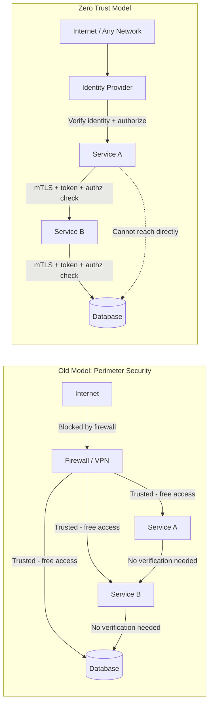

# Zero Trust Security

## Why This Topic Exists

For decades, network security was built on a simple assumption: everything inside the corporate network is safe; everything outside is dangerous. This worked when all employees sat in the same building, connected to the same network, and accessed systems through physical machines they never took home.

That world no longer exists. Employees work from coffee shops. Contractors access internal systems remotely. Microservices call each other over internal networks. Cloud environments blur the boundary between inside and outside entirely. The old model does not just become less effective — it becomes dangerously misleading because it creates a false sense of security.

Zero Trust is the architectural response to this new reality.

---

## Learning Objectives

- Explain the fundamental shift from perimeter security to Zero Trust
- Describe the three core principles of Zero Trust
- Explain mutual TLS (mTLS) and how services authenticate each other
- Describe micro-segmentation and why it limits breach impact
- Explain continuous verification and why one-time authentication is insufficient
- Understand why Zero Trust is critical for microservice architectures
- Reference Google's BeyondCorp as a real-world implementation

---

## Prerequisites

- Understanding of how networks and HTTP work
- Familiarity with TLS and certificates (covered in the Encryption file)
- Basic knowledge of microservices concepts
- Authentication and Authorization fundamentals (covered in File 01)

---

## Introduction

Zero Trust is a security model based on a single principle: **"Never trust, always verify."**

Under Zero Trust, no user, device, or service is automatically trusted — not even if they are inside your corporate network, not even if they authenticated five minutes ago. Every request must be authenticated, authorized, and validated regardless of where it originates.

This sounds extreme. But it is the only approach that makes sense when:
- Attackers can get inside your network through phishing, supply chain attacks, or insider threats
- Your "internal" network spans multiple cloud providers, VPNs, and offices worldwide
- A compromised microservice should not be able to freely access every other service

---

## Real-World Analogy

**Old model (Perimeter Security) — The Castle and Moat**

A medieval castle has a thick wall and a deep moat. Anyone outside is assumed dangerous. Anyone who gets through the gate is assumed friendly and can walk anywhere inside the castle — kitchens, armory, treasury. The entire security model depends on the moat and gate. If a spy sneaks in through the kitchen drain, they have free run of the entire castle.

**Zero Trust — The High-Security Office Building**

A modern office building like a government facility does not trust anyone just because they are inside the building. Every door has a badge reader. Access to the server room requires not just a badge but a fingerprint and a specific clearance level. Even if you are an employee with a valid badge, you cannot open doors that require higher clearance. Security cameras log every door access. If someone's badge is stolen, they cannot access anything except the lobby until the badge is deactivated. Cleaning staff can enter offices but not the vault. Every access, every time, is explicitly verified.

---

## Core Concepts

### The Perimeter Security Model and Its Failures

The traditional model uses a network perimeter — a firewall that separates the trusted internal network from the untrusted internet. Once traffic is inside the perimeter (from a VPN, an office network connection, or a trusted server), it moves freely.

**Why this fails today:**

- **Lateral movement**: Once an attacker compromises one machine inside the network — through phishing, a vulnerability, or a stolen VPN credential — they can move laterally to attack every other internal system. Nothing stops them.
- **Insider threats**: Malicious or compromised insiders are already inside the perimeter.
- **Cloud**: Your application runs across AWS, GCP, on-premises data centers, and third-party services. There is no single perimeter.
- **Remote work**: Employees connect from home networks, coffee shops, and hotel rooms. The perimeter has dissolved.

The 2020 SolarWinds attack is a perfect example. Attackers compromised SolarWinds' build pipeline. When companies installed the update, the malware was inside their perimeter — trusted, authenticated, and free to move laterally.

### The Three Principles of Zero Trust

**1. Verify Every Request**

Every request — whether from a user, a service, or an automated job — must be authenticated and authorized every time. Being authenticated once does not grant perpetual access.

This means:
- Services must prove their identity before calling other services (mTLS or service account tokens)
- User authentication must be continuously validated (short-lived tokens, session timeouts)
- Even privileged internal services are verified

**2. Least Privilege Access**

Grant the minimum permissions necessary to perform a specific function. A microservice that needs to read user data should not have permission to write, delete, or access payment data.

This limits the blast radius. If Service A is compromised, it can only do what Service A is explicitly permitted to do — nothing more.

**3. Assume Breach**

Design and operate as if attackers have already compromised part of your system. This means:
- Segment your network so compromised systems cannot reach everything
- Encrypt internal traffic (because an insider can sniff it)
- Log everything so you can detect anomalous behavior
- Plan incident response procedures proactively

---

## Visual Diagram (Mermaid)

---

## Deep Explanation

### Mutual TLS (mTLS)

Standard TLS (as used in HTTPS) is one-directional: the server proves its identity to the client via a certificate. The client does not prove anything — any browser can connect.

**Mutual TLS** is bidirectional: both the client and server present and verify certificates. In a microservice context, "client" and "server" are both services.

How it works:
1. Service A (the caller) presents its certificate to Service B
2. Service B verifies the certificate against a trusted Certificate Authority
3. Service B presents its certificate to Service A
4. Service A verifies it in return
5. Both parties know exactly who they are talking to

This means if an attacker compromises a machine and tries to call your payment service, the payment service rejects the connection — because the attacker does not have a valid certificate issued by your internal CA.

Certificates can be rotated frequently (e.g., every 24 hours using tools like SPIFFE/SPIRE) and automatically revoked if a service is compromised.

### Service Identity with SPIFFE/SPIRE

SPIFFE (Secure Production Identity Framework For Everyone) is a standard for establishing identity for microservices. SPIRE is its implementation.

Every service gets a SPIFFE Verifiable Identity Document (SVID) — a certificate that encodes a service-specific identity (e.g., `spiffe://example.com/payments-service`). Services present this identity to authenticate to each other. The SPIRE agent automatically rotates certificates, so there are no long-lived secrets to steal.

### Micro-Segmentation

In traditional network security, your internal network is flat — every service can talk to every other service. In a Zero Trust architecture, the network is segmented into small, isolated zones. Each service can only communicate with the services it explicitly needs to.

This is enforced at the network level (using firewall rules, Kubernetes NetworkPolicy, or a service mesh like Istio) and at the application level (authorization policies).

If Service A is compromised, it can only reach the services explicitly allowed in its policy. The attacker cannot pivot to the database or the payment service.

### Identity-Based Access

Instead of trusting network location (IP address, subnet), Zero Trust trusts identity. Access decisions are based on:
- Who or what is making the request (authenticated identity)
- What they are trying to do (requested action and resource)
- The state of the requesting device (device health, patch status)
- Context (time of day, location, risk score)

This is implemented through a **Policy Engine** (like Open Policy Agent / OPA) that evaluates these attributes for every request.

### Continuous Verification

Zero Trust does not authenticate once and then trust forever. It continuously re-evaluates:
- Short-lived tokens (JWTs expiring in 15 minutes, mTLS certificates expiring in 24 hours)
- Device posture checks (is this device's OS patched? Is it encrypted? Is it enrolled in MDM?)
- Behavioral analysis (is this user requesting data they have never accessed before at 3am?)

If something changes — device becomes non-compliant, token expires, anomalous behavior detected — access is re-challenged or denied.

---

## Google's BeyondCorp Model

Google's BeyondCorp, first published in a research paper in 2014, is the most famous real-world Zero Trust implementation. It emerged from Google's "Operation Aurora" experience in 2010, where sophisticated attackers compromised Google's corporate network.

The insight: even if you are a Google employee on Google's corporate network, you are not automatically trusted. Access to internal applications depends on your device certificate, your user identity, and your group membership — not on your network location.

**How BeyondCorp works:**
- All internal Google apps are accessed through a proxy (the "Access Proxy")
- The proxy enforces policy: user identity (via Google login) + device identity (certificate installed by IT) + group membership
- If any factor fails verification, access is denied
- Employees can work securely from any network — home WiFi or a hotel — without a VPN, because network location is irrelevant
- VPN is eliminated entirely for corporate applications

The outcome: no privileged internal network. The coffee shop is equivalent to the office. Security is enforced at the application layer, not the network layer.

### Why Zero Trust Matters for Microservices

A monolith has one authentication boundary — the user authenticates at the door. A system with 50 microservices has 50 services calling each other, often through hundreds of endpoints.

Without Zero Trust:
- Service-to-service traffic is often unencrypted and unauthenticated (trusted by IP address)
- A compromised service can call any other service without restriction
- There is no audit trail of which service called what

With Zero Trust:
- Every service-to-service call is authenticated (mTLS) and authorized (policy engine)
- Each service has the minimum permissions it needs
- All calls are logged with service identity
- Compromising one service does not give free access to others

Service meshes like **Istio** and **Linkerd** implement Zero Trust networking for Kubernetes: they automatically inject mTLS between all service-to-service calls, handle certificate rotation, and enforce network policies.

---

## Step-by-Step Example

How a request flows through a Zero Trust microservice architecture:

1. User authenticates to the Identity Provider (e.g., Okta, Google Identity) with credentials + MFA
2. Identity Provider issues a short-lived JWT containing user identity and roles
3. User's browser sends the JWT to the API Gateway
4. API Gateway validates the JWT signature and expiration; checks authorization policy
5. API Gateway calls the Orders Service with a service-account token (its own identity)
6. Orders Service authenticates the API Gateway via mTLS — verifies the certificate
7. Orders Service checks authorization: is API Gateway allowed to call this endpoint?
8. Orders Service needs to call the Inventory Service — it presents its own mTLS certificate
9. Inventory Service verifies the Orders Service identity and checks authorization
10. Every hop is logged: who called what, with what identity, at what time, with what result

If the Orders Service is compromised, it still cannot call the Payment Service — because there is no authorized policy permitting that.

---

## Advantages / Disadvantages / Trade-offs

| Aspect | Zero Trust | Perimeter Security |
|--------|-----------|-------------------|
| Lateral movement risk | Severely limited by segmentation | Very high — free movement inside perimeter |
| Breach impact | Limited to compromised component | Entire internal network at risk |
| Complexity | High — certificates, policy engine, logging | Low — just a firewall |
| Remote work support | Excellent — network location irrelevant | Poor — requires VPN |
| Implementation cost | High — significant engineering effort | Low — firewall rules |
| Operational overhead | High — certificate rotation, policy management | Low |
| Insider threat mitigation | Good — every access is verified | Poor — insiders are trusted |

---

## When to Use / When NOT to Use

**Use Zero Trust when:**
- You have a microservice architecture with service-to-service communication
- You operate in a cloud environment with no clear physical perimeter
- You have remote workers or contractors
- You handle sensitive data (financial, health, government)
- You need to meet security compliance requirements (SOC 2, FedRAMP, HIPAA)

**Zero Trust may be overkill when:**
- You are building a small monolithic application with a single trusted server
- You are in the early startup phase where iteration speed is paramount
- You do not yet have a team capable of operating the infrastructure (certificates, policy engines)

Even in early stages, you should adopt Zero Trust principles conceptually — think about least privilege, avoid flat internal networking, and log access — even if you cannot implement full mTLS and policy engines yet.

---

## Common Interview Questions

1. What is Zero Trust and how does it differ from perimeter security?
2. What are the three core principles of Zero Trust?
3. What is mutual TLS and how does it enable service-to-service authentication?
4. What is micro-segmentation and why does it matter?
5. Describe Google's BeyondCorp model.
6. How would you implement Zero Trust in a Kubernetes-based microservice architecture?
7. What problem does Zero Trust solve that a VPN does not?
8. What is "assume breach" and how does it change system design?

---

## Common Beginner Mistakes

**Assuming VPN equals Zero Trust.** A VPN just moves the perimeter to a different point. Once inside the VPN, a traditional network is still flat and permissive. Zero Trust eliminates the concept of a trusted perimeter entirely.

**Implementing mTLS without automating certificate rotation.** Manually managed certificates inevitably expire and cause outages. Automate with tools like SPIRE or cert-manager in Kubernetes.

**Treating Zero Trust as a product you can buy.** Zero Trust is an architectural philosophy and a set of controls. No single vendor product gives you Zero Trust — it requires changes to how you design services, manage identity, and enforce policy.

**Neglecting the data plane.** Teams often focus on network-level controls and forget to enforce authorization at the application level too. Network policy is one layer; the service must also check whether the authenticated caller is authorized to perform the specific operation.

**Not logging access decisions.** Zero Trust is also about visibility. If you cannot see who accessed what and when, you cannot detect compromised services or insider threats.

---

## Summary

Zero Trust is the security model built for the modern world: cloud environments, remote work, microservices, and sophisticated attackers who can get inside your network perimeter. The three principles — verify every request, enforce least privilege, assume breach — replace the outdated castle-and-moat model.

Technically, Zero Trust is implemented through mutual TLS (services authenticate each other), micro-segmentation (limit what each service can reach), identity-based access (policy engines like OPA), and continuous verification (short-lived credentials, device posture checks). Google's BeyondCorp is the most influential reference implementation.

For microservice architectures, Zero Trust is not optional — it is the only architecture that limits the blast radius of a compromised service.

---

## Key Takeaways

- Zero Trust principle: "Never trust, always verify" — regardless of network location
- Perimeter security fails because attackers get inside and move freely (lateral movement)
- The three pillars: verify every request, least privilege, assume breach
- mTLS enables services to authenticate each other — not just encrypt traffic
- Micro-segmentation contains breaches by limiting what each component can reach
- Google BeyondCorp: access based on identity + device, not network location; no VPN needed
- Service meshes (Istio, Linkerd) make Zero Trust networking practical in Kubernetes
- Continuous verification: short-lived tokens, device health checks, behavioral analysis

---

## Related Topics

- [Authentication and Authorization](./01.%20Authentication%20and%20Authorization%20(BEGINNER).md) — Identity verification is the foundation of Zero Trust
- [Encryption](./02.%20Encryption%20(BEGINNER).md) — mTLS builds on TLS certificate concepts
- [Common Attacks and Defenses](./03.%20Common%20Attacks%20and%20Defenses%20(INTERMEDIATE).md) — Zero Trust limits lateral movement after a breach
- [Secrets Management](./05.%20Secrets%20Management%20(INTERMEDIATE).md) — mTLS certificates and service tokens need careful management
- [Security in Interviews](./06.%20Security%20in%20System%20Design%20Interviews%20(INTERMEDIATE).md) — Zero Trust is a powerful design discussion at the senior level
