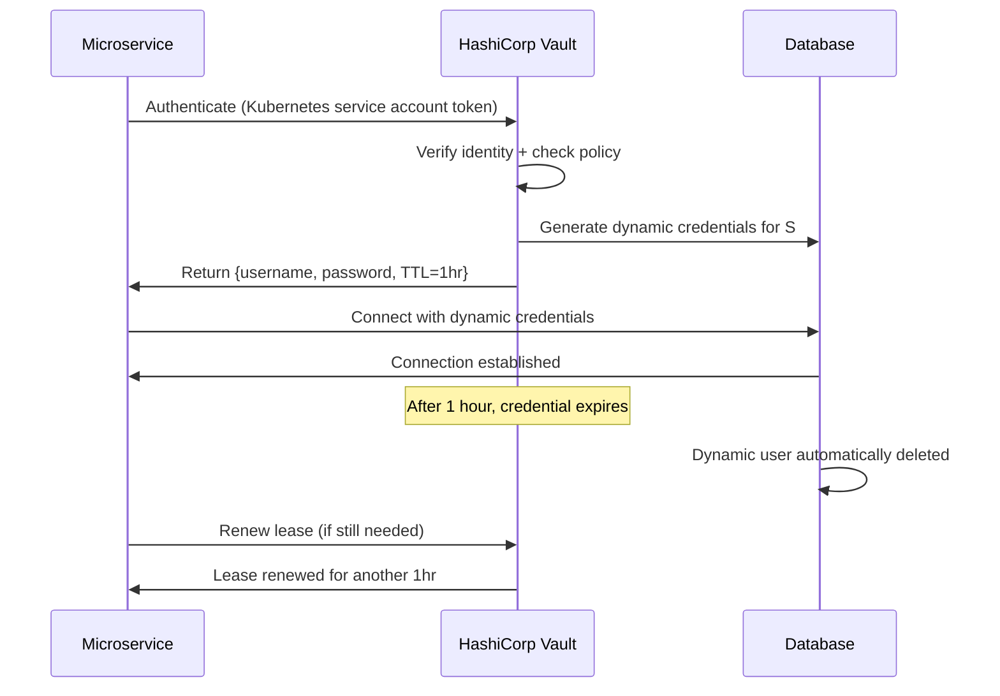

# Secrets Management

## Why This Topic Exists

In 2022, a researcher searched GitHub for a few minutes and found thousands of repositories containing live AWS access keys, database passwords, and private API keys — credentials that granted immediate access to real production systems. Many had been sitting there for months or years, actively leaking access.

Secrets — API keys, database passwords, TLS certificates, OAuth credentials — are the keys to your kingdom. How you manage them determines whether a careless mistake (a public git push) or a breach of one system means the attacker gets into everything else.

Secrets management is not glamorous engineering. But its absence is one of the most common causes of catastrophic breaches.

---

## Learning Objectives

- Explain why hardcoding secrets in code is dangerous
- Describe the risks of secrets in git history and application logs
- Compare environment variables, HashiCorp Vault, and cloud-native secret stores
- Explain dynamic secrets and why they are superior to static credentials
- Describe secret rotation and why it matters
- Apply the principle of least privilege to secrets access
- Reference a real incident where hardcoded credentials caused a breach

---

## Prerequisites

- Basic understanding of application development and deployment
- Familiarity with databases, APIs, and environment configuration
- Understanding of authentication concepts (File 01) is helpful

---

## Introduction

A **secret** is any credential that grants access to a resource or system: database passwords, API keys, TLS private keys, OAuth client secrets, SSH keys, JWT signing secrets, and encryption keys.

Secrets are different from configuration (feature flags, service URLs, timeout values). Configuration can be public. Secrets cannot.

The core rule of secrets management is simple: **secrets must never appear in your source code, git history, application logs, or any location accessible to unauthorized parties.**

In practice, this rule is violated constantly — which is why secrets management is such a critical engineering discipline.

---

## Real-World Analogy

Imagine you are a property manager with a master key that opens every unit in a large apartment building. You need to give a maintenance worker temporary access to fix a leak in Unit 4B.

**The wrong way**: Write the master key number on a sticky note, take a photo of it, and post the photo publicly on a community board so the maintenance worker can find it. Now everyone who walks past has the master key number forever — even after the maintenance is done.

**The right way**: Give the maintenance worker a temporary, limited key that only opens Unit 4B, automatically expires after 4 hours, and leaves a record in the building management log of exactly when it was used and for how long.

That temporary, auditable, scoped key is what a modern secrets management system provides. The sticky note is what a hardcoded secret in your git repository is.

---

## Core Concepts

### Why Secrets in Code is Dangerous

**The git history problem**: Git is designed to never forget. Even if you delete a secret from your code and commit the deletion, the secret is still present in the git history. Anyone who clones or forks the repository — or anyone who had access before the deletion — still has the secret. You cannot fully un-ring this bell without rewriting git history and rotating the credential.

**The fork/clone propagation problem**: Many companies host internal repositories that get forked. Public repositories get cloned by bots within seconds of being pushed. If your repository is accidentally made public for even a minute, bots have already scraped and stored any secrets present.

**The log problem**: Application logs often capture request parameters, error details, and environment variable dumps. If a secret is passed as an environment variable or a URL parameter, it may end up in plaintext in a log aggregation system, accessible to anyone with log access.

**The deployment artifact problem**: If your code is compiled into a Docker image or a build artifact and pushed to a registry, any embedded secrets travel with it — potentially accessible to anyone who can pull the image.

### The Spectrum of Secret Storage Approaches

**Level 1 — Hardcoded in Source Code (Never do this)**

```python
# DO NOT DO THIS
db_password = "SuperSecret123"
aws_key = "AKIA1234567890ABCDEF"
```

If this file is ever committed to git, the secret is permanently in history. If the repo is public or gets leaked, the secret is instantly compromised.

**Level 2 — Environment Variables (Better, but still risky)**

```bash
export DB_PASSWORD="SuperSecret123"
```

```python
import os
db_password = os.environ.get("DB_PASSWORD")
```

Environment variables keep secrets out of source code. However:
- They are often visible in process listings (`ps aux` on a server shows environment)
- They are easy to accidentally log (`print(os.environ)` in debug code)
- They require manual rotation — changing them usually requires restarting services
- They are often stored in `.env` files that get accidentally committed
- They do not provide an audit trail of who accessed them

Environment variables are a significant improvement over hardcoding, but they are not a complete solution for production systems.

**Level 3 — Dedicated Secrets Management Solutions (Recommended)**

These provide centralized, audited, access-controlled secret storage with rotation capabilities.

### HashiCorp Vault

Vault is the gold standard for secrets management in cloud-native applications.

**Core capabilities:**

- **Centralized secret storage**: All secrets stored in one encrypted system with fine-grained access control policies
- **Dynamic secrets**: Instead of storing a static database password, Vault generates a unique, time-limited credential for each service that requests access. The credential expires after 1 hour (or whatever TTL you set). This means there are no long-lived passwords to steal.
- **Secret rotation**: Vault automatically rotates static secrets on a schedule
- **Audit logging**: Every secret access — who requested what secret, when, from what service — is logged
- **Encryption as a Service**: Vault can encrypt/decrypt data for applications without those applications ever handling encryption keys directly
- **Multiple secret backends**: Database credentials, AWS IAM credentials, TLS certificates, SSH keys, KV secrets

**How a service retrieves a secret from Vault:**
1. Service authenticates to Vault using its own identity (Kubernetes service account, AWS IAM role, etc.)
2. Vault checks if this service is authorized to access the requested secret (based on Vault policies)
3. If authorized, Vault returns the secret (or generates a dynamic credential)
4. The secret has a TTL — the service gets a lease and must renew it or the credential expires
5. The access is logged in Vault's audit log

**Dynamic secrets example:**
```
# Service requests database credentials from Vault
vault read database/creds/my-service

# Vault generates a real, working database user for this service
# Valid for 1 hour, then automatically deleted from the database
Key                Value
username           v-my-service-8f3Kp2mQ
password           A1b2C3d4E5f6G7h8
lease_duration     1h
```

If an attacker steals this credential, it expires in at most 1 hour. There is no static password to steal.

### AWS Secrets Manager and Parameter Store

Cloud-native alternatives to Vault, tightly integrated with AWS IAM.

**AWS Secrets Manager:**
- Store and retrieve secrets (database passwords, API keys, OAuth tokens)
- Automatic rotation for RDS database passwords (built-in Lambda rotation function)
- Fine-grained IAM policies control which services can retrieve which secrets
- Audit trail via AWS CloudTrail
- Versioning — can retrieve previous versions during rotation

**AWS Parameter Store (SSM Parameter Store):**
- Similar to Secrets Manager but cheaper (free tier for standard parameters)
- SecureString parameters are encrypted with KMS
- Good for configuration and non-sensitive parameters at low cost
- Manual rotation — no automatic rotation built in
- Less feature-rich than Secrets Manager for high-security use cases

**Rule of thumb**: Use Secrets Manager for secrets (passwords, API keys). Use Parameter Store for configuration. Use Vault if you need cross-cloud or on-premises capability.

### Kubernetes Secrets

Kubernetes has a built-in Secrets resource. However, by default, Kubernetes Secrets are stored as base64-encoded (not encrypted) values in etcd.

**The problem**: Base64 is not encryption. It is just encoding. Anyone with access to etcd or the right kubectl permissions can trivially decode them.

**Making Kubernetes Secrets actually secure:**
- Enable etcd encryption at rest (Kubernetes supports encryption providers)
- Use a dedicated secrets management solution (Vault with Kubernetes integration, AWS Secrets Manager via the Secrets Store CSI Driver)
- Restrict RBAC access to the Secrets resource tightly — service accounts should only be able to read the specific secrets they need
- Never store Kubernetes Secrets in your git repository (even as YAML) without encrypting them first (use Sealed Secrets or SOPS)

### Secret Rotation

Secret rotation is the practice of periodically changing credentials. This limits the window of opportunity if a secret is compromised.

**Why rotation matters:**
- If a static credential is stolen today but you rotate it tomorrow, the attacker loses access
- Compliance requirements (PCI DSS, SOC 2, HIPAA) often mandate rotation policies
- Regular rotation forces you to ensure your rotation process works — so when you need emergency rotation, you know it will succeed

**Rotation strategies:**
- **Manual rotation**: An engineer changes the secret and updates all services. Error-prone and does not scale.
- **Automated rotation**: The secrets management system (Vault, AWS Secrets Manager) rotates credentials automatically on a schedule and notifies dependent services
- **Dynamic secrets**: No rotation needed — credentials are generated on-demand and expire automatically

**Rotation graceful period**: When rotating a secret, you need both the old and new credentials valid simultaneously for a brief period — long enough to update all services. AWS Secrets Manager handles this with a versioned staging label system (AWSCURRENT, AWSPENDING).

### Least Privilege for Secrets

Not every service should be able to access every secret. A service that sends emails should not be able to read database passwords. A read-only analytics service should not have access to secrets for writing data.

In Vault, this is implemented with policies:
```hcl
# This policy only allows the payments-service to read payment-related credentials
path "database/creds/payments-db" {
  capabilities = ["read"]
}

# Block access to all other paths
path "*" {
  capabilities = ["deny"]
}
```

In AWS Secrets Manager, use IAM policies scoped to specific secret ARNs.

---

## Visual Diagram (Mermaid)



---

## Deep Explanation

### The Real Incident: Code.uber.com Breach (2014)

In 2014, Uber suffered a data breach caused by a credential stored in a private GitHub repository. Attackers found an AWS access key in Uber's code and used it to access an S3 bucket containing user data.

This pattern — credentials in git, leading to cloud resource access — is among the most common breach vectors. GitHub, AWS, and other services actively scan for exposed credentials and notify owners, but by the time notification arrives, bots may have already exploited them.

A similar pattern led to the 2019 Capital One breach: AWS credentials obtained through SSRF gave access to S3 buckets containing 100+ million customer records.

The lesson: the cost of setting up proper secrets management is orders of magnitude smaller than the cost of a breach caused by a hardcoded secret.

### The ".env File in Git" Problem

Many developers use `.env` files for local development. These files must be in `.gitignore`. When they are not, they get committed and pushed — even to private repositories.

Even private repositories can be exposed through:
- GitHub account compromise
- Repository access granted to a contractor
- Repository accidentally made public
- Repository settings inherited incorrectly

Best practice: Use a `.env.example` file in git with placeholder values. Keep the real `.env` file only in `.gitignore` and local machines. For production, inject secrets via the deployment system, never from a file.

---

## Step-by-Step Example

Migrating a service from hardcoded secrets to HashiCorp Vault:

1. **Audit current state**: Search the codebase for hardcoded credentials (`grep -r "password"`, `grep -r "secret"`, use tools like `truffleHog` or `git-secrets`)
2. **Rotate all discovered credentials**: Assume any secret that was ever in code has been compromised
3. **Set up Vault**: Deploy Vault (or use Vault Cloud), configure the database secrets backend for your database
4. **Create Vault policies**: Write policies granting each service read access only to its specific secrets
5. **Configure Kubernetes auth**: Enable Vault's Kubernetes auth method so services can authenticate using their Kubernetes service account tokens
6. **Update the service**: Replace hardcoded credentials with Vault API calls at startup (or use Vault Agent which injects secrets as environment variables automatically)
7. **Enable audit logging**: Configure Vault audit log to ship to your SIEM
8. **Set up rotation**: Configure the Vault database secrets engine with a TTL (e.g., 1 hour for dynamic credentials)
9. **Test rotation**: Deliberately let a credential expire and verify the service handles renewal gracefully

---

## Advantages / Disadvantages / Trade-offs

| Approach | Security | Rotation | Audit | Complexity |
|----------|---------|---------|-------|-----------|
| Hardcoded in code | Very poor | Manual | None | Trivial |
| Environment variables | Poor-Medium | Manual | None | Low |
| AWS Secrets Manager | Good | Automated | CloudTrail | Medium |
| HashiCorp Vault | Excellent | Automated / Dynamic | Built-in | High |
| Dynamic secrets (Vault) | Excellent | Not needed (auto-expire) | Built-in | High |

---

## When to Use / When NOT to Use

**Use environment variables when:** Building a simple application or prototype where secrets management infrastructure is not yet justified. Always better than hardcoding.

**Use AWS Secrets Manager / Parameter Store when:** Running primarily on AWS and want a managed, low-operational-overhead solution with automatic rotation for RDS.

**Use HashiCorp Vault when:** You need cross-cloud or on-premises operation, dynamic secrets, advanced policies, encryption as a service, or the most comprehensive audit trail.

**Avoid hardcoded secrets always.** Without exception. Even in "internal tools," "test environments," or "quick scripts." Quick scripts get committed, get shared, and get forgotten.

---

## Common Interview Questions

1. What is secrets management and why does it matter?
2. Why is storing secrets in environment variables not sufficient for production?
3. What are dynamic secrets and how do they improve security?
4. What is secret rotation and how would you implement it with zero downtime?
5. How does HashiCorp Vault work at a high level?
6. How would you handle secrets in a Kubernetes deployment?
7. What went wrong in the Uber 2014 breach?
8. How would you audit which services have access to which secrets?

---

## Common Beginner Mistakes

**Committing .env files to git.** Always add `.env` to `.gitignore` before creating it. Use tools like `pre-commit` hooks or `git-secrets` to scan for accidental secret commits.

**Assuming private repositories are safe.** Private does not mean secret. Repos get forked, shared, compromised.

**Not rotating secrets after a team member leaves.** If a developer who had access to production credentials leaves, rotate everything they had access to.

**Giving broad access to a secrets manager.** "If in doubt, give it admin access to Vault" defeats the purpose. Scope each service's Vault policy to exactly the paths it needs.

**Not testing secret rotation.** If you have never tested your rotation process, it will fail when you need it most — during an incident. Regularly test rotation in staging.

**Logging secrets accidentally.** Review all logging code to ensure secrets never appear in log output. Use log scrubbing libraries or structured logging with explicit field allowlists.

---

## Summary

Secrets — passwords, API keys, certificates, signing keys — must never appear in source code, git history, or application logs. The consequences of exposure range from immediate account compromise to full data breaches affecting millions of users.

Environment variables improve on hardcoding but lack rotation, auditability, and fine-grained access control. Dedicated secrets management solutions — HashiCorp Vault, AWS Secrets Manager — provide centralized storage, audit logging, automated rotation, and least-privilege access policies. Dynamic secrets, where credentials are generated on-demand and expire automatically, represent the gold standard: there are no long-lived passwords to steal.

Apply the principle of least privilege: each service should only be able to access the specific secrets it needs, with no broader access.

---

## Key Takeaways

- Secrets must never be in source code, git history, or logs — ever
- Git history is permanent; rotate any secret that was ever committed
- Environment variables are better than hardcoding but insufficient for production
- HashiCorp Vault provides dynamic secrets, audit logging, and fine-grained policies
- AWS Secrets Manager provides cloud-native managed secret storage with auto-rotation
- Dynamic secrets have TTLs and auto-expire, eliminating long-lived static passwords
- Rotate all secrets regularly; automate rotation to ensure it actually happens
- Apply least privilege to secrets access — each service gets only what it needs

---

## Related Topics

- [Authentication and Authorization](./01.%20Authentication%20and%20Authorization%20(BEGINNER).md) — JWT signing secrets and OAuth client secrets are classic secrets that need proper management
- [Encryption](./02.%20Encryption%20(BEGINNER).md) — Encryption keys are a type of secret requiring the same management discipline
- [Common Attacks and Defenses](./03.%20Common%20Attacks%20and%20Defenses%20(INTERMEDIATE).md) — SSRF attacks often target metadata endpoints to steal credentials
- [Zero Trust Security](./04.%20Zero%20Trust%20Security%20(INTERMEDIATE).md) — mTLS certificates and service tokens are secrets that need management
- [Security in Interviews](./06.%20Security%20in%20System%20Design%20Interviews%20(INTERMEDIATE).md) — Secrets management is a key differentiator in senior-level design discussions
