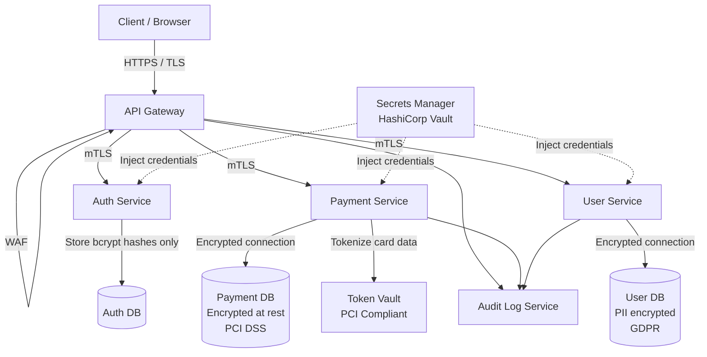

# Security in System Design Interviews

## Why This Topic Exists

Most system design interview guides teach you to design for scale, performance, and availability. Security is often treated as an optional add-on — something you mention only if the interviewer explicitly asks. This approach misses a critical signal.

Senior and staff engineers raise security concerns without being prompted. They know which components need access control, which data requires encryption, which endpoints are vulnerable to abuse, and which regulations apply. The ability to proactively weave security into a design — without derailing the conversation or over-engineering — is one of the clearest signals of engineering seniority.

This file teaches you how to think about security holistically during a system design interview, and how to communicate it in a way that impresses rather than overwhelms.

---

## Learning Objectives

- Build a mental security checklist applicable to any system design
- Know how to proactively raise security concerns at the right moments in an interview
- Understand the security requirements for specific domains: payments (PCI DSS), healthcare (HIPAA), and general web apps (GDPR)
- Design the security architecture for a payment system and a healthcare application
- Explain PII data handling and why it is a design concern, not just a legal concern

---

## Prerequisites

- Completion of Files 01–05 in this security chapter (or equivalent knowledge)
- Familiarity with basic system design concepts (databases, APIs, caches, queues)
- Understanding of authentication, encryption, and access control

---

## Introduction

System design interviews test whether you can think like a senior engineer. Senior engineers consider security as a first-class design constraint — not an afterthought. When you design a URL shortener, a senior engineer notes that the redirect endpoint could be abused for phishing and suggests adding a URL scanning mechanism. When you design a chat application, they note that message content should be encrypted at rest, and that end-to-end encryption is worth discussing.

You do not need to turn every design into a deep security lecture. You need to demonstrate awareness: naming the right concerns, applying the right controls, and knowing when to go deep and when to note something and move on.

---

## Real-World Analogy

Imagine you are an architect designing a physical building. A good architect does not wait for the client to ask about fire safety — they know that fire exits, sprinkler systems, and smoke detectors are non-negotiable parts of any building design. They size them correctly for the building type: a warehouse has different requirements than a hospital.

Similarly, a senior engineer knows that any system handling user data needs authentication, any system handling payments needs encryption and audit logs, and any public API needs rate limiting. These are the "building codes" of software — you apply them automatically, and you know when stricter rules apply (hospitals vs. warehouses = healthcare apps vs. simple web apps).

---

## Core Concepts

### The Security Checklist for System Design

Every time you design a system, run through this checklist. You will not discuss every item in every interview — but having the list in your head means you will never miss an obvious concern.

| Category | Questions to Ask |
|----------|-----------------|
| Authentication | Who can access this system? How do they prove their identity? Is MFA required? |
| Authorization | What can each type of user do? How is access control enforced? RBAC or ABAC? |
| Encryption in Transit | Is all communication over TLS? Are there any internal services using HTTP? |
| Encryption at Rest | Is sensitive data encrypted in the database? Are backups encrypted? |
| Input Validation | Are all inputs validated and sanitized? Are SQL injection and XSS defenses in place? |
| Rate Limiting | Are public endpoints rate-limited? Are there anti-brute-force controls? |
| Audit Logging | Are all access events logged? Who accessed what, when? Are admin actions logged? |
| PII Handling | What personally identifiable information is collected? How long is it retained? Can it be deleted? |
| Secrets Management | Where are API keys, passwords, and certificates stored? Are they in code? |
| Dependency Security | Are third-party libraries scanned for CVEs? Is there a software bill of materials? |
| Network Security | Is the database directly accessible from the internet? Are internal services segmented? |
| Incident Response | Are there alerts for suspicious activity? Is there a process for rotating credentials after a breach? |

### How to Raise Security Proactively

The key is to weave security naturally into the design flow, not to deliver a security lecture at the end.

**At the requirements phase**: "Before we finalize requirements, I want to note a few security constraints that will shape the design. We are handling user financial data, so we need to consider PCI DSS compliance — that means encryption at rest, audit logging, and tokenization of card numbers. Does that change the scope?"

**When designing the API layer**: "The API gateway is the natural place to handle authentication with JWT validation and rate limiting. I will put that here."

**When designing the database layer**: "User passwords should be stored as bcrypt hashes, not plaintext. PII fields — names, emails, addresses — should be encrypted at the column level or at least have restricted access."

**When designing internal services**: "In a microservices setup, I would recommend mTLS between services so that internal traffic is authenticated and encrypted. This is especially important because this system handles medical records."

**When wrapping up**: "From a security standpoint, I want to make sure we have: TLS everywhere, JWT authentication at the gateway, database encryption, audit logging, and rate limiting on public endpoints. Want me to go deeper on any of these?"

This approach demonstrates awareness without derailing the interview into a security deep-dive.

---

## Visual Diagram (Mermaid)

---

## Deep Explanation

### Scenario 1: Designing a Payment System

When an interviewer says "design a payment system" or "design a checkout flow," they expect you to address security head-on. Here is what to cover:

**Authentication and Authorization:**
- Users authenticate before any payment action
- Payment operations (charge a card, refund, change payment method) require explicit authorization checks — even authenticated users should not be able to charge cards belonging to other users
- Admin operations (refund all orders, access bulk payment data) require elevated privileges with MFA and extra verification

**PCI DSS (Payment Card Industry Data Security Standard):**
PCI DSS applies to any system that stores, processes, or transmits cardholder data (card numbers, CVVs, expiration dates). Key requirements relevant to design:
- Never store CVV codes after authorization (not in the database, not in logs)
- If storing card numbers, they must be encrypted and access must be strictly controlled
- **Tokenization**: The best approach is to not store raw card numbers at all. Use a PCI-compliant payment processor (Stripe, Braintree) that returns a token representing the card. Store the token — not the card number. The payment processor handles PCI compliance for card storage.
- All transmission of cardholder data must be over TLS
- Network must be segmented — payment systems should not be on the same network segment as unrelated services
- Audit logs must capture all access to cardholder data
- Penetration testing and vulnerability scanning are required on a schedule

**Design decisions:**
- Idempotency keys: Payment API must be idempotent — if a request is retried (due to network failure), it must not double-charge. Store idempotency keys in a distributed cache (Redis) with the request hash and result.
- Fraud detection: Build signals for anomalous behavior — unusual purchase amounts, new device, high-risk country, velocity (many transactions in short time). Use risk scoring and require additional verification above a threshold.
- Audit log every transaction: who initiated it, what was charged, what was the outcome, what was the source IP. This is both a security requirement and a business necessity.

### Scenario 2: Designing a Healthcare Application

**HIPAA (Health Insurance Portability and Accountability Act):**
HIPAA applies to any system that stores or transmits Protected Health Information (PHI) — patient records, diagnoses, treatment histories, medications, insurance information.

Key design requirements:
- **PHI must be encrypted at rest and in transit**: No exceptions. Use AES-256 for storage, TLS 1.2+ for transmission.
- **Access control**: Only authorized healthcare providers should access a patient's records. Implement fine-grained ABAC — a cardiologist should not be able to access psychiatric records unless there is a clinical relationship.
- **Audit logs**: Every access to PHI must be logged — who accessed what record, when, from which device. HIPAA requires the ability to produce an audit report of all PHI access.
- **Data minimization**: Collect only the PHI necessary for the purpose. Do not store sensitive fields unless needed.
- **Breach notification**: If PHI is breached, covered entities must notify affected patients within 60 days. Your design should include incident detection capabilities.
- **Business Associate Agreements (BAAs)**: Any vendor with access to PHI (AWS, Twilio for patient SMS, etc.) must sign a BAA. AWS, Google Cloud, and Azure offer HIPAA-eligible services with BAAs.

**Design decisions:**
- Separate PHI from non-PHI data: Store clinical notes in a separate, HIPAA-compliant data store. Keep analytics and non-PHI operational data in standard storage.
- De-identification for analytics: For data science and population health analytics, use de-identified data (remove or transform the 18 HIPAA-defined direct identifiers).
- Emergency access override: HIPAA allows for "break-glass" access — emergency scenarios where a provider needs access to records they are not normally authorized for. This must be implemented with extensive logging and mandatory review.

### GDPR Basics for System Design

GDPR (General Data Protection Regulation) applies to any system collecting personal data from EU residents. Key design implications:

- **Right to erasure (right to be forgotten)**: Your system must be able to delete or anonymize all personal data for a specific user. This is a design challenge — data in backups, data lakes, audit logs. Design for deletion from day one.
- **Data portability**: Users can request all their data in a machine-readable format. Build export functionality.
- **Consent management**: Record explicit user consent for each purpose you collect data for. Store consent records with timestamps.
- **Data residency**: GDPR restricts transferring EU resident data outside the EU/EEA without appropriate safeguards. Consider database geography in your design.
- **Privacy by design**: Collect the minimum necessary data. Use anonymization/pseudonymization where full PII is not required.

For interviews, you do not need to quote GDPR article numbers. Demonstrating awareness of these concepts is sufficient.

---

## Step-by-Step Example

You are asked to design a system for an online doctor consultation platform. Here is how to address security naturally throughout the design:

**At requirements gathering**: "This is a healthcare application, so HIPAA applies. We need to design for PHI encryption, access control, and audit logging from the start. We also need to handle EU users, so GDPR considerations for consent and data residency apply."

**When designing the data model**: "Patient records and consultation notes are PHI. I'll store these in a separate, encrypted database with stricter access controls than our non-PHI operational data. Patient names, DOBs, diagnoses — all encrypted at the column level using AES-256."

**When designing the API**: "Authentication requires MFA for healthcare providers — a single password is not sufficient for HIPAA compliance. I'll use OAuth 2.0 with PKCE for the mobile app and short-lived JWTs. Every API call to patient data goes through an authorization check: does this provider have a clinical relationship with this patient?"

**When designing logging**: "Every read or write to PHI — every time a doctor opens a patient's chart — logs the provider identity, patient ID, timestamp, action, and source IP. This audit log is append-only and immutable for HIPAA compliance."

**When discussing storage**: "Patient document uploads (images, PDFs) go to S3, but with server-side encryption using KMS-managed keys. The S3 bucket has no public access. Access is only through pre-signed URLs with short expiration."

**When wrapping up**: "The security posture here: TLS everywhere, MFA for providers, ABAC for PHI access, column-level encryption, immutable audit logs, no public database access, and all PHI retained according to state minimum retention laws with automated deletion workflows. The main compliance frameworks are HIPAA and GDPR."

---

## Advantages / Disadvantages / Trade-offs

Recognizing security trade-offs shows maturity:

| Security Control | Benefit | Cost / Trade-off |
|-----------------|---------|-----------------|
| Encryption at rest | Data useless if database stolen | Performance overhead (~5-10%), key management complexity |
| MFA | Dramatically reduces account takeover | Friction for users, recovery flows needed |
| Short JWT expiration | Limits damage if token stolen | Users re-authenticate more often; need refresh token flow |
| Immutable audit logs | Non-repudiation, compliance | Storage costs, logs cannot be pruned for PII |
| Tokenization (payments) | No raw card data to steal | Depends on third-party processor, limited offline processing |
| Rate limiting | Prevents brute force and DDoS | Legitimate power users may hit limits; requires tuning |

---

## When to Use / When NOT to Use

**When to go deep on security in an interview:**
- The system clearly handles sensitive data (payments, health, government, identity)
- The interviewer explicitly asks about security
- The system is described as high-traffic / public-facing (DDoS and rate limiting are relevant)
- The system design includes an admin panel or privileged internal access

**When to keep security discussion brief:**
- Designing a simple internal tool with known users
- Early design phases focused on functional requirements
- The interviewer explicitly says "don't worry about security for now"

Even when keeping it brief, always at least mention: authentication, authorization, TLS, and that you would add more security detail in a real design.

---

## Common Interview Questions

1. How would you design authentication and authorization for a multi-tenant SaaS application?
2. What security considerations apply to a payment system design?
3. How would you handle PII data in a system? How would you support GDPR right-to-erasure?
4. How would you prevent someone from enumerating other users' data via your API?
5. What is PCI DSS and how does it affect the design of a payments backend?
6. How do you design a system so that it can produce a compliance audit report?
7. How would you design audit logging that is tamper-resistant?
8. A microservice needs to access a database. How should it store and retrieve its credentials?

---

## Common Beginner Mistakes

**Only mentioning security when prompted.** Proactively raising security concerns is a strong senior signal. Do not wait to be asked.

**Mentioning security without substance.** Saying "we should add security" without specifics is worse than saying nothing. Be concrete: "bcrypt for passwords," "JWT at the API gateway," "AES-256 for PII columns."

**Treating all data the same.** Public blog posts have different security requirements than credit card numbers. Demonstrate that you can categorize data by sensitivity and apply proportionate controls.

**Not knowing the compliance frameworks.** You do not need to be a compliance expert, but knowing that payments involve PCI DSS, healthcare involves HIPAA, and EU user data involves GDPR is expected at the senior level.

**Forgetting about internal access.** Designing the external API security perfectly but leaving the internal admin panel without MFA or the database accessible from any internal IP is a common oversight.

**Ignoring the deletion problem.** Designing for GDPR right-to-erasure as an afterthought is very hard. Data ends up in caches, CDNs, message queues, analytics warehouses, and backups. If you do not design for deletion from day one, your system will fail compliance.

---

## Summary

Security is a first-class design concern, not an optional topic. Senior engineers demonstrate security thinking throughout a design, not just in response to direct questions. The security checklist — authentication, authorization, encryption in transit and at rest, input validation, rate limiting, audit logging, PII handling, and secrets management — should be part of every design review.

Domain-specific security requirements amplify baseline controls: PCI DSS for payments (tokenization, no CVV storage, network segmentation), HIPAA for healthcare (PHI encryption, audit every access, break-glass procedures), and GDPR for EU data (right-to-erasure design, consent management, data minimization). The ability to name these frameworks and explain their concrete design implications is a strong senior and staff-level signal.

---

## Key Takeaways

- Raise security proactively — do not wait for the interviewer to ask
- The security checklist: AuthN, AuthZ, TLS, encryption at rest, rate limiting, audit logs, PII handling, secrets management
- Payment systems: PCI DSS, tokenization, idempotency keys, fraud detection, no CVV storage
- Healthcare systems: HIPAA, PHI encryption, ABAC access control, immutable audit logs
- GDPR: right-to-erasure requires designing for deletion from day one
- Be specific: name the algorithms, protocols, and frameworks — not just "add security"
- Demonstrate trade-off awareness: every security control has a cost, and you can articulate both
- Internal security matters too: databases, admin panels, service-to-service calls all need controls

---

## Related Topics

- [Authentication and Authorization](./01.%20Authentication%20and%20Authorization%20(BEGINNER).md) — The foundation of every secure system design
- [Encryption](./02.%20Encryption%20(BEGINNER).md) — Encryption at rest and in transit are standard interview checklist items
- [Common Attacks and Defenses](./03.%20Common%20Attacks%20and%20Defenses%20(INTERMEDIATE).md) — Knowing OWASP Top 10 is expected at the intermediate-to-senior level
- [Zero Trust Security](./04.%20Zero%20Trust%20Security%20(INTERMEDIATE).md) — Relevant for microservices design discussions
- [Secrets Management](./05.%20Secrets%20Management%20(INTERMEDIATE).md) — Always mention credentials management when designing services that connect to other services
