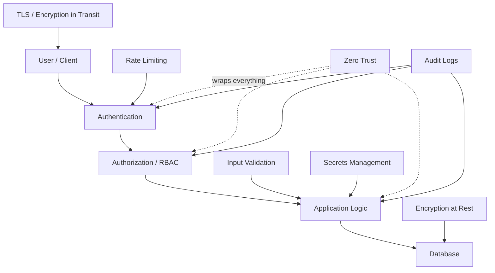

# Chapter 14: Security

## Why This Chapter Exists

Every system you design will be attacked. Not maybe — definitely. Whether it is a small startup API or a global payments platform, attackers scan the internet continuously looking for weak points. Security is not an afterthought or a checkbox; it is a fundamental design constraint just like performance or reliability.

This chapter builds your security thinking from the ground up. You will learn how to prove who someone is, how to keep data private, how to defend against the most common attacks, and how to think about security at the architecture level. By the end, you will be able to walk into any system design interview and proactively raise security concerns — which is exactly what senior and staff engineers do.

---

## How This Chapter Is Organized

| File | Topic | Level | Description |
|------|-------|-------|-------------|
| [01. Authentication and Authorization](./01.%20Authentication%20and%20Authorization%20(BEGINNER).md) | AuthN / AuthZ | Beginner | Proving identity and controlling what users can do. Covers passwords, JWT, OAuth 2.0, RBAC, ABAC, and common credential attacks. |
| [02. Encryption](./02.%20Encryption%20(BEGINNER).md) | Encryption | Beginner | Scrambling data so only authorized parties can read it. Covers symmetric/asymmetric encryption, TLS, hashing, salting, and real algorithms. |
| [03. Common Attacks and Defenses](./03.%20Common%20Attacks%20and%20Defenses%20(INTERMEDIATE).md) | Attacks | Intermediate | The OWASP Top 10 and how to defend against SQL Injection, XSS, CSRF, DDoS, MitM, and SSRF. |
| [04. Zero Trust Security](./04.%20Zero%20Trust%20Security%20(INTERMEDIATE).md) | Zero Trust | Intermediate | "Never trust, always verify." Moving beyond the castle-and-moat model with mutual TLS, micro-segmentation, and identity-based access. |
| [05. Secrets Management](./05.%20Secrets%20Management%20(INTERMEDIATE).md) | Secrets | Intermediate | How to handle API keys, passwords, and credentials safely. HashiCorp Vault, AWS Secrets Manager, secret rotation, and why hardcoding is dangerous. |
| [06. Security in System Design Interviews](./06.%20Security%20in%20System%20Design%20Interviews%20(INTERMEDIATE).md) | Interviews | Intermediate | How to proactively raise security concerns in interviews. Covers payment system security, HIPAA, GDPR, PCI DSS, and the senior engineer security checklist. |

---

## Core Security Principles (Remember These Always)

Before diving into the individual topics, internalize these five principles. They apply everywhere.

**1. Defense in Depth**
Never rely on a single layer of protection. Use multiple independent controls — if one fails, others still protect you. Think of it like wearing both a belt and suspenders.

**2. Principle of Least Privilege**
Give users and services only the permissions they actually need, nothing more. A database backup service should be able to read data but never delete it.

**3. Assume Breach**
Design your system as if attackers have already gotten inside. Segment your network, encrypt internal traffic, and log everything so you can detect and respond.

**4. Security by Design**
Bake security in from day one. Retrofitting security onto an existing system is expensive and error-prone. Think about security requirements the same way you think about performance requirements.

**5. Zero Trust**
Do not automatically trust traffic just because it comes from inside your network. Verify every request, every time.

---

## The Security Mindset

A good engineer thinks like an attacker. For every feature you design, ask:

- Who is allowed to do this? (Authentication and Authorization)
- What happens if someone sends malicious input? (Input Validation)
- Is this data protected if the database is stolen? (Encryption at Rest)
- Can someone intercept this data in transit? (Encryption in Transit)
- What is the blast radius if this component is compromised? (Segmentation)
- How will we know if something goes wrong? (Logging and Monitoring)

---

## How Security Topics Connect

---

## Prerequisites for This Chapter

- Basic understanding of how the web works (HTTP, requests/responses)
- Familiarity with databases and APIs
- Chapters 1–13 of this course (helpful but not strictly required)

---

## What You Will Be Able to Do After This Chapter

- Explain the difference between authentication and authorization with concrete examples
- Describe how TLS protects data in transit, step by step
- Identify at least six common web attacks and their defenses
- Explain the Zero Trust model and when it is necessary
- Describe how secrets should be managed in a production system
- Proactively raise security concerns during system design interviews without being prompted

---

## Related Topics

- [Load Balancers](../03.%20Load%20Balancers/README.md) — WAFs often sit alongside load balancers
- [API Design](../08.%20API%20Design/README.md) — Authentication is a core part of API design
- [Microservices](../11.%20Microservices/README.md) — Zero Trust and mTLS are critical in microservice architectures
- [Databases](../05.%20Databases/README.md) — Encryption at rest, access control, and SQL injection all relate to database design
