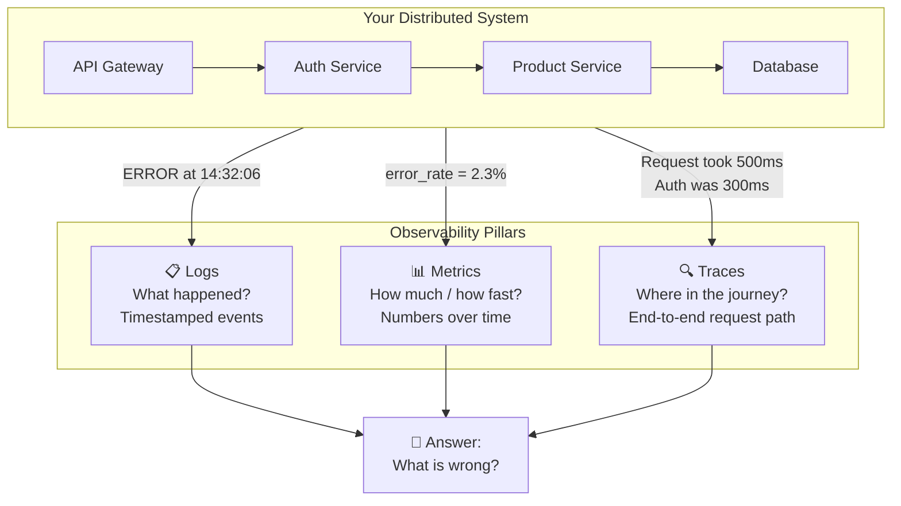

# The Three Pillars of Observability

## Why This Topic Exists

Imagine you are a doctor. A patient walks in and says "I feel bad." You cannot open up the patient and look directly at their organs. Instead, you use **observable symptoms** — temperature, blood pressure, blood tests, X-rays — to understand what is happening inside.

Software systems are the same. You cannot peer directly into a running server. Instead, you need instruments that tell you what is happening inside. Those instruments are **observability**.

Without observability, when your system breaks at 3 AM, you are guessing. With observability, you have evidence. The difference between a 5-minute fix and a 5-hour outage is often the quality of your observability setup.

---

## Learning Objectives

By the end of this topic, you will be able to:

- Define observability and explain why it matters
- Name the three pillars of observability and describe each one
- Explain the difference between monitoring and observability
- Understand what "unknown unknowns" means in the context of production systems
- Describe how logs, metrics, and traces work together

---

## Prerequisites

- Basic understanding of what a web server does
- Familiarity with the concept of microservices (at least the idea that one request can touch multiple services)

---

## Introduction

Modern software systems are complex. A single user request might pass through 10 or more different services before returning a response. Any one of those services could be slow, failing, or behaving unexpectedly.

**Observability** is the ability to understand what is happening inside your system by examining its external outputs. The word comes from control theory — a system is "observable" if you can determine its internal state from its outputs.

In practice, observability in software is built on three pillars:

1. **Logs** — records of specific events that happened
2. **Metrics** — numerical measurements collected over time
3. **Traces** — the end-to-end journey of a single request

Each pillar answers a different question. Together, they give you the full picture.

---

## Real-World Analogy

Think about how a **pilot navigates an airplane**:

- **Logs** are like the black box flight recorder. After something goes wrong, you can replay exactly what happened: "engine temperature spiked at 14:32:05, fuel pump activated at 14:32:06, autopilot disengaged at 14:32:07."

- **Metrics** are like the cockpit instruments — altitude, airspeed, fuel level, engine RPM. The pilot watches these continuously to know if everything is within normal range. If the fuel gauge drops below 20%, an alarm goes off.

- **Traces** are like the flight plan combined with actual flight data. You can see: the plane left Chicago, flew over Kansas City, hit turbulence over Denver, and arrived in Los Angeles 12 minutes late. You can pinpoint exactly where the delay happened.

A pilot with no instruments is flying blind. A software engineer with no observability is doing the same thing.

---

## Core Concepts

### What is Observability?

Observability is a property of a system that describes **how well you can understand its internal state from its external outputs**.

A highly observable system:
- Emits detailed, structured logs
- Exposes useful metrics
- Instruments every request with trace context
- Makes it easy to ask new questions you didn't anticipate

### Monitoring vs Observability

This distinction is important and frequently misunderstood.

| Monitoring | Observability |
|------------|--------------|
| Tracks **known** problems | Helps you investigate **unknown** problems |
| "Is the server down?" | "Why is this one user getting slow responses?" |
| Alert: error rate > 5% | Explore: what's different about these failing requests? |
| Answers pre-defined questions | Answers questions you haven't asked yet |
| Known unknowns | Unknown unknowns |

**Monitoring** is checking that the dashboard is green. **Observability** is having the tools to diagnose something you've never seen before.

The famous distinction from Donald Rumsfeld applies here:
- **Known knowns**: Things you know you know (server uptime)
- **Known unknowns**: Things you know you don't know (you know traffic can spike, so you alert on it)
- **Unknown unknowns**: Things you don't know you don't know (a rare edge case that causes slowdown in only 0.01% of requests)

Monitoring handles known unknowns. Observability handles unknown unknowns.

### The Three Pillars

#### Pillar 1: Logs

A **log** is a timestamped, immutable record of something that happened.

```
2024-03-15T14:32:05Z [INFO] User 12345 logged in from IP 192.168.1.1
2024-03-15T14:32:06Z [ERROR] Payment failed for order 99887 - Card declined
2024-03-15T14:32:07Z [WARN] Database connection pool at 90% capacity
```

Logs are the most detailed and human-readable pillar. They tell you exactly what happened at a specific moment in time.

#### Pillar 2: Metrics

A **metric** is a numerical measurement collected at regular intervals.

```
http_requests_total{method="GET", status="200"} = 142,854
http_request_duration_seconds{p99} = 0.342
database_connections_active = 87
memory_usage_bytes = 2,147,483,648
```

Metrics are aggregated and efficient to store. They are perfect for dashboards, alerts, and spotting trends over time.

#### Pillar 3: Traces

A **trace** follows a single request through every service it touches.

```
TraceID: abc123
├── API Gateway        [0ms → 5ms]
├── Auth Service       [5ms → 23ms]  ← slow!
├── Product Service    [23ms → 45ms]
├── Inventory Service  [45ms → 67ms]
└── Response returned  [67ms]
```

Traces answer the question: "My request took 500ms — which service was responsible?"

---

## Visual Diagram (Mermaid)



---

## Deep Explanation

### Why You Need All Three Pillars

Each pillar has blind spots. The real power comes from using all three together.

**Scenario:** Users are reporting slow checkouts.

- **Metrics** alert you: checkout latency P99 jumped from 200ms to 2000ms at 3:45 PM.
- **Traces** narrow it down: the slowness is happening in the payment service, specifically in the call to the fraud detection API.
- **Logs** give you the details: "FraudCheck timeout after 1500ms for user region=EU, payment_method=credit_card."

Without metrics, you might not notice the problem for hours. Without traces, you know something is slow but not where. Without logs, you can't see the specific error message.

### The Cardinality Problem

One important concept is **cardinality** — the number of unique values a label can have.

- **Low cardinality**: `status_code` (200, 404, 500 — just a few values). Fine for metrics.
- **High cardinality**: `user_id` (millions of unique values). Terrible for metrics, fine for logs and traces.

This is why you don't track per-user metrics — it would create millions of time series. Instead, you log individual user events and use traces to follow specific user requests.

### The Correlation Between Pillars

The most powerful pattern is **correlating** across pillars using a shared identifier.

When a request comes in, generate a **trace ID** (e.g., `abc-123-xyz`). Pass this ID:
- Into every log line: `[traceId=abc-123-xyz] Payment failed`
- Into trace spans: the trace for `abc-123-xyz` shows the full journey
- Into metric labels (carefully, only for low-cardinality ones)

Now when an alert fires on a metric, you can jump to traces for that time window, then jump to logs for specific trace IDs. This is called **correlation** and it dramatically speeds up incident investigation.

### Telemetry Data

Logs, metrics, and traces are collectively called **telemetry data** — data emitted by a running system to describe its behavior. Modern observability platforms like **OpenTelemetry** provide a standardized way to collect and export all three types.

---

## Step-by-Step Example

### Scenario: Debugging a Production Incident

**Step 1: Alert fires.**
Your monitoring system sends an alert: "Payment service error rate > 5% for last 5 minutes."

**Step 2: Check metrics dashboard.**
You open Grafana. The error rate spiked at 3:47 PM. It started small (2%) and grew to 8%. The spike correlates with a deployment that went out at 3:45 PM.

**Step 3: Use traces to find the failure point.**
You open your tracing tool (Jaeger). You filter for failed traces in the payment service between 3:45-4:00 PM. You see that 8% of traces have a red span in the "fraud-check-api" step.

**Step 4: Read the logs.**
You copy a trace ID from a failing trace: `trace-98765`. You search your log aggregation system for this ID. You find:

```
2024-03-15T15:47:03Z [ERROR] traceId=trace-98765 FraudCheck API returned 503
2024-03-15T15:47:03Z [ERROR] traceId=trace-98765 Payment aborted due to fraud check failure
```

**Step 5: Root cause found.**
The fraud check API is returning 503 (Service Unavailable). The new deployment changed the circuit breaker configuration and it's now immediately failing instead of falling back to a default policy.

Total diagnosis time: **8 minutes** instead of potentially hours.

---

## Advantages / Disadvantages / Trade-offs

| | Logs | Metrics | Traces |
|--|------|---------|--------|
| **Strength** | Rich detail, human-readable | Efficient, aggregatable, great for alerts | Shows request flow, great for latency diagnosis |
| **Weakness** | Expensive to store and search at scale | Low cardinality only, no request context | Overhead, sampling complexity |
| **Storage Cost** | High | Low | Medium |
| **Query Speed** | Slow (full-text search) | Fast (time-series queries) | Medium |
| **Best For** | Debugging specific events | Dashboards and alerting | Diagnosing distributed latency |

---

## When to Use / When NOT to Use

**Use observability when:**
- Running any production system that users depend on
- Operating microservices where requests span multiple services
- You need to meet SLAs and need to prove you are meeting them
- Your team needs to respond to incidents quickly

**You cannot skip observability if:**
- You have paying users
- Your system handles transactions or important data
- You have an on-call rotation

**Common shortcut (and why it fails):**
Many teams add logging but skip metrics and tracing. This leads to "log archaeology" — manually searching through millions of log lines trying to find a pattern. Metrics and traces exist precisely to avoid this.

---

## Common Interview Questions

**Q: What is the difference between monitoring and observability?**
A: Monitoring checks known failure modes (known unknowns). Observability lets you investigate unexpected behavior you've never seen before (unknown unknowns). Monitoring tells you something is wrong; observability helps you figure out what and why.

**Q: Why do you need all three pillars? Can't you just use logs?**
A: Logs lack aggregation efficiency (too expensive to query at scale for trends). Logs don't show you the request path across services. You need metrics for alerting efficiency and traces for distributed debugging. All three answer different questions.

**Q: What is a correlation ID?**
A: A unique identifier (usually a UUID) attached to a request when it enters the system and propagated through every service it touches. This lets you search logs and traces for all activity related to one specific request, even across dozens of microservices.

---

## Common Beginner Mistakes

1. **Only adding logging.** Logs alone don't give you dashboards or latency visualization. You need all three pillars.

2. **Not propagating trace IDs.** If your auth service doesn't forward the trace ID to the payment service, your traces break. Trace context must be passed in HTTP headers (or message queue headers) between every service.

3. **Treating observability as an afterthought.** Teams often add observability after a bad incident. The right approach is to design it in from day one.

4. **Logging too much or too little.** Logging every SQL query at DEBUG level in production will fill your disk. Logging nothing in ERROR paths means you can't diagnose failures.

5. **Confusing monitoring with observability.** A green dashboard is not the same as an observable system. Your dashboards only show what you thought to measure. Observability lets you explore what you didn't think of.

---

## Summary

Observability is the practice of understanding your system's internal state from its external outputs. It is built on three pillars:

- **Logs**: Detailed, timestamped records of events — "what happened?"
- **Metrics**: Numerical measurements over time — "how much? how fast?"
- **Traces**: End-to-end request journeys — "where did it slow down?"

The key insight is that monitoring handles **known unknowns** (things you know might go wrong), while observability handles **unknown unknowns** (things you've never seen before). At scale, unexpected failures are guaranteed — observability is what lets you diagnose them before they become catastrophes.

---

## Key Takeaways

- Observability = understanding your system's internal state from external outputs
- Three pillars: Logs (events), Metrics (numbers over time), Traces (request journeys)
- Monitoring = known unknowns; Observability = unknown unknowns
- Correlation IDs link the three pillars together for fast incident diagnosis
- All three pillars are needed — each has blind spots the others cover
- Design observability in from day one, not as an afterthought

---

## Related Topics (relative markdown links)

- [02. Logging (BEGINNER)](./02.%20Logging%20(BEGINNER).md)
- [03. Metrics and Monitoring (INTERMEDIATE)](./03.%20Metrics%20and%20Monitoring%20(INTERMEDIATE).md)
- [04. Distributed Tracing (INTERMEDIATE)](./04.%20Distributed%20Tracing%20(INTERMEDIATE).md)
- [05. Alerting and On-Call (INTERMEDIATE)](./05.%20Alerting%20and%20On-Call%20(INTERMEDIATE).md)
- [06. Performance Profiling (INTERMEDIATE)](./06.%20Performance%20Profiling%20(INTERMEDIATE).md)
- [Chapter 11: Reliability and Fault Tolerance](../11.%20Reliability%20and%20Fault%20Tolerance/)
- [Chapter 12: Microservices](../12.%20Microservices/)
