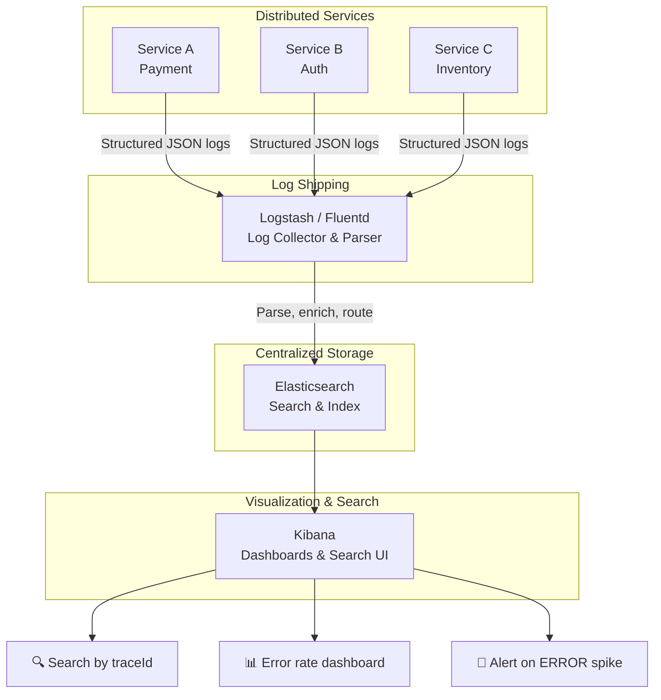

# Logging

## Why This Topic Exists

Every computer program needs a way to communicate what it is doing. When something goes wrong in production, you cannot attach a debugger and step through the code — the system is live, serving real users. Logs are your **window into the past**. They are the record of what your program did, when it did it, and what it saw.

Logging sounds simple. In practice, bad logging habits — logging the wrong things, logging in unstructured formats, logging to local files in a distributed system — cause enormous pain. This topic teaches you how to log correctly so that you can actually use your logs when you need them most.

---

## Learning Objectives

By the end of this topic, you will be able to:

- Describe what to log and what to absolutely never log
- Explain the difference between structured and unstructured logging
- Use log levels correctly (DEBUG, INFO, WARN, ERROR, FATAL)
- Understand how centralized logging works and why it is necessary in distributed systems
- Implement correlation IDs to trace a request across multiple services
- Describe a real debugging workflow using logs

---

## Prerequisites

- Understanding of what logs are (covered in topic 01)
- Basic familiarity with HTTP requests
- Some programming experience (any language)

---

## Introduction

A log is simply a record of something that happened: what occurred, when it occurred, and any relevant context. In the early days of computing, logs were text files written to disk. In modern distributed systems, logs flow from dozens of services into centralized storage platforms where they can be searched and analyzed.

The key insight is that logs are written for the **future you** — specifically, for the version of you who is woken up at 3 AM because something is broken and needs to diagnose the problem in minutes. Write your logs with that person in mind.

---

## Real-World Analogy

Think of a **ship's log**. A ship's captain writes down every significant event: the weather, the position, any mechanical issues, course changes, crew incidents. They don't write down every breath they take (too much noise), but they do write down everything a future investigator would need if something went wrong.

If the ship runs aground, investigators read the log to reconstruct what happened. If the log only says "things were fine, then we hit rocks," it is useless. If it says "15:42 - radar showed clear. 15:51 - crew member reported radar malfunction. 15:58 - collision detected," you can understand the root cause.

Your application logs should tell the same kind of story: specific, timestamped, with enough context to reconstruct what happened.

---

## Core Concepts

### What to Log

**Log these things:**
- Errors and exceptions (with full stack traces)
- Warnings — degraded but not broken behavior
- Important business events: user signup, payment processed, order placed
- Service start/stop
- Configuration loaded
- Request received / response sent (at the right level of detail)
- Authentication events: login, logout, failed login attempts
- Slow operations exceeding a threshold

**Never log these things:**
- Passwords (in any form)
- Credit card numbers or bank account numbers
- Social Security Numbers or national IDs
- Authentication tokens or API keys
- Session tokens or cookies
- Any PII (Personally Identifiable Information) unless you have explicit legal and compliance approval
- Private keys or certificates

This is not just good practice — in many jurisdictions, logging PII without proper controls is a legal violation (GDPR, HIPAA, PCI-DSS).

### Structured vs Unstructured Logging

#### Unstructured Logging

```
User 12345 logged in from 192.168.1.100 at 2024-03-15 14:32:05
Payment failed for order 99887: card declined
```

This is readable to humans but very hard for machines to parse. If you want to find all payment failures in the last hour, you have to write a regex and hope the format is consistent.

#### Structured Logging

```json
{
  "timestamp": "2024-03-15T14:32:05Z",
  "level": "INFO",
  "event": "user_login",
  "userId": "12345",
  "ipAddress": "192.168.1.100",
  "userAgent": "Mozilla/5.0",
  "service": "auth-service",
  "traceId": "abc-123"
}

{
  "timestamp": "2024-03-15T14:32:06Z",
  "level": "ERROR",
  "event": "payment_failed",
  "orderId": "99887",
  "reason": "card_declined",
  "service": "payment-service",
  "traceId": "abc-124"
}
```

Structured logs (usually JSON) are:
- **Searchable**: Filter by `event=payment_failed` returns only payment failures
- **Aggregatable**: Count all `event=user_login` per hour
- **Machine-parseable**: Log aggregation platforms (ELK, Loki) ingest these automatically
- **Consistent**: No regex guessing — fields are always in the same place

**Always use structured logging in production systems.** The initial investment pays off enormously during incident diagnosis.

### Log Levels

Log levels let you control the verbosity of your logs and filter them by severity.

| Level | When to Use | Example |
|-------|-------------|---------|
| **DEBUG** | Detailed diagnostic information, only useful during development. Never leave on in production. | "Entering calculateTax() with params: {amount: 100, country: 'US'}" |
| **INFO** | Normal application behavior worth recording. | "User 12345 logged in successfully" |
| **WARN** | Something unexpected happened but the system is still functioning. Investigate soon. | "Database connection pool at 80% capacity" |
| **ERROR** | A specific operation failed. The system continues running but this request failed. | "Payment processing failed for order 99887: timeout" |
| **FATAL** | The application cannot continue. Imminent shutdown. | "Failed to connect to database on startup — cannot continue" |

**Production configuration:** Set the log level to INFO or WARN. Set it to DEBUG only when actively investigating a specific problem, then turn it back off. DEBUG logs at high traffic volumes can fill disks in minutes.

---

## Visual Diagram (Mermaid)



---

## Deep Explanation

### Centralized Logging: The ELK Stack

In a distributed system, logs are produced by dozens of services on dozens of servers. If each service writes logs only to its local disk, you cannot:
- Search across services simultaneously
- Correlate a request that touched 5 services
- Keep logs after a server shuts down (logs lost forever)

**Centralized logging** solves this by shipping all logs to a single searchable platform.

The most common open-source stack is **ELK**:

- **Elasticsearch**: A distributed search and analytics engine. Stores logs as documents and makes them searchable in milliseconds.
- **Logstash**: A data pipeline that ingests logs from many sources, parses and transforms them, then outputs to Elasticsearch. Think of it as the plumbing.
- **Kibana**: A web UI for searching, visualizing, and creating dashboards from data stored in Elasticsearch.

A modern alternative replaces Logstash with **Fluentd** or **Fluent Bit** (lighter weight) and sometimes replaces Elasticsearch/Kibana with **Grafana Loki** (designed for logs, cheaper to operate at scale).

### Log Aggregation in Distributed Systems

Each service should:
1. Write structured JSON logs to stdout (not to files)
2. A log agent (Fluentd, Filebeat, or the container runtime) picks up stdout and ships it to the centralized platform
3. The agent adds metadata: service name, hostname, environment (prod/staging), region

This is the **12-factor app** approach: treat logs as event streams, not files.

### Log Sampling

At high traffic volumes, logging every request is expensive. A service handling 100,000 requests per second would generate millions of log lines per second — storing and indexing all of them is cost-prohibitive.

**Log sampling** keeps a representative subset:
- **Random sampling**: Log 1% of requests randomly. Cheap and easy, but you might miss rare errors.
- **Head-based sampling**: Decide at request entry whether to log it. Consistent: either all logs for a request exist or none do.
- **Tail-based sampling**: Collect all logs but only keep them if the request was slow or errored. More complex but keeps the interesting data.
- **Priority sampling**: Always log ERROR and FATAL, sample INFO.

A common pattern: always log errors at 100%, sample successful requests at 1%.

### Correlation IDs

This is one of the most important logging patterns for distributed systems.

**The problem:** A user's checkout request touches 6 services. It fails. You search logs for the error. You find an error in the payment service... but what caused it? Was it triggered by a bad request from the cart service? You'd have to manually piece together the timeline.

**The solution: Correlation IDs (also called Request IDs or Trace IDs)**

1. When a request enters your system (at the API gateway or first service), generate a unique ID: `req-8f7e3a2b`
2. Include this ID in every log line: `[traceId=req-8f7e3a2b] Payment initialized`
3. When Service A calls Service B, pass the ID in an HTTP header: `X-Request-ID: req-8f7e3a2b`
4. Service B reads this header and includes it in all its logs

Now you can search your centralized logging platform for `traceId=req-8f7e3a2b` and get **every log line from every service** that handled this specific request, in chronological order.

```
[req-8f7e3a2b] API Gateway  → Request received: POST /checkout
[req-8f7e3a2b] Auth Service → User 12345 authenticated
[req-8f7e3a2b] Cart Service → Cart validated: 3 items
[req-8f7e3a2b] Payment Svc → Charging card ending 4242
[req-8f7e3a2b] Payment Svc → ERROR: Stripe API timeout after 5000ms
[req-8f7e3a2b] API Gateway  → Returning 500 to client
```

This complete picture takes seconds to assemble with a correlation ID. Without it, you'd be manually cross-referencing timestamps across 6 log files.

---

## Step-by-Step Example

### Debugging a Production Issue Using Logs

**Scenario:** Users report that checkout is failing "sometimes." No other details.

**Step 1: Check error rate metrics.**
You see an elevated error rate on the payment service that started 20 minutes ago.

**Step 2: Search centralized logs for errors.**
In Kibana, you search:
```
service:payment-service AND level:ERROR AND @timestamp:[now-30m TO now]
```

You see a cluster of errors:
```json
{"level":"ERROR","event":"payment_failed","reason":"stripe_timeout","count":342}
```

**Step 3: Get a specific trace ID from a failed request.**
```json
{"traceId": "req-abc999", "level":"ERROR", "reason":"stripe_timeout"}
```

**Step 4: Search for all logs with that trace ID.**
```
traceId:req-abc999
```

You get the full picture:
```
[req-abc999] 14:47:02 API Gateway: POST /checkout from user 12345
[req-abc999] 14:47:02 Auth: Token valid
[req-abc999] 14:47:02 Cart: Items validated
[req-abc999] 14:47:02 Payment: Calling Stripe API
[req-abc999] 14:47:07 Payment: ERROR Stripe call timed out after 5000ms
```

**Step 5: Root cause.**
The Stripe API call is timing out. You check Stripe's status page — they are having an incident. You implement a fallback and the errors stop.

Total time: 12 minutes.

---

## Advantages / Disadvantages / Trade-offs

| | Advantage | Disadvantage |
|--|-----------|--------------|
| **Structured Logging** | Searchable, consistent, machine-parseable | More verbose, slightly more code to write |
| **Centralized Logging** | Cross-service search, persistent storage, team access | Infrastructure cost, latency in log delivery |
| **High Log Volume** | Rich detail for debugging | Storage cost, performance impact, index lag |
| **Log Sampling** | Reduced cost and storage | May miss rare events, uneven representation |
| **Correlation IDs** | Complete request picture across services | Must be propagated through every service and every call |

---

## When to Use / When NOT to Use

**Always log:**
- All errors and exceptions with full stack traces
- All authentication events
- Important business events
- Slow operations

**Never log:**
- PII, passwords, secrets, tokens
- Binary data or large blobs
- DEBUG in production (unless investigating a specific issue for a short window)

**Use centralized logging when:**
- You have more than one server
- You use microservices
- Logs need to persist beyond instance lifetime

---

## Common Interview Questions

**Q: What is structured logging and why does it matter?**
A: Structured logging formats log entries as machine-parseable records (typically JSON) with consistent fields rather than freeform text. It matters because centralized log platforms can efficiently index and search structured fields — you can filter for `event=payment_failed` in milliseconds across billions of log lines, whereas regex-searching unstructured logs is slow and fragile.

**Q: How do correlation IDs work across microservices?**
A: A unique ID is generated when a request enters the system. Every service includes this ID in its logs. When a service makes a downstream call, it passes the ID in an HTTP header (e.g., `X-Request-ID`). This lets you search your centralized log platform for that ID and reconstruct the complete request journey across all services.

**Q: What is the ELK stack?**
A: Elasticsearch (search/storage), Logstash (log collection and parsing pipeline), and Kibana (visualization UI). Together they form a centralized logging platform that ingests logs from distributed services, makes them searchable, and provides dashboards.

---

## Common Beginner Mistakes

1. **Logging PII or secrets.** This is a serious security and compliance violation. Audit your logs regularly. Implement log scrubbing if needed.

2. **Unstructured logs.** Writing `"User 12345 failed to login"` as a string is fine in development but a nightmare in production. Use structured logging from day one.

3. **Logging to local files only.** When the server dies, the logs die with it. Always ship logs to a centralized platform.

4. **Not propagating correlation IDs.** Every HTTP call between services must pass the trace/correlation ID header. If even one service in the chain drops it, you lose the ability to stitch together the full request.

5. **Every log at ERROR level.** If everything is an error, nothing is an error. Use log levels correctly: INFO for normal events, WARN for degraded behavior, ERROR only for actual failures.

6. **Not logging enough context.** `"Payment failed"` is useless. `"Payment failed for orderId=99887, userId=12345, amount=99.99, reason=card_declined, stripeError=insufficient_funds"` is useful.

---

## Summary

Good logging is a discipline, not an afterthought. The key practices are:

- Use **structured logging** (JSON) so logs are searchable and consistent
- Follow **log levels** rigorously — don't cry wolf with ERROR
- **Never log PII** or secrets — this is a security and legal requirement
- Use **correlation IDs** to link logs across all services in a request
- Ship logs to a **centralized platform** (ELK Stack, Loki) so they survive server restarts and can be searched across services
- Use **log sampling** at high volumes to control cost

The goal is to be able to reconstruct exactly what happened during any incident, quickly, without guessing.

---

## Key Takeaways

- Structured JSON logs are searchable; unstructured text logs require fragile regex parsing
- Log levels: DEBUG (dev only), INFO (normal behavior), WARN (degraded), ERROR (failure), FATAL (crash)
- Never log passwords, tokens, PII, or secrets
- Centralized logging (ELK Stack) is mandatory for any distributed system
- Correlation IDs are the most powerful technique for debugging across microservices
- Log with context: include user IDs, order IDs, and relevant business fields
- At high traffic, sample logs to control storage costs while keeping 100% of errors

---

## Related Topics (relative markdown links)

- [01. The Three Pillars of Observability (BEGINNER)](./01.%20The%20Three%20Pillars%20of%20Observability%20(BEGINNER).md)
- [03. Metrics and Monitoring (INTERMEDIATE)](./03.%20Metrics%20and%20Monitoring%20(INTERMEDIATE).md)
- [04. Distributed Tracing (INTERMEDIATE)](./04.%20Distributed%20Tracing%20(INTERMEDIATE).md)
- [05. Alerting and On-Call (INTERMEDIATE)](./05.%20Alerting%20and%20On-Call%20(INTERMEDIATE).md)
- [Chapter 12: Microservices](../12.%20Microservices/)
- [Chapter 14: Security](../14.%20Security/)
